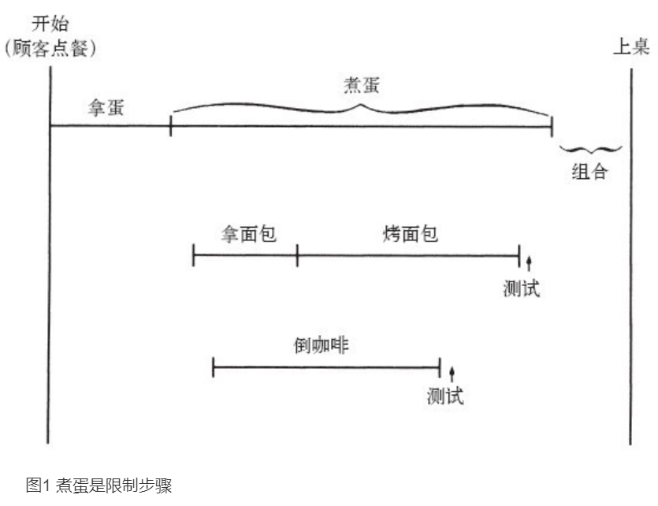
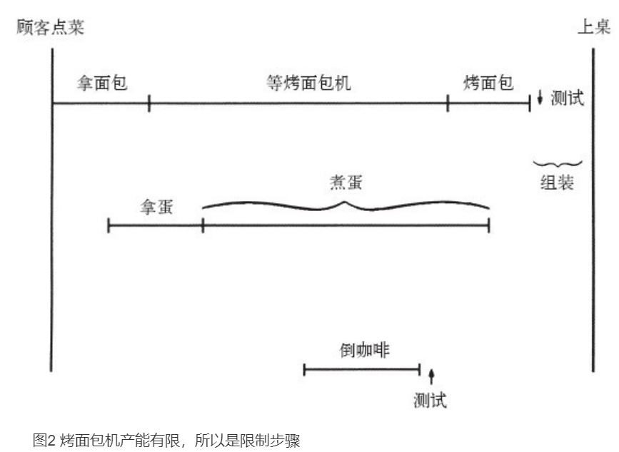
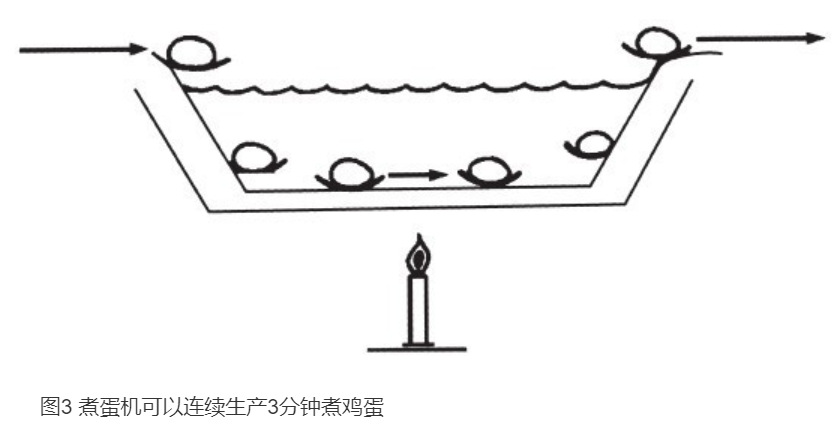

    作者: 安迪•格鲁夫
    出版社: 中信出版社
    原作名: High Output Management
    译者: 巫宗融
    出版年: 2013-6-14
    页数: 272
    定价: 38.00元
    装帧: 精装
    丛书: 中信十年畅销经典
    ISBN: 9787508639666

[豆瓣链接](https://book.douban.com/subject/24700126/)

- [第一篇 早餐店的生产线](#第一篇-早餐店的生产线)
  - [1 “生产”包含什么？](#1-生产包含什么)
    - [限制步骤](#限制步骤)
    - [生产的步骤](#生产的步骤)
    - [复杂化](#复杂化)
    - [找出最佳策略](#找出最佳策略)
    - [测试与验货](#测试与验货)
    - [及早发现、及早解决](#及早发现及早解决)
  - [2 从早餐店的库存谈起](#2-从早餐店的库存谈起)

# 第一篇 早餐店的生产线
## 1 “生产”包含什么？
### 限制步骤
早餐店应大概在顾客进门后5 到10 分钟送出早餐，并以具竞争性的生产成本生产，才能获取应有的利润。

>我们必须找出决定整个生产流程的“限制步骤”（limiting step），并围绕这一最关键的步骤拟订流程计划。

首先，我们必须找出决定整个生产流程的“限制步骤”（limiting step）。早餐组合中哪一项准备起来最耗时？答案无疑是煮蛋。因为咖啡已经煮好在壶里，而烤面包只要花一分钟左右，所以我们应该以需时最长的煮蛋为限制步骤。

接着我们要反推流程（见图1）——也就是用最后完成的时间向前推算，先弄清楚煮蛋、煮咖啡及烤面包分别需要的时间，以便于它们同时完成。首先，计算将这三项产品摆在餐盘里所需的时间，然后计算从烤面包机中拿出面包、从壶中倒出咖啡以及从锅中捞蛋出来的时间。将以上所需时间的总和，加上拿蛋和煮蛋的时间，便是整个流程需要的时间。这在生产管理上称为总产出时间。

### 生产的步骤
准备早餐的过程其实还暗藏不少玄机，其中便包含了三项基本的生产步骤：
1. 制造：这种生产活动通常有物理或化学变化。煮蛋便是物理变化的一种。
2. 组装：将零件拼装组合在一起产生新个体。就像我们把鸡蛋、面包和咖啡组成一份早餐一样。
3. 测试：对零件及最终产品作检查。我们可以以目测来鉴定咖啡是不是煮好了，面包有没有烤焦。

制造、组装及测试可以灵活运用在其他不同的生产活动中。拿训练业务人员销售新产品的任务为例，我们便能清楚划分出这3个要素。
1. 制造：营销和研发人员将一大堆的产品资料化为业务人员理解的销售策略，这个将资料转化成策略的过程便是制造。
2. 组装：将各种销售策略组合成完美的销售计划。在新产品上市的会议上，营销人员将最合适的策略和必要的市场资料（如竞争商品的价格和存货状况）结合产品说明、宣传册及活动挂图向业务人员报告。
3. 测试：在真正上市之前应先有一场虚拟的上市发布会。在此会议上，被挑选出来的业务代表要对策略及销售工具等等作出反应。如果反映不佳，亦即测试结果不良，整个策略就必须修改或重新制定，以符合原定的营销及销售目标。

### 复杂化
如果你在排队等着用烤面包机，该怎么办？如果你不把排队等候这件事纳入你的生产流程来考虑，你3分钟煮的鸡蛋可能就要变成6分钟的铁蛋！

所以，如果你的烤面包机数量有限，你就必须把这一步骤当成限制步骤，重新设计流程。煮鸡蛋的品质仍然决定顾客对早餐的喜恶，但时间互偿的部分必须重新调整。

请看图2，有关蛋和咖啡的部分仍然维持不变，但烤面包机的数量有限会造成相当大的变化。现在你必须考虑拿面包、烤面包和等烤面包机的时间，这表示整个生产流程要有所改变。烤面包的部分成为限制步骤，整个流程的重新设计都必须以此为中心。

再把事情复杂化一点。万一你在该下水煮蛋时碰巧被卡在等烤面包机的长龙中，你该如何是好？

如果你是这家餐厅的经理，你可以考虑将某些人变成专司一职。你可以让某个人专烤面包，专门煮蛋或是专门倒咖啡，然后再找一个人来监工。当然，这笔人事支出可能太高，让你连想都不想。

如果你是服务生，你可以请也在排队的同事帮忙，在你去放蛋时他可以帮你放面包。但当事情必须借助他人时，结果通常很难预期。身为餐厅经理，你也可能再多买一台烤面包机，但这又会是一笔昂贵的支出。

或者你也可以持续不断地烤面包，这样一来虽然增加了面包的存货成本——有一些面包烤好但放久了你得丢掉，但你的热面包将可以随时供应。总归一句话，至少你知道天无绝人之路，总有一些办法可想。你可以增加设备产能、增加人手或是提高存货量，每个办法都各有利弊，但也都对整个烤面包的流程有帮助。

### 找出最佳策略
因为每一个方案都得花钱，你的责任就是找一个最具成本效益的方法来运用资源，这也是所有生产活动最佳化的关键。

>凡是能以最低成本达到理想的运送速度以及品质的，便是最佳方案。

现在我们要更进一步地把这个例子中的早餐店厨房换成一个大规模生产的大厂。首先，你添购了一台能固定且持续生产3分钟煮鸡蛋的机器（见图3）。我们已经假设顾客喜欢3分钟煮鸡蛋，而且有大量且可预期的需求。因为这台机器是设计好的自动设备，它将失去生产4分钟煮鸡蛋的弹性，而只生产了3分钟煮鸡蛋。

其次，这部煮蛋机的生产速度应该配合烤面包机。我们现在已经将整个流程转化成连续性作业，但与此同时，我们也失去了灵活性，无法再针对个别客户的特殊需求作调整。

### 测试与验货
然而，连续性作业并不能保证较低的成本和较好的品质。试想：如果煮蛋机的水温失控的话会发生什么——在失控期间所煮出的蛋将成为废品，而同时间生产的烤面包也将因为没有蛋可以一起送上桌而成为废品。你该如何将这种风险降至最小？功能性测试会是个好方法。

你要不时地敲开煮鸡蛋检查它们的品质，但这样你也必须丢掉检测过的蛋。

另一个方法称为“线上检视”，这又有各种不同的做法。举例来说，你可以找一根温度计经常性地检测水温。为了节省聘请专人读温度计的费用，你可以请人设计一个小机关，只要水温和设定的温度差了一两度就会铃声大作。

原则上，你的存货应该至少能在供货商下次送货之前满足工厂的用料速度。在这个早餐店生产线的例子中，如果这个蛋商每天送一次货，你就必须要有足够一天使用的安全存货量。但记住一点：存货需要成本，你必须权衡累积一天存货量的利益和所需费用。

>这里的要点是：只要有可能，你都应该使用线上检视的方法，而避免必须要牺牲产品的测试方法。

除了有形的费用之外，你还得考虑无形的风险。如果煮蛋机出现故障将会怎样？你会失掉多少顾客？要把这些顾客再招揽回来的成本又是多少？这些都是有关风险的问题。

### 及早发现、及早解决
我们应该谨守“及早发现、及早解决”的准则，如此我们便能在生产流程中价值最低的阶段修正问题。

因此，我们应该在蛋商送蛋之前让他们把坏的蛋挑出来，而不是让我们的顾客在餐桌上发现它们。

>我们应该谨守“ 及早发现、及早解决”的准则，如此我们便能在生产流程中价值最低的阶段修正问题。

## 2 从早餐店的库存谈起

