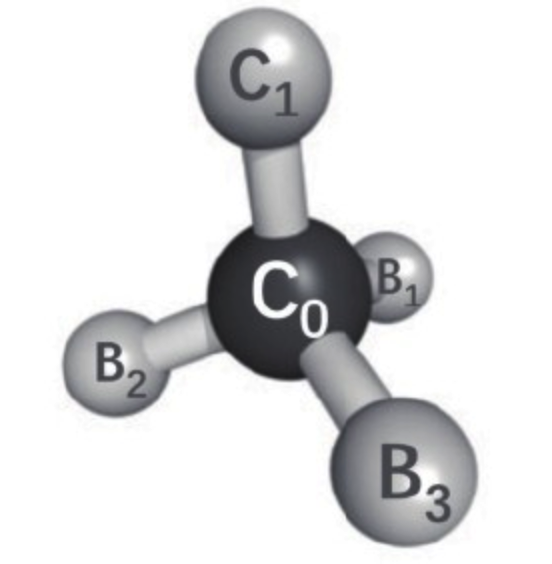

    作者: 杨旸 
    出版社: 九州出版社
    副标题: 从石斧到爆品
    出版年: 2017-11
    页数: 296
    定价: 45.00
    装帧: 平装
    ISBN: 9787510859922

[豆瓣链接](https://book.douban.com/subject/27178652/)

- [第一部分　创新的起源](#%e7%ac%ac%e4%b8%80%e9%83%a8%e5%88%86-%e5%88%9b%e6%96%b0%e7%9a%84%e8%b5%b7%e6%ba%90)
  - [第一章　创新的起源](#%e7%ac%ac%e4%b8%80%e7%ab%a0-%e5%88%9b%e6%96%b0%e7%9a%84%e8%b5%b7%e6%ba%90)
  - [第二章　商业的启蒙](#%e7%ac%ac%e4%ba%8c%e7%ab%a0-%e5%95%86%e4%b8%9a%e7%9a%84%e5%90%af%e8%92%99)
    - [社会发展开启加速度模式——贝币和私有制的诞生](#%e7%a4%be%e4%bc%9a%e5%8f%91%e5%b1%95%e5%bc%80%e5%90%af%e5%8a%a0%e9%80%9f%e5%ba%a6%e6%a8%a1%e5%bc%8f%e8%b4%9d%e5%b8%81%e5%92%8c%e7%a7%81%e6%9c%89%e5%88%b6%e7%9a%84%e8%af%9e%e7%94%9f)
    - [城市为什么存在？](#%e5%9f%8e%e5%b8%82%e4%b8%ba%e4%bb%80%e4%b9%88%e5%ad%98%e5%9c%a8)
  - [第三章　根创新](#%e7%ac%ac%e4%b8%89%e7%ab%a0-%e6%a0%b9%e5%88%9b%e6%96%b0)
- [第二部分　创新的发展](#%e7%ac%ac%e4%ba%8c%e9%83%a8%e5%88%86-%e5%88%9b%e6%96%b0%e7%9a%84%e5%8f%91%e5%b1%95)
  - [第四章　农业与创新延续](#%e7%ac%ac%e5%9b%9b%e7%ab%a0-%e5%86%9c%e4%b8%9a%e4%b8%8e%e5%88%9b%e6%96%b0%e5%bb%b6%e7%bb%ad)
  - [第五章　工业时代的创新](#%e7%ac%ac%e4%ba%94%e7%ab%a0-%e5%b7%a5%e4%b8%9a%e6%97%b6%e4%bb%a3%e7%9a%84%e5%88%9b%e6%96%b0)
  - [第六章　域创新](#%e7%ac%ac%e5%85%ad%e7%ab%a0-%e5%9f%9f%e5%88%9b%e6%96%b0)
- [第三部分　创新的升级](#%e7%ac%ac%e4%b8%89%e9%83%a8%e5%88%86-%e5%88%9b%e6%96%b0%e7%9a%84%e5%8d%87%e7%ba%a7)
  - [第八章　维创新](#%e7%ac%ac%e5%85%ab%e7%ab%a0-%e7%bb%b4%e5%88%9b%e6%96%b0)

## 第一部分　创新的起源
### 第一章　创新的起源
露西是生活在320万年前东非大草原上的直立人，露西的体形看起来很怪，但她是幸运的，因为露西的祖先向两个不同的方向进化，一支向我们人类的方向进化，而另一支则进化成了更为高大的古猿，但可惜的是，古猿这支最后灭绝了，只有露西选对了进化方向，幸运地成为了人类的祖先。

露西的脑容量只有400毫升，但进化出了与四指相对的大拇指，这对露西来说具有非常重要的意义，为什么这么说呢？因为大拇指与四指相对，可以让她进行很多精细化的动作，可以握拳、可以两根手指捻物体，从而制造工具、武器等，这使得她和动物的差距越来越大。

人类学家说，除了大拇指的进化外，人类和动物的第二个区别在于外族通婚制度。它的意义在于，**跨部落的通婚增加了彼此交流的机会**。

外族通婚让人类对陌生人有了**信任**。

手掌进化和外族通婚，让人和猩猩有了区别。手掌的进化让人有了制造精细工具的条件，而通婚让陌生人建立了信任感，这种信任感扩大了彼此的交流。

人类这种对事物的反思和模仿能力，就是经验融合能力，这个能力不像鸭子认妈妈一样，它并不会随基因遗传下去，而只会发生在后天的个体身上。经过多年的训练，每个人都有了自己擅长的职业，老师、科学家、服务员、厨师、运动员……这些都是后天学习的结果，因为你不断地积累某一方面的技能，久而久之，就成为这个行业的专家了。

当我们做一件事情的时候，会有一些想法，这些想法我们可以称为经验。做不同的事就会产生不同的经验，经验有了，人类就能对这些经验进行任意的组合，有些组合可能会发生不错的化学反应，有些组合可能什么也不是，那就不用管了，但那些拥有好运气的组合，就会变成各种各样的创新。

人的这种经验融合能力，是人类领先其他物种称霸地球的最重要原因，我称这种能力为“经验+1“的能力，直接用别人的经验进行加工，并不需要自己从0开始。

当每个人都在做“经验+1“积累的时候，创新的总量就会呈指数增长。

为了更加清晰地看到这种进步，我在这里做了一个表，假设每个人最开始都只有1个经验，然后彼此交换，2个经验生成一个简单创新，那么，我们来看看其中的变化。

2个人的理论创新数：

3个人的理论创新数：

4个人的理论创新数：

在理想的条件下，人类创新的公式是：

`S_{Innovation} ≤ n(n-1)/2 (n≥2)`

其中S表示最终产出创新的数量，n表示经验个数，之所以是“≤”，是因为创新有简单和复杂之分。

通过这个公式，我们还可以解答一个问题：为什么100多万年前的祖先进步如此缓慢？很重要的一个原因就是，他们生活在一个没有大量交换的环境下。

通过人工取火，人类第一次学会了熟食制作。在没有熟食的年代，人类祖先为了消化生肉和植物，需要长出庞大的肠道来增加营养吸收的面积，同时生食带有很多的细菌，使人的寿命平均不超过20岁。火产生的高温会杀死寄生在肉里的细菌，从而提升了人类的寿命。人类开始食用熟食后，淀粉会变成胶状，蛋白质也改变了性质，提高了肠道吸收效率，以前庞大的肠道就不再需要了，于是开始减小。其次，熟食为人的大脑提供了更多的营养，使大脑体积变得越来越大。

从公元前180万到公元前20万年，直立人慢慢向现代人进化，他们几乎具备了人类的一切特征：两条腿、一双手、脑容量很大的大脑、与四指相对的拇指、生火、烹饪、制造并使用工具、协作等等。到了公元前20万年，地球上出现了一种新的人类，这就是智人，智人是直立人的后代，直立人和智人在形体上的变化并不是很大，但在大脑容量上，智人有了一定的增加，晚期智人的脑容量可以达到1400毫升，与现在的我们已经毫无差别。大脑容量的提升，最终体现在了工具创新上。比如，智人除了可以制造更先进的工具进行捕猎，还可以制作装饰物，在一些遗址中，就发现了很多钻孔的贝壳装饰物，有的甚至是用绳子串联而成，用于佩戴。

到了晚期智人时代，出现了以物易物的经济行为。

农业革命的产生，对人类发展有着十分深远的意义。

- 首先，它使得人类的生存方式从以前的采集、狩猎变为以种植、存储粮食为主的新生活方式。这种播种、照料、收获的全新生存方式，也慢慢对人类的心智进化产生了影响，主要是变得更加温顺。以狩猎时代为例，看到猎物你必须马上兴奋，并通过血腥和暴力的方式获取猎物，还有外族入侵，也需要通过暴力来解决。在这种情况下，能快速兴奋的人就有生存优势。到了农业时代，粮食的获取需要多方参与，并且周期也变长了，这个时候人需要冷静，还需要协作，播种、灌溉、施肥、除草、收割，都需要多方参与，如果没有学会冷静，就不会有很好的协作，也不会有耐心等待一年才收获一次。所以，农业发展后，给人带来了较稳定的生活方式，也让人的性格开始走向“温顺”的一面，而这种变化，更有利于人类的协作和进步。
- 其次，农业革命让人类转入较稳定的定居生活。由于需要照料农作物，智人选择在附近居住，最早的村落开始出现。聪明的智人开始建造适于较长时间居住的房屋，从这里开始，一个部落就开始变成一个村落，而这一切，也为后来更大规模的交换行为奠定了环境基础，那就是产生以物易物的交换行为。农作物最大的优势在于可存储性。在没有冰箱的年代，以肉类、蛋白质为主的食物，可以说是即时性食物，即使不被偷走，也必须在短短的几天内就食用完，否则就会腐烂，这会使整个部落陷入新的饥饿当中。粮食可以存储，就意味着只要收成好，很长时间内都不会挨饿。且种植并不需要每天都劳作，人类就有了多余的时间进行一些经验的获取，然后产生创新，新的工具、武器、文学、艺术，就是这样慢慢产生的。
- 最后，产生了以物易物的商业雏形。因为粮食可以存储了，大家有了更多的闲余时间，在此基础上，各种有益于生活和劳作的产品开始出现，比如冶炼、制陶、武器、艺术品等等，而这些东西，要么满足了生产需要，要么满足了文化需要，大家开始各取所需。

### 第二章　商业的启蒙
通用电气公司前总裁杰克·韦尔奇强调：管理就是不断地沟通、不断地交换想法。杜邦公司前执行总裁夏皮罗也认为：沟通是管理的关键，如果把最高主管的责任列一张清单，没有一项对企业的作用比得上沟通。沟通就是交换经验和想法。

#### 社会发展开启加速度模式——贝币和私有制的诞生
贝币产生的时间大约在公元前5000年到公元前3000年，这种作为货币的贝是生长于浅海的天然贝，小巧玲珑，色彩鲜艳，更重要的是坚固耐用。它的产生，标志着当时社会生产力的提升，也标志着人类开始进入真正的商业时代，这是一个非常伟大的创新。

按现代经济学对货币的解释，货币的特性有三个，一是交易媒介，二是储藏价值，三是记账单位。从这层定义来看，贝币只能算是货币的初级形态。

贝币的出现，激活了当时平静的市场，或者说激活了人性趋利避害的天性，希望让生活变得更美好。在这样的意愿下，每个人都开始努力生产，大量的产品丰富了市场上的选择，各具功能的物品也提升了人们的生活质量和生产效率，市场中的交换频次因此大大增加。就在这个时候，一个新的职业便孕育而生，那就是商人，商人出现的同时，商业自然也出现了。

中国人对“商人”的称呼，最早来自原始社会的商部落。据记载，在原始社会时，商部落就以善于交换闻名。传说他们的祖先曾驾着牛车游走各部落之间进行交易，所以当时的人们就把到处贩卖物品的人称为“商”，而把在固定地方售物的人叫“贾”，也就是后来说的“行商坐贾”，这些人慢慢被称之为“商人”，他们出售的物品，便叫“商品”，专门从事交换的行业则称为“商业”。

部落中的男子担任获取食物和防御的任务，女性担任采集食物和烹饪食物的任务。从分工来看，女人从事的职责比男人从事的职责显得更加稳定和重要，是可靠的生活来源，在部落中具有非常重要的地位。这就是母系氏族社会。

贝币的出现，使男性的生产效率大大发挥，由于男性拥有足够的力量和肌肉，在捕猎中更容易捕获到猎物。更重要的是，这些盈余的肉类，以前不能大量和其他部落交换，最后只能腐烂，但贝币出现后，他们就可以把多余的肉类拿到集市上进行交换，然后换取其他物品。这种情况下，男性比女性带来了更多更有价值的食物和工具，这使得男性的地位逐渐上升，整个社会进入父系氏族时期。

贝币让交换的频率和范围达到了前所未有的盛况，交换越多的人就变得越来越富有，拥有更多的粮食和武器，慢慢就有了贫富差距，导致私有制和阶级开始产生。为什么在这之前，大家都过着非常团结、平等、互帮互助的生活呢？原因是食物必须要通过协作来获取。贝币产生后，就不需要每个人都参与到获取食物的过程中了，不会种地的人也可能会生活得非常好，只要他有经商的头脑或者可以提供工具就可以了。

随着农业时代的到来，大家可以独立谋得生存，以前的部落式生产单位变得毫无必要，家庭式的小生产单位开始出现，于是以前那种不分劳动质量一律平分的野蛮、落后的分配制度自然也就走到了终点。人类开始了新的分配制度——私有制。

既然有了私有财产，接下来的问题必然就是私有财产的保护。战争随着私有制的诞生而诞生。战争永远是利益矛盾走向崩溃边缘的产物，为了生存，必须发动战争。

没有足够粮食的部落开始向富裕的部落发起战争，输的一方会变为奴隶。人有了贵贱之分后，阶级和地位的概念也随之产生。

在农业革命之前，也会有冲突和战争，但不会有俘虏一说，输的一方，即使很虔诚地投降，也都是直接杀死，因为没有多余的食物来供养这些俘虏，在饥饿的时候，俘虏甚至可能成为食物。到了农业社会后，生产力大大提升，食物开始有了盈余，这个时候俘虏就不再杀死，而是被当成奴隶来使用。畜牧业的发展，也是因为生产力的提升，圈养需要人给动物提供食物，如果没有多余的食物和时间，畜牧业不会出现。

#### 城市为什么存在？
贝币影响社会而产生的另外一个创新是诞生了最初的城市。“城市”这个词在词典中是这么解释的，“城”是指一种防御性的工事，“市”是指一种商品交易的场所，这说明最早的“城市”就是在进行商品交换的过程中，为适应人们对生产、生活、防御等方面的要求而集聚形成的。城市是社会进步的象征，更是人类交换行为发展到一定阶段的创新产物。

### 第三章　根创新
`根创新`是指对宇宙原本存在的东西的认知，比如火的发现、万有引力的发现、各种化学元素的发现等等。由于大脑不断进化，达到了足以认识它们的地步，一次刻意的实验或者偶然的巧遇，让它们出现在了人类面前。

根创新就是大脑对世界本身存在的“根”的认识和发现。如果说火、水、引力、氢元素都是根创新，那汽车是不是根创新呢？很明显，不是。汽车并不是自然界最初存在的事物，而是通过各种经验和创新的再组合创新，它有动力系统、制动系统、车身、电气设备等部分，每个部分又分为不同的细小部分。一辆普通的家用轿车约有一万多个零件，而这些零件通过一定的逻辑组合，才组成一个新的创新体——汽车。

## 第二部分　创新的发展
### 第四章　农业与创新延续
从1600年到2001年的400年里，世界人均GDP猛增到6049美元，我们不免要问，这是为什么呢？

原因就是，金属货币被纸币取代了。

其实货币最大的职能就是提高交换效率。

金属货币是货币史上第一种可以匹配社会生产力的支付货币。在现代金融学中：

*商品的价格水平=流通中所需要的货币量×货币的流通次数÷待售商品的数量。*

从这个公式我们可以看到，在其他条件不变的情况下，商品的价格水平与流通中所需要的货币量和货币的流通次数成正比。一般商品的价格会根据劳动的成本来定义，所以全世界都规定，低于成本价销售属于不正当竞争。所以这个时候，随着商品数量的增加，只要提供的货币数量与之匹配，商品的价格才会保持健康发展，而流通次数会随着货币的增多而增加，当市场上的货币变少时，货币的商品属性就会高于货币属性，也或者是劣币驱逐良币，这两种情况都会使得金属货币的流通次数减少，只有当货币提供量正常时，大家才会把金银当成货币去使用，整个市场才会提升交换的规模和效率。

### 第五章　工业时代的创新
封建时代末期，由于商业已经相当发达，金属货币和纸币都有了大量的兑换需求，就有这么一批人，开始私营钱币兑换业务，借此发展起了存款、放款和汇兑等业务，这就是钱庄的起源，也是现代银行业的始祖。由于钱庄们财力雄厚，信用度相当高，因此钱庄发行的花票已经在一定程度上成为了一种货币，拿着花票就可到任意一间该钱庄的分号兑换金属货币。然而花票的本质其实是一种借据，你拿得出等额的票，我随时就得给你等额的金属货币，这张票的面额就是钱庄欠你的金额。所以纸币是什么？纸币是借据，由于欠钱者信用良好，它的借据就能在市面上被普遍接受，进而流通，包括我们的人民币，本质也是国家写给人民的借据，以国家的财产作为抵押。

1656年，瑞士银行成立。第二年，它们在欧洲第一次发行了真正的纸币，同时现代银行也随之诞生。现代银行的诞生标志着银行服务的对象有了变化，以前只服务于国王，现在开始服务于商业市场，这为工业革命和资本主义的发展带去了血液。

工业革命之所以发生，其原因有两个：第一个是当时英国商品的生产已经不能满足市场的需要，这就对工厂手工业提出了技术改革的要求，在这种趋势下，工业革命就首先在英国发展起来了；第二是当时纸币和现代银行的出现，工业信用、国家信用、商业信用与金钱一同构成了更大规模的货币供应，来促进工业时代巨大的商品交易。

英国实现了君主立宪制后，国王不能随意征税，也不能随便借钱，借钱要还，而且要付利息。这样一来，使得当时的货币制度比较稳定，这种稳定让标准货币产生的条件成熟，因此英镑诞生。你也可以说，是君主立宪制和标准货币促进了英国的工业革命，这点其实是有关联的。当君主的权力被关在了笼子里，所有人在法律的框架下可以公平竞争，生产要素按市场优化分配，这时企业与个人只能通过不断地创新来创造价值，这种创新就带动了商业的进步。如果货币是不标准的，不断贬值，大家就会追逐货币贬值的利益，谁还会辛苦地创造与创新呢？

在美国，投资银行往往有两个来源：一是由综合性银行分拆而来，典型的例子如摩根士丹利；二是由证券经纪人发展而来，典型的例子如美林证券。投资银行以其强大的盈利能力而为世人所瞩目。以最常见的股票发行业务为例，投资银行一般要抽取7%的佣金，也就是说，如果客户发行价值100亿美元的股票，投资银行就要吃掉7亿美元。在公司并购业务中，投资银行同样大赚特赚。19世纪80年代以来，美国至少经历了四次公司并购浪潮，这就为投资银行提供了相当可观的收入来源。近年来欧美动辄发生价值几百亿甚至几千亿美元的超级兼并案，如美国在线兼并时代华纳、沃达丰兼并曼内斯曼、惠普兼并康柏等，背后都有投资银行的推波助澜。因为兼并业务的技术含量很高，利润又很丰厚，一般被认为是投资银行的核心业务，从事这一业务的银行家是整个金融领域最炙手可热的人物。

### 第六章　域创新
在这里，我们需对创新的内部因素——节点因素做一个全面的解释。

节点因素是影响创新进步的关键，它分为三种：第一种是底层的`根创新`，第二种是`域创新`，第三种是`维创新`。

为了方便理解，我用一个球体模型来解释这几种创新。根创新就是球体的中心点A.我们知道在人类诞生之前，有些东西就早已经产生了，比如火、电、引力、电磁波，或者是事物与事物之间的关系，如牛顿定律、摩尔定律、热力学定律等。这些原本存在的事物和关系就是根创新的A,A的特点是不随人的意志改变而改变。比如只要你在地球，就永远会保持200斤的体重，改变的方法是需要一个减肥计划，而不是责怪地球引力。根创新A是一切经验和创新的起点。科学一般分为两个步骤，第一步是研究阶段，研究的其实就是根创新A的特性，当对A足够了解后，就会到第二步，就是实用阶段，把A变成一个实用的创新。

第二层是域创新。当根创新A被发现后，大多数都不能直接利用，比如电的发现。

电灯的发明揭示了电的重要性，也是域创新的开始。随后，从电这个“根创新”延伸出了各种产品，包括电动机、电视机、电脑、电冰箱、电影等。从此人类进入电器时代。

除了这两种创新外，还有一种创新，就是维创新。什么是维创新呢？维创新主要出现在复杂创新中，任何新品的发明，都是各种技术巧妙的组合。如图中我们把`$C_{0}$`看作是一个维创新，它的诞生是由三个域创新B形成的。我们不妨举例说明，如果把C看成是一个维创新台灯，那么`$B_{1}$`是灯泡、`$B_{2}$`是开关、`$B_{3}$`是灯罩，当然它还有更多的零件，比如到了`$B_{100}$`，那么整个B系列都是`$C_{0}$`的零件，只有当这些零件都达到`$C_{0}$`的同一个维度时，那么`$C_{0}$`才能成为一个台灯。如果其中有一个B没有达到这个维度，`$C_{0}$`就不能成为一个维创新。从这个图中我们可以得出，`$B_{1}$`、`$B_{2}$`、`$B_{3}$`都是在它们各自的域创新中改进来的，是从1到1.1的升级，只有`$C_{0}$`是全新的创新。我们可以用另一种思维来理解维创新，我称之为`终点法`，就是我们最终需要一个什么样的东西，就从这个终点往前推，比如我需要可以放在桌子上而且可以移动的灯，那么有人就将一些零件组合到了一起，并且完美达到了一个维度，一个伟大的创新台灯就诞生了。

## 第三部分　创新的升级
### 第八章　维创新
从时间上来看，根创新产生最早，从人类的起源就开始了。人类学家把人类的发展分为觅食时代、农耕时代、燃料时代、信息时代。在觅食时代，人类主要做的事是升级大脑，好奇心让大家得到了更多经验，这段时间里的创新大多是根创新。到了农业和工业时代，出现了域创新，人类进入到创新大发展时期，城市和国家出现了，人口变多，让经验交换的频率更加频繁。但域创新并不能一直持续发展，到了一定阶段，就会遇到创新瓶颈，维创新就是瓶颈的产物。

维创新其实是不同技术的组合。

技术上的连续性更像是域创新，比如从电的发现到电视机、电冰箱，这个过程中存在一定的连续性，那就是以电为“根”技术连续。我们知道，一切创新都是从根创新开始的，然后再从根创新引申出来，形成一些节点，这就是域创新。

下面我们从维创新的角度来分析Uber是如何取得成功的。

- 第一个维度，硬件的普及。智能手机的出现，让很多我们难以想象的生活方式变成了现实：和千里之外的朋友聊天、在手机上购物、还信用卡、通过地图找到口碑不错的餐厅……这些都得益于智能手机的普及。同样，打车软件的盛行，最大的功劳也要归功于智能手机这个载体。
- 第二个维度，成熟的数字货币技术。前面我们用了很大篇幅叙述数字货币代替纸币的优势，数字货币提升了整个社会的生产生活效率，所以货币的进化直接影响着社会的发展。Uber出现的时候，数字货币的发展已经非常成熟，网上银行、信用卡、第三方支付平台已经遍布我们的身边，这为Uber自身的第三方身份做了信用背书。
- 第三个维度，市场有需求。城市出行，采用的方式一般有三种，私家车、公交和出租车。以出租车为例，传统的出租车市场存在信息不对称，无法自行实现资源最优配置，比如当你半夜从机场下了飞机，发现没有一辆出租车可以载你回家，但此时可能有很多辆空车在城市的其他地方寻找即将回家的乘客，这就是信息不对称。于是Uber采取了共享私家车的方法，据统计，私家车有95%的时间是空闲的，对于有出行需求的人来说，这种空闲是极大的资源浪费。一方面是城市交通压力大，高峰期根本打不到车，即使你用软件呼叫一辆出租车，此时也是僧多粥少，资源明显分配不均。但不管是不是高峰期，你会发现私家车大多数是有空座位的，如果把这些座位合理地利用起来，不但缓解了地面交通，还让很多人找到了不拥挤且高品质的出行方式。
- 第四个维度，各种辅助技术的支持。如果说出行难是一个痛点，除了硬件智能手机外，其他辅助的技术也至关重要。2010年，全球的4G网络环境已经非常成熟，4G技术理论上可以达到10Mbps的速度下载，在路上听歌、看电视已经没有问题，这对于Uber的体验来说相当重要。其次，基于位置的地图服务也成了软件不可或缺的一部分，拿Uber来说，Uber中国使用的地图是腾讯地图，如果没有完善的地图导航，那么打车软件就成了一个瞎子，毕竟不是每一个私家车司机都像出租车司机一样拥有“活地图”的功能。当你在Uber软件上下了一个单，首先收到你订单的是离你最近的车主，他们需要找到最低成本的用户，这个成本就是时间成本，同样对于你来说，最短的等待才会带来最佳的体验，那么LBS功能在其中就起到了非常大的作用。现在，LBS衍生出很多生意，为人们的生活带来了很大变化。

在《技术的本质》这本书中，作者提到，创新就是技术的再组合，其实这种说法不太准确，因为他说的这种再组合，更倾向于维创新的组合。**维创新中，技术的组合并不是胡乱地组合，而是一系列技术到达一个维度上的组合。**
