    作者: 亚历山大•奥斯特瓦德 (Alexander Osterwalder) / 伊夫•皮尼厄 (Yves Pigneur)
    出版社: 机械工业出版社
    原作名: Business Model Generation
    译者: 王帅 / 毛心宇 / 严威
    出版年: 2011-8-15
    页数: 284
    定价: 88.00元
    装帧: 平装
    ISBN: 9787111352211

[豆瓣链接](https://book.douban.com/subject/6718487/)

- [画布](#画布)
  - [商业模式的定义](#商业模式的定义)
  - [9个构造块（Building Blocks）](#9个构造块building-blocks)
    - [CS客户细分（Customer Segments）](#cs客户细分customer-segments)
    - [VP价值主张（Value Propositions）](#vp价值主张value-propositions)
    - [CH渠道通路（Channels）](#ch渠道通路channels)
    - [CR客户关系（Customer Relationships）](#cr客户关系customer-relationships)
    - [R$收入来源（Revenue Streams）](#r收入来源revenue-streams)
    - [KR核心资源（Key Resources）](#kr核心资源key-resources)
    - [KA关键业务（Key Activities）](#ka关键业务key-activities)
    - [KP关键合作（Key Partnerships）](#kp关键合作key-partnerships)
    - [C$成本结构（Cost Structure）](#c成本结构cost-structure)
- [式样](#式样)
  - [非绑定式商业模式](#非绑定式商业模式)
    - [私人银行：三种业务合一](#私人银行三种业务合一)
    - [移动通信行业](#移动通信行业)
  - [长尾式商业模式](#长尾式商业模式)
    - [图书出版行业的变革](#图书出版行业的变革)
    - [乐高的新长尾](#乐高的新长尾)
  - [多边平台式商业模式](#多边平台式商业模式)
    - [Google的商业模式](#google的商业模式)
    - [Wii 对决 PSP/Xbox相同模式，不同关注点](#wii-对决-pspxbox相同模式不同关注点)
  - [免费式商业模式](#免费式商业模式)
    - [广告：多边平台模式](#广告多边平台模式)
    - [免费增收商业模式：基础免费，增值收费](#免费增收商业模式基础免费增值收费)
    - [开源：变形的免费增收模式](#开源变形的免费增收模式)
    - [保险模式：颠倒的免费增收](#保险模式颠倒的免费增收)
    - [诱钓模式](#诱钓模式)
  - [开放式商业模式](#开放式商业模式)
    - [宝洁：连接和发展](#宝洁连接和发展)
    - [葛兰素史克的专利池](#葛兰素史克的专利池)
    - [连接器：Innocentive](#连接器innocentive)
- [设计](#设计)
  - [技术方法_1 客户洞察 （Customer Insights）](#技术方法_1-客户洞察-customer-insights)
  - [技术方法_2 创意构思 （Ideation）](#技术方法_2-创意构思-ideation)
    - [商业模式创新的多个集中点](#商业模式创新的多个集中点)
    - [“假如”（What if）提问的力量](#假如what-if提问的力量)
  - [技术方法_3 可视思考 （Visual Thinking）](#技术方法_3-可视思考-visual-thinking)
    - [通过便利贴实现视觉化](#通过便利贴实现视觉化)
    - [视觉化的故事讲述活动](#视觉化的故事讲述活动)
  - [技术方法_4 原型制作 （Prototyping）](#技术方法_4-原型制作-prototyping)
  - [技术方法_5 故事讲述 （Storytelling）](#技术方法_5-故事讲述-storytelling)
  - [技术方法_6 情景推测 （Scenarios）](#技术方法_6-情景推测-scenarios)
- [战略](#战略)
  - [商业模式环境：背景、设计的驱动因素和制约因素](#商业模式环境背景设计的驱动因素和制约因素)

# 画布
`商业模式画布The Business Model Canvas`：一种用来描述商业模式、可视化商业模式、评估商业模式以及改变商业模式的通用语言。

## 商业模式的定义
`商业模式`描述了企业如何创造价值、传递价值和获取价值的基本原理

## 9个构造块（Building Blocks）
1. `客户细分Customer Segments`：企业或机构所服务的一个或多个客户分类群体。
2. `价值主张Value Propositions`：通过价值主张来解决客户难题和满足客户需求。
3. `渠道通路Channels`：通过沟通、分销和销售渠道向客户传递价值主张。
4. `客户关系Customer Relationships`：在每一个客户细分市场建立和维系客户关系。
5. `收入来源Revenue Streams`：收入来源产生于成功提供给客户的价值主张。
6. `核心资源Key Resources`：核心资源是提供和交付先前描述要素所必备的重要资产……
7. `关键业务Key Activities`：……通过执行一些关键业务活动，运转商业模式。
8. `重要合作Key Partnerships`：有些业务要外包，而另外一些资源需要从企业外部获得。
9. `成本结构Cost Structure`：商业模式上述要素所引发的成本构成。

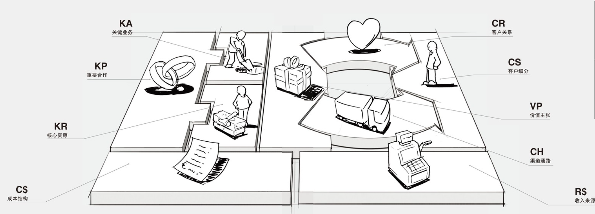

### CS客户细分（Customer Segments）
>客户细分构造块用来描绘一个企业想要接触和服务的不同人群或组织

客户群体现为独立的客户细分群体，如果：

- 需要和提供明显不同的提供物（产品/服务）来满足客户群体的需求；
- 客户群体需要通过不同的分销渠道来接触；
- 客户群体需要不同类型的关系；
- 客户群体的盈利能力（收益性）有本质区别；
- 客户群体愿意为提供物（产品/服务）的不同方面付费。

我们正在为谁创造价值？谁是我们最重要的客户？客户细分群体存在不同的类型。这里给出了一些例子：

- `大众市场（Mass market）`：聚焦于大众市场的商业模式在不同客户细分之间没有多大区别。价值主张、渠道通路和客户关系全都聚焦于一个大范围的客户群组，在这个群组中，客户具有大致相同的需求和问题，这类商业模式经常能在消费类电子行业中找到。
- `利基市场（Niche market）`：以利基市场为目标的商业模式迎合特定的客户细分群体。价值主张、渠道通路和客户关系都针对某一利基市场的特定需求定制。这样的商业模式常常可以在供应商—采购商（supplier-buyer）的关系中找到。例如，很多汽车零部件厂商严重依赖来自主要汽车生产工厂的采购。
- `区隔化市场（Segmented）`：有些商业模式在略有不同的客户需求及困扰（needs and problems）的市场细分群体间会有所区别。例如，瑞士信贷的银行零售业务，在拥有超过10万美元资产的大客户群体与拥有超过50万美元资产的更为富有的群体之间的市场区隔就有所不同。这些客户细分有很多相似之处，但又有不同的需求和困扰。这样的客户细分群体影响了瑞士信贷商业模式的其他构造块，诸如价值主张、渠道通路、客户关系和收入来源。思考一下瑞士微型精密系统公司（Micro Precision Systems），其专门提供外包微型机械设计和生产解决方案业务，服务于3个不同的客户细分群体—钟表行业、医疗行业和工业自动化行业，而为这些行业所提供的价值主张略有不同。
- `多元化市场（Diversified）`：具有多元化客户商业模式的企业可以服务于两个具有不同需求和困扰的客户细分群体。例如，2006年亚马逊（Amazon.com）决定通过销售云计算服务而使其零售业务多样化，即在线存储空间业务与按需服务器使用业务。因此亚马逊开始以完全不同的价值主张迎合完全不同的客户细分群体—网站公司。这个策略（可以实施）的根本原因是亚马逊强大的IT基础设施经营的多样化，其基础设施能被零售业务运营和新的云计算服务所共享。
- `多边平台或多边市场（Multi-sided platforms/multi-sided markets）`：有些企业服务于两个或更多的相互依存的客户细分群体。例如，信用卡公司需要大范围的信用卡持有者，同时也需要大范围可以受理那些信用卡的商家。同样，企业提供的免费报纸需要大范围的读者以便吸引广告。另一方面，它还需要广告商为其产品及分销提供资金。这需要双边细分群体才能让这个商业模式运转起来（参见更多关于多边平台式商业模式的内容）。

### VP价值主张（Value Propositions）
>价值主张构造块用来描绘为特定客户细分创造价值的系列产品和服务

价值主张是客户转向一个公司而非另一个公司的原因，它解决了客户困扰（customer problem）或者满足了客户需求。每个价值主张都包含可选系列产品或服务，以迎合特定客户细分群体的需求。在这个意义上，价值主张是公司提供给客户的受益集合或受益系列。

我们该向客户传递什么样的价值？ 我们正在帮助我们的客户解决哪一类难题？ 我们正在满足哪些客户需求？ 我们正在提供给客户细分群体哪些系列的产品和服务？

价值主张通过迎合细分群体需求的独特组合来创造价值。价值可以是定量的（如价格、服务速度）或定性的（如设计、客户体验）。下面一些简要要素列表有助于为客户创造价值。

- `新颖（Newness）`。有些价值主张满足客户从未感受和体验过的全新需求，因为以前从来没有类似的产品或服务。这通常但不总是与技术有关，举例来说，移动电话围绕移动通信开创了一个全新的行业。另外，诸如伦理投资基金（ethical investment funds）的产品与新技术关系甚微。
- `性能（Performance）`。改善产品和服务性能是一个传统意义上创造价值的普遍方法。个人计算机（PC）行业有依赖于这个因素的传统，向市场推出更强劲的机型，但性能的改善似乎也有它的局限。例如，近几年更快速的PC、更大的磁盘存储空间和更好的图形显示都未能在用户需求方面促成对应的增长。
- `定制化（Customization）`。定制产品和服务以满足个别客户或客户细分群体的特定需求来创造价值。近几年来，大规模定制和客户参与制作的概念显得尤为重要。这个方法允许定制化产品和服务，同时还可以利用规模经济优势。
- `“把事情做好”（Getting the job done）`。可以通过帮客户把某些事情做好而简单地创造价值。罗尔斯-罗伊斯公司（Rolls-Royce）很清楚这一点：罗尔斯-罗伊斯航空公司的客户完全依赖它所制造和服务的引擎发动机。这样可以使客户把业务焦点放在他们的航线运营上。作为回报，航空公司按引擎用时向罗尔斯-罗伊斯公司支付费用。
- `设计（Design）`。设计是一个重要但又很难衡量的要素。产品可以因为优秀的设计脱颖而出，在时尚和消费电子产品工业，设计是价值主张中一个特别重要的部分。
- `品牌/身份地位（Brand/status）`。客户可以通过使用和显示某一特定品牌而发现价值。例如，佩戴一块劳力士手表象征着财富。此外，滑板者可能穿戴最新的“undergroununderground”品牌来显示他们很“潮”。
- `价格（Price）`。以更低的价格提供同质化的价值是满足价格敏感客户细分群体的通常做法，但是低价价值主张对于商业模式的其余部分有更重要的含义。经济航空公司，诸如西南航空公司（Southwest）、易捷航空公司（EasyJet）和瑞安航空公司（Ryanair）都设计了全新的商业模式，以便使低价航空旅行成为可能。另一个基于价格的价值主张例子可以在印度塔塔集团（Tata Group）设计和制造的Nano新型汽车中找到。它以令人惊叹的低价使印度全民都买得起汽车。免费产品和服务正开始越来越多地渗透到各行各业。免费提供产品和服务的范围很广，从免费报纸到免费电子邮件、免费移动电话服务无所不包（参见本书之后更多的关于免费式商业模式的内容）。
- `成本削减（Cost reduction）`。帮助客户削减成本是创造价值的重要方法。例如，Salesforce.com公司销售在线的客户关系管理系统（CRM）的应用，这项服务减少了购买者的开销并免除了用户自行购买、安装和管理CRM软件的麻烦。
- `风险抑制（Risk reduction）`。当客户购买产品和服务的时候，帮助客户抑制风险也可以创造客户价值。对于二手汽车买家来说，为期一年的服务担保规避了在购买后发生故障和修理的风险。而服务品质级别担保书（service-level guarantee）部分抑制了由买方承担外包IT服务所要承担的风险。
- `可达性（Accessibility）`。把产品和服务提供给以前接触不到的客户是另一个创造价值的方法。这既可能是商业模式创新的结果，也可能是新技术的结果，或者兼而有之。例如，奈特捷航空公司（NetJets）以普及私人飞机拥有权（fractional private jet ownership）概念而著称。通过应用创新的商业模式，奈特捷航空提供私人及企业拥有私人飞机的权限，在此之前这项服务对于绝大部分客户来说都很难支付得起。同样，共同基金（mutual funds）是通过提升可达性来创造价值的另一个例子。这种创新的金融产品使那些小康微富的人建立多元化的投资组合成为可能。
- `便利性/可用性（Convenience / usability）`。使事情更方便或易于使用可以创造可观的价值。苹果公司的iPod和iTunes为用户提供了在搜索、购买、下载和收听数字音乐方面前所未有的便捷体验。现在，苹果已经主导了市场。

### CH渠道通路（Channels）
>渠道通路构造块用来描绘公司是如何沟通、接触其客户细分而传递其价值主张

渠道通路包含以下功能：

- 提升公司产品和服务在客户中的认知；
- 帮助客户评估公司价值主张；
- 协助客户购买特定产品和服务；
- 向客户传递价值主张；
- 提供售后客户支持。

通过哪些渠道可以接触我们的客户细分群体？ 我们现在如何接触他们？我们的渠道如何整合？ 哪些渠道最有效？哪些渠道成本效益最好？ 如何把我们的渠道与客户的例行程序进行整合？

渠道具有5个不同的阶段，每个渠道都能经历部分或全部阶段。我们可以区分直销渠道与非直销渠道，也可以区分自有渠道和合作伙伴渠道。

### CR客户关系（Customer Relationships）
>客户关系构造块用来描绘公司与特定客户细分群体建立的关系类型

客户关系可以被以下几个动机所驱动：

- 客户获取
- 客户维系
- 提升销售额（追加销售）

我们每个客户细分群体希望我们与之建立和保持何种关系？哪些关系我们已经建立了？这些关系成本如何？如何把它们与商业模式的其余部分进行整合？

我们可以把客户关系分成几种类型，这些客户关系可能共存于企业与特定客户细分群体之间。

- `个人助理（Personal assistance）`.这种关系类型基于人与人之间的互动。在销售过程中或者售后阶段，客户可以与客户代表交流并获取帮助。在销售地点，可以通过呼叫中心、电子邮件或其他销售方式等个人助理手段来进行。
- `专用个人助理（Dedicated personal assistance）`。这种关系类型包含了为单一客户安排的专门的客户代表。它是层次最深、最亲密的关系类型，通常需要较长时间来建立。例如，私人银行服务会指派银行经理向高净值个人客户提供服务。在其他商业领域也能看到类似的关系类型，关键客户经理与重要客户保持着私人联系。
- `自助服务（Self-service）`。在这种关系类型中，一家公司与客户之间不存在直接的关系，而是为客户提供自助服务所需要的所有条件。
- `自动化服务（Automated services）`。这种关系类型整合了更加精细的自动化过程，用于实现客户的自助服务。例如，客户可以通过在线档案来定制个性化服务。自动化服务可以识别不同客户及其特点，并提供与客户订单或交易相关的信息。最佳情况下，良好的自动化服务可以模拟个人助理服务的体验（例如提供图书或电影推荐）。
- `社区（Communities）`。目前各公司正越来越多地利用用户社区与客户/潜在客户建立更为深入的联系，并促进社区成员之间的互动。许多公司都建立了在线社区，让其用户交流知识和经验，解决彼此的问题。
- `共同创作（Co-creation）`。许多公司超越了与客户之间传统的客户—供应商关系，而倾向于和客户共同创造价值。亚马逊书店就邀请顾客来撰写书评，从而为其他图书爱好者提供价值。有的公司还鼓励客户参与到全新和创新产品的设计过程中来。还有一些公司，例如YouTube，请用户来创作视频供其他用户观看。

### R$收入来源（Revenue Streams）
>收入来源构造块用来描绘公司从每个客户群体中获取的现金收入（需要从创收中扣除成本）

一个商业模式可以包含两种不同类型的收入来源：
1. 通过客户一次性支付获得的交易收入。
2. 经常性收入来自客户为获得价值主张与售后服务而持续支付的费用。

什么样的价值能让客户愿意付费？他们现在付费买什么？他们是如何支付费用的？他们更愿意如何支付费用？每个收入来源占总收入的比例是多少？

以下是一些可以获取收入的方式：

- `资产销售（Asset sale）`：最为人熟知的收入来源方式是销售实体产品的所有权。亚马逊在线销售图书、音乐、消费类电子产品和其他产品。菲亚特销售汽车，客户购买之后可以任意驾驶、转售甚至破坏。
- `使用收费（Usage fee）`：这种收入来源于通过特定的服务收费。客户使用的服务越多，付费越多。电信运营商可以按照客户通话时长来计费。旅馆可以按照客户入住天数来计费。快递公司可以按照运送地点的距离来计费。
- `订阅收费（Subscription fees）`：这种收入来自销售重复使用的服务。一家健身房可以按月或按年以会员制订阅方式来销售健身设备的使用权。在线魔兽世界—一款大型多人在线角色扮演游戏，允许用户使用按月订阅的付费方式。诺基亚的音乐服务也可以让用户通过按月订阅付费的方式来收听音乐。
- `租赁收费（Lending/Renting/Leasing）`：这种收入来源于针对某个特定资产在固定时间内的暂时性排他使用权的授权。对于出借方而言，租赁收费可以带来经常性收入的优势。另一方面，租用方或承租方可以仅支付限时租期内的费用，而无须承担购买所有权的全部费用。Zipcar.com提供了一个很好的例证。该公司可以让客户在北美各大城市按小时租车。Zipcar.com的服务导致许多消费者决定租赁汽车而不再购买汽车。
- `授权收费（Licensing）`：这种收入来自将受保护的知识产权授权给客户使用，并换取授权费用。授权方式可以让版权持有者不必将产品制造出来或者将服务商业化，仅靠知识产权本身即可产生收入。授权方式在媒体行业非常普遍，内容所有者保留版权，但是可以将使用权销售给第三方。同样，在技术行业，专利持有人授权其他公司使用专利技术，并收取授权费作为回报。
- `经纪收费（Brokerage fees）`：这种收入来自为了双方或多方之间的利益所提供的中介服务而收取的佣金。例如，信用卡提供商作为信用卡商户和顾客的中间人，从每笔销售交易中抽取一定比例的金额作为佣金。同样，股票经纪人和房地产经纪人通过成功匹配卖家和买家来赚取佣金。
- `广告收费（Advertising）`：这种收入来源于为特定的产品、服务或品牌提供广告宣传服务。传统上，媒体行业和会展行业均以此作为主要收入来源。近几年，在其他行业包括软件和服务，也开始逐渐向广告收入倾斜。

定价机制有两种主要的形式：固定定价（根据静态变量而预设价格的的定价）和动态定价（根据市场情况变化而调整的定价）。

固定定价类目 | 固定定价说明 | 动态定价类目 | 动态定价说明
-----|---------|------|--------
标价 | 单独产品、服务或其他价值主张的固定价格 | 协商定价(谈判定价) | 双方或多方商定价格，最终的价格取决于谈判能力或谈判技巧
基于产品特性的定价 | 基于价值主张特性的数量或质量的定价 | 收益管理定价 | 基于库存量和购买时间的定价（通常用于易损资源，例如旅馆的房间或飞机的座位)
基于客户细分的定价 | 基于客户细分群体的类型和特点定价 | 实时市场定价 | 价格基于市场供求的动态关系决定
数量定价 | 基于客户购买的数量定价 | 拍卖定价 | 价格根据竞拍结果决定

### KR核心资源（Key Resources）
>核心资源用来描绘让商业模式有效运转所必需的最重要因素

核心资源可以是实体资产、金融资产、知识资产或人力资源。核心资源既可以是自有的，也可以是公司租借的或从重要伙伴那里获得的。

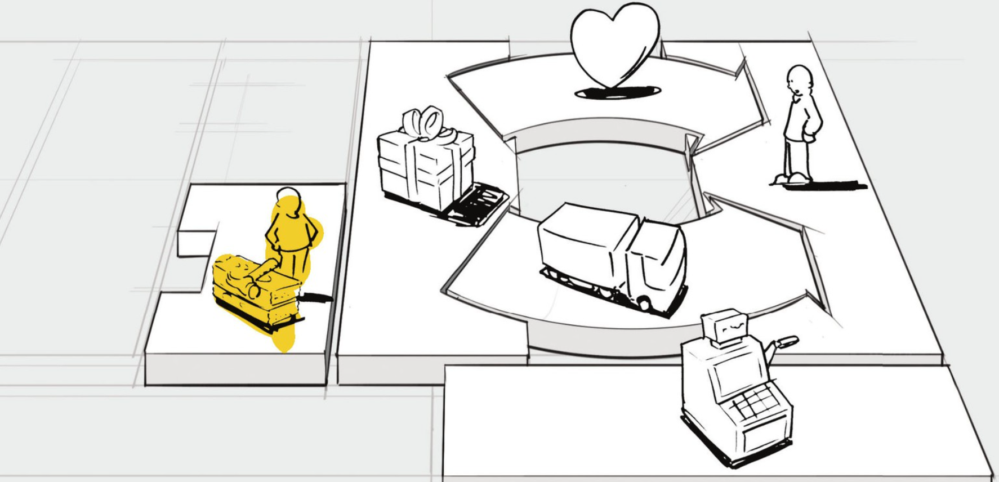

我们的价值主张需要什么样的核心资源？ 我们的渠道通路需要什么样的核心资源？ 我们的客户关系呢？收入来源呢？

核心资源可以分为以下几类：

- `实体资产（Physical）`。包括实体的资产，诸如生产设施、不动产、汽车、机器、系统、销售网点和分销网络等。沃尔玛和亚马逊等零售企业的核心资产就是实体资产，且均为资本集约型资产。沃尔玛拥有庞大的全球店面网络和与之配套的物流基础设施。亚马逊拥有大规模的IT系统、仓库和物流体系。
- `知识资产（Intellectual）`。包括品牌、专有知识、专利和版权、合作关系和客户数据库，这类资产日益成为强健商业模式中的重要组成部分。知识资产的开发很难，但成功建立后可以带来巨大价值。快速消费品企业例如耐克和索尼主要依靠品牌为其核心资源。微软和SAP依赖通过多年开发所获得的软件和相关的知识产权。宽带移动设备芯片设计商和供应商高通（Qualcomm）是围绕芯片设计专利来构建其商业模式的，这些核心资源为该公司带来了大量的授权收入。
- `人力资源（Human）`。任何一家企业都需要人力资源，但是在某些商业模式中，人力资源更加重要。例如，在知识密集产业和创意产业中人力资源是至关重要的。制药企业，例如诺华公司，在很大程度上依赖于人力资源，其商业模式基于一批经验丰富的科学家和一支强大娴熟的销售队伍。
- `金融资产（Financial）`。有些商业模式需要金融资源抑或财务担保，例如现金、信贷额度或用来雇用关键雇员的股票期权池。电信设备制造商爱立信提供了一个在商业模式中利用金融资产的案例。爱立信可以选择从银行和资本市场筹资，然后使用其中的一部分为其设备客户提供卖方融资服务，以确保是爱立信而不是竞争对手赢得订单。

### KA关键业务（Key Activities）
>关键业务构造模块用来描绘为了确保其商业模式可行，企业必须做的最重要的事情

我们的价值主张需要哪些关键业务？ 我们的渠道通路需要哪些关键业务？ 我们的客户关系呢？收入来源呢？

关键业务可以分为以下几类：

- `制造产品（Production）`。这类业务活动涉及生产一定数量或满足一定质量的产品，与设计、制造及发送产品有关。制造产品这一业务活动是企业商业模式的核心。
- `问题解决（Problem solving）`。这类业务指的是为个别客户的问题提供新的解决方案。咨询公司、医院和其他服务机构的关键业务是问题解决。它们的商业模式需要知识管理和持续培训等业务。
- `平台/网络（Platform/network）`。以平台为核心资源的商业模式，其关键业务都是与平台或网络相关的。网络服务、交易平台、软件甚至品牌都可以看成是平台。eBay的商业模式决定了公司需要持续地发展和维护其平台eBay.com网站。而维萨（Visa）的商业模式需要为商业客户、消费者和银行服务的Visa®信用卡交易平台提供相关的业务活动。微软的商业模式则是要求管理其他厂商软件与其Windows®操作系统平台之间的接口。此类商业模式的关键业务与平台管理、服务提供和平台推广相关。

### KP关键合作（Key Partnerships）
>关键合作构造块用来描述让商业模式有效运作所需的供应商与合作伙伴的网络

我们可以把合作关系分为以下四种类型：
1. 在非竞争者之间的战略联盟关系；
2. 竞合：在竞争者之间的战略合作关系；
3. 为开发新业务而构建的合资关系；
4. 为确保可靠供应的购买方—供应商关系。

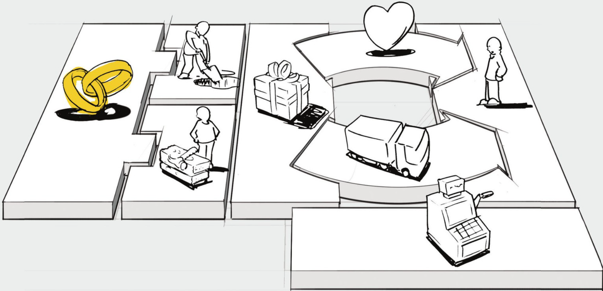

谁是我们的重要伙伴？谁是我们的重要供应商？ 我们正在从伙伴那里获取哪些核心资源？ 合作伙伴都执行哪些关键业务？

以下三种动机有助于创建合作关系：
- `商业模式的优化和规模经济的运用`。伙伴关系或购买方—供应商关系的最基本的形式，是设计用来优化资源和业务的配置。公司拥有所有资源或自己执行每项业务活动是不合逻辑的。优化的伙伴关系和规模经济的伙伴关系通常会降低成本，而且往往涉及外包或基础设施共享。
- `风险和不确定性的降低`。伙伴关系可以帮助减少以不确定性为特征的竞争环境的风险。竞争对手在某一领域形成了战略联盟而在另一个领域展开竞争的现象很常见。例如，蓝光—一种光盘格式，由一个世界领先的消费类电子、个人电脑和媒体生产商所构成的团体联合开发。该团体合作把蓝光技术推向市场，但个体成员之间又在竞争销售自己的蓝光产品。
- `特定资源和业务的获取`。很少有企业拥有所有的资源或执行所有其商业模式所要求的业务活动。相反，它们依靠其他企业提供特定资源或执行某些业务活动来扩展自身能力。这种伙伴关系可以根据需要，主动地获取知识、许可或接触客户。例如，移动电话制造商可以为它的手机获得一套操作系统授权而不用自己开发。保险公司可以选择依靠独立经纪人销售其保险，而不是发展自己的销售队伍。

### C$成本结构（Cost Structure）
>成本结构构造块用来描绘运营一个商业模式所引发的所有成本

区分两种商业模式成本结构类型会更有帮助，即成本驱动和价值驱动（许多商业模式的成本结构介于这两种极端类型之间）。

- `成本驱动（Cost-driven）`的商业模式侧重于在每个地方尽可能地降低成本。这种做法的目的是创造和维持最经济的成本结构，采用低价的价值主张、最大程度自动化和广泛外包。廉价航空公司，如西南航空、易捷航空和瑞安航空公司就是以成本驱动商业模式为特征的。
- `价值驱动（Value-driven）`。有些公司不太关注特定商业模式设计对成本的影响，而是专注于创造价值。增值型的价值主张和高度个性化服务通常是以价值驱动型商业模式为特征的。豪华酒店的设施及其独到的服务，都属于这一类。

成本结构有以下几个特点：

- `固定成本（Fixed costs）`。不受产品或服务的产出业务量变动影响而能保持不变的成本，例如薪金、租金、实体制造设施。有些企业，比如那些制造业的公司，是以高比例固定成本为特征的。
- `可变成本（Variable costs）`。伴随商品或服务产出业务量而按比例变化的成本。有些业务，如音乐节，是以高比例可变成本为特征的。
- `规模经济（Economies of scale）`。企业享有产量扩充所带来的成本优势。例如，规模较大的公司从更低的大宗购买费用中受益。随着产量的提升，这个因素和其他因素一起，可以引发平均单位成本下降。
- `范围经济（Economies of scope）`。企业由于享有较大经营范围而具有的成本优势。例如，在大型企业，同样的营销活动或渠道通路可支持多种产品。

这9个商业模式构造块组成了构建商业模式便捷工具的基础，这个工具我们称之为`商业模式画布（Business Model Canvas）`。

# 式样
## 非绑定式商业模式
“非绑定”企业的概念认为，存在三种不同的基本业务类型：`客户关系型业务`、`产品创新型业务`和`基础设施型业务`。每种类型都包含不同的经济驱动因素、竞争驱动因素和文化驱动因素。这三种类型可能同时存在于一家公司里，但是理论上这三种业务“分离”成独立的实体，以便避免冲突或不利的权衡妥协。

三种核心的业务类型

维度 | 产品创新 | 客户关系管理 | 基础设施管理
---|------|--------|-------
经济 | 更早地进入市场可以保证索要溢价价格，并获取巨大的市场份额；速度是关键 | 获取客户的高昂成本决定了必须获取大规模的客户份额；范围经济是关键 | 高昂的固定成本决定了通过大规模生产达到单位成本降低的必要性；规模是关键
竞争 | 针对人才而竞争；进入门槛低：许多小公司繁荣兴旺 | 针对范围而竞争；快速巩固；寡头占领市场 | 针对规模而竞争；快速巩固，寡头占领市场
文化 | 以员工为中心：鼓励创新人才 | 高度面向服务；客户至上心态 | 关注成本；统一标准；可预测和有效性

### 私人银行：三种业务合一
瑞士的私人银行为非常富有的人群提供银行服务，私人银行业一直以来被认为是一个保守、缺乏活力的行业。然而过去十年间，瑞士的私人银行业却发生了天翻地覆的变化。从传统上来讲，私人银行机构都是垂直整合的，且工作范围涵盖资产管理、投资和金融产品设计等。选择紧密垂直整合的方式是有充足理由的。因为外包的成本很高，加上出于保密性考虑，私人银行宁愿将所有的业务都放在自己的体系内部。

但是行业环境正在发生着变化。瑞士私人银行业的运作方式已不再是个秘密，保密已经变得不那么重要了。由于特殊服务提供商的涌现而导致银行价值链的分裂，使得外包变得越来越有吸引力，这些特殊服务提供商包括交易银行和金融产品专营机构。交易银行专注处理银行交易，而金融产品供应商则专注于设计新的金融产品。

总部位于苏黎世的私人银行机构Maerki Baumann就是采取非绑定式商业模式的典范。它们将面向交易的平台业务分拆成所得驻内银行（Incore Bank）的独立实体，这些实体为其他银行和证券商提供银行服务。现在，Maerki Baumann本身则专注于建立良好的客户关系，并提供咨询服务。

另一方面，位于日内瓦的Pictet银行是瑞士最大的私人银行，它们更喜欢坚持整合的模式。这家有着200年历史的金融机构拥有良好的客户关系，处理大量客户的交易，并且自己设计金融产品。虽然该银行以这种模式取得了成功，但是仍然需要小心翼翼地权衡管理着这三类有着根本差异的业务。

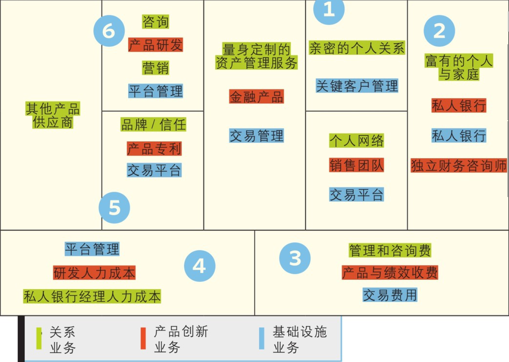

_这张图反面描绘了传统的私人银行商业模式，描绘了其间的权衡妥协，并把它分拆成三种基本业务：关系管理、产品创新和基础设施管理。_

权衡取舍

1. 银行用两种不同的逻辑为两个不同的市场服务。咨询业务是一种长期、基于关系的业务，而销售金融产品是复杂且快速变化的业务。
2. 该银行的目标是出售其产品给竞争银行增加收入，但是这会产生利益冲突。
3. 银行的产品部门强迫咨询师向客户销售银行自家产品，这与客户希望有“中立的建议”有所冲突。客户希望投资市场上最好的产品，而不管这些产品来自哪家。
4. 以成本和效率为焦点的交易平台业务和薪酬敏感的咨询与金融产品业务相冲突，后者需要吸引昂贵的人才。
5. 交易平台业务需要一定的规模来压低成本，单独一家银行很难做到。
6. 产品创新业务由快速研发和迅速进入市场所驱动，而这与需要长期维持的咨询业务相冲突。

### 移动通信行业
移动通信企业已经将其业务分拆了。以前，传统的电信运营商之间的竞争围绕着网络质量，但是现在它们更突出与竞争者共享网络，或将网络运营全部外包给设备制造商。为什么？因为它们意识到自己的核心资产不再是网络，而是它们的品牌及客户关系。

## 长尾式商业模式
长尾式商业模式的核心是多样少量：他们关注于为利基市场提供大量产品，每种产品相对而言卖得都少。利基产品销售总额可以与凭借少量畅销产品产生绝大多数销售额的传统模式相媲美。长尾模式需要低库存成本和强大的平台，并使得利基产品对于兴趣买家来说容易获得。

### 图书出版行业的变革
传统的图书出版模式建立在选择过程基础上，出版商审查许多作者和稿件，然后选择那些似乎最有可能达到销售目标的作者和稿件。与此相反，希望不大的作者及其作品将会被拒绝，因为编辑、设计、印刷、推广卖得不好的图书可能无利可图。出版商们最感兴趣那些印刷后针对广大读者可以热卖的图书。

新的模式：Lulu.com将传统以畅销书为中心的出版模式转变为提供让每个人都能出版作品的服务。Lulu.com的商业模式是基于帮助利基和业余作者在市场上推出作品。它通过为作者提供清样、出版和在线商场分销作品的工具消除了传统模式的高进入门槛，这与选择“市场—价值”的传统模式形成了强烈的对比。实际上，Lulu吸引的作者越多，就越有可能成功，因为这些作者同时也会成为消费者。简单地说，Lulu是一个多边的平台（参见此处），通过用户自主生成利基内容所形成的长尾来连接和服务作者与读者。成千上万的作者都在使用Lulu.com的自助服务工具出版和销售自己的书籍。这种模式之所以能够发挥作用，是因为只根据实际订单来印刷书籍。特定主题的作品销售失败也与Lulu.com无关，因为这样的失败并不会给Lulu.com带来任何成本。

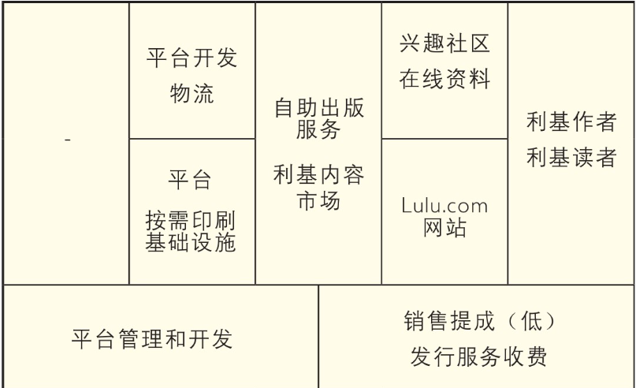

### 乐高的新长尾
2005年，乐高开始尝试用户创造内容的模式。它们推出了乐高工厂，让客户组装他们自己的乐高套件并在线订购。使用称为乐高数码设计师（LEGO digital designer）的软件，客户可以发明和设计自己的建筑物、汽车、主题和人物，期间可以从数千种组件和颜色中选择搭配。客户甚至可以设计用来包装定制玩具套件的包装盒。通过乐高工厂，这家公司把被动的客户变成了主动设计者，参与到乐高的设计体验中来。

这种模式要求改造供应链基础设施，因为（客户自己定制的）玩具套件订货量都很低，所以乐高也没有完全改造它的支撑基础设施来适应新的乐高工厂模式，而仅仅调整了现有资源和业务（来适应新的模式）。

乐高工厂：客户设计（玩具）套件：

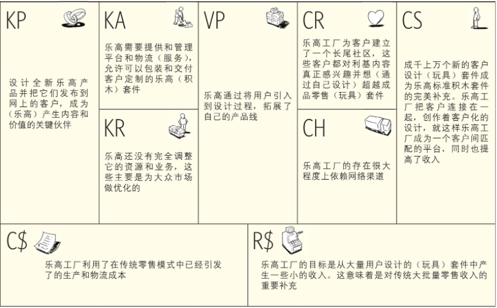

    乐高+乐高的用户可以自己设计产品并在线订购
    =
    乐高工厂+乐高允许用户销售自己设计的产品
    =
    乐高的用户产品目录

## 多边平台式商业模式
多边平台将两个或者更多有明显区别但又相互依赖的客户群体集合在一起。

只有相关客户群体同时存在的时候，这样的平台才具有价值。多边平台通过促进各方客户群体之间的互动来创造价值。多边平台需要提升其价值，直到它达到可以吸引更多用户的程度，这种现象被称为`网络效应`。

多边平台对于某个特定用户群体的价值本质上依赖于这个平台“其他边”的用户数量。如果有足够多的游戏，一款家用游戏机平台就能吸引足够多的玩家。另一方面，如果有足够的游戏玩家已经在玩游戏了，游戏开发商也会为新的视频游戏机开发（更多的）游戏。所以多边平台经常会面临着一个“先有鸡还是先有蛋”左右为难的困境。

解决这个问题的方法是针对一个群体。尽管多边平台的运营商最主要的成本是运营费用，但是他们经常会通过为一个群体提供低价甚至免费的服务来吸引他们，并依靠这个群体来吸引与之相对的另一个群体。多边平台的运营商所面临的困难是选择哪个群体，以及以什么价格来吸引他们。

微软免费赠送它的Windows软件开发工具包（SDK），来鼓励（程序员）为其操作系统开发新应用软件。数量庞大的应用程序把更多的用户吸引到Windows平台上来了，同时增加了微软的收入。反观另一方面，索尼的PlayStation 3游戏机是一个（运用）多边平台却适得其反的例子。索尼为每一位购买该游戏机的用户提供补贴，希望后面可以收到更多的游戏版税。这一战略执行得并不成功，PlayStation 3的游戏的销售远没有达到索尼最初的预期。

多边平台的运营商必须要问自己几个关键问题：我们能否为平台各边吸引到足够数量的客户？哪边（客户）对价格更加敏感？能够通过补贴吸引价格敏感一边的用户吗？平台另一边是否可以产生充足的收入来支付这些补贴？

### Google的商业模式
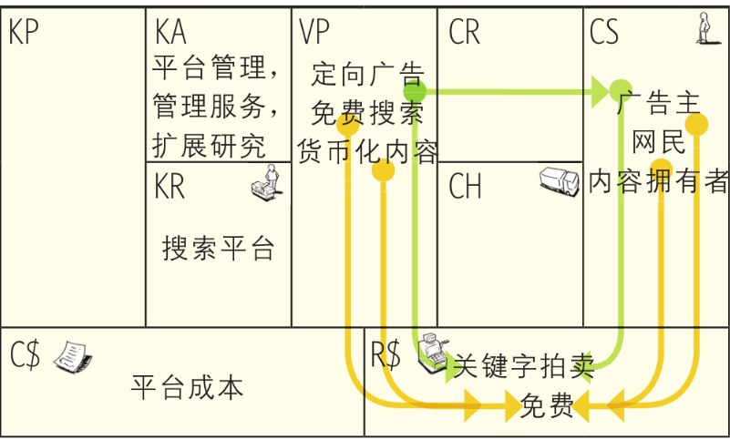

Google针对三个不同的客户细分群体提供不同的价值主张，Google有一个主要收入来源，这个收入来源补贴平台的其他边。（收入来源被“免费”替换掉了）

### Wii 对决 PSP/Xbox相同模式，不同关注点
传统上，视频家用游戏机制造商都锁定了狂热玩家，并在游戏机价格和性能上展开竞争。对于这种“铁杆玩家”来说，图像与游戏质量还有处理器速度是主要的选择标准。因此，制造商都开发极其复杂和昂贵的家用游戏机并亏本卖了多年，同时用其他两个收入来源补贴游戏硬件（游戏机）。

首先，它们开发和销售运行在自己游戏机上的自产游戏。其次，它们从第三方开发商那里赚取特许使用费，开发商为特定游戏机游戏开发权支付费用。这是一个双边平台商业模式的典型式样：一边是消费者，厂商通过大量补贴在市场上尽可能多地吸引消费者，然后，通过平台的另一边—游戏开发商来赚钱。

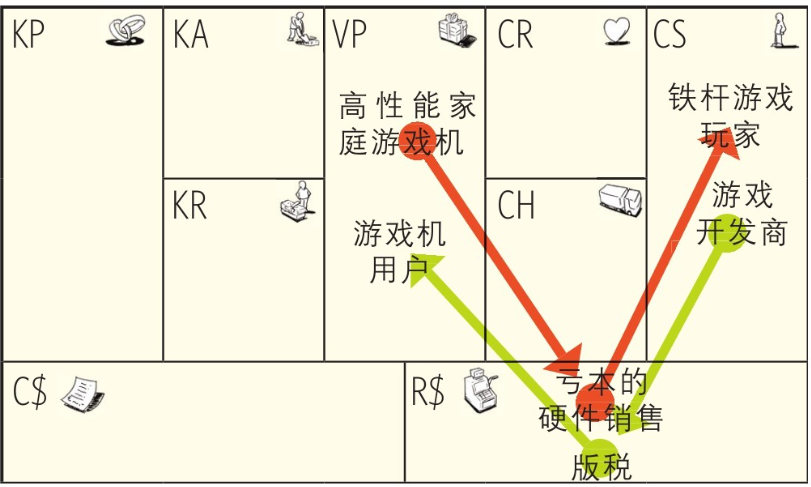

Wii 关注点：任天堂的家用游戏机针对的是数量庞大的休闲游戏玩家，而不是更小的传统游戏发烧友市场。Wii赢得了休闲玩家的倾心，相对便宜的游戏机配备一个专门遥控器，让玩家可以通过身体的姿态控制方向。诸如Wii体育、Wii音乐和Wii健身等运动控制游戏的新颖性和趣味性吸引了数目庞大的休闲游戏玩家。这个区别也是任天堂所造就的新型双边平台的基础。

索尼和微软的竞争代价昂贵，专利性、最新型的技术都以游戏发烧友为目标，赞助游戏机的同时期望赢得市场份额，并且保持硬件价格不要太昂贵。而另一方面，任天堂却专注于一个对技术性能远不敏感的市场细分群体，任天堂用动作控制游戏的“趣味因素”吸引客户。对比全新而强大的芯片组而言，这是一项廉价得多的技术创新。因此，任天堂Wii的生产成本更低，使得该公司得以放弃商业化补贴。这是任天堂与竞争对手索尼和微软主要的不同点：任天堂从它双边Wii平台的两边赚钱。在每台卖给消费者的游戏机上都可以产生利润，同时从游戏开发商那里收取版税。

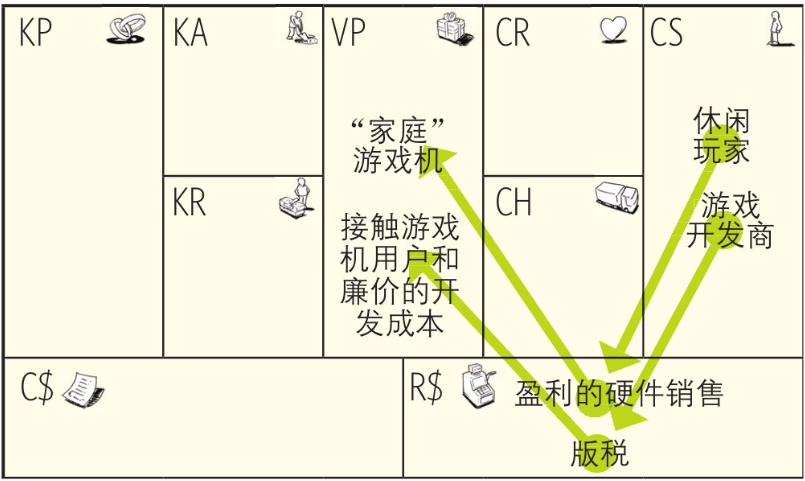

## 免费式商业模式
在免费式商业模式中，至少有一个庞大的客户细分群体可以享受持续的免费服务。免费服务可以来自多种模式。通过该商业模式的其他部分或其他客户细分群体，给非付费客户细分群体提供财务支持。

接受免费的东西总是一个有吸引力的价值主张。

我们来看看让免费成为可行商业模式可选项的三种不同商业模式式样。每种商业模式式样都有不同的潜在经济特征，但是它们都有一个共同的特点：至少有一个客户细分群体持续从免费的产品或服务中受益。这三种模式是：

1. 基于多边平台（基于广告（advertising-based））的免费产品或服务
2. 带有可选收费服务（所谓的“免费增收”（freemium）模式）的免费基本服务；
3. “诱钓”（bait & hook）模式，即使用免费或廉价的初始产品或服务来吸引客户重复购买。

### 广告：多边平台模式
这种式样的一个突出例子就是Metro，一份在斯德哥尔摩创办的免费报纸，现在在全球许多城市都可以看到同类型的报纸。Metro的本质就在于它是如何改变传统日报模式的。

首先，这份报纸本身是免费的。其次，这份报纸集中在人流量大的通勤区和公共交通网络，通过人工和自助服务架分发。这就需要Metro建立自己的分销网络，但也能让该公司快速地实现广泛流通。其次，对于年轻的上班族而言，Metro把制作报纸的编辑成本削减至刚好能满足那些在短乘期间上下班的年轻乘客。

很快，竞争对手采用相同模式跟进了，但是Metro通过一系列聪明的举措使它们陷入了困境。例如，Metro控制了在火车站和汽车站的大多数新闻报纸货架，迫使竞争对手在一些重要地区只能采用昂贵的手工分发。

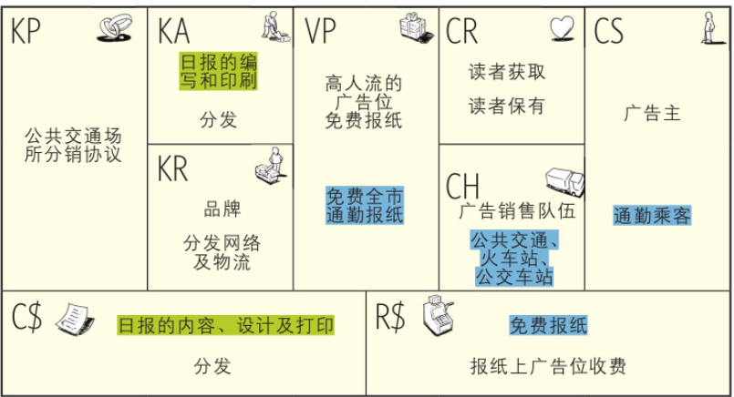

- 绿色：通过裁减编辑团队，以最大限度地削减成本的方式制作报纸，品质刚好可以满足通勤阅读。
- 蓝色：通过免费供应和集中在人流量大的公共区与交通网络发放来确保高流动性。

### 免费增收商业模式：基础免费，增值收费
免费增收模式中有大量基础用户受益于没有任何附加条件的免费产品或服务。大部分免费用户永远不会变成付费客户；只有一小部分，通常不超过所有用户的10％的用户会订阅收费的增值服务。这一小部分付费用户群体所支付的费用将用来补贴免费用户。

在免费增收模式中，关键的指标是为单位用户提供免费服务的成本和免费用户变成付费用户的转化率。

Flickr—被雅虎（Yahoo!）在2005年收购的流行照片共享网站，提供了一个很好的免费增收商业模式的案例。Flickr的用户可以免费注册允许他们上传和共享照片的账户。这种免费服务有一定限制，诸如受限的存储空间和每月上传照片的最大数量。

而那一小部分年费用户可以购买“高级”（pro）账户并享受无限上传和不限量的存储空间，外加额外功能。

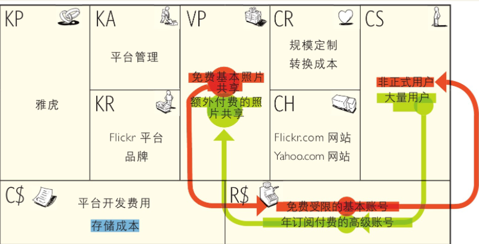

- 蓝色：平台开发所带来的固定成本和成没成本，依赖存储照片数量的可变成本
- 红色：大量非正式用户免费的基本账户
- 绿色：少量付费的高级用户

### 开源：变形的免费增收模式
软件行业内的商业模式通常有三个特点：

1. 支撑打造产品的专业软件开发团队的高固定成本；
2. 软件专家和产品开发的高固定成本；
3. 构建在各种各样用户许可证和定期软件升级收费基础上的收入模型。

Red Hat知道，企业感兴趣耐用的、免费授权的开源软件，但是却不愿意真正部署这些软件，因为没有单一的实体在法律上对这些软件的开发和维护负责。Red Hat填补了这个空白，并为企业用户提供稳定的、经过测试的、服务就绪的开源软件的各种免费版本，尤其是Linux操作系统。

每一个Red Hat的发行版都提供7年的支持。

skype：5年多历史，4亿多用户，1000多亿次免费电话，2008年年收入5.5亿美元。

用户只有在呼叫固定电话和移动电话时才需要付费，这种增值服务被称做SkypeOut，费率非常低廉。实际上，用户的收费只比接通费用略多一点，接通费用是Skype通话通过诸如iBasis和Level 3等批发运营商时的呼叫路由所引发的，这些批发运营商处理Skype公司的网路流量。

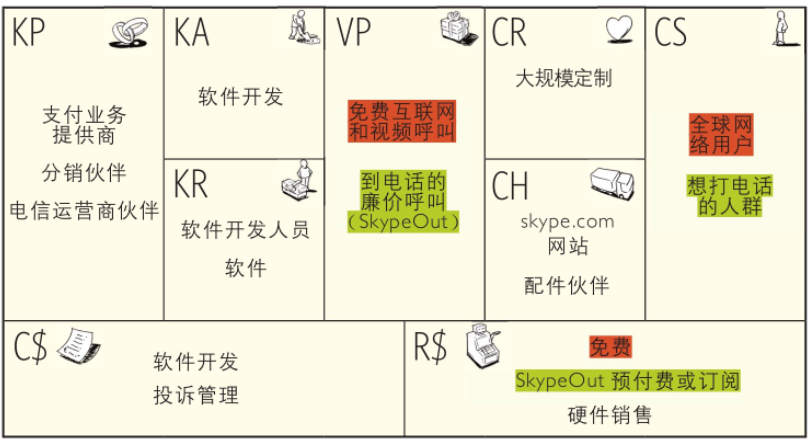

- 红色：超过90%的skype用户订阅免费服务
- 绿色：付费SkypeOut呼叫账号少于总用量的10%

### 保险模式：颠倒的免费增收
在免费增收模式中，少量为高级服务付费的客户补贴大量非付费客户。而保险模式则正好相反—将免费增收模式完全颠倒过来。在保险模式中，大量用户定期支付小额费用，来保护自己预防那些一旦发生在财务上就是毁灭性的小概率事件。简而言之，大量付费客户补贴有实际需求的少量客户，而且付费客户可以在任何时间成为受益客户群中的一员（即获赔客户）。

REGA是瑞士的一家非营利组织，通过直升机和飞机将医疗人员运送到事故现场，特别是瑞士的山区。超过200万名叫做“赞助人”的客户资助了这家机构，作为回报，赞助人在被REGA营救过程中无须支付任何费用。山区救援行动可能非常昂贵，所以REGA的赞助人认为该服务在保障他们免受在滑雪假期、夏季远足或山地驾驶发生事故时的高额花销时很有吸引力。

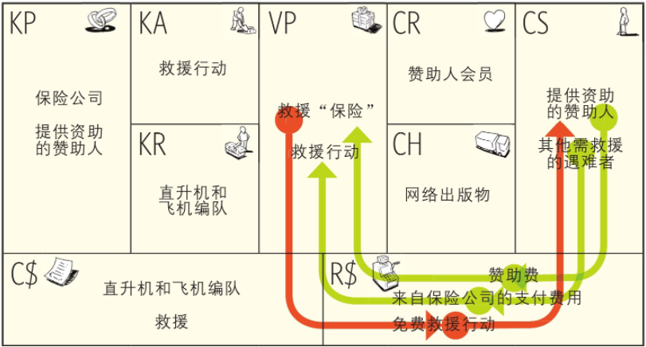

### 诱钓模式
`诱钓（bait & hook）`指的是通过廉价的、有吸引力的甚至是免费的初始产品或服务，来促进相关产品或服务未来的重复购买的商业模式式样。

这种模式也被称为`“亏损特价品”（loss leader）`或者`“剃刀与刀片”（razor & blades）模式`。“亏损特价品”指的是最初补贴甚至亏本提供，目的是从客户后续购买产生利润的产品或服务。

运营商起初赔钱免费赠送手机，但他们很容易通过后续按月服务费弥补损失。

1904年，金·吉列将第一款可替换刀片剃须刀推向市场，并决定以极低的折扣销售剃须刀架，甚至作为其他产品的赠品来销售，以此创造一次性刀片的需求。

控制这种“锁定”的关系是这种模式能够成功的关键。

通过专利限制（blocking patent），吉列保证了竞争对手无法为吉列刀架提供更便宜的刀片。事实上，剃须刀是今日世界上专利保护最完善的消费产品，有超过1000种专利，覆盖了从润滑条到“刀头”系统的方方面面。

包括喷墨式打印机行业。诸如惠普、爱普生和佳能等生产商通常都以很低的价格销售打印机，尔后通过墨盒的销售产生良好的利润。

## 开放式商业模式
开放式商业模式可以用于那些通过与外部伙伴系统性合作，来创造和捕捉价值的企业。这种模式可以是“由外到内”，将外部的创意引入到公司内部，也可以是“由内到外”，将企业内部闲置的创意和资产提供给外部伙伴。

### 宝洁：连接和发展
2000年6月，宝洁的股价不断下滑，长期担任宝洁高管的雷富礼（A. G. Lafley）临危受命，成为这家消费品巨头的新CEO。为了振兴宝洁，雷富礼再次将“创新”作为公司的核心。但是他没有对研发部门大力投资，而是建立了一种新的创新文化：从关注内部研发到关注开放式研发过程的转变。

一个关键因素就是“连接和发展”战略，这个战略旨在通过外部伙伴关系来促进内部的研发工作。

雷富礼制定了一个雄心勃勃的目标：在现有的接近15％的基础上，将公司与外部伙伴的创新工作提高到总研发量的50％。2007年，该公司完成了这个目标。与此同时，研发生产率大幅提升了85％，而研发成本仅比雷富礼接任CEO前有略微的提高。

为了连接企业内部资源和外部世界的研发活动，宝洁在其商业模式中建立了三个“桥梁”：技术创业家、互联网平台和退休专家。

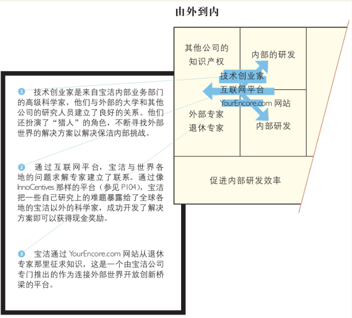

### 葛兰素史克的专利池
由内到外的开放式创新方法通常专注于将内部闲置资产的变现，主要是专利和技术。就葛兰素史克的专利池而言，动机略有不同。这家企业的目标是让药物在世界上最贫穷的国家更容易获得，并促进疑难病症的研究。为达到此目标，它们采取的方法之一是把开发这些疑难杂症药物相关的知识产权权利放入对外开放的专利池，供外部的其他研究者所用。因为制药公司主要专注于研发畅销药物，所以未被深入研究的疾病相关的知识产权往往被闲置。专利池汇集了来自不同专利持有者的知识产权，并让它更容易获得。这个做法可以帮助防止研发进度被某个专利持有者所阻碍。

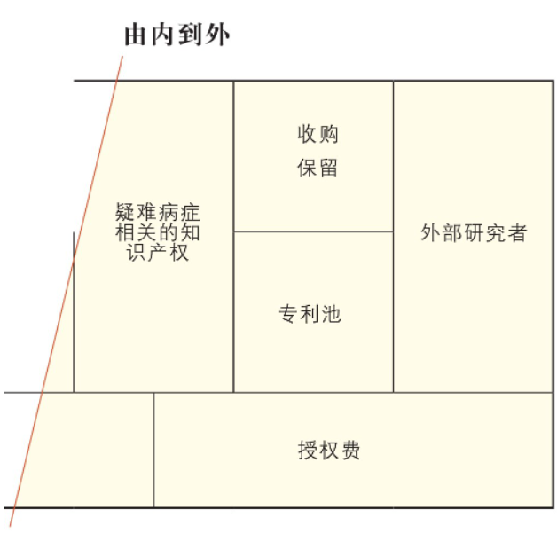

### 连接器：Innocentive
当企业试图吸引拥有知识并可以解决难题的个人或者组织时，或是企业在寻求外部研究专家见解时，通常会带来大量的成本。另一方面，那些想在组织外运用知识的研究专家们在寻找有吸引力的机会时也会引发搜寻成本，在为他们的研究成果寻找应用前景时也会带来成本。这就是InnoCentive公司的机会所在。

InnoCentive公司在有待解决研究难题的组织和来自世界各地渴望解决挑战性难题的研究专家之间建立了联系。InnoCentive起初只是制药商礼来公司（Eli Lilly）的一部分，现在作为一个独立中介机构服务于非营利组织、政府机构和诸如宝洁、苏威（Solvay）及洛克菲勒基金会等商业机构。

将创新难题发布在InnoCentive网站上的企业被称为“求解者”，它们会用现金奖励那些成功的问题解决者，金额从5000美元到100万美元不等。那些试图找到待解难题的科学家被称为“解决者”。InnoCentive的价值主张就在于汇聚和联结“求解者”和“解决者”。

# 设计
## 技术方法_1 客户洞察 （Customer Insights）
创新的成功需要依靠对客户的深入理解，包括环境、日常事务、客户关心的焦点及愿望。

苹果的iPod媒体播放器提供了一个很好的案例。苹果知道人们喜欢的并不是数码媒体播放器本身，这家公司意识到用户需要一种无缝的服务，能够搜索、下载和收听数字内容，包括音乐，并且他们愿意为这种能成功解决这些问题的服务付费。苹果的观点是非常独特的，特别是在非法下载猖獗、大部分公司都认为没有人会为在线音乐付费的时候。苹果并不认同这种观点，它为客户建立了一种无缝音乐（消费）体验，将iTunes音乐与媒体软件、iTunes在线商店和iPod媒体播放器整合到一起。以这种价值主张为核心的商业模式，使得苹果成为在线数字音乐市场的领导者。

    采用客户视角是整个商业模式设计过程的指导原则。
    应该让客户视角来指引我们关于价值主张、渠道通路、客户关系和收入来源的选择。

另一个挑战在于要知道该听取哪些客户和忽略哪些客户的意见。有时，未来的增长领域就在现金牛的附近。因此商业模式创新者应该避免过于聚焦于现有客户细分群体，而应该盯着新的和未满足的客户细分群体。许多商业模式创新的成功，正是因为它们满足了新客户未得到满足的需求。例如，斯泰利奥斯·哈吉·约安努（Stelios Haji-loannou）的易捷航空使中低收入客户可以享受空中旅行，而这些客户以前几乎没飞过。还有，Zipcar消除了城市居民因为拥有汽车所带来的麻烦，取而代之的是，支付了一定年费的客户可以按小时租赁汽车。这两个都是新商业模式的案例，这些商业模式全都构建在现有模式边缘的客户细分群体上：传统的空中旅行和传统的汽车租赁。

一个良好的开端是使用`移情图`（empathy map，感同身受之意），如何使用（客户）移情图：

移情图是这样发挥作用的。首先，找出你的相关商业模式中可提供服务的所有客户细分群体。选出三个有希望的候选人，并选择一个开始客户描述分析。

给这个客户一个名字和一些人口统计特征，诸如收入、婚姻状况，等等。然后参考下一页的图表，通过询问和回答以下六个问题，在活动挂图或白板上描绘你新命名的客户。

1. 她看到的是什么？描述客户在她的环境里看到了什么
   1. 环境看起来像什么？
   2. 谁在她周围？
   3. 谁是她的朋友？
   4. 她每天接触什么类型的产品或服务（相对于所有市场产品或服务）？
   5. 她遭遇的问题是什么？
2. 她听到的是什么？描述客户所处环境是如何影响客户的
   1. 她的朋友说什么？她的配偶呢？
   2. 谁能真正影响她？如何影响？
   3. 哪些媒体渠道能影响她？
3. 她真正的想法和感觉是什么？设法概述你的客户所想的是什么
   1. 对她来说，什么是最重要的（她可能不公开说）？
   2. 想象一下她的情感。什么能感动她？
   3. 什么能让她失眠？
   4. 尝试着描述她的梦想和愿望。
4. 她说些什么又做些什么？想象这位客户可能会说什么或者在公开场合可能的行为
   1. 她的态度是什么？
   2. 她会给别人讲什么？
   3. 要特别留意在客户所说和她真正想法与感受之间的潜在冲突。
5. 这个客户的痛苦是什么？
   1. 她最大的挫折是什么？
   2. 在她和她想要事物或需要达到的目标之间有什么障碍？
   3. 她会害怕承担哪些风险？
6. 这个客户想得到什么？
   1. 她真正想要和希望达到的是什么？
   2. 她如何衡量成功？
   3. 猜想一些她可能用来实现其目标的策略。

## 技术方法_2 创意构思 （Ideation）
你可以从几个不同的出发点生成针对创新商业模式的创意。我们来看看这两点：

1. 使用商业模式画布来分析商业模式创新的核心问题，
2. 使用“假如”的提问方式。

### 商业模式创新的多个集中点
商业模式创新的创意可以来自任何地方，商业模式的9个构造块都可以是创新的起点。具有改造作用的商业模式创新可以影响到多个商业模式构造块。

我们可以把这些创新区别分为4类集中点的商业模式创新：资源驱动、产品/服务驱动、客户驱动和财务驱动。

这4个集中点的每一个都可以成为主要商业模式变化的起点，每一个都可以对其他8个构造块产生强大的影响。有时候，商业模式创新可以引发自多个集中点。此外，变化经常源于那些通过SWOT分析后被标识出来的区域：针对一个商业模式的优势、劣势、机会和威胁的调查研究。

1. 资源驱动
   1. 资源驱动型创新起源于一个组织现有的基础设施，抑或合作关系拓展，抑或转变现有商业模式。
   2. 案例：亚马逊Web服务是基于亚马逊网站的零售基础设施的，为其他企业提供服务器能力和数据存储空间。
2. 产品/服务驱动
   1. 产品/服务驱动型创新是以建立新的价值主张的方式来影响其他商业模式构造块。
   2. 案例：Cemex公司—墨西哥水泥制造商，承诺混凝土可以在4个小时内送达施工现场，而不是行业通行的48小时。这就需要他们改变自己的商业模式。这一创新帮助Cemex从一家墨西哥区域性的竞争者变成了世界第二大水泥生产商。
3. 客户驱动
   1. 客户驱动型创新是基于客户需求、降低获取成本或提高便利性的。就像所有从单一集中点所引发的创新一样，来自客户驱动的创新同样可以影响商业模式的构造块。
   2. 案例：23andMe为个人客户提供个性化DNA测试服务—这一服务以前专门提供给健康专家和研究人员，这对价值主张和测试结果的发布都有重要的影响，23andMe是通过大规模定制化的Web资料来达成上述目标的。
4. 财务驱动
   1. 财务驱动创新是由收入来源、定价机制或成本结构来驱动的，同样影响商业模式的其他构造块。
   2. 案例：1958年，施乐发明了Xerox 914型复印机—世界上第一台普通纸复印机。针对市场定价太高的问题，施乐构建了一种新的商业模式。它们以每月95美元的价格出租这种复印机，包括2000张免费复印纸，额外购买一张复印纸需要5美分。就这样，客户获得了新设备，并开始了每月成千上万份的复印。
5. 多中心驱动
   1. 多中心驱动创新是由多个集中点驱动的，并会显著影响商业模式的其他多个构造块。
   2. 案例：专业的全球建筑工具制造商喜利得（Hilti）将自己的商业模式从彻底的销售工具转变为出租工具套件给客户。这是对喜利得价值主张的潜在改变，同时也改变了它们的收入来源，从一次销售收入变成重复性的服务收入。

### “假如”（What if）提问的力量
“假如”问题可以帮助我们打破现有模式强加的束缚。这些问题会激发我们挑战自己的思维，可以提出一些让我们好奇而又难以执行的命题。

- 日报的经营者可以问自己：如果我们停止发行印刷版，改为通过亚马逊Kindle电子图书阅读器或者完全通过网络数字发行会怎么样？这将极大地降低我们的生产和物流成本，但需要弥补平面广告损失的收入，同时把读者转换到数字渠道上来。
- 买家具的顾客可以从大仓库的扁平货架上挑选配件，然后回家组装成家具吗？这个在我们今天看来很普通的体验，在20世纪60年代宜家推出这种概念之前显得那么不可思议。
- 航空公司并不购买飞机引擎，而是根据飞机引擎运转的时数来付钱？罗尔斯-罗伊斯公司将自己从一家亏损的英国飞机引擎制造商变成一家服务型公司，并成为当今世界上第二大的大型喷气式引擎供应商。
- 语音通话在全球范围内免费？2003年Skype推出了一项服务，让用户通过网络享受免费的全球通话。5年之后，Skype拥有了4亿注册用户，每年通话超过1000亿次。
- 汽车制造商不再销售汽车，而是提供服务？2008年，戴姆勒在德国乌尔姆推出了Car2go服务—一项试验性的汽车服务—Car2go车队的用户可以在城市的任何一个租车点租用和归还汽车，并按照使用的时间分钟数支付机动服务费用。
- 个人可以不从银行手里贷款，而是借别人的钱？2005年，英国的Zopa银行在互联网上推出了点对点贷款平台。
- 孟加拉国的每位农民都可以拥有电话？这是格莱珉电话公司设定的目标，通过与小额贷款机构乡村银行的合作实现。当时，孟加拉国的电话普及率还是世界最低的，而今天格莱珉电话公司已经是孟加拉国最大的纳税大户了。

## 技术方法_3 可视思考 （Visual Thinking）
对于商业模式的相关工作来说，可视思考是必不可少的。我们所谓的`可视思考`，是指使用诸如图片、草图、图表和便利贴等视觉化工具来构建和讨论事情。因为商业模式是由各种构造块及其相互关系所组成的复杂概念，不把它描绘出来将很难真正理解一个模式。

商业模式确实是一个系统，其中的一个元素可以影响其他的元素，只有作为一个整体看待的时候才有意义。不把它进行可视化，很难捕捉到商业模式的全貌。事实上，通过可视化地描绘商业模式，人们可以把其中的隐形假设转变为明确的信息，这使得商业模式明确而有形，并且讨论和改变起来也更清晰。视觉化技术赋予了商业模式“生命”，并能够促进人们的共同创造。

我们会提到两种视觉化思考的技术：`便利贴的用法`和`结合商业模式画布略图描绘的用法`。我们还将讨论四个由视觉化思维改善的过程：理解、对话、探索和交流。

### 通过便利贴实现视觉化
这里有三个简单的指导准则：（1）使用粗的马克笔；（2）每张便利贴上只写一个元素；（3）每张便利贴上只写几个词以便捕捉要点。

草图和图画在许多方面都能发挥作用。最明显的作用是基于简单图画解释和交流商业模式（变得更加容易）。

### 视觉化的故事讲述活动
1. 绘制出你的商业模式
   1. 从绘制出一个简单文字版本的商业模式开始。
   2. 在单个便利贴上写上商业模式的每个元素。
   3. 绘制可以独自或团队协作来完成。
2. 画出每个商业模式元素
   1. 每次一张，拿着便利贴用绘图方式替代其中的文字所表现的内容。
   2. 保持图像简单：忽略细节。
   3. 只要能够传达信息，图画质量并不重要。
3. 设定故事情节
   1. 当你讲故事的时候，决定先放上去哪张便利贴。
   2. 尝试不同的路径。你可以从客户细分群体开始，也可以从价值主张开始。
   3. 基本上，如果元素可以有效支撑你的故事的话，从任何起点开始都是可能的。
4. 讲述故事
   1. 讲述你的商业模式，每次画一张便利贴图画。

## 技术方法_4 原型制作 （Prototyping）
商业模式原型制作，与我们称之为“设计态度”的心态相关。这代表了一种不妥协的承诺，通过勾绘出许多原型，来发现新的和更好的商业模式，既有粗略的又有详细的，意味着许多战略可供选择。你还可以用不同层次的原型做试验。

1. `餐巾素描`（概括和抛出一个粗略的想法）。绘制一个简单的商业模式画布。使用关键元素描述这个想法。
   1. 概括想法
   2. 包含价值主张
   3. 包含主要的收入来源
2. `详细绘制画布`（探索怎样才能让这个想法可行）。绘制一个更详细的画布，探索可以让这个商业模式可行所需的所有元素。
   1. 绘制一个完整的画布
   2. 考虑你的业务逻辑
   3. 评估市场潜力
   4. 理解各种构造块之间的关系
   5. 做些基本事实检查
3. `商业案例`（检查想法的可行性）。把详细的画布转变成电子表格来评估模型的赢利潜力。
   1. 制作完整的画布
   2. 包括关键的数据
   3. 计算成本和收入
   4. 评估赢利潜力
   5. 测试基于不同假设的财务场景
4. `现场测试`（调查客户的接受度和可行性）。你已经决定了潜在的新商业模式，现在要进行实地测试某些方面。
   1. 为新模式准备一个站得住脚的商业案例
   2. 在实地测试时，包括预期的和实际的客户
   3. 测试价值主张、渠道、定价机制抑或市场中的其他要素

## 技术方法_5 故事讲述 （Storytelling）
本质上，新颖而富有创意的商业模式经常是晦涩难懂的，它们通过全新的方式组合各种元素，挑战现行的模式，它们迫使听众们打开思路，去接受这些新的可能。面对这些陌生模式，听众们很有可能会产生本能的抵触。所以，把新的商业模式呈现出来，而又不招致抵触情绪，呈现的方法就变得至关重要。就像商业模式画布帮助你绘制和分析新模式一样，讲故事能帮助你有效地表达新的商业模式和理念。好的故事能引起听众的兴趣，所以讲故事是一种理想的工具，为我们深入讨论商业模式和其内在逻辑预热。

## 技术方法_6 情景推测 （Scenarios）
我们会讨论两种类型的情景推测。

1. 不同的客户背景：客户是如何使用产品和服务的，什么类型的客户在使用它们，客户的顾虑、愿望和目的分别是什么。这种建立在客户洞察（参见此处）之上的情景推测更进一步，把对客户的了解融入一组独特、具体的图像。通过描述特定的场景，关于客户的情景推测就能把客户洞察具体形象地表现出来。
2. 新商业模式可能会参与竞争的未来场景。这里的目的并不是要去预测未来，而是要具体形象地草绘出未来的各种可能情况。这种技巧训练能帮助创新者，针对未来不同的环境设计出最为恰当的商业模式。在这一领域的商业战略文献中，都称这种技巧为“情景规划”。在商业模型的创新中，运用这种情景规划技巧“迫使”我们去思考商业模式在特定的环境下可能的演变趋势，这样加深了我们对于模式的认知和可能有必要调整的理解。最为重要的是，它帮助我们更好地来迎接未来的商业环境。

# 战略
## 商业模式环境：背景、设计的驱动因素和制约因素
建议把商业环境大体上映像成四块主要领域范畴。它们分别是：（1）市场影响因素；（2）行业影响因素；（3）重要趋势；（4）宏观经济影响因素。

```mermaid
graph LR;
    r[商业环境]-->a[市场影响]
    r-->b[行业影响]
    r-->c[重要趋势]
    r-->d[宏观经济影响]
    a-->a1[细分市场]
    a-->a2[需要和需求]
    a-->a3[市场问题]
    a-->a4[转换成本]
    a-->a5[收益吸引力]
    b-->b1[供应商和其他价值链成员]
    b-->b2[利益相关者]
    b-->b3[竞争对手-现有的]
    b-->b4[行业新进入者-搅局者]
    b-->b5[替代性产品和服务]
    c-->c1[监管法规趋势]
    c-->c2[社会和文化趋势]
    c-->c3[技术趋势]
    c-->c4[社会经济趋势]
    d-->d1[全球市场情况]
    d-->d2[经济基础设施]
    d-->d3[资本市场]
    d-->d4[商品和其他资源]
```

市场影响：

子方面 | 说明 | 主要拷问
----|----|-----
市场问题 | 从客户和提供给客户的产品成服务的视角发现驱动和改变市场的关键因素 | 影响客户环境的关键因素是什么？现在正在发生什么转变？市场在朝什么方向发展？
市场细分 | 发现主要的细分市场，描述它们的吸引力，寻找新的细分市场 | 哪块客户细分群体最为重要？最大的增长潜力在哪里？哪个细分市场在要缩？哪个边缘细分市场值得关注？
需要和需求 | 罗列出市场需求，分析市场需求目前的服务水平 | 客户密要什么？在客户求中，哪些没有得到满足，最大的缝隙在哪甲？客户最渴望满足的需求是什么？哪些需求在增长？哪些在降低？
转换成本 | 描述与客户投靠竞争对手行为相关的因素 | 联系客户和公司及其产品或服务的组带是什么？阻止客户投靠竞争对手的转移成本是什么？客户找到和购买相似产品或服务的难度大吗？品牌的作用大吗？
收益吸引力 | 寻找出与收益吸引力和定价能力相关的因素 | 让客户真正愿意掏腰包的是什么产品或服务？什么产品或服务能获得最大的收益率？客户能轻而易举地发现和购买更为使宜的产品和服务吗？

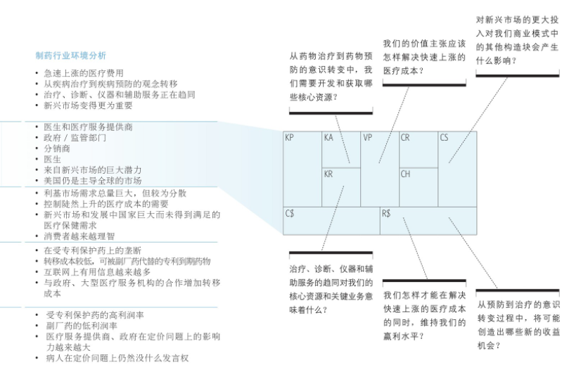

