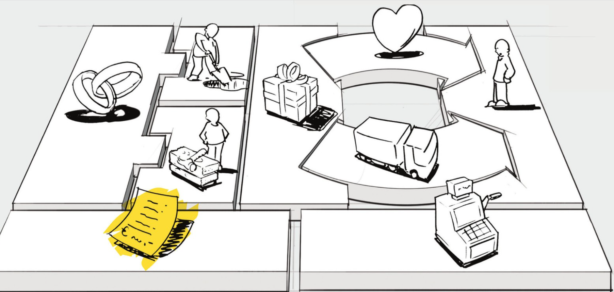
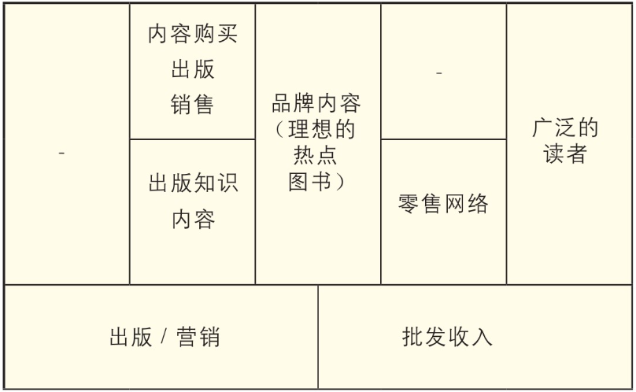

    作者: 亚历山大•奥斯特瓦德 (Alexander Osterwalder) / 伊夫•皮尼厄 (Yves Pigneur)
    出版社: 机械工业出版社
    原作名: Business Model Generation
    译者: 王帅 / 毛心宇 / 严威
    出版年: 2011-8-15
    页数: 284
    定价: 88.00元
    装帧: 平装
    ISBN: 9787111352211

[豆瓣链接](https://book.douban.com/subject/6718487/)

- [画布](#画布)
  - [商业模式的定义](#商业模式的定义)
  - [9个构造块（Building Blocks）](#9个构造块building-blocks)
    - [CS客户细分（Customer Segments）](#cs客户细分customer-segments)
    - [VP价值主张（Value Propositions）](#vp价值主张value-propositions)
    - [CH渠道通路（Channels）](#ch渠道通路channels)
    - [CR客户关系（Customer Relationships）](#cr客户关系customer-relationships)
    - [R$收入来源（Revenue Streams）](#r收入来源revenue-streams)
    - [KR核心资源（Key Resources）](#kr核心资源key-resources)
    - [KA关键业务（Key Activities）](#ka关键业务key-activities)
    - [KP关键合作（Key Partnerships）](#kp关键合作key-partnerships)
    - [C$成本结构（Cost Structure）](#c成本结构cost-structure)
- [式样](#式样)
  - [非绑定式商业模式](#非绑定式商业模式)
    - [私人银行：三种业务合一](#私人银行三种业务合一)
    - [移动通信行业](#移动通信行业)
  - [长尾式商业模式](#长尾式商业模式)
    - [图书出版行业的变革](#图书出版行业的变革)

# 画布
`商业模式画布The Business Model Canvas`：一种用来描述商业模式、可视化商业模式、评估商业模式以及改变商业模式的通用语言。

## 商业模式的定义
`商业模式`描述了企业如何创造价值、传递价值和获取价值的基本原理

## 9个构造块（Building Blocks）
1. `客户细分Customer Segments`：企业或机构所服务的一个或多个客户分类群体。
2. `价值主张Value Propositions`：通过价值主张来解决客户难题和满足客户需求。
3. `渠道通路Channels`：通过沟通、分销和销售渠道向客户传递价值主张。
4. `客户关系Customer Relationships`：在每一个客户细分市场建立和维系客户关系。
5. `收入来源Revenue Streams`：收入来源产生于成功提供给客户的价值主张。
6. `核心资源Key Resources`：核心资源是提供和交付先前描述要素所必备的重要资产……
7. `关键业务Key Activities`：……通过执行一些关键业务活动，运转商业模式。
8. `重要合作Key Partnerships`：有些业务要外包，而另外一些资源需要从企业外部获得。
9. `成本结构Cost Structure`：商业模式上述要素所引发的成本构成。

### CS客户细分（Customer Segments）
>客户细分构造块用来描绘一个企业想要接触和服务的不同人群或组织

客户群体现为独立的客户细分群体，如果：

- 需要和提供明显不同的提供物（产品/服务）来满足客户群体的需求；
- 客户群体需要通过不同的分销渠道来接触；
- 客户群体需要不同类型的关系；
- 客户群体的盈利能力（收益性）有本质区别；
- 客户群体愿意为提供物（产品/服务）的不同方面付费。

我们正在为谁创造价值？谁是我们最重要的客户？客户细分群体存在不同的类型。这里给出了一些例子：

- `大众市场（Mass market）`：聚焦于大众市场的商业模式在不同客户细分之间没有多大区别。价值主张、渠道通路和客户关系全都聚焦于一个大范围的客户群组，在这个群组中，客户具有大致相同的需求和问题，这类商业模式经常能在消费类电子行业中找到。
- `利基市场（Niche market）`：以利基市场为目标的商业模式迎合特定的客户细分群体。价值主张、渠道通路和客户关系都针对某一利基市场的特定需求定制。这样的商业模式常常可以在供应商—采购商（supplier-buyer）的关系中找到。例如，很多汽车零部件厂商严重依赖来自主要汽车生产工厂的采购。
- `区隔化市场（Segmented）`：有些商业模式在略有不同的客户需求及困扰（needs and problems）的市场细分群体间会有所区别。例如，瑞士信贷的银行零售业务，在拥有超过10万美元资产的大客户群体与拥有超过50万美元资产的更为富有的群体之间的市场区隔就有所不同。这些客户细分有很多相似之处，但又有不同的需求和困扰。这样的客户细分群体影响了瑞士信贷商业模式的其他构造块，诸如价值主张、渠道通路、客户关系和收入来源。思考一下瑞士微型精密系统公司（Micro Precision Systems），其专门提供外包微型机械设计和生产解决方案业务，服务于3个不同的客户细分群体—钟表行业、医疗行业和工业自动化行业，而为这些行业所提供的价值主张略有不同。
- `多元化市场（Diversified）`：具有多元化客户商业模式的企业可以服务于两个具有不同需求和困扰的客户细分群体。例如，2006年亚马逊（Amazon.com）决定通过销售云计算服务而使其零售业务多样化，即在线存储空间业务与按需服务器使用业务。因此亚马逊开始以完全不同的价值主张迎合完全不同的客户细分群体—网站公司。这个策略（可以实施）的根本原因是亚马逊强大的IT基础设施经营的多样化，其基础设施能被零售业务运营和新的云计算服务所共享。
- `多边平台或多边市场（Multi-sided platforms/multi-sided markets）`：有些企业服务于两个或更多的相互依存的客户细分群体。例如，信用卡公司需要大范围的信用卡持有者，同时也需要大范围可以受理那些信用卡的商家。同样，企业提供的免费报纸需要大范围的读者以便吸引广告。另一方面，它还需要广告商为其产品及分销提供资金。这需要双边细分群体才能让这个商业模式运转起来（参见更多关于多边平台式商业模式的内容）。

### VP价值主张（Value Propositions）
>价值主张构造块用来描绘为特定客户细分创造价值的系列产品和服务

价值主张是客户转向一个公司而非另一个公司的原因，它解决了客户困扰（customer problem）或者满足了客户需求。每个价值主张都包含可选系列产品或服务，以迎合特定客户细分群体的需求。在这个意义上，价值主张是公司提供给客户的受益集合或受益系列。

我们该向客户传递什么样的价值？ 我们正在帮助我们的客户解决哪一类难题？ 我们正在满足哪些客户需求？ 我们正在提供给客户细分群体哪些系列的产品和服务？

价值主张通过迎合细分群体需求的独特组合来创造价值。价值可以是定量的（如价格、服务速度）或定性的（如设计、客户体验）。下面一些简要要素列表有助于为客户创造价值。

- `新颖（Newness）`。有些价值主张满足客户从未感受和体验过的全新需求，因为以前从来没有类似的产品或服务。这通常但不总是与技术有关，举例来说，移动电话围绕移动通信开创了一个全新的行业。另外，诸如伦理投资基金（ethical investment funds）的产品与新技术关系甚微。
- `性能（Performance）`。改善产品和服务性能是一个传统意义上创造价值的普遍方法。个人计算机（PC）行业有依赖于这个因素的传统，向市场推出更强劲的机型，但性能的改善似乎也有它的局限。例如，近几年更快速的PC、更大的磁盘存储空间和更好的图形显示都未能在用户需求方面促成对应的增长。
- `定制化（Customization）`。定制产品和服务以满足个别客户或客户细分群体的特定需求来创造价值。近几年来，大规模定制和客户参与制作的概念显得尤为重要。这个方法允许定制化产品和服务，同时还可以利用规模经济优势。
- `“把事情做好”（Getting the job done）`。可以通过帮客户把某些事情做好而简单地创造价值。罗尔斯-罗伊斯公司（Rolls-Royce）很清楚这一点：罗尔斯-罗伊斯航空公司的客户完全依赖它所制造和服务的引擎发动机。这样可以使客户把业务焦点放在他们的航线运营上。作为回报，航空公司按引擎用时向罗尔斯-罗伊斯公司支付费用。
- `设计（Design）`。设计是一个重要但又很难衡量的要素。产品可以因为优秀的设计脱颖而出，在时尚和消费电子产品工业，设计是价值主张中一个特别重要的部分。
- `品牌/身份地位（Brand/status）`。客户可以通过使用和显示某一特定品牌而发现价值。例如，佩戴一块劳力士手表象征着财富。此外，滑板者可能穿戴最新的“undergroununderground”品牌来显示他们很“潮”。
- `价格（Price）`。以更低的价格提供同质化的价值是满足价格敏感客户细分群体的通常做法，但是低价价值主张对于商业模式的其余部分有更重要的含义。经济航空公司，诸如西南航空公司（Southwest）、易捷航空公司（EasyJet）和瑞安航空公司（Ryanair）都设计了全新的商业模式，以便使低价航空旅行成为可能。另一个基于价格的价值主张例子可以在印度塔塔集团（Tata Group）设计和制造的Nano新型汽车中找到。它以令人惊叹的低价使印度全民都买得起汽车。免费产品和服务正开始越来越多地渗透到各行各业。免费提供产品和服务的范围很广，从免费报纸到免费电子邮件、免费移动电话服务无所不包（参见本书之后更多的关于免费式商业模式的内容）。
- `成本削减（Cost reduction）`。帮助客户削减成本是创造价值的重要方法。例如，Salesforce.com公司销售在线的客户关系管理系统（CRM）的应用，这项服务减少了购买者的开销并免除了用户自行购买、安装和管理CRM软件的麻烦。
- `风险抑制（Risk reduction）`。当客户购买产品和服务的时候，帮助客户抑制风险也可以创造客户价值。对于二手汽车买家来说，为期一年的服务担保规避了在购买后发生故障和修理的风险。而服务品质级别担保书（service-level guarantee）部分抑制了由买方承担外包IT服务所要承担的风险。
- `可达性（Accessibility）`。把产品和服务提供给以前接触不到的客户是另一个创造价值的方法。这既可能是商业模式创新的结果，也可能是新技术的结果，或者兼而有之。例如，奈特捷航空公司（NetJets）以普及私人飞机拥有权（fractional private jet ownership）概念而著称。通过应用创新的商业模式，奈特捷航空提供私人及企业拥有私人飞机的权限，在此之前这项服务对于绝大部分客户来说都很难支付得起。同样，共同基金（mutual funds）是通过提升可达性来创造价值的另一个例子。这种创新的金融产品使那些小康微富的人建立多元化的投资组合成为可能。
- `便利性/可用性（Convenience / usability）`。使事情更方便或易于使用可以创造可观的价值。苹果公司的iPod和iTunes为用户提供了在搜索、购买、下载和收听数字音乐方面前所未有的便捷体验。现在，苹果已经主导了市场。

### CH渠道通路（Channels）
>渠道通路构造块用来描绘公司是如何沟通、接触其客户细分而传递其价值主张

渠道通路包含以下功能：

- 提升公司产品和服务在客户中的认知；
- 帮助客户评估公司价值主张；
- 协助客户购买特定产品和服务；
- 向客户传递价值主张；
- 提供售后客户支持。

通过哪些渠道可以接触我们的客户细分群体？ 我们现在如何接触他们？我们的渠道如何整合？ 哪些渠道最有效？哪些渠道成本效益最好？ 如何把我们的渠道与客户的例行程序进行整合？

渠道具有5个不同的阶段，每个渠道都能经历部分或全部阶段。我们可以区分直销渠道与非直销渠道，也可以区分自有渠道和合作伙伴渠道。

### CR客户关系（Customer Relationships）
>客户关系构造块用来描绘公司与特定客户细分群体建立的关系类型

客户关系可以被以下几个动机所驱动：

- 客户获取
- 客户维系
- 提升销售额（追加销售）

我们每个客户细分群体希望我们与之建立和保持何种关系？哪些关系我们已经建立了？这些关系成本如何？如何把它们与商业模式的其余部分进行整合？

我们可以把客户关系分成几种类型，这些客户关系可能共存于企业与特定客户细分群体之间。

- `个人助理（Personal assistance）`.这种关系类型基于人与人之间的互动。在销售过程中或者售后阶段，客户可以与客户代表交流并获取帮助。在销售地点，可以通过呼叫中心、电子邮件或其他销售方式等个人助理手段来进行。
- `专用个人助理（Dedicated personal assistance）`。这种关系类型包含了为单一客户安排的专门的客户代表。它是层次最深、最亲密的关系类型，通常需要较长时间来建立。例如，私人银行服务会指派银行经理向高净值个人客户提供服务。在其他商业领域也能看到类似的关系类型，关键客户经理与重要客户保持着私人联系。
- `自助服务（Self-service）`。在这种关系类型中，一家公司与客户之间不存在直接的关系，而是为客户提供自助服务所需要的所有条件。
- `自动化服务（Automated services）`。这种关系类型整合了更加精细的自动化过程，用于实现客户的自助服务。例如，客户可以通过在线档案来定制个性化服务。自动化服务可以识别不同客户及其特点，并提供与客户订单或交易相关的信息。最佳情况下，良好的自动化服务可以模拟个人助理服务的体验（例如提供图书或电影推荐）。
- `社区（Communities）`。目前各公司正越来越多地利用用户社区与客户/潜在客户建立更为深入的联系，并促进社区成员之间的互动。许多公司都建立了在线社区，让其用户交流知识和经验，解决彼此的问题。
- `共同创作（Co-creation）`。许多公司超越了与客户之间传统的客户—供应商关系，而倾向于和客户共同创造价值。亚马逊书店就邀请顾客来撰写书评，从而为其他图书爱好者提供价值。有的公司还鼓励客户参与到全新和创新产品的设计过程中来。还有一些公司，例如YouTube，请用户来创作视频供其他用户观看。

### R$收入来源（Revenue Streams）
>收入来源构造块用来描绘公司从每个客户群体中获取的现金收入（需要从创收中扣除成本）

一个商业模式可以包含两种不同类型的收入来源：
1. 通过客户一次性支付获得的交易收入。
2. 经常性收入来自客户为获得价值主张与售后服务而持续支付的费用。

什么样的价值能让客户愿意付费？他们现在付费买什么？他们是如何支付费用的？他们更愿意如何支付费用？每个收入来源占总收入的比例是多少？

以下是一些可以获取收入的方式：

- `资产销售（Asset sale）`：最为人熟知的收入来源方式是销售实体产品的所有权。亚马逊在线销售图书、音乐、消费类电子产品和其他产品。菲亚特销售汽车，客户购买之后可以任意驾驶、转售甚至破坏。
- `使用收费（Usage fee）`：这种收入来源于通过特定的服务收费。客户使用的服务越多，付费越多。电信运营商可以按照客户通话时长来计费。旅馆可以按照客户入住天数来计费。快递公司可以按照运送地点的距离来计费。
- `订阅收费（Subscription fees）`：这种收入来自销售重复使用的服务。一家健身房可以按月或按年以会员制订阅方式来销售健身设备的使用权。在线魔兽世界—一款大型多人在线角色扮演游戏，允许用户使用按月订阅的付费方式。诺基亚的音乐服务也可以让用户通过按月订阅付费的方式来收听音乐。
- `租赁收费（Lending/Renting/Leasing）`：这种收入来源于针对某个特定资产在固定时间内的暂时性排他使用权的授权。对于出借方而言，租赁收费可以带来经常性收入的优势。另一方面，租用方或承租方可以仅支付限时租期内的费用，而无须承担购买所有权的全部费用。Zipcar.com提供了一个很好的例证。该公司可以让客户在北美各大城市按小时租车。Zipcar.com的服务导致许多消费者决定租赁汽车而不再购买汽车。
- `授权收费（Licensing）`：这种收入来自将受保护的知识产权授权给客户使用，并换取授权费用。授权方式可以让版权持有者不必将产品制造出来或者将服务商业化，仅靠知识产权本身即可产生收入。授权方式在媒体行业非常普遍，内容所有者保留版权，但是可以将使用权销售给第三方。同样，在技术行业，专利持有人授权其他公司使用专利技术，并收取授权费作为回报。
- `经纪收费（Brokerage fees）`：这种收入来自为了双方或多方之间的利益所提供的中介服务而收取的佣金。例如，信用卡提供商作为信用卡商户和顾客的中间人，从每笔销售交易中抽取一定比例的金额作为佣金。同样，股票经纪人和房地产经纪人通过成功匹配卖家和买家来赚取佣金。
- `广告收费（Advertising）`：这种收入来源于为特定的产品、服务或品牌提供广告宣传服务。传统上，媒体行业和会展行业均以此作为主要收入来源。近几年，在其他行业包括软件和服务，也开始逐渐向广告收入倾斜。

定价机制有两种主要的形式：固定定价（根据静态变量而预设价格的的定价）和动态定价（根据市场情况变化而调整的定价）。

固定定价类目 | 固定定价说明 | 动态定价类目 | 动态定价说明
-----|---------|------|--------
标价 | 单独产品、服务或其他价值主张的固定价格 | 协商定价(谈判定价) | 双方或多方商定价格，最终的价格取决于谈判能力或谈判技巧
基于产品特性的定价 | 基于价值主张特性的数量或质量的定价 | 收益管理定价 | 基于库存量和购买时间的定价（通常用于易损资源，例如旅馆的房间或飞机的座位)
基于客户细分的定价 | 基于客户细分群体的类型和特点定价 | 实时市场定价 | 价格基于市场供求的动态关系决定
数量定价 | 基于客户购买的数量定价 | 拍卖定价 | 价格根据竞拍结果决定

### KR核心资源（Key Resources）
>核心资源用来描绘让商业模式有效运转所必需的最重要因素

核心资源可以是实体资产、金融资产、知识资产或人力资源。核心资源既可以是自有的，也可以是公司租借的或从重要伙伴那里获得的。

我们的价值主张需要什么样的核心资源？ 我们的渠道通路需要什么样的核心资源？ 我们的客户关系呢？收入来源呢？

核心资源可以分为以下几类：

- `实体资产（Physical）`。包括实体的资产，诸如生产设施、不动产、汽车、机器、系统、销售网点和分销网络等。沃尔玛和亚马逊等零售企业的核心资产就是实体资产，且均为资本集约型资产。沃尔玛拥有庞大的全球店面网络和与之配套的物流基础设施。亚马逊拥有大规模的IT系统、仓库和物流体系。
- `知识资产（Intellectual）`。包括品牌、专有知识、专利和版权、合作关系和客户数据库，这类资产日益成为强健商业模式中的重要组成部分。知识资产的开发很难，但成功建立后可以带来巨大价值。快速消费品企业例如耐克和索尼主要依靠品牌为其核心资源。微软和SAP依赖通过多年开发所获得的软件和相关的知识产权。宽带移动设备芯片设计商和供应商高通（Qualcomm）是围绕芯片设计专利来构建其商业模式的，这些核心资源为该公司带来了大量的授权收入。
- `人力资源（Human）`。任何一家企业都需要人力资源，但是在某些商业模式中，人力资源更加重要。例如，在知识密集产业和创意产业中人力资源是至关重要的。制药企业，例如诺华公司，在很大程度上依赖于人力资源，其商业模式基于一批经验丰富的科学家和一支强大娴熟的销售队伍。
- `金融资产（Financial）`。有些商业模式需要金融资源抑或财务担保，例如现金、信贷额度或用来雇用关键雇员的股票期权池。电信设备制造商爱立信提供了一个在商业模式中利用金融资产的案例。爱立信可以选择从银行和资本市场筹资，然后使用其中的一部分为其设备客户提供卖方融资服务，以确保是爱立信而不是竞争对手赢得订单。

### KA关键业务（Key Activities）
>关键业务构造模块用来描绘为了确保其商业模式可行，企业必须做的最重要的事情

我们的价值主张需要哪些关键业务？ 我们的渠道通路需要哪些关键业务？ 我们的客户关系呢？收入来源呢？

关键业务可以分为以下几类：

- `制造产品（Production）`。这类业务活动涉及生产一定数量或满足一定质量的产品，与设计、制造及发送产品有关。制造产品这一业务活动是企业商业模式的核心。
- `问题解决（Problem solving）`。这类业务指的是为个别客户的问题提供新的解决方案。咨询公司、医院和其他服务机构的关键业务是问题解决。它们的商业模式需要知识管理和持续培训等业务。
- `平台/网络（Platform/network）`。以平台为核心资源的商业模式，其关键业务都是与平台或网络相关的。网络服务、交易平台、软件甚至品牌都可以看成是平台。eBay的商业模式决定了公司需要持续地发展和维护其平台eBay.com网站。而维萨（Visa）的商业模式需要为商业客户、消费者和银行服务的Visa®信用卡交易平台提供相关的业务活动。微软的商业模式则是要求管理其他厂商软件与其Windows®操作系统平台之间的接口。此类商业模式的关键业务与平台管理、服务提供和平台推广相关。

### KP关键合作（Key Partnerships）
>关键合作构造块用来描述让商业模式有效运作所需的供应商与合作伙伴的网络

我们可以把合作关系分为以下四种类型：
1. 在非竞争者之间的战略联盟关系；
2. 竞合：在竞争者之间的战略合作关系；
3. 为开发新业务而构建的合资关系；
4. 为确保可靠供应的购买方—供应商关系。

谁是我们的重要伙伴？谁是我们的重要供应商？ 我们正在从伙伴那里获取哪些核心资源？ 合作伙伴都执行哪些关键业务？

以下三种动机有助于创建合作关系：
- `商业模式的优化和规模经济的运用`。伙伴关系或购买方—供应商关系的最基本的形式，是设计用来优化资源和业务的配置。公司拥有所有资源或自己执行每项业务活动是不合逻辑的。优化的伙伴关系和规模经济的伙伴关系通常会降低成本，而且往往涉及外包或基础设施共享。
- `风险和不确定性的降低`。伙伴关系可以帮助减少以不确定性为特征的竞争环境的风险。竞争对手在某一领域形成了战略联盟而在另一个领域展开竞争的现象很常见。例如，蓝光—一种光盘格式，由一个世界领先的消费类电子、个人电脑和媒体生产商所构成的团体联合开发。该团体合作把蓝光技术推向市场，但个体成员之间又在竞争销售自己的蓝光产品。
- `特定资源和业务的获取`。很少有企业拥有所有的资源或执行所有其商业模式所要求的业务活动。相反，它们依靠其他企业提供特定资源或执行某些业务活动来扩展自身能力。这种伙伴关系可以根据需要，主动地获取知识、许可或接触客户。例如，移动电话制造商可以为它的手机获得一套操作系统授权而不用自己开发。保险公司可以选择依靠独立经纪人销售其保险，而不是发展自己的销售队伍。

### C$成本结构（Cost Structure）
>成本结构构造块用来描绘运营一个商业模式所引发的所有成本

区分两种商业模式成本结构类型会更有帮助，即成本驱动和价值驱动（许多商业模式的成本结构介于这两种极端类型之间）。

- `成本驱动（Cost-driven）`的商业模式侧重于在每个地方尽可能地降低成本。这种做法的目的是创造和维持最经济的成本结构，采用低价的价值主张、最大程度自动化和广泛外包。廉价航空公司，如西南航空、易捷航空和瑞安航空公司就是以成本驱动商业模式为特征的。
- `价值驱动（Value-driven）`。有些公司不太关注特定商业模式设计对成本的影响，而是专注于创造价值。增值型的价值主张和高度个性化服务通常是以价值驱动型商业模式为特征的。豪华酒店的设施及其独到的服务，都属于这一类。

成本结构有以下几个特点：

- `固定成本（Fixed costs）`。不受产品或服务的产出业务量变动影响而能保持不变的成本，例如薪金、租金、实体制造设施。有些企业，比如那些制造业的公司，是以高比例固定成本为特征的。
- `可变成本（Variable costs）`。伴随商品或服务产出业务量而按比例变化的成本。有些业务，如音乐节，是以高比例可变成本为特征的。
- `规模经济（Economies of scale）`。企业享有产量扩充所带来的成本优势。例如，规模较大的公司从更低的大宗购买费用中受益。随着产量的提升，这个因素和其他因素一起，可以引发平均单位成本下降。
- `范围经济（Economies of scope）`。企业由于享有较大经营范围而具有的成本优势。例如，在大型企业，同样的营销活动或渠道通路可支持多种产品。

这9个商业模式构造块组成了构建商业模式便捷工具的基础，这个工具我们称之为`商业模式画布（Business Model Canvas）`。

# 式样
## 非绑定式商业模式
“非绑定”企业的概念认为，存在三种不同的基本业务类型：`客户关系型业务`、`产品创新型业务`和`基础设施型业务`。每种类型都包含不同的经济驱动因素、竞争驱动因素和文化驱动因素。这三种类型可能同时存在于一家公司里，但是理论上这三种业务“分离”成独立的实体，以便避免冲突或不利的权衡妥协。

三种核心的业务类型

维度 | 产品创新 | 客户关系管理 | 基础设施管理
---|------|--------|-------
经济 | 更早地进入市场可以保证索要溢价价格，并获取巨大的市场份额；速度是关键 | 获取客户的高昂成本决定了必须获取大规模的客户份额；范围经济是关键 | 高昂的固定成本决定了通过大规模生产达到单位成本降低的必要性；规模是关键
竞争 | 针对人才而竞争；进入门槛低：许多小公司繁荣兴旺 | 针对范围而竞争；快速巩固；寡头占领市场 | 针对规模而竞争；快速巩固，寡头占领市场
文化 | 以员工为中心：鼓励创新人才 | 高度面向服务；客户至上心态 | 关注成本；统一标准；可预测和有效性

### 私人银行：三种业务合一
瑞士的私人银行为非常富有的人群提供银行服务，私人银行业一直以来被认为是一个保守、缺乏活力的行业。然而过去十年间，瑞士的私人银行业却发生了天翻地覆的变化。从传统上来讲，私人银行机构都是垂直整合的，且工作范围涵盖资产管理、投资和金融产品设计等。选择紧密垂直整合的方式是有充足理由的。因为外包的成本很高，加上出于保密性考虑，私人银行宁愿将所有的业务都放在自己的体系内部。

但是行业环境正在发生着变化。瑞士私人银行业的运作方式已不再是个秘密，保密已经变得不那么重要了。由于特殊服务提供商的涌现而导致银行价值链的分裂，使得外包变得越来越有吸引力，这些特殊服务提供商包括交易银行和金融产品专营机构。交易银行专注处理银行交易，而金融产品供应商则专注于设计新的金融产品。

总部位于苏黎世的私人银行机构Maerki Baumann就是采取非绑定式商业模式的典范。它们将面向交易的平台业务分拆成所得驻内银行（Incore Bank）的独立实体，这些实体为其他银行和证券商提供银行服务。现在，Maerki Baumann本身则专注于建立良好的客户关系，并提供咨询服务。

另一方面，位于日内瓦的Pictet银行是瑞士最大的私人银行，它们更喜欢坚持整合的模式。这家有着200年历史的金融机构拥有良好的客户关系，处理大量客户的交易，并且自己设计金融产品。虽然该银行以这种模式取得了成功，但是仍然需要小心翼翼地权衡管理着这三类有着根本差异的业务。

_这张图反面描绘了传统的私人银行商业模式，描绘了其间的权衡妥协，并把它分拆成三种基本业务：关系管理、产品创新和基础设施管理。_

权衡取舍

1. 银行用两种不同的逻辑为两个不同的市场服务。咨询业务是一种长期、基于关系的业务，而销售金融产品是复杂且快速变化的业务。
2. 该银行的目标是出售其产品给竞争银行增加收入，但是这会产生利益冲突。
3. 银行的产品部门强迫咨询师向客户销售银行自家产品，这与客户希望有“中立的建议”有所冲突。客户希望投资市场上最好的产品，而不管这些产品来自哪家。
4. 以成本和效率为焦点的交易平台业务和薪酬敏感的咨询与金融产品业务相冲突，后者需要吸引昂贵的人才。
5. 交易平台业务需要一定的规模来压低成本，单独一家银行很难做到。
6. 产品创新业务由快速研发和迅速进入市场所驱动，而这与需要长期维持的咨询业务相冲突。

### 移动通信行业
移动通信企业已经将其业务分拆了。以前，传统的电信运营商之间的竞争围绕着网络质量，但是现在它们更突出与竞争者共享网络，或将网络运营全部外包给设备制造商。为什么？因为它们意识到自己的核心资产不再是网络，而是它们的品牌及客户关系。

## 长尾式商业模式
长尾式商业模式的核心是多样少量：他们关注于为利基市场提供大量产品，每种产品相对而言卖得都少。利基产品销售总额可以与凭借少量畅销产品产生绝大多数销售额的传统模式相媲美。长尾模式需要低库存成本和强大的平台，并使得利基产品对于兴趣买家来说容易获得。

### 图书出版行业的变革
传统的图书出版模式建立在选择过程基础上，出版商审查许多作者和稿件，然后选择那些似乎最有可能达到销售目标的作者和稿件。与此相反，希望不大的作者及其作品将会被拒绝，因为编辑、设计、印刷、推广卖得不好的图书可能无利可图。出版商们最感兴趣那些印刷后针对广大读者可以热卖的图书。

