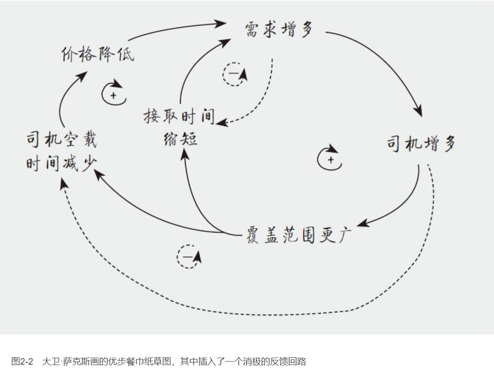

    作者: [美]杰奥夫雷G.帕克（Geoffrey G. Parker） 等
    出版社: 机械工业出版社
    出品方: 华章经管
    副标题: 改变世界的商业模式
    译者: 志鹏
    出版年: 2017-10
    页数: 336
    定价: 65.00
    ISBN: 9787111579069

[豆瓣链接](https://book.douban.com/subject/27171481/)

- [第1章 今天：欢迎来到平台革命](#第1章-今天欢迎来到平台革命)
  - [平台革命和变革的趋势](#平台革命和变革的趋势)
- [第2章 网络效应：平台的力量](#第2章-网络效应平台的力量)
  - [需求规模经济](#需求规模经济)
  - [双边网络效应](#双边网络效应)
  - [网络效应VS.其他促进增长的工具](#网络效应vs其他促进增长的工具)
  - [扩大网络效应：无缝进入及其扩展工具](#扩大网络效应无缝进入及其扩展工具)
  - [消极的网络效应：原因及解决方法](#消极的网络效应原因及解决方法)
  - [四种类型的网络效应](#四种类型的网络效应)
- [第3章 体系结构：设计成功平台的原则](#第3章-体系结构设计成功平台的原则)
  - [核心交互：平台设计的根本原因](#核心交互平台设计的根本原因)
  - [吸引、促进、匹配：平台设计的方式](#吸引促进匹配平台设计的方式)
  - [核心交互之外的其他交互](#核心交互之外的其他交互)
  - [在平台设计上使用端到端原则](#在平台设计上使用端到端原则)
  - [模块化的力量](#模块化的力量)
- [第4章 颠覆市场：平台如何征服、改变传统行业](#第4章-颠覆市场平台如何征服改变传统行业)
- [第5章 平台上线：先有鸡还是先有蛋？平台成功上线的八种方式](#第5章-平台上线先有鸡还是先有蛋平台成功上线的八种方式)

# 第1章 今天：欢迎来到平台革命
- 平台的首要目标是：匹配用户。通过商品、服务或社会货币的交换为所有参与者创造价值。
- 因为平台商业利用不直接拥有或控制的资源创造价值，因此它们能够比传统业务增长得更迅速。
- 平台绝大部分的价值是从它们服务的社群获取的。
- 平台颠覆了企业，模糊了业务界限，并且促使企业从传统的向内聚焦到向外聚焦转变。
- 平台的崛起已经改变了许多主要行业——更有甚者，同样显著的变革就要到来了。

## 平台革命和变革的趋势
大多数企业采用的传统系统是一种被我们描述成`“管道”（pipeline）`的东西。与平台不同的是，管道是一步一步创造和传递价值的过程，供应商在一端，而顾客在另一端。公司首先设计产品或服务，制造产品，然后投入市场进行销售或交付服务。最终，用户出现并购买产品或服务。由于它简单、单向的特性，我们也把管道业务称作`线性价值链（liner value chain）`。

平台之所以能打败管道，是因为平台借助规模化消除了`守门人（gate keeper）`，从而使得其规模化更加有效。

一个原因在于管道是由低效率的守门人管理着从供应商到顾客的价值传递。在传统的出版行业，编辑在上千本书里选择几本投放市场，希望其能够成为畅销书。但这非常浪费时间，是一项靠直觉和猜测的劳动密集型工作。相反，亚马逊的Kindle平台允许任何人出版书，依靠实时的顾客反馈判断哪些书会成功，哪些书将会失败。由于传统的守门人——编辑被全社会的读者作为市场信号自动取代，平台系统成长得更加迅速和高效。

平台之所以能打败管道是因为平台开发了价值创造的新来源。

在某种程度上，新生代的爱彼迎的业务与希尔顿和万豪相同。就像其他酒店巨头一样，爱彼迎利用定价预订系统让顾客能查看、预订并支付需要的房间。但是爱彼迎将平台模式运用到了酒店业务：爱彼迎不拥有任何房间。相反，爱彼迎创造运营了一个允许每个人直接向顾客提供房间的平台。作为回报，爱彼迎对平台上的每一次租房交易收取9%～15%的佣金（平均值为11%）。

这意味着爱彼迎的增长会远比一家传统酒店迅速，因为它的增长不再受限于资金使用和固定资产管理。一家连锁酒店可能要花费几年的时间选择购买地块，设计建造新酒店，然后雇用，培训员工。相比之下，爱彼迎能迅速增加资产“存量”，只要它能让有空置房间的房东注册房源。结果是在短短几年里，爱彼迎达到了传统酒店经营者要冒着风险辛辛苦苦经营数十年才能达到的规模和市值。

在平台市场里，供应方的特性已经改变了。供应方现在解封了闲置的产能，使得社群住房成为供应侧的贡献者。尽管传统商业能达到最精益的`实时库存管理（Just-in-time inventory）`，但是新生代平台商业里`从来没有自己的库存（not-even-mine inventory）`。

平台通过开发新的供应产品投放市场，颠覆传统的竞争局面。那些必须承担固定成本的酒店发现要和没有固定成本的公司竞争。这对新兴公司来说是可行的，因为平台中介能够帮助它们利用闲置产能。`共享经济（sharing economy）`分享的前提是许多物品在大多数时间是闲置的，如汽车、船，甚至剪草机等。

查证信用和诚信是一笔很高的交易成本，通常对交易有阻碍作用。而平台通过提供默认的保险合同和信用系统鼓励诚信行为，显著降低了交易成本，并为首次供应产品的新供应商创造了市场。

平台之所以能打败管道，原因在于借助基于数据的工具创造了`社群反馈回路（community feedback loops）`。

相反，传统管道公司依赖控制的机制：靠编辑、经理、监管者来保证质量和市场互动的形成。这些控制机制成本高，且会影响发展规模。

# 第2章 网络效应：平台的力量
- 鉴于供应规模经济促成了工业时代大公司的产生，今天的大公司则得益于需求规模经济，且以网络效应的形式表现出来。
- 网络效应与价格效应、品牌效应或者其他众所周知的工具不一样。
- 无缝进入以及延展性的其他特质最大限度地扩大了网络效应在创造价值这方面的影响力。
- 双边市场（既有生产商也有顾客）产生了四种类型的网络效应：单边效应（积极的和消极的），以及交叉效应（积极的和消极的）。一个发展中的平台必须妥善应对这四种效应。
- 让消极网络效应降到最低点的关键在于质量策展。它提高了生产商和顾客之间愉快配对的概率。

优步以一种经典的平台形式为消费者提供了匹配服务。在格利的文章中，他引用了另一个投资人的图来阐释这一良性循环的工作原理，那张图是大卫·萨克斯（David Sacks），亚美（Yammer）的联合创始人、PayPal的前任COO在餐巾纸上所画的草图（见图2-1）。

萨克斯的餐巾纸草图引用了`网络效应（network effects）`的一个经典案例。它表明了在越来越多人使用优步的情况下，优步对每一位用户的价值是如何提升的。这样一来也吸引了更多的用户，从而提升了服务的价值。

网络效应指的是一个平台的用户的数量对用户所能创造的价值的影响。`积极的网络效应（positive network effects）`指的是一个巨大的、管理完善的平台社区所有的，为每一个平台用户创造重要价值的能力。`消极的网络效应`指的是管理不善的平台社区的增加，能够减小为每一个用户所创造的价值的可能性。

## 需求规模经济
`梅特卡夫定律（Metcalf’s law）`能够有效地概述网络效应如何为该网络参与者、拥有者和管理者创造价值。以太网的发明人之一，也是3Com公司的缔造者罗伯特·梅特卡夫（Robert Metcalfe）指出随着订户数量的增加，电话网络的价值呈现非线性增长，使得订户之间可以有更多的连接。

## 双边网络效应
大卫·萨克斯的草图表明了第二个驱动力在优步的增长中发挥作用，我们称其为`双边网络效应（two-sided network effect）`。在梅特卡夫的电话例子中，电话用户吸引更多电话用户。但在优步的例子中则包含了双边网络：乘客吸引司机，司机吸引乘客。这一相似的驱动力存在于很多其他平台公司中。在谷歌的安卓一例中，应用程序开发者吸引消费者，消费者也吸引应用程序开发者。在Upwork（原名Elance-oDesk）上，工作列表吸引自由职业者，自由职业者也吸引工作列表。在PayPal上，商家吸引顾客，顾客吸引商家。在爱彼迎上，房东吸引房客，房客吸引房东所有这些商业以正面反馈引起双边网络效应。

## 网络效应VS.其他促进增长的工具
`价格效应`是会逐渐消失的。它会在打折结束或者其他公司给予更优价格的时候消失。

`品牌效应`更是棘手。它会在人们将质量与特定的品牌联系时产生。但品牌效应，像价格效应一样，通常很难维持。它也很可能极其昂贵。

价格效应和品牌效应在一家创业公司成长的战略中拥有一席之地。但只有前面提到的网络效应才能创造良性循环，这一良性循环会建立一个长久的用户网络，我们将这一现象称作`锁定（lock-in）`。

`病毒式传播`从短语“像病毒式增长”而来，是一种理念或品牌在互联网用户中快速广泛传播的趋势。病毒式传播是吸引不在平台上的人群加入平台，而网络效应则是通过平台上的人群增加价值。

## 扩大网络效应：无缝进入及其扩展工具
谷歌的案例表明，允许`无缝进入（frictionless entry）`的网络能够有机地、无限制地增长。无缝进入指的是用户能够快速且轻易地加入一个平台，开始利用该平台创造价值。

扩展一个网络需要双边市场成比例地增长。例如，一位优步司机一小时内平均能为三位乘客提供服务，所以对优步来说拥有一名乘客和1000名司机或1000名乘客和一名司机是完全没有意义的。爱彼迎面临一个扩展房东和房客的平行问题。如果一方变得不成比例，依靠优惠券或者打折来为另一方吸引更多参与者才能成就好买卖。

在某些情况下，平台的增长可以被用户`角色转换（side switching）`促进。这一效应发生在平台一方的用户加入另一方，例如当那些商品或服务的消费者开始为其他消费者生产商品和服务。在有些平台上，用户可以轻易且不间断地参与转换。

例如，优步从其乘客群中招募新的司机，就像爱彼迎从其房客群中招募新的房东。一个可扩展性的商业模式、无缝进入和用户角色转换同时促进了网络效应。

## 消极的网络效应：原因及解决方法
人数增加让生产商和消费者之间有更多匹配的可能性，这同时也大大增加了两方找到最适合伙伴的难度，这时候一个消极网络效应出现了。

婚恋网站丘比特发现，如果管理不谨慎，规模（匹配）可能导致网络崩溃。根据丘比特的CEO克里斯蒂安·鲁德尔（Christian Rudder）所说，当婚恋网站上有很多用户时，平台上的男性往往会接近最漂亮的女性。给男生定标的行为导致了一个问题，那就是接近特别有吸引力的女性的那些男性大部分会变得没什么吸引力——就像老话说的，她和他们“不是一个世界的人”。当这些B等的男性（这是我们的定义，不是鲁德尔说的！）向想要约会的A等女性套近乎时，没有人会觉得开心。漂亮的女性不高兴，而且很有可能因为所有这些未经筛选的关注放弃这个网站；与此同时，B等男性不高兴，因为他们感兴趣的女性从来不回应他们。而少数非常有吸引力的男性原本有机会和最有魅力的女性在一起，但是现在这些女性要离开这个平台了，所以他们也不高兴。

一旦这一切发生了，各种魅力级别的男性全部涌向第二魅力级别的女性，同样的过程又会再发生一遍。网络效应逆转，这种商业模式随之垮台。

为了解决这个问题，丘比特实行了一种策略，即多级别的网络配对。第一级别解决了最突出的问题，即兴趣爱好的匹配。两个人都抽烟吗？都喜欢文身个过程中的参与者人数。

第二个配对级别解决了魅力值匹配的问题——也就是说两个人是“同一个世界的人”。根据其他用户的反应，如果丘比特的算法认定乔显然没有玛丽有魅力（打个比方），那么乔平时搜索配对时，就不会看到玛丽的照片。（她可能在出现有高度针对性的搜索里，而不会出现在其他地方。）相反，乔会看到那些被认为和他魅力值相当的女性。这种结果是双赢的。玛丽会更开心，因为这个平台帮她找到了她一直在寻找的人，同时保护她免受太多人的猛攻。乔也会很开心，因为以前他被冷眼以待，而现在那些女性会回复他的信息。

像丘比特采用的那样有技巧的策展极大地减少了消极网络效应。与此同时，它增加并利用了积极网络效应的益处。随着网络参与者越来越多，有关他们的信息量也在增加。

## 四种类型的网络效应
在双边市场中，`单边效应（same-side effects）`是指由市场一边的用户影响这边其他用户而产生的网络效应——顾客对其他顾客的效应，以及生产商对其他生产商的效应。相比之下，`交叉效应（cross-side effects）`是指市场中一边的用户影响另一边的用户而产生的网络效应——消费者对生产商的效应以及生产商对消费者的效应。单边效应和交叉效应都有利有弊，取决于如何设计系统以及实施的规则。

第一种类型，`积极的单边效应（positive same-side effects）`，包括当同类用户数量上升时产生的积极效益——比如说，这种效应在贝尔电话用户数量增加时产生了。你有越多的朋友和邻居使用贝尔电话，你就能获得作为贝尔会员应获得的越多的好处。今天，消费者对消费者这种相当积极的效应可以被看作一个像是微软大型多人在线游戏机（Xbox MMOG）一样的游戏平台：你在这个平台上遇到越多的同伴玩家，你在使用这个平台的时候就能获得越多的乐趣。

有时候平台的一边也会有不利于数量增长的一面，这被称作`消极的单边效应（negative same-side effects）`。比如信息技术平台Covisint，它与服务提供商联合开发基于云的网络工具。随着Covisint平台上互相竞争的供应商数量不断增长，源源不断的客户被吸引到这个平台上，这也让供应商非常高兴。但是当供应商数量过多，合适的供应商和顾客找到彼此的难度也会变大。

当顾客或供应商的得失基于平台另一方的用户数量时，交叉效应就产生了。当用户从市场另一边的参与者数量增长中获益时，出现的是`积极交叉效应（positive cross-side effects）`。想想看一个像Visa卡一样的支付机制：当更多的商家（生产商）同意接受时，消费者（顾客）在消费中能体验到灵活性和便利，这就创造了积极交叉效应。同样的效应反过来当然也是成立的。越多人持有Visa卡，商家也就拥有越多的潜在客户。

交叉效应不一定都是对称的。在婚恋网站丘比特上，女人对男人的吸引力大于男人对女人的。在优步上，司机比乘客对市场发展更重要。在安卓系统中，开发者的App对用户的吸引力大于用户对开发者App的吸引力。在推特上，绝大部分人读，少部分人发。在问答网站Quora上，绝大部分人提出问题，少部分人回答问题。

`消极交叉效应（negative cross-side effects）`产生了。想想看一个促进数字媒体分享的平台——音乐、短信、图像、视频等。在大多数情况下，生产商（比如音乐公司）数量的增加会给顾客带来积极的好处，但是也可能会导致复杂性和费用的加大。比如说，太多不同的数字版权管理格式需要阅读和受理。这时候，交叉效应从积极转变为消极，导致顾客放弃或者至少减少使用这个平台。同样地，当一个平台上相互竞争的商家发布大量信息带来乱七八糟的广告时，增加生产商多样性的积极影响可能会转变为消极的交叉效应，从而让顾客反感，也破坏了平台原本的价值。

图2-2对优步的生长螺线的描述更加完整，强调了一个事实，那就是一家在双边市场上的公司必须处理这四种网络效应。好的平台管理会努力加强积极的网络效应，创造并强化尽可能多的积极的循环结果。

# 第3章 体系结构：设计成功平台的原则
- 平台的设计应该从它的核心互动机制开始——这种互动是平台价值创造使命的核心。
- 三个定义核心互动的要素：参与者、价值单元和过滤器。其中，价值单元是最重要而且通常是最难掌控的因素。
- 为了使核心互动容易产生甚至必然发生，一个平台必须执行三个关键的作用：吸引、促进和匹配。这三个功能是必不可少的，各有其特殊的挑战。
- 在平台发展的过程中，它常会扩展，超出核心互动机制。新类型的互动可能在核心互动的上面分层堆积，这个过程中经常会吸引新的参与者。
- 精心设计平台，让大部分用户都能便利、满意地互动是很重要的。但是在平台上为偶然与意外留下空间也很重要，因为用户自己会在平台上找到创造价值的新方法。

平台的目标是将生产者和消费者聚合在一起，使他们能够进行信息、商品或服务，以及货币的交换。平台会提供给那些参与者一个加入即用的基础设置，包括软件工具和规则等，来让交换变得方便，且能够使他们互惠互利。

## 核心交互：平台设计的根本原因
每个平台在开始设计时应先设计生产者与消费者之间的`核心交互（core interaction）`。核心交互是平台内部活动的最重要的形式——它就是价值的交换，能够在第一时间将多数用户吸引至平台上。核心交互有三个关键要素：`参与者（participants）`、`价值单元（valce unit）`、`过滤器（filter）`。

例如，领英就拥有很多种交互方式：专家交换职场与企业战略的专业意见；猎头或招聘人员与潜在应聘者交换就业信息；人力资源主管交换劳动力市场信息；意见领袖发表自己对全球趋势的见解。这些交互方式都被植入了平台内部，它们在设计时都是为了去迎合平台特定的目标，并帮助用户创造全新形式的价值。领英目前的多元化设计初期却是围绕一个核心交互进行的：职业者联系其他的职业者。

来详细看看核心交互的三要素:

`参与者`。通常，核心交互的根本参与者就是两种人：创造价值的生产者和使用价值的消费者。要定义核心交互，我们需要明确地描述和理解这两种角色。

平台设计的其中一个差别是：同样的用户在不同的交互中扮演着不同的角色。在爱彼迎上，同一个人既可能是房东，也可能是旅行者，尽管他们通常在一段固定的交互中只会扮演其中一种角色。YouTube用户既可以上传视频，又可以观看视频。设计得当的平台有利于用户的角色转换。

`价值单元`。我们说过，每个交互都是以那些对用户有利的信息的交换开始的。因此，几乎每个核心交互的开端都是生产者对于价值单元的创造。

`过滤器`。价值单元是经过过滤器处理后传递给特定消费者的。过滤器是有着严格算法、以软件为基础的工具，平台会用它来完成用户间适当价值单元的交换。设计得当的过滤器会保证平台用户只会接收到与他们相关并对他们有价值的价值单元，而设计不得当的（或没有）过滤器所造成的结果则恰恰相反，甚至使用户放弃平台。

不管怎样，每个平台都会利用过滤器来进行信息交换。优步的司机会通过分享其位置、可载人数等信息来显示目前的可利用状态，这些都是可以帮助他们寻找适当消费者的价值单元。当消费者拿出手机呼叫车辆时，她就会基于其位置与时间设定过滤器，之后，与其相关的司机信息就会被交换。

一旦信息交换完成，其他活动便会立刻开始。出租车到达乘客设定的起点，乘客上车直至出租车将乘客送达目的地，乘客支付车款，司机收到钱。核心交互就此完成，价值也因此被创造和交换。

    参与者+价值单元+过滤器→核心交互

在设计平台时，你的首要任务就是确定你的核心交互，然后去定义参与者、价值单元以及过滤器来完成核心交互。

一个有价值的、可以简单安心参与的核心交互会吸引更多的参与者，并会产生积极的网络效应。

价值单元的关键作用。正如我们对核心交互所介绍的，价值单元在任何一个平台里都会起到关键作用。但是在多数情况下，平台不会创造价值单元，创造价值单元的是平台内的参与者。因此，平台是“信息工厂”，但它无法控制其库存。它提供“作业场地”（也就是说，他们创造的平台基础设置是用来生产价值单元的）。平台可以培育一种质量控制的文化（采取各种措施鼓励生产者创造精确、有用、有关联且让消费者感兴趣的价值单元）。它也会创造出过滤器来传递价值单元，并屏蔽不需要传递的单位。但是它并不直接控制生产过程，这是它与传统的管道商业之间最明显的区别。

## 吸引、促进、匹配：平台设计的方式
核心交互就是平台设计的理由，平台的整个目标就是要使核心交互成为可能。

为了拥有更多有价值的核心交互，平台必须发挥三个关键功能：`吸引（pull）`、`促进（faciliate）`、`匹配（match）`。平台必须要将生产者和消费者吸引至平台，以便使核心交互在他们之间发生。平台要通过提供方便且易于联系和交换的工具与规则来促进交互的完成。另外，平台还要通过利用相互之间的信息，进而有效地匹配生产者和消费者，让他们互惠互利。

`吸引`。吸引参与者是管道商业不会遇到的难题。

刚开始的时候，平台需要解决管道商业模式不会有的“先有鸡还是先有蛋”的问题：平台没有价值就不会有用户，而用户不去使用平台也不会具有价值。

关于吸引的第二个问题是如何保持已注册平台用户的黏性。

其中一种能够让用户反复使用平台的工具是`反馈回路（feedback loop）`。平台的反馈回路有很多种形式，这些形式都有助于平台持续不断地自我补充。在典型的反馈回路中，价值单元会促使用户回应。如果价值单元与用户相关，且能引起用户的兴趣，用户就会不断地被吸引至平台中，进而产生其他价值单元并促进更多交互。有效的反馈回路可以扩大网络，提升价值，强化网络效应。

其中一种反馈回路是`单用户反馈回路（single-user feedback loop）`，这是一种嵌入平台的算法，它能分析用户活动，最终得出用户的兴趣、喜好、需求，并向用户推荐其他对于他们可能存在价值的价值单元和关联。如果单用户反馈回路设计得当，可以有效地增加用户活动，因为用户使用平台的次数越多，反馈回路就对用户“了解”得越多，它的推荐也就越准确。

而在`多用户反馈回路（multi-user feedback loop）`中，生产者的活动会递交给相关消费者，而消费者的活动也会给予生产者很多反馈。如果它能够有效运行，就可以创造良性循环，增加双方的活动，最终加强网络效应。

其他因素也会影响平台吸引用户的能力，其中一个就是平台内现有货币的价值。正如我们所讨论的，一些平台的交换基于的是无形的货币，如关注度、人气、影响力等。因此，网络效应的一种形式就是随着网络平台规模不断增加而与日俱增的吸引力形式货币。因为推特有了很大的用户基础，与在其他平台传播相比，一条成功的推文在推特上会吸引更多的关注度形式货币。所以，推特巨大的规模增加了它的吸引力，鼓励人们进行更多的活动，从而使其他平台无法与其竞争。

促进一方面是要让生产者更加方便地创造和交换商品与服务。这需要提供具有创造性的工具用来共享，就像加拿大图片网站500px做的那样：照片上传者在平台上管理自己的整个作品集；或者像创意平台Quirky做的那样：提供工具来让用户分享创意并集体创造新的产品和服务。

促进过程还需要减少使用障碍。不久前，Facebook用户若想要与朋友分享照片，就需要将相机里的照片传到电脑里，再用PS软件修改图片，最终才上传到Facebook上。而Instagram允许用户在一个设备上只经过三个点击操作就可以完成对图片的拍摄、修改和分享。减少使用障碍能够有助于互动的进行，并扩大参与者数量。

在有些情况下，使用门槛变高也会有一些积极作用。Sittercity是一个帮助父母寻找保姆的平台。为了提高用户（父母）的信任度，该软件设计了一套严格的规定来限制注册的生产者（保姆）。其他时候，平台需要制定严格的规则来组织管理价值单元及其他生产者创造的内容，实现用户需要的交互，去除用户不需要的内容。另外的少数情况是，不法分子也会在网上有一些违法行为，比如社交新闻网站Reddit的“喷子们”的种族和性别歧视言论，克雷格网站（Craigslist）上也会出现雇凶杀人，糟蹋爱彼迎上订的公寓都能说明有害的交互会破坏网络效应。

`匹配`。成功的平台能够精确匹配用户，保证相关的商品与服务能够被交换。它会利用生产者、消费者、价值单元和要交换的商品与服务的信息来完成这个目标。平台获得的信息越多，收集、组织、分类、解析数据的算法设计得越好，过滤器越精准，用来交换的信息就会越有用，生产者与消费者正确匹配得到的回报就越高。

## 核心交互之外的其他交互
优步、来福车和领英展现了多种将新的交互机制嵌入核心交互机制的方法：
- 改变现有用户对价值单元的交换（就像领英将基本信息交换从用户资料改为讨论帖子）
- 加入新的生产性和消费性用户群体（就像领英邀请猎头和广告商以生产性用户加入平台）
- 容许用户交换新类型的价值单元（就像优步和来福车使乘客可以选择拼车）
- 鼓励现有用户去吸引新类型的用户（就像领英将一些用户指定为“思想领导者”，并且请求他们成为高信息量帖子的生产者）

## 在平台设计上使用端到端原则
`膨胀软件（Bloatware）`这个嘲弄术语就是描述一些软件系统因为不断增加的功能变得过于复杂、缓慢和低效。

对于平台公司，这个概念等同于一个早已存在的电脑网络概念，被称为`端到端原则（end-to-end principle）`，最初被萨特泽（J.H.Saltzer）、里德（D.P.Reed）和克拉克（D.D.Clark）于1981年提出。端到端原则是指对于通用网络，专用功能应该存于末端主机而非中间节点。^{6}换句话说，对整个网络没用，但是对某些用户有用的功能应该被放在网络的边缘区域，远离核心区域。这样，补助性功能就不会干扰或者负面影响网络核心的运作，也不会使得整个网络的维护和升级变得更复杂。慢慢地，端到端原则从网络设计延伸到多种复杂运算环境的设计。

端到端原则也可以被应用到平台的设计上。对于平台来说，这个原则认为专业型应用功能应该放在平台的边缘或者上层，而不是放在平台根部的最底层。只有流量最大、价值最高、应用最广的功能才应该成为平台核心的一部分。

有两个理由支撑这个规则。第一，当某一特定的专业功能被加入平台核心当中，而不是外挂在平台上时，不使用这些功能的应用程序会运行得缓慢和低效。反过来，当某一特定的专业功能是通过应用运行的而不是在核心平台上运行时，用户体验会非常简洁。

第二，只要其平台核心是一个简洁、简单的系统，而不是一个多种功能互相纠缠的系统，这个平台的生态系统就可以发展得更快。

现在设计最优秀的平台融入了这个结构原则。比如，亚马逊云服务（Amazon Web Services，AWS），是提供云端存储和管理服务中最成功的平台，只注重优化少数基础的运营服务，包括数据存储、运算和消息传递。那些只被一小部分用户使用的其他服务则被限制在平台外围，并且需要使用专门创建的应用。

## 模块化的力量
从长期来看，一个成功的平台必须有更模块化的开发方法。鲍德温和克拉克（1996）提出的模块化定义写下来：

>`模块化（modularity）`是一种用来有效组织复杂产品和进程的战略。模块化系统是由那些独立设计，但仍有整体功能的单位（或模块）组成。设计师通过将信息分割为可视化的设计规则和隐性的设计参数实现模块化。只有当这些分区是精确、明确且完整的时候，模块化才是有利的。可见设计规则（也被称为可视化信息）是影响后续设计决策的决定。在理想情况下，可见设计规则在设计过程的早期建立，并广泛地传达给参与对象。

# 第4章 颠覆市场：平台如何征服、改变传统行业
- 平台能在竞争中打败管道企业，是因为它们优越的边际经济效益以及由积极的网络效应所产生的价值。因此，平台比管道企业发展得更快并在曾经以管道企业为主导的行业中占据领先的位置。
- 平台的崛起也在其他方面颠覆着商业。它正对价值进行重构以开发新的供应源；通过赋予新的消费行为来重构价值消费；通过社区驱动的内容管理来重构质量管控。
- 平台的崛起同时也带来很多产业中的结构性改变，尤其是通过以下三个方面进行：中介重构、分享使用权与管控以及市场集合。
- 现有企业可以反抗由平台驱动的颠覆，其方式是用平台的思维方式思考自身的产业，正如耐克与美国通用电气所做的一样，企业可以建立它们自己的价值创造的生态系统。

# 第5章 平台上线：先有鸡还是先有蛋？平台成功上线的八种方式

