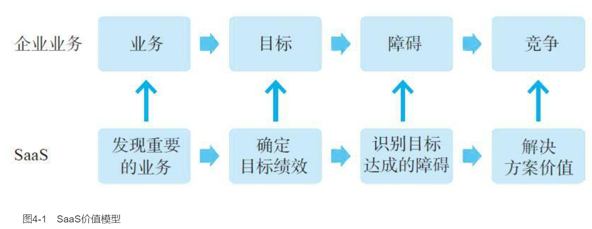

    作者: 代珂
    出版社: 机械工业出版社
    副标题: 好模式如何变成好生意
    原作名: 代珂
    出版年: 2021-5-1
    页数: 255
    定价: 89.00元
    装帧: 精装
    ISBN: 9787111679585

[豆瓣链接](https://book.douban.com/subject/35488676/)

- [SaaS概述](#saas概述)
- [国内SaaS的现状与发展机遇](#国内saas的现状与发展机遇)
- [SaaS的商业模式](#saas的商业模式)
  - [SaaS商业模式概述](#saas商业模式概述)
  - [SaaS的客户价值主张](#saas的客户价值主张)
    - [什么是客户价值主张](#什么是客户价值主张)
    - [客户价值主张为什么重要](#客户价值主张为什么重要)
  - [SaaS的盈利模式](#saas的盈利模式)
    - [SaaS的收益模式](#saas的收益模式)
    - [SaaS的成本结构](#saas的成本结构)
    - [SaaS的利润模式](#saas的利润模式)
    - [SaaS的几种收入模型](#saas的几种收入模型)
  - [SaaS的关键资源](#saas的关键资源)
  - [SaaS的关键流程](#saas的关键流程)
- [SaaS价值论](#saas价值论)
  - [SaaS价值模型](#saas价值模型)
  - [SaaS价值模型的应用](#saas价值模型的应用)
- [成功的SaaS是怎样炼成的](#成功的saas是怎样炼成的)
  - [SaaS创业的难点](#saas创业的难点)
  - [选择利基市场与切入点](#选择利基市场与切入点)
  - [目标客户画像](#目标客户画像)
  - [为SaaS赋予价值](#为saas赋予价值)
  - [改进的MVP](#改进的mvp)
  - [找到早期客户](#找到早期客户)
  - [定义核心竞争力](#定义核心竞争力)

# SaaS概述
Salesforce的创始人兼CEO马克·贝尼奥夫是SaaS商业模式最早的实践者。马克坚信：一定有一种方式，让购买软件更加方便和便宜。企业不再需要动辄数十万、上百万美元的投入，也不需要经历漫长的安装和实施周期，只要注册和付费，用户通过自行配置就可以使用软件，对软件进行维护和升级也不需要用户亲自动手。

对于客户而言，SaaS相当于把IT设备、软件和运维服务，全部外包给了SaaS服务商。

# 国内SaaS的现状与发展机遇
中国拥有全球最大的企业服务市场，即超过4000万家企业构成的巨大潜在用户市场，这也是SaaS创业公司可以看到的宏观趋势和重大机会。

在大部分情况下，企业的规范化程度越高，对信息化服务的需求就越强，销售成交的可能性就越大。虽然企业规范化也没有严格的标准，但销售员在第一次拜访时就能大致判断出来。销售员可以从这几个方面观察企业的规范化水平：企业对自己的业务有无明确的定义、有无业务流程、业务组织是否完整。

# SaaS的商业模式
## SaaS商业模式概述
通俗来讲，`商业模式`可以简单地概括为：为谁提供什么产品或服务；创造何种价值；最后以何种方式换取收益。克莱顿·克里斯·滕森对商业模式的阐述。他认为商业模式由四个要素构成，依靠这四个要素之间的相互作用，就能创造并传递价值。商业模式的构成框架如图3-1所示：

    商业模式：
        价值主张（创造客户价值）
        关键流程（实现公司价值）
        盈利模式（创造公司价值）
        关键资源（实现客户价值）

1. **价值主张定义了客户价值**。所有成功的公司都是因为找到了某种为客户创造价值的方式，也就是帮助客户达成某项重要目标的方法，价值主张通过解决方案实现客户价值。
2. **盈利模式定义了公司价值**。所谓盈利模式就是创造价值的一份详细计划，而盈利模式本身还包括四个构成要素。
    - 收益模式：收益的构成和计算。
    - 成本结构：关键资源的成本构成。
    - 利润模式：为实现预期利润所要求每笔交易贡献的收益。
    - 资源利用效率：为实现预期营业收入和利润，需要多高的资源使用效率。
3. **依靠关键资源实现客户价值**。一家公司可能会拥有很多资源，而只有那些能创造差异化竞争优势的资源才是关键资源。要实现公司定义的客户价值，就必须依靠关键资源，比如技术、品牌、产品等。
4. **依靠关键流程实现公司价值**。一家公司通常都有很多流程，比如销售流程、运营流程和管理流程等。但是，只有那些能使价值传递方式具备可重复性和扩展性的流程，才是关键流程。实现公司的价值，只能依靠关键流程。

总结SaaS商业模式，在SaaS创业前必须弄清楚四个问题：

1. 你的SaaS产品要为客户提供什么具体的和可量化的价值；
2. 必须以财务上可计算的方式，说明如何从SaaS服务中实现盈利；
3. 实现客户价值需要哪些关键的资源；
4. 以怎样的业务方式实现盈利。

## SaaS的客户价值主张
### 什么是客户价值主张
`客户价值主张（Customer Value Proposition，CVP）`是商业模式中一个重要的构成要素，客户价值主张表明了客户价值，描述了产品提供的价值与客户需求之间的联系，同时也说明了客户为什么要购买你的产品。

按照价值主张的定义，SaaS的客户价值主张需要说明以下三个方面的内容。

- 方法论：价值主张首先表达为一种方法论，利用该方法论能够帮助客户达成重要的业务目标。
- 解决方案：方法论并不能直接发挥作用，还需要基于这个方法论，设计出帮助客户达成目标的解决方案。
- 卓越性：客户业务的重要性越高，客户对达成目标的其他方案的满意度越低，你的价值主张就越卓越。

“痛点说”的问题在于，它又太过于具体，因为SaaS能解决的企业痛点其实非常少，或者你认为的痛点，并不一定是客户最痛的痛点，如果直接提出解决客户的痛点，很容易把自己逼入一条死胡同。所以，无论是满足客户需求，还是解决客户痛点，都不是最明确的客户价值主张。

如果用另一个词“障碍”来代替“痛点”，眼界就会放宽不少。因为障碍所代表的是某一类问题，而痛点通常是指某一个问题，所以SaaS的价值主张就可以表述为：如果客户在达成重要业务目标的过程中，存在着亟待克服的障碍，而借助SaaS有可能解决这些障碍，则价值主张就得以彰显。

在SaaS客户价值主张的描述中，首次将抽象的“价值”与“用户目标达成”建立联系。企业可以对SaaS没有直接需求，也可能没有SaaS能解决的痛点，但所有企业都有业务目标需要达成，比如：完成一个亿的销售任务、将库存降低50%。目标越大、障碍也越大，这就为SaaS提供了解决问题的机会。

### 客户价值主张为什么重要
在为SaaS公司做咨询时，我都会问他们这样一个问题：你的SaaS客户价值主张是什么？令人不解的是，竟然有半数以上的SaaS从业者不知道什么是客户价值主张。他们认为产品差异化、产品话术、市场策略、品牌效应、产品优势、FAB、PMF等，都可以被当作价值主张。还有人把客户价值主张与企业的愿景混为一谈。

任何一个成功的商业模式，都离不开一个坚实的价值主张作支撑。如果一个SaaS的价值主张不对，或者没有价值主张，这种SaaS不但难以营销，也不会给客户带来真正的价值。说得再严重一点，就是做了一个没用的SaaS，没有可交换的价值，当然也谈不上商业价值。

一个好的客户价值主张，会成为企业内部一种创造价值的共同语言。一个连价值认知都不一致的团队，无论有什么样的文化、核心能力，都不可能取得商业成功。

## SaaS的盈利模式
`盈利模式`的一般定义是，通过为客户提供价值，从而为公司创造价值的一个详细的计划。这个定义中包含3项内容：

1. 只有在正确的客户价值主张的前提下，才能谈到为自己创造价值；
2. 盈利模式的本质，是说明公司的价值来源和获得方法；
3. 盈利模式是一个计划，它需要指标量化和计算，也就是说，盈利最后要落实到一套计算公式上。

盈利模式可以进一步细分为四个要素：收益模式、成本结构、利润模式和经营效率。

### SaaS的收益模式
下面我们先介绍常用指标的含义，然后再给出收益的计算方法。

1. SaaS收益指标
   1. `合同额`。因为SaaS是订阅收入模式，即客户是按周期（通常为年）付费的，所以统计合同额要用两个计算口径。
      1. `总合同额（Total Contract Value，TCV）`，也就是全部签约合同金额，包括多年期合同总金额。
      2. `年合同额（Annual Contract Value，ACV）`，即一年的签约合同金额。
   2. `经常性收入（Recurring Revenue，RR）`指能够持续产生的合同收入，对于SaaS来说主要是订阅的费用，国内SaaS的经常性收入一般以年度计算。
   3. `非经常性收入（Non-recurring Revenue，NRR）`包括单次费用，比如实施、培训、二次开发、咨询等专业服务；也包括多次的可变费用，比如电商SaaS的交易抽成、按用量计费的充值消耗（如视频会议的分钟数、电子签约的合同数等）。
      1. `总合同额（TCV）＝经常性收入（RR）×服务周期+非经常性收入（NRR）`
   4. `年经常性收入（Annual Recurring Revenue，ARR）`即年化的经常性收入，是按合同计算每年带来的经常性收入。
   5. `月经常性收入（Monthly Recurring Revenue，MRR）`即月化经常性收入，是按合同计算每月带来的经常性收入。对于一些非整年订阅的SaaS业务，就需要用到MRR。
2. SaaS的营收计算
   1. 使用以下公式可计算年经常性收入（ARR），即：`ARR＝上一年末ARR+新增ARR+增值ARR-流失ARR-减值ARR`
      1. `新增ARR（New ARR）`：新客户带来的收入。
      2. `增值ARR（Expansion ARR）`：因增加了客户数或使用量而带来的收入。
      3. `流失ARR（Churned ARR）`：因客户取消订阅导致流失的收入。
      4. `减值ARR（Contraction ARR）`：虽然客户没有取消订阅，但减少了客户数或者使用量导致流失的收入。
3. 留存指标
   1. SaaS用净收入留存（Net Dollar Retention，NDR）来衡量收入的留存，NDR的计算公式如下。
      1. `NDR＝（期初收入+增加收入-减少收入-流失收入）/期初收入`

图3-2所示是一个计算NDR的示例。

客户 | 第N年 | 第N+1年 | 变动 | 变动状态
---|-----|------|----|-----
客户1 | 150 | 200 | 50 | 增加
客户2 | 100 | 50 | -50 | 减少
客户3 | 200 | 0 | -200 | 流失
客户4 | 0 | 100 | 100 | 新客户
合计 | 450 | 350 | -100

    NDR =（450+50-50-200）/450×100%
        = 55.6%（新增客户100万收入不计入）

4. `客户终身价值（Life Time Value，LTV）`是指从客户那里获取的全部收入总额。LTV由经常性收入、非经常性收入、客户留存、各项收入的毛利水平和客户生命周期等要素决定。LTV真正聚焦的是利润，而不是收入。LTV的大小并不能说明业务是否盈利，实际上，一个SaaS是否盈利，是由LTV、客户获取成本（CAC）和单位经济等因素共同决定的。
   1. LTV必须远高于CAC，SaaS企业才可能盈利（通常LTV/CAC>3）。
   2. 在计算LTV时还应考虑其他成本，如为维护LTV所增加的客户服务成本（CTS）。
   3. 增加的成本会对整个客户生命周期内的盈利都产生影响，如果用很高的服务成本来维持LTV，将会吃掉很大一部分利润。
5. SaaS业务收益模式特点
   1. SaaS业务收益模式的优势在于其收入的可预测性，即体现在经常性收入（RR）上，这也是SaaS模式被广泛看好的原因。经常性收入在总收入中的占比反映了SaaS的收入质量，即订阅收入的占比越大，收入的稳定性越高，可预测性也就越强。
   2. ARR降低的主要因素是流失ARR。相比于国外SaaS的低流失，ARR高流失是国内SaaS的头号杀手，国内很多SaaS公司的收益不佳，其中很重要的一点是没有解决好ARR流失的问题。

### SaaS的成本结构
对于SaaS业务来说，需要重点关注两个重要的成本指标：客户获取成本和服务成本。

1. `客户获取成本（Customer Acquisition Cost，CAC）`用来衡量营销和销售成本的质量，是每获取一个新客户，需要付出的一次性成本。CAC的计算方法为：`CAC＝（营销&销售费用）/新增客户数`
   1. 营销&销售费用包括：市场部、销售部人员和渠道管理人员的所有薪酬成本（工资、福利、五险一金、提成、年终奖等）；所有与获取客户直接相关的费用，如用于营销&销售的CRM工具费用、网站建设/SEO/SEM/AB测试费用、办会和参会的费用等所有为了拉新而产生的费用。
   2. 新增客户数是指同周期内新增的客户数。虽然免费试用客户不记入客户数，但获取免费用户的所有营销&销售费用却要记入成本。
2. `服务成本（Cost To Serve，CTS）`用来衡量服务成本的质量，是指服务于客户所付出的所有成本。一般业务的服务成本不单独统计，但SaaS模式是高度依赖服务的，且SaaS对客户服务的投资都比较大，所以需要有单独的成本KPI。CTS的计算方法为：`CTS＝各种服务成本/客户数`
   1. 服务成本计算与客户数量的时间段需要对齐，比如今年全年的服务成本除以今年内的客户数。
   2. 服务成本包括但不限于：实施服务人员、客户成功人员、培训人员的所有薪酬成本和差旅成本，还包括服务工具的成本。通常CTS与产品的复杂度有关，如果产品属于通用工具，则CTS比较低，可以计入CAC中；反之，对于复杂的解决方案，CTS会比较高，需要单独计算。

根据SaaS业务的特点，通过调整各项成本，可以获得更高的毛利率。为了统一成本的计算口径，SaaS业务通过各项费用与收入的占比来衡量各项成本投入。

- 营销&销售成本占比：只有获得足够多的客户，才能使业务运转起来，所以SaaS业务前期需要投入较高的营销费用，参考区间＜40%。
- 客户服务成本占比：初始阶段比较高，随着客户数的增加、服务规模化效应和引入自动化服务，客户服务成本会逐渐降低，参考区间15%～20%。
- 研发成本占比：前期需要投入很大的研发成本，特别是平台型和需要二次开发的SaaS。后期研发费用会平稳下降，并维持在一定水平，参考区间15%～20%。
- 行政管理成本占比：必要的行政管理成本，参考区间＜10%。

结合前面讲到的客户终身价值，营销&销售成本和服务成本分别对应了获客成本和服务成本，一个SaaS要想盈利，LTV必须远大于CAC与CTS之和。

### SaaS的利润模式
    运营利润＝毛利润－（营销&销售成本＋研发成本＋行政管理成本＋客户服务成本）

提高运营利润率主要有两条途径：降低成本占比和提高毛利率。

### SaaS的几种收入模型
SaaS的收入模型至少可以分为以下四种。
1. `纯自动化的订阅收入模型`。所谓纯自动化的订阅收入模式，即SaaS交付之后的运行不再需要人工介入，而是由软件自动化提供，即“SaaS收入=软件产生的收入”。这是一种理想的收入模式，由于CTS大大降低，所以这种收入模式的盈利能力强，不受服务水平的影响。订阅模式的优势是有更好的收入可预测性，就是说未来ARR是可预测的。但是这也有一个重要的前提，为了使订阅模式成立，需要保证订阅用户持续付费，也就是尽可能保证客户不流失。
2. `自动化+人工服务的订阅收入模式`。这种收入模式仍然属于订阅模式，只是收入的结构中由两部分组成，即“SaaS收入=软件产生的收入+人工服务产生的收入”。显然，与纯自动化的订阅模式相比，这种模式的一部分收入受到人工服务能力的限制。除了增加CTS外，效率也会受到人工因素的影响。如果收入结构中的人工服务收入占比过高，所产生的效率问题会使复制能力受到限制，导致盈利能力的降低。
3. `混合收入模式`。与完全订阅模式不同，在混合收入模式下：SaaS收入=订阅收入+其他收入。比如电商SaaS除了固定的店铺服务费（订阅）之外，还包括流量费、交易费、交易提成等非订阅收入。如果订阅收入占比太小，收入的可预测性就会变差。
4. `类SaaS收入模式`。是指除了服务平台架构是SaaS技术模式外，订阅收入的占比为0。也就是说，所有收入都是“其他收入”。类SaaS收入模式的形式很像订阅收入模式，商业模式是通过业务拓展（Bussiness Development，BD）开发客户，之后依靠客户持续复购取得收入。

虽然达不到订阅收入那么准确的预测，但收入曲线与订阅模式相似；虽然没有CTS，但为了维持客户的复购，BD的服务也是有成本的。

## SaaS的关键资源
`SaaS关键资源`是指为了向目标客户群体传递价值主张，需要的关键岗位、核心技术、产品、专业服务和品牌等资源。

## SaaS的关键流程
一家SaaS公司可能存在很多的流程，比如招聘、培训、产品研发、市场营销、销售、服务和客户成功等，但是这些流程中只有部分属于关键流程。所谓`关键流程`，就是能够产生核心竞争力、实现公司价值的那些流程，比如销售流程、服务流程等。

对于SaaS业务来说，因为整个商业模式都是透明的，所以从理论上讲，SaaS领域根本就是无城可护。如果一定要找出能够起到护城河作用的因素，那只能是流程。更确切地说，是与公司融为一体的关键业务流程，这是对手很难复制的。纵观成功的SaaS企业，其实并没有什么绝招，它们有的只是长期磨合优化的业务流程。

# SaaS价值论
## SaaS价值模型
在SaaS的销售过程中可以发现：企业用户购买的其实并不是产品或服务，而是为了让自己能够达成业务目标，也就是通过绩效目标的考核。无论做什么工作和业务，达成目标都是刚需。用户正是为了达成业务目标，才使用了SaaS产品或服务。理解这个概念以后，解决问题的目标就变成了“发掘用户业务目标”。沿着这个思路，我们就可以建立SaaS的价值模型，这个价值逻辑与客户价值主张的理念是高度吻合的。

在构建SaaS价值模型的路径上，可以提炼和解析出四个核心要素。

1. 业务目标
   1. 企业中所有的业务、任务和工作，都是有目标和绩效要求的，比如销售业务有销售目标和业绩考核；生产业务有产量目标、库存目标、质量要求等，这些目标和绩效都是在经营战略中定义好的。业务目标的价值意义在于，它建立了价值提供与用户需求之间的联系，即管理者和员工只愿意为能实现重要的和关键的目标的服务买单。
   2. 用业务目标而不是需求作为价值模型核心要素，是因为二者并不在同一个业务层级上。首先，业务目标的达成是一个持续、经常发生的过程，而不是个别情况下的某种需求。比如，某些SaaS也能帮助用户达成目标，但是其市场需求规模并不大，这说明从需求的角度看，目标只是一个偶发事件，这种SaaS的价值就不大。把用户目标与用户需求混为一谈，是对业务目标的一个误解，目标不是需求，需求也不是SaaS价值模型的核心要素。
2. 业务背景
   1. 所谓业务可以理解为某种工作或任务，它是达成目标的执行手段。背景即业务的范围和业务发生的情境，任何业务目标都是基于业务背景的。企业有多种业务，SaaS也能提供各种对应的服务。但原则上，业务切入点应选择那些重要、权重高和频发的业务。
3. 目标达成的障碍
   1. 越是高权重业务和关键的目标绩效，达成的难度就越大。这些挑战来自达成业务目标过程中的各种障碍。因为这些障碍可能会影响达成业务目标的进度，甚至导致失败；所以企业不会吝惜克服业务障碍方面的投资。从这个意义上说，企业面临的障碍就是SaaS的商机。
4. 竞争
   1. 即使SaaS服务商成功定位了高权重的客户业务，也确认了关键目标绩效，SaaS还必须是扫除障碍的首选方案，也就是具有强竞争力。因为客户价值主张中还有一个条件：“客户对现有达成目标的解决方案或方法的满意度低。”这实际上表明了一种竞争关系，但不一定是SaaS服务商之间的竞争。此时的竞争是SaaS与其他解决方案（包括软件、信息工具，甚至电子表格）之间的竞争。如果客户勉强接受了不完美的方案，对于软件来说，客户一般会勉强使用下去而不考虑更换产品。但是对于SaaS来说，客户完全没有必要忍受不合适的SaaS服务，换就是了。

把上述四个要素关联起来，就形成了SaaS价值模型。SaaS价值模型如图4-1所示。

## SaaS价值模型的应用
都说SaaS创业有很多致命的坑，但如果回头看就会发现，其实这些坑都是连环坑，也就是由第一个坑导致第二个坑，依次引发到第N个坑，所以避开第一个坑就很关键。所谓第一个坑，就是SaaS产品的定位问题，表现为要么定位不精准、要么定位跑偏，其实这两种情况的结果都是一样的。在所有SaaS创业失败的原因中，排在首位的是“no market need”，说白了就是做的产品没人需要。如果不加思考地直接埋头做产品，极有可能会掉入SaaS的第一个坑。不要以为定位问题影响的只是定位，实际上，产品的设计、营销、销售、服务、续费都会受到定位的影响。

**SaaS产品定位的本质是价值定位**，一个产品的定位过程就是将价值与解决方案结合在一起的过程。如果结合得不好，价值与解决方案就变成了两张皮，影响价值的传递。比如，目前很多SaaS产品的营销都在大谈价值，销售员也是一上来就讲自己产品的价值。我们经常能听到诸如“助力企业数字化转型”“赋能企业提升管理效率”这样的说辞。因为价值与产品解决方案是分离的，所以这种说辞很难与用户产生共鸣，更不用说触发客户的购买动机了。

**SaaS产品定位的目的是向潜在客户传递价值**，而最有效的传递并不取决于一套漂亮的说辞，而取决于客户的共鸣。SaaS价值模型有业务、目标、障碍和竞争四个要素，虽然通常我们以障碍为切入点，但是在定位问题上，我们还是应该选择目标这个要素作为价值沟通的基准。因为在目标绩效这个共同点上，更容易与企业客户的战略目标对齐。也就是说，一个有价值的SaaS产品不但能够解决用户目前的障碍，还能帮助用户达成更好的绩效，这个理念就是后面要讲到的价值型营销的基础。

# 成功的SaaS是怎样炼成的
## SaaS创业的难点
衡量SaaS成功的第一个标准，就是有企业愿意为你的SaaS付费。如果有第二个标准的话，那就是持续地付费。

## 选择利基市场与切入点
选择一个目标市场，对市场进行不断细分，直到找到一个能够迅速控制的细分领域，这个聚焦过程能够保证SaaS创业起跑成功。

无论你自己认为对所选目标市场是多么的了解，都必须对目标市场做一个全方位的商业评估和验证。而对一个目标市场的判断必须是客观的，不能先入为主。对目标市场的验证主要围绕以下四个方面。

1. **目标客户是否有充足的理由购买你的SaaS**？潜在目标客户是否愿意为了你的产品放弃其他的选择，他们这样做的理由是什么？有些SaaS创业者的答复是“我们技术更先进”“我们在××方面有特点”，甚至是“我们在这个行业有很好的客户资源”等。这些都不是客户选择你的理由，这种自圆其说的问题在于你没有站在客户角度，而是站在自己的角度进行主观判断。
2. **目标客户的资金是否宽裕**？如果这个市场的客户没有钱，或者在信息服务方面的投资意愿不强，即使你很容易进入这个市场，后续的发展也是难以持续的。
3. **这个市场的毗邻市场是否也有机会**？如果所选利基市场的容量不够大，就需要向毗邻的相似市场扩展。如果能在赢得当前细分市场后，对目前产品或销售策略进行微调，就能进军毗邻市场，这是最好的结果。如果必须对产品或销售策略进行重大修改才能进入毗邻市场，就说明细分市场的可扩展性不佳，可能会限制业务规模的发展。
4. **市场中有没有阻碍你发展的强有力的竞争者**？实际上，无论选择什么领域，很少存在无竞争的市场。那么，你需要提出疑问：在客户眼中（而不是你的眼中），你的竞争对手的实力如何？竞争对手对你和客户建立的业务关系是否存在强大的阻碍？作为客户的新选择，你在竞争中胜出的策略是什么？

怎样知道我们找到的是不是一个切入点市场呢？根据《龙卷风暴》的作者杰弗里·摩尔的理论，定义一个正确的切入点市场有三个条件。

- 市场中的客户都购买类似的产品。
- 市场中的客户期望产品以相似的方式提供价值，且对于客户有相似的销售流程。
- 市场中的客户容易形成口碑效应，他们可以高效、可靠地推荐好友购买你的产品。

有些SaaS创业者采取与市场细分相反的过程，即把找到的所有可能切入点市场汇总在一起，合并成一个更加通用的市场。即所谓的通用型或一站式SaaS。这类SaaS都很难成功推销出去，客户的付费意愿不高，背后的原因是违背了定义细分目标市场的三个条件，也就是说没有选对切入点市场。

## 目标客户画像
所谓`目标客户`，是指一群拥有共同特征，出于相同目的，愿意购买特定产品的潜在客户。把目标客户的属性描述出来，就是我们平时所说的客户画像。

在ToB领域，SaaS提供的服务是面向企业的，普通的一维画像就很难进行准确的商业化描述。对于SaaS来说，客户画像不再是单一维度，而是多维度主题的刻画，比如价值、绩效、功能、决策、采购等，每个主题下面包含多个属性。

按照SaaS价值模型，对于ToB的客户画像，最重要的是达成目标的障碍和绩效维度。障碍可以理解为平时所说的“痛点”，而绩效维度常常被忽视，遗漏了问题解决后的效果。知道客户问题所在，不代表你能解决；解决了客户问题，也不代表解决得好，所以客户画像必须体现障碍和绩效这两个重要维度。图5-1是目标客户画像结构示例。

画像主题 | 内容
-----|---
基本属性 | 运输物流行业，集团下属200家公司，规模30000人，年产值15亿元
业务背景 | 区域性物流竞争激烈
目标障碍 | ①发件积压严重②差错率高经常被投诉③员工季度考核不达标，影响收入和晋升
绩效改进 | ①发件无积压②差错率投诉减少到2件/月③季度绩效达标
购买标准 | ①可靠性②总成本<10万元/年③达到绩效要求
决策层成员 | 生产副总、CIO、采购经理
最终用户 | 车间主任、工人
核心需求 | ①发货速度提升30%②差错率降到0.1%③不增加人手

## 为SaaS赋予价值
关于SaaS价值的表达，始终存在两个难点：一是价值定位；二是价值量化。

对于价值定位要回答的问题是：你的SaaS究竟能为客户提供哪些价值、如何提供。而价值量化的问题是：如何衡量SaaS所提供价值的大小以及客户的价值认知问题。价值定位和价值量化共同决定实际的客户价值，即

    客户价值=实际价值×客户认知

我们先说SaaS的价值定位。在SaaS价值模型中，我们利用“业务目标”这个要素，可以找到客户目标，并确定目标一致性。客户购买SaaS服务，一定是为了解决目标绩效的障碍，由此可以发现客户的购买目的。而一致性是说，SaaS服务商的价值主张必须与客户画像中的主要购买期望保持一致，比如：客户购买SaaS的目的是加快发货速度和降低差错率，而你的价值主张是降低运营成本，这显然是不匹配的。

接下来再说价值量化问题。以发货速度和差错率为例，发货速度和差错率都是可以衡量的。当然，在有些情况下，价值是不能精确衡量的，我们只能以客户达成目标绩效的程度，也就是用SaaS的效用来量化价值。价值定位和量化是依存关系，即一定是在价值定位正确的基础上，价值量化才有意义。

## 改进的MVP
要验证的问题有两个：①产品是否解决了客户要解决的问题？②客户真的愿意为此买单吗？验证这两个问题，需要用到`MVP（Minimum Viable Product，最小化可行产品）`的概念和方法。

但我们在SaaS的产品实践中很快会发现：将MVP方法运用于SaaS创业的初期，存在着很大的限制或者缺陷。核心问题总结如下。

- MVP定义的最简可用产品，适合消费领域的产品创意表达。客户很可能因为对主要功能的喜爱，就愿意为此创意付费；但是在SaaS领域，MVP方法受到了很大限制，主要问题是SaaS产品模型大多是多维度的，MVP并不能系统和全视角地描述复杂的企业业务。
- 策划一个SaaS产品会预先假定很多条件，这一点在前面各个环节都有涉及。在用MVP与客户交互的过程中，如果没有在MVP中集成进这些假设条件，MVP的效果不会让人满意。
- 我们知道，ToB领域的最终用户与付费客户通常不是同一个角色。MVP的交互对象是最终用户，但是MVP方法不能直接从最终用户那里得到客户是否愿意付费的验证。

MVP仍是一种简洁和方便的方法，但是需要对其进行改良才能用于SaaS产品，即将MVP变成MVBP（Minimum Viable Business Product，最小化可用业务产品），通过集成所有假设条件，重新定义MVBP，使其兼具简单性和业务完整性，准确地验证最终用户和付费客户的付费意愿并形成有效反馈。按照这样的目标，MVBP要达到以下三个验证目的。

- 客户使用产品是否能获得价值。
- 通过MVBP获得足够的反馈。
- 找出客户愿意付费的驱动因素。

MVBP的设计必须围绕上面三个要素，区分参与的两类客户的作用：最终用户针对的是前两项；付费客户针对的是第三项。列出所有业务场景假设，根据反馈删除其中不太重要的，最后利用关键假设修改MVBP，便能得出客户是否愿意购买这类产品的结论。

## 找到早期客户
对于要找什么样的验证客户和找多少，是有严格要求的，基本条件是，要找的潜在客户至少需要满足以下四个要求。

1. **必须是非关联客户**。所谓`非关联客户`，不能是投资人的关系网，也不能是那些之前的客户、合伙人、同事，或者社交网络上的人。一句话，这些客户与你毫不相干。
2. **符合目标客户画像**。必须确保找到的潜在客户，与你之前所做的目标客户画像完全吻合。保证所有客户的同质性非常重要，只有这样验证才有实际意义。如果找到的客户不符合要求，不但无法提供可靠的验证信息，而且会把发展方向带入歧途。
3. **至少需要10个以上**。根据客户画像的模型特征，至少需要找到10个符合最终用户特征的潜在客户，验证结果才具有统计上的可靠性。实际上，你不可能等到验证阶段再去现找客户，而是应该在创业之初，就开始搜集和建立用于验证的潜在客户名单。要确保找到至少10个客户，可能要准备数十个甚至上百个客户才行。这10个客户的重要性在于，它们可以保证未来公司的第1000个客户都与这10个客户是同一类型，因为他们有相似的问题和诉求。如果前10个客户的问题解决了，公司的核心问题也就解决了。
4. **真实性测试问题**。表面上的喜欢或者不喜欢并不重要，重要的是愿意为此类服务付费。所以，意愿性测试必须以是否付费为验证标准。“如果市面上有这样的产品，你是否愿意付费使用？”对于这个问题的回答，在很大程度上能够确认客户的真实想法。

找到了符合标准的验证客户，验证结果有以下三种可能，对于每一种反馈都需要有对应的措施。

1. **大部分客户的反馈都是“不错”“挺好的”**
   1. 首先，这未必是一个好现象，实际上，这很可能是无效反馈。特别是如果找到的都是关联客户，他们并没有深入探究切入点市场和产品要解决的问题，只能是敷衍了事。
   2. 不过，这种情况也可能是验证方法有问题导致的，比如把MVBP丢给客户“测试”，或者是付费意愿的调查询问方法不对，让客户误以为是在推销产品。这样的结果不能算是完成了验证过程，需要找出失败原因，重新做一遍。
2. **有很多负面的反馈**。俗话说得好，有褒贬才是买主。如果客户表示愿意付费使用这类产品，但是从目前的MVBP看，还有很多问题，这其实是一个很好的结果。首先，客户的付费意愿说明市场定位和价值定位是对的，这个结论非常重要。其次，负面反馈说明MVBP中的某些假设存在问题，这也是一个宝贵的信号，说明这些假设原本很重要，但是被忽视了。
3. **全盘否定**。令人沮丧的是，如果所有客户对MVBP的所有假设都给予了否定，这种情况下就需要回到原点，重新考虑切入点市场是不是存在偏差。

## 定义核心竞争力

