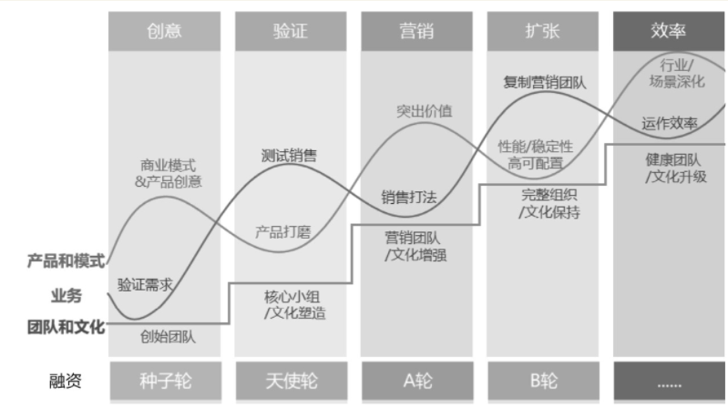
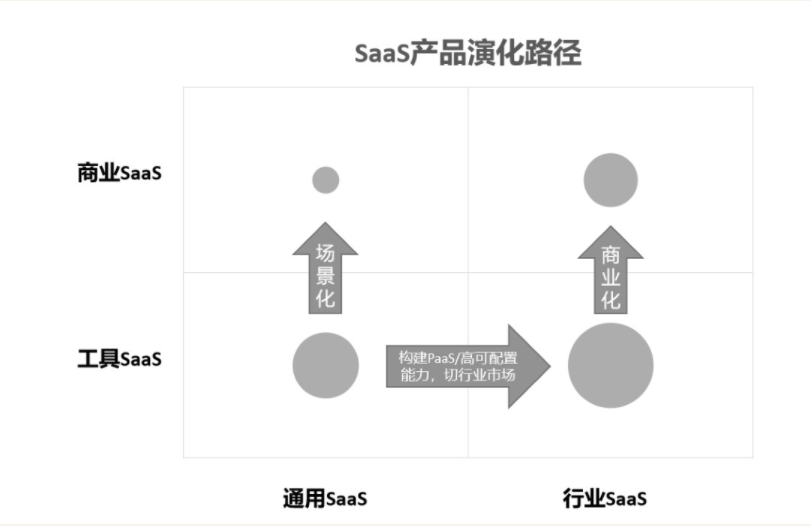

    作者: 吴昊
    出版社: 电子工业出版社
    出品方: 博文视点
    出版年: 2020-5
    页数: 296
    定价: 79
    ISBN: 9787121386374

[豆瓣链接](https://book.douban.com/subject/35079444/)

- [引言 国内SaaS领域发展现状](#引言-国内saas领域发展现状)
  - [SaaS与传统安装部署软件的差异](#saas与传统安装部署软件的差异)
  - [国内SaaS发展的阻力](#国内saas发展的阻力)
    - [1）“效率提升”类IT产品的需求还没有大规模爆发](#1效率提升类it产品的需求还没有大规模爆发)
    - [2）大部分SaaS公司的产品还不够好](#2大部分saas公司的产品还不够好)
    - [3）中国企业IT采购流程也是一个瓶颈](#3中国企业it采购流程也是一个瓶颈)
- [序章](#序章)
  - [第1节 产品的市场定位与商业模式](#第1节-产品的市场定位与商业模式)
    - [1.目标市场](#1目标市场)
      - [1）小微企业市场](#1小微企业市场)
      - [2）中部市场](#2中部市场)
      - [3）头部市场](#3头部市场)
    - [2.波特五力模型](#2波特五力模型)
    - [3.产品创新的重要性](#3产品创新的重要性)
    - [4.SaaS公司的商业模式](#4saas公司的商业模式)
      - [1）传统软件的买断模式](#1传统软件的买断模式)
      - [2）SaaS收年费](#2saas收年费)
      - [3）消耗模式](#3消耗模式)
      - [4）分销售额](#4分销售额)
  - [第2节 SaaS的数据价值](#第2节-saas的数据价值)
    - [1.客户对云计算的接受程度逐年提高](#1客户对云计算的接受程度逐年提高)
    - [2.SaaS产品利用数据增值的路径设想](#2saas产品利用数据增值的路径设想)
  - [第3节 SaaS的本质是续费](#第3节-saas的本质是续费)
    - [1.服务模式的影响](#1服务模式的影响)
    - [2.销售模式的影响](#2销售模式的影响)
    - [3.公司价值的影响](#3公司价值的影响)
    - [4.总结](#4总结)
  - [第4节 路线图：SaaS创业的5个阶段和4条主线](#第4节-路线图saas创业的5个阶段和4条主线)
- [阶段1 产品创意与商业模式选择](#阶段1-产品创意与商业模式选择)
  - [第1节 SaaS产品分类及其发展方向](#第1节-saas产品分类及其发展方向)
    - [1.通用SaaS vs行业SaaS](#1通用saas-vs行业saas)
    - [2.工具SaaS vs商业SaaS](#2工具saas-vs商业saas)
    - [3.关于“商业SaaS”的争议](#3关于商业saas的争议)
    - [4.各类型SaaS产品间的转化路径](#4各类型saas产品间的转化路径)
    - [5.通用SaaS的PaaS路径](#5通用saas的paas路径)
    - [6.行业SaaS从“工具”向“商业”转变](#6行业saas从工具向商业转变)
    - [7.通用SaaS增加“场景”价值](#7通用saas增加场景价值)
  - [第2节 SaaS创业是否要做PaaS](#第2节-saas创业是否要做paas)
    - [1.工具SaaS做PaaS的目的](#1工具saas做paas的目的)
    - [2.采用PaaS的三层目的](#2采用paas的三层目的)
      - [1）厂商内部：基于PaaS开发自有SaaS产品](#1厂商内部基于paas开发自有saas产品)
      - [2）客户：能基于PaaS做定制开发](#2客户能基于paas做定制开发)
      - [3）ISV：能基于PaaS开发新产品](#3isv能基于paas开发新产品)
  - [第3节 商业SaaS的特征](#第3节-商业saas的特征)
  - [第4节 工具SaaS公司转型商业SaaS的能力模型及发展路径](#第4节-工具saas公司转型商业saas的能力模型及发展路径)
- [阶段2 产品打磨和商业模式初步验证](#阶段2-产品打磨和商业模式初步验证)
  - [第1节 产品打磨的原则与分工](#第1节-产品打磨的原则与分工)
  - [第2节 该不该做定制开发](#第2节-该不该做定制开发)
  - [第3节 营销人才画像和初期核心营销人才招募](#第3节-营销人才画像和初期核心营销人才招募)
    - [1.人才画像](#1人才画像)
    - [2.人才画像+](#2人才画像)
    - [3.招人的方法](#3招人的方法)
    - [4.聊人的方法](#4聊人的方法)
  - [第4节 to B产品能不能免费](#第4节-to-b产品能不能免费)
  - [第5节 如何面对市场竞争](#第5节-如何面对市场竞争)
  - [第6节 创业初期是否应该做BD和会销](#第6节-创业初期是否应该做bd和会销)
- [阶段3 创造销售打法和验证销售团队毛利模型](#阶段3-创造销售打法和验证销售团队毛利模型)

# 引言 国内SaaS领域发展现状
## SaaS与传统安装部署软件的差异
两者背后的运营方式和商业模式有两个重大区别。

1. 用户使用的SaaS软件，其数据保存在云端。
1. SaaS公司提供的SaaS服务是租用制的。

**SaaS的本质是“续费”**。这是SaaS与传统安装部署软件的本质差别。

## 国内SaaS发展的阻力
### 1）“效率提升”类IT产品的需求还没有大规模爆发
国内大量中小企业的管理还很粗放，以拿到订单为主要目标，不太重视生产组织环节中的资源浪费。

目前大部分中小企业主还没有意识到，通过IT系统提高管理水平、降低提供产品（包括服务）成本的重要性。

### 2）大部分SaaS公司的产品还不够好
由于早期知识产权容易被忽视，一家软件企业做出一个创新产品，并在市场取得不错反响时，很快就会被模仿，最后软件企业只能拼营销能力和性价比。软件企业被迫走上为企业做定制化开发的道路，因为定制化开发是无法被模仿的。

产品功能不丰满、价值点不突出，获得客户认可难；表现在产品的IT架构扩展性不佳，在版本迭代过程中，反复推倒重来，浪费了大量研发资源；也表现在整个组织的能力不足，在市场、销售、服务各个环节缺乏管理思路、业务流程和员工文化建设。

从“产品—客户—市场”三者关系的角度来看（如下图所示）：产品价值不够突出，公司想形成市场突破就很费力；即便客户购买了，产品不能很好地解决客户的痛点需求，客户口碑就不会好，市场对该产品的新需求增速就不会提高。这是一个糟糕的循环。

### 3）中国企业IT采购流程也是一个瓶颈
在美国，因为商业环境成熟，SaaS产品明码标价，传统企业中各个部门的工程师（未必是IT人士）和管理者，能够迅速决定采购提升效率的SaaS产品，然后向企业报销。而在国内，因为IT采购流程复杂（经常涉及采购部、信息部、业务部门、行政部门、CEO办公室等多个部门），SaaS公司的营销成本要高很多，触达客户的速度也要慢很多。

到了续费阶段，还需要重新进行合同及价格谈判。国内SaaS公司真是困难重重。

第3点是表象，主因还是前两点：需求和产品价值。

对于SaaS公司来说，产品不够好是内因，客户需求非刚性是外因。即便通过练内功把内部问题解决了，销售额达到一定规模后，受制于外部原因，大部分SaaS公司的增速也会放缓。

# 序章
## 第1节 产品的市场定位与商业模式
### 1.目标市场
SaaS产品最适合“橄榄型”（营收占比维度）的目标市场。

- 该市场有一部分头部企业，他们的市场占有率也没有达到垄断地位，只有10%～30%，甚至更低。
- 该市场的中间部分很大，就如橄榄球的中部，有大量“中小企业”（50～500人的企业），并且占据着大部分市场份额。
- 该市场尾部也有不少“小微企业”（50人以下），但市场份额并不高。

#### 1）小微企业市场
我们从下往上看。小微企业不到50人，业务模式、人员构成、管理方式都不稳定，一套SaaS系统每年5000～10000元也会嫌贵，他们更愿意用免费的企业微信、邮箱、钉钉来做团队内部的沟通。但从SaaS营销成本上看，一个5000元的单子与5万元的单子，从投入人力、成交周期上看，差别并不大。何况，小微企业自身存活率不高，这类企业来年的“续费率”也低，对SaaS公司来说价值很有限。

#### 2）中部市场
中部市场有大量的中小企业，这是SaaS产品的优质目标市场。该类市场有这样几个特点。

- 有大量中小企业（几万到几十万家）。
- 由于外部竞争激励，企业有提高效率的刚性需求。
- 企业愿意向其他企业学习，也愿意接受效果良好的标准管理方式。
- 中部市场的企业由于在同一个市场上长期竞争，盈利模式和管理方式趋同，因此需求相对标准，标准产品就能满足70%以上的使用需求。
- 这部分企业不愿意承担高额定制开发费用，更愿意接受标准产品。

#### 3）头部市场
大部分行业都有几家或几十家头部企业。他们的人员和营收规模往往很大，业务及管理流程也相对规范，本来应该是SaaS产品的优质目标客户。但这些企业是供应商竞相争夺的行业标杆，由于规模大、业务需求独特，同时也能承担高额的定制化开发费用，所以他们经常会挑选能做定制化开发的IT供应商。

在定制化开发方面，SaaS公司从IT架构到工程师雇用成本都不具备优势。也许为几家头部企业做定制化开发是SaaS厂商打磨未来标准化产品的一条路径，但长期为大客户做定制化开发肯定不是SaaS公司的终极目标。

### 2.波特五力模型
当你决定进入一个行业SaaS市场（例如教育机构SaaS），或者通用SaaS工具市场（例如CRM）时，可以先做波特五力模型分析。

- 现有竞争者。通用SaaS领域比较成熟的CRM、HR、OA等。每个细分行业有1～3个头部SaaS公司和众多中小创业企业。在很多垂直行业的SaaS市场，还没有出现头部企业，但竞争者数量不少。相对来说，新出现的“行业+商业SaaS”产品的竞争对手是比较少的。
- 新进入者的威胁。SaaS创业门槛很低，有三五个工程师就能组织创业。当然，从具体细分领域的情况看又各不相同。后文会专题分析SaaS公司的护城河。
- 替代品的威胁。传统软件厂商的威胁不大，他们也逐渐往SaaS迁移，但目标客户企业内部存在新老产品交替的难题，有一个递进过程。
- 买家议价能力。SaaS企业当然希望自己的目标市场呈“橄榄型”，中型买家数量多、需求一致，这样面对买家的议价能力才会更高。如果只有目标行业的几个头部客户，而自己竞争者不少，其议价能力自然很弱。
- 供应商议价能力。SaaS企业的主要成本不是设备费用而是人员成本。和互联网巨头“抢人”，除了薪酬，也要多发挥创业公司自身的优势：更多自主决策的机会、更深的股权绑定、更有朝气的文化氛围……

### 3.产品创新的重要性
为何中国SaaS公司会陷入激烈的竞争中呢？我判断有3个因素。

1. 2015—2016年中国“热钱”比美国更多，拿了投资的SaaS厂商在竞争过程中更倾向以“销售额”为导向而非追求“利润”。
1. 中国市场更大、中国人的创业热度更高，大量创业者没有商业经验，也缺乏重视现金流等实际经营企业的经验，容易做出激进决策。
1. 国有垄断企业的高额利润在商业环境中形成了一个假象，“先用低价干掉对手，我们未来再提价”。其实在充分竞争市场中并非如此。

在自由竞争的局面下，不存在长时间的垄断利润。以下这些都是错觉。
- 1999年，没有一家软件公司能打败微软了！——微软股价在2016年才回到1999年的高度，用了17年时间。
- 2010年，电商市场被某电商平台垄断了！——之后京东很快通过物流“奇兵”拿到部分市场。
- 2013年，百度搜索广告第一！——现在要加上限定词：PC端，今天在移动端，今日头条的“推荐阅读”更受欢迎。
- 2016年，微信的流量入口地位无人可以挑战！——结果2017年出现了“抖音”。

产品同质化后，价格竞争无可避免。避免未来激烈竞争的关键还是应该在初期就定位好公司的战略和产品。

### 4.SaaS公司的商业模式
几个跟SaaS相关的商业模式，从表面上看，它们的收费模式不同。

#### 1）传统软件的买断模式
传统部署软件的收费模式是买断式的。企业签约后，支付买断该软件（某个版本一定数量的账号，也可以是其他形式）使用许可权（License）的费用。在常规做法中，后续每年还可以收10%～15%的维保费用（在实际运作中，维保费用较难收到）。

#### 2）SaaS收年费
SaaS的本质是续费。SaaS公司有一个内在的机制，每年都会找客户续费，就会不断帮客户解决问题。公司内部有一个CSM（客户成功管理）团队，专门有一个客户成功经理以客户的“续费”为KPI。他会想尽办法调动产品资源、研发资源、服务资源，甚至公司高管资源，去帮客户解决问题。

#### 3）消耗模式
收年费还不是最好的模式。有一个模式比它更好，就是消耗模式。例如关键字搜索排名，客户先存4000元，消耗过程带来商机，有效果了再预存1万元，带来了一批客户，效果不错，再预存2万元……在这样的情况下，企业其实按效果付费，双方的交互频率更高，业务紧密度更高。很明显，消耗模式在商业上更有价值。

为什么这么说呢？因为它会不断地督促服务供应商想办法帮你做消耗。比如百度SEM，百度代理商会派人帮企业做优化、做消耗、帮企业带来更多客户。

#### 4）分销售额
见到一个2004年就做SaaS的老前辈。他做了一个产品，有硬件也有软件，他的商业模式就是跟租用硬件（含软件）的门店客户分销售额：你卖多少，我都只拿1%。

这个模式最有趣的地方，从机制上让SaaS公司销售服务体系中的每个员工不断地帮助客户去获取更多的销售额。只有客户有了更多销售额，服务供应商才有更多钱可分。

## 第2节 SaaS的数据价值
### 1.客户对云计算的接受程度逐年提高
第一个台阶大部分SaaS公司都慢慢跨过去了。用了几年时间呢？大约是5年。

我记得在2013年的时候，想说服一个中等规模的企业使用SaaS产品非常困难，只要客户问“数据保存在哪里”，丢单率就有80%。

分析一下背后的原因，这些客户接受云产品的主要原因是什么？是因为SaaS产品能提升管理效率、节约成本等。

### 2.SaaS产品利用数据增值的路径设想
SaaS能帮客户企业增加获客数量和营收，这是每个企业的刚需。如果要能够与客户分享数据实现共赢，就很可能要参与到客户的业务运营中。举个例子，借用客户的老顾客关系链进行新顾客引流，这不是卖给客户一个工具就能运作好的，往往需要提供工具的SaaS公司也提供代运营的服务。

其次，那些能够掌握某个领域大量数据的SaaS公司也会挖掘数据增值场景。企业拥有数据，结合新IT技术，甚至能够改变整个行业的业务链条。处在上游的客户企业往往能因此得到更大的价值：更了解终端客户的需求、分布、购买力等。

公司开发SaaS产品中的数据未来能给客户带来更多价值吗？

数据的使用要遵循合规、诚信的原则。数据属于提供数据的客户，SaaS公司只能在三个条件同时成立的前提下使用：

- 能为客户带来更多价值；
- 得到客户的正式许可；
- 只在客户许可的范围内使用。

## 第3节 SaaS的本质是续费
### 1.服务模式的影响
先从客户侧说起，传统软件实施失败率高或上线后使用体验糟糕，行业内常说是客户需求变化快的问题，是企业执行力的问题，但实际上还是“利益与贡献不匹配”的机制问题。

从软件公司来看，销售在签订合同时其业绩任务就已经达成，因此销售代表，甚至售前支持顾问大都会以“拿下单子”为目的，在遇到竞争激励时即使过度承诺，给后面的实施部门“挖坑”也在所不惜。而后续年份只有15%左右的维护费，利益不多，好收就顺手收一下，不好收也不值得费力再进行重度投入。

而SaaS的按年付费彻底改变了这个局面。举个例子，一个报价为30万元的传统软件项目，SaaS公司报价为10万元/年。客户签约及实施完成后，由“客户成功部（CSM）”接手服务。客户成功经理有非常明确的目标，就是让客户用好，这样12个月后客户才会续费！有这10万元的续费，CSM才有业绩、才有奖金，所以他们会极其重视客户使用体验。如果企业没用好，CSM甚至会重新进行需求调研和二次实施。为什么？因为客户用好了，后面还有10万元×N年，这是第一年收入的100%而不是10%！

### 2.销售模式的影响
收年费的模式也极大地影响了SaaS公司的销售毛利模型。

虽然首次收费10万元比30万元少很多，但门槛低了，销售难度和销售周期都缩短，一个SaaS产品的销售代表也能做到一年上百万元，甚至更多销售收入。而对SaaS公司来说，第二年开始的续费成本非常低，CSM拿走20%～40%的费用，剩下60%～80%都是毛利。

因此，SaaS销售的新单毛利可以很低，甚至使用0毛利政策，给销售10%～30%的首次成交提成（提成比例是传统软件行业的3～10倍），给代理商60%～70%的返款——这都是基于SaaS的本质。

### 3.公司价值的影响
收年费的模式也决定了SaaS公司的价值，或者说“估值”。

SaaS公司是按年营收额来估值的，在美国SaaS公司的估值大概是年销售额的10倍，这与传统上市公司20倍左右的`市盈率（市值÷盈利）`是完全背离的。

我们可以简单算一下，传统公司如果完成1000万元年销售额，净利润大概在100万元左右（10%），市值=100万元×20倍市盈率=2000万元，市值只有销售额1000万元的2倍。

而根据`市销率（市值约为销售额的倍数）`10倍的SaaS估值模型，年销售额1000万元的SaaS公司估值是1亿元！为什么？因为续费收入可持续，这对于to B销售公司来说是巨大的价值。

如果我是投资人，我会严格考核`ARR（Annual Recurring Revenue，年度经常性收入）`，而不仅仅看年度总营收。也就是说收入必须按服务期折算，如果是一次收3年费用，只能把当年将执行的这部分作为当年收入。

### 4.总结
SaaS作为一个新商业模式，其最核心、最本质的东西，就是“续费”。如果大部分客户不能成功续费，只收到一次费用的SaaS公司不符合SaaS的商业模式。

续费率很差（例如，低于60%）的SaaS公司，要找找自己的问题是什么，是产品的`PMF（Product-Market-Fit，产品市场匹配）`没完成就急于发布了，还是客户成功经理的服务没做好，或者根本是销售部门选错了客户（这往往是客户不续费的主要原因）？

而对于那些一次收多年服务费的SaaS公司，就连发现自身问题的机会都没有了。SaaS收费模式塑造了SaaS公司的组织结构和服务机制。因此坚持不卖多年单，才能把产品打磨成熟，真正做到客户成功。

## 第4节 路线图：SaaS创业的5个阶段和4条主线
我总结SaaS公司（及to B企业服务公司）创业的5个阶段，如下图所示。贯穿这5个阶段的则是4条主线。

- 阶段1，产品创意与商业模式选择
- 阶段2，产品打磨和商业模式初步验证
- 阶段3，创造销售打法和验证销售团队毛利模型
- 阶段4，扩张期的组织发展
- 阶段5，效率提升

其中每个阶段都有明确的任务。所有SaaS公司（及toB公司）不可能跳过这些阶段。而4条主线分别是：

- 产品和模式
- 业务
- 团队和文化
- 融资

# 阶段1 产品创意与商业模式选择
`MVP（Minimum Viable Product，最小化可行产品）`的概念很有指导性，这个“原型”可以是只有UI界面的H5，也可以是手绘的演示图。不用拘泥于形式，关键是能把价值讲清楚，能从客户那里得到反馈。

## 第1节 SaaS产品分类及其发展方向
### 1.通用SaaS vs行业SaaS
首先按照SaaS公司产品的服务对象来分类：聚焦某个业务但客户群体是跨行业的通用SaaS，还有聚焦一个行业内的多个业务的行业SaaS。

- `通用SaaS`：跨行业的通用产品。例如，北森、肯耐珂萨和Moka的HR产品，纷享销客和销售易的CRM产品，UDesk和智齿科技的智能客服。
- `行业SaaS`：在某个行业内使用的产品。例如，奥琦玮和客如云的餐饮企业SaaS、聚水潭和旺店通的电商SaaS、云朵课堂和校宝在线的教育机构SaaS等。

### 2.工具SaaS vs商业SaaS
`工具SaaS`的主要特点是：为客户企业提供了一个提高管理效率的工具。这和传统软件的价值一致：做SaaS CRM的还是辅助管理客户、提高销售团队效率的CRM，做SaaS HR系统的还是提供提高人力资源部门工作效率的HR系统。

`商业SaaS`有哪些方向呢？

- 引客流：SaaS产品帮助企业获得更多新客户。引流SaaS往往通过微信关系链、私域流量等方式运转。获客工具有效果不可持续的风险，客户企业也常常由于自己不会运营而影响效果。我看到这类SaaS公司往往需要进行重度专业知识培训，甚至提供代运营。这两年我接触过几家“美业SaaS”公司，他们的培训和运营工作量都很大。
- 收取交易流水手续费：例如，聚合支付平台就有这个能力，客户企业按使用聚合支付资金流水的某个千分比来支付费用。
- 提供金融服务：为金融机构提供客户企业授权信息，获得金融机构的佣金。我推测未来也会逐渐有更深的方式，例如直接做风控管理，提供贷款。当然建立风控体系成本很高，要GMV足够大才能承担。
- 集中采购：国内已经有SaaS企业在垂直领域介入供应链了。他们为制造企业供货，GMV已达百亿元，公司营收及利润也很可观。再想想，美团不也一直在这个方向上努力吗？如果美团占领足够多的餐饮SaaS系统份额，“美团快驴”（进货平台）的价值也会更大。
- 提供决策及运营数据：这个方向容易理解，如果只是企业内的数据，只能做内部报表；如果能够在部分客户的授权下，提供行业、地域等范围分析，SaaS将有更大价值。
- 产业互联网：再往上说，SaaS公司有可能参与某些行业或领域的产业互联网改造。这些改造肯定要用到SaaS公司的数据或IT能力。有些供应链、价值链的改造可能是SaaS公司主导的，当然也可能是行业或领域的寡头企业主导的。

### 3.关于“商业SaaS”的争议
从我接触过的上百家行业SaaS公司的实践看，仅靠收软件年服务费没有多少发展空间，甚至养不活公司。所以行业SaaS公司，大多都正在往商业化的路径上发展。

### 4.各类型SaaS产品间的转化路径

### 5.通用SaaS的PaaS路径
什么是标准的`PaaS`产品？在我看来，这要求PaaS平台有极其丰富、强大、便捷的架构和能力，令`ISV（独立软件开发商）`能够在PaaS上进行自有行业/领域产品的开发。

### 6.行业SaaS从“工具”向“商业”转变
他们在完成了“工具”价值化后，在SaaS功能和“数据”的基础上，有机会帮助客户企业获得更多客户、增加商业增长点、提供新的产品，甚至介入整个供应链和价值链的再造过程。

### 7.通用SaaS增加“场景”价值
做通用SaaS的公司，我觉得不能轻易放弃原有阵地转向“行业SaaS”。因为转“行业”需要有该行业的基因。

相对“通用+工具SaaS”而言，“通用+商业SaaS”的使用场景更具体，业务边界也更清晰。场景具体了、产品价值大了，营销环节才容易突破。

## 第2节 SaaS创业是否要做PaaS
`PaaS （Platform-as-a-Service，平台即服务）`、`IaaS （Infrastructure-as-a-Service，基础设施即服务）`、`SaaS`都是云计算的一部分，它们三者的层次关系如下图所示。

PaaS再往下还可以拆分为`IPaaS（Integration PaaS，集成PaaS）`和`APaaS （Application PaaS，应用PaaS）`。本文谈的PaaS特指APaaS。

### 1.工具SaaS做PaaS的目的
首先，我强调一下，并不是所有SaaS公司都应该做PaaS。目前国内真正在做PaaS开发的公司大多是做通用工具SaaS产品的公司。我们探究一下这部分SaaS公司为什么要做PaaS？这些SaaS公司面对的需求往往有两种。

1. 多个行业较统一的需求（例如管理销售业务的CRM、管理人事业务的HRM）。
1. 一个万亿级大行业中的多个细分子行业的大客户（例如快消行业众多细分门类中的大客户）。

我和一个头部SaaS公司的CTO交流，他给我举了个很具体的例子。为了照顾没有技术背景的同学，我尽量翻译成大家能理解的语言。某个系统中有很多对象（object）——“部门”“岗位”“人员”等，总共有上百个。系统v1.0版上线时应对的需求还比较简单，但随着客户数量和客户规模同步增加，企业要求自己可在“部门”对象下增加自定义字段。于是v2.0版本中对“部门”对象做了改造，加上了“增加自定义字段”的功能。随后，又在后续的版本v2.1、v2.2中给“岗位”等其他5个对象增加了这个功能。每为一个对象增加“自定义对象”的功能，都需要付出不小的设计、开发、测试成本。最后，公司终于决定在v3.0版本对整个软件架构进行“中间层”改造。虽然过程比较艰难，但改造完成后可以达到以下效果。

- 所有对象都自动具备了“自定义对象”的功能。
- 今后如果还需要为所有或部分对象增加新功能，只需要改造“中间层”中的母对象即可。
- 开发成本、测试工作量都大幅下降。

PaaS的第一层价值大体可以用这个例子说明。

### 2.采用PaaS的三层目的

#### 1）厂商内部：基于PaaS开发自有SaaS产品
一个SaaS厂商投入巨资引入PaaS的第一层目的是为了提高内部开发效率。

#### 2）客户：能基于PaaS做定制开发
第二层目的是从客户角度出发的，因为很多中大客户有独特的需求，需要定制化的开发。如果没有PaaS平台，无论是SI（System Integrator，系统集成商），还是承担SI角色的SaaS厂家或客户企业IT部门，他们开发出来的程序未来都不能随着SaaS产品升级而自动、平滑地升级。这将为客户企业埋下巨大隐患，未来也会为SI和SaaS公司带来非常大而不确定的人力投入风险。

同时，为了达到这个目的，PaaS提供的开发手段也有三种。

1. `无代码开发`：完全通过页面配置，就能按需求定制开发，不用写入代码，不需要IT基础，对配置人员的要求很低。
1. `低代码开发`：除了页面配置，还可以通过加入一些简单的函数或编程脚本达到实现复杂判断、控制流程、展现结果等目的。对配置人员的要求是有软件编程基础，但不用专门学习新的编程语言。
1. `专业代码开发`：这就是基于PaaS常规的程序开发工作，需要专业的软件工程师才能完成操作。PaaS平台将提供编程语言（可以是类Java语言，但也包含很多新对象和新概念）和集成开发环境（IDE，Integrated Development Environment）。后者一般包括代码编辑器、编译器、调试器和图形用户界面等工具。
1. `全定制开发`：在没有PaaS的情况下，SI为SaaS产品不能满足的客户企业提供独特需求的定制开发。这种方式只要求SaaS产品提供丰富而健壮的API接口。

#### 3）ISV：能基于PaaS开发新产品
最后才说到PaaS的终极目的——支持`ISV （Independent Software Vendors，独立软件开发商）`在PaaS平台上开发新SaaS产品。

我分析一下目前国内的形势：几个大的IaaS厂商阿里云、腾讯云等，为了避免自己被“管道化”（就像自来水管网一样，只提供通道资源，而不提供增值服务），除了做IPaaS也会逐步开发或引入APaaS。

## 第3节 商业SaaS的特征
商业SaaS的特征是很鲜明的：以SaaS系统积累的数据为核心，融合更广泛的外部数据，为客户提供增值价值。

SaaS是路径，而非目的。

## 第4节 工具SaaS公司转型商业SaaS的能力模型及发展路径
做某个行业中的商业SaaS，对创始团队的人才能力模型、资源积累、行业理解沉淀要求是很高的。我不觉得一个做跨行业客户的通用SaaS公司能够做这个转型，毕竟要放弃的市场太大，具体的目标行业市场水又太深。

另外，也不是所有做行业的工具SaaS公司都应该转型做商业SaaS。这与客户的需求有很大关系。举个例子，如果客户群体很欢迎工具，很恐惧平台把他们的客户串在一起造成流量外逸，也许这家SaaS公司就应该坚守自己做工具的初心。

# 阶段2 产品打磨和商业模式初步验证
## 第1节 产品打磨的原则与分工
梁宁老师的《产品思维30讲》的建议是，to C产品“打痛点、打爽点或打痒点”都行，但to B产品只能打痛点。

to B与to C相比，还有一个很大的区别：客户需求一致性较差。换句话说，即使在一个行业里，各个企业间的业务和组织差异也很大。也许一个创意点子在创始人头脑里很完美，但一到市场上，必然面对南北差异、城市差异、规模差异，甚至门店位置差异等问题。不同客户的需求有很大偏差，找到共性需求成为很大的难题。

正确的产品打磨方式应该是什么样的？我建议用以下调研框架来解决产品打磨的问题。

1. 任何行业的市场都需要被细分，要做广度抽样调研，弄清楚目标客户有哪些主要属性，每一类客户的数量、需求的紧迫性及购买力。
1. 选择3～4个细分市场的头部产品，在这个特定范围内进行调研，才有机会找到共性需求。创始人、产品经理、营销合伙人最好一起参与调研，分别把握产品价值、产品体验和产品卖点。如果创始人能三者兼顾的话，效率会更高。
1. 不要想一次性地就把功能做完整，新产品应该胜在“锋利”而非“完整”。这也是MVP应有之意。

## 第2节 该不该做定制开发
1. 明确自己做产品，还是做项目
2. 初期可以做定制开发，但要明确目的
3. 从项目转型产品的时机和方法
   1. 即便定制，也只做自己边界内的定制。边界外的定制应当去找成熟产品，只做好接口即可；如果没有产品能满足，就尽量找第三方`系统集成商（System Integrator）`做定制开发。
   2. 要在合适的时机出现时，尽早转为产品。定制开发的产能是有上限的，即便增加人手也未必能扭转“边际效益递减”的趋势。如果营收增速已经放缓，定制开发团队人均月产出金额也会下降，项目开发组与销售部门的摩擦会越来越大，这时就要考虑启动产品开发了。
   3. CTO能驾驭的版本数量有限，具体上限与产品复杂度、客户需求差异度有关。为每个定制开发客户提供的软件都是一个独立的版本。每个独立版本未来都有客户需求升级、Bug修改、环境参数变化造成的软件维护等成本。
   4. 通用SaaS企业可以升级自己的开发平台为PaaS。如果PaaS能力成熟了，基于PaaS的20%比例的定制开发是比较容易管理的。

## 第3节 营销人才画像和初期核心营销人才招募
### 1.人才画像
作为创始人或销售VP，首先心中要有一个“人才画像”。当前要招的营销骨干的特性和背景等都要一一写下来。

to B和to C的业务流程完全不同，跑小B（门店）和对大型企业进行销售的业务流程也完全不同。这几类目标客户对销售代表的能力模型要求也很不一样。面对企业的销售，做快单（平均客单价4万元以下，成交周期4周以内）与做解决方案销售（平均客单价4万以上，成交周期2～4个月）就不一样。前者更有冲击力，善于在新市场中形成突破；后者的产品和解决方案能力更强，适合稳扎稳打，慢慢做中大客户。

根据自身产品的需要，从这4类营销人才中做选择。

- to B：解决方案销售（例如北森、销售易、神策）
- to B：快单销售（例如2017年之前的纷享销客、红圈营销、爱客）
- to小B：门店地推（例如美团、客如云、美业SaaS）
- to C：客户是个人（例如针对个人的寿险产品）

### 2.人才画像+
在这个阶段，还需要考虑这个人未来的成长路径。换个角度说，公司目前是做销售探索，一旦成功地找到“可复制”的打法，就要扩建团队。现在招的人，就是几个月后要带团队的人。所以这个阶段要招“士官”而非“士兵”。所以他的“人才画像”里，还应该有以下内容。

- 领导力，能体察别人的需求并乐于助人
- 组织管理能力，至少有12个月以上销售团队的管理经验

### 3.招人的方法
这里有个快捷有效的方法：`定向招人`。有一次我帮一位华为老领导的SaaS项目招销售合伙人，我推荐可以定向在某些同类公司的离职员工中招，这样经验比较匹配。

### 4.聊人的方法
见到优秀人才，创始人要重视，但不要谄媚。

回顾我曾经招到大量优秀人才的过程，大体如此：先详细介绍公司（至少30分钟），再提要求。

1. 候选人年度收入设计会高于业内平均水平，但无责底薪不要太高，高收入靠完成业绩去挣。
2. 希望候选人从一线做起，哪怕在基层的时间只有2、3个月，但可以掌握产品细节、融入团队。这比“空降人材”存活率高。
3. 打预防针，告诉候选人团队目前的工作状态。
4. 如果一个很牛的候选人能接受低于原有的底薪，那就说明他对团队事业的认同程度很高。这点非常关键，但在入职前又很难判断。
5. 具体谈到什么程度，要参考自己公司的状况和紧迫性。
6. 面谈的关键是用真心打动人。只能是多花时间聊、多花心思惦记啊！所以招人是个花时间的活儿。

## 第4节 to B产品能不能免费
1. 客户太容易放弃，难以搜集深度使用需求。免费策略确实会让客户数迅速增加，但客户在使用前缺乏对使用该系统必要性的考虑，使用中遇到困难（例如：员工说不好用、用户不愿意扫描二维码）就很容易放弃，并且还没有放弃成本——毕竟没花钱买。
2. 避免刷单，管理成本太高。免费容易造成营销团队及代理商刷单。
3. 服务压力大，服务水平下降。从服务上来讲，大量免费客户涌入，降低了付费客户的服务质量。同时，在免费客户中，低质量和高质量的客户混在一起，客服团队主动服务的效率也极其低下。

从本质上说，对产品经理和销售代表来说，既然是企业服务产品就必须真正解决企业的问题，销售人员也必须正视困难、啃下初期的硬骨头，做到真正让客户买单。而企业采购一个产品，除了采购成本，还有决策成本和培训使用成本，对企业来说并不存在“免费的产品”。

## 第5节 如何面对市场竞争
在创造新商业的过程中，企业经常会做出这样的决定。

- 在一个市场方向上发展受阻后，很容易只看到眼前市场所存在的问题。
- 然后发现另一个巨大的市场，在董事会或投资人的压力下做新市场/新产品。
- 一旦深入新市场后，又发现新市场有新市场的问题，再次受阻。
- 这时候，原市场的产品由于低投入时间过长，原有的优势也逐步丧失。

实际上，创业公司探索新市场也正常。我想提醒的是进入一个新市场前，是否该做一做调研？
- 新市场上有多少玩家？
- 他们的历史有多久？生存状况如何？
- 他们遇到了哪些困难？如果进入该市场自己是否能够避免？

## 第6节 创业初期是否应该做BD和会销
SaaS创业的第二个阶段要打磨产品，则要求稳。“稳”体现在几个方面。

- 产品真能卖得出去：要卖给陌生客户，不能只卖给老朋友的公司。
- 卖产品的人：不仅创始人能签单，符合“营销人才画像”的销售代表也能签单。
- 签单数量：如果是客单价4万元以下的轻产品，至少签10个客户，以避免偶然性；如果是客单价4万元以上的产品，可以适当降低数量要求。
- 客户企业的员工能迅速上手，把产品用好。

完成第二阶段的目标，`PMF（Product-Market Fit，产品市场匹配）`也就顺利完成了。

# 阶段3 创造销售打法和验证销售团队毛利模型

