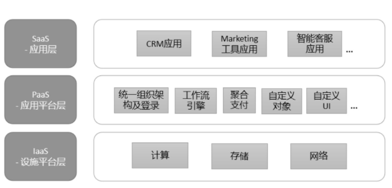
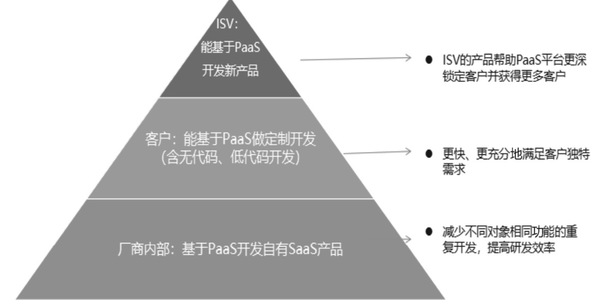
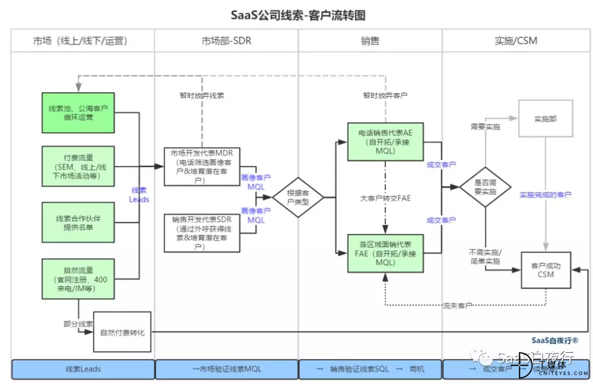

    作者: 吴昊
    出版社: 电子工业出版社
    出品方: 博文视点
    出版年: 2020-5
    页数: 296
    定价: 79
    ISBN: 9787121386374

[豆瓣链接](https://book.douban.com/subject/35079444/)

- [引言 国内SaaS领域发展现状](#引言-国内saas领域发展现状)
  - [SaaS与传统安装部署软件的差异](#saas与传统安装部署软件的差异)
  - [国内SaaS发展的阻力](#国内saas发展的阻力)
    - [1）“效率提升”类IT产品的需求还没有大规模爆发](#1效率提升类it产品的需求还没有大规模爆发)
    - [2）大部分SaaS公司的产品还不够好](#2大部分saas公司的产品还不够好)
    - [3）中国企业IT采购流程也是一个瓶颈](#3中国企业it采购流程也是一个瓶颈)
- [序章](#序章)
  - [第1节 产品的市场定位与商业模式](#第1节-产品的市场定位与商业模式)
    - [1.目标市场](#1目标市场)
      - [1）小微企业市场](#1小微企业市场)
      - [2）中部市场](#2中部市场)
      - [3）头部市场](#3头部市场)
    - [2.波特五力模型](#2波特五力模型)
    - [3.产品创新的重要性](#3产品创新的重要性)
    - [4.SaaS公司的商业模式](#4saas公司的商业模式)
      - [1）传统软件的买断模式](#1传统软件的买断模式)
      - [2）SaaS收年费](#2saas收年费)
      - [3）消耗模式](#3消耗模式)
      - [4）分销售额](#4分销售额)
  - [第2节 SaaS的数据价值](#第2节-saas的数据价值)
    - [1.客户对云计算的接受程度逐年提高](#1客户对云计算的接受程度逐年提高)
    - [2.SaaS产品利用数据增值的路径设想](#2saas产品利用数据增值的路径设想)
  - [第3节 SaaS的本质是续费](#第3节-saas的本质是续费)
    - [1.服务模式的影响](#1服务模式的影响)
    - [2.销售模式的影响](#2销售模式的影响)
    - [3.公司价值的影响](#3公司价值的影响)
    - [4.总结](#4总结)
  - [第4节 路线图：SaaS创业的5个阶段和4条主线](#第4节-路线图saas创业的5个阶段和4条主线)
- [阶段1 产品创意与商业模式选择](#阶段1-产品创意与商业模式选择)
  - [第1节 SaaS产品分类及其发展方向](#第1节-saas产品分类及其发展方向)
    - [1.通用SaaS vs行业SaaS](#1通用saas-vs行业saas)
    - [2.工具SaaS vs商业SaaS](#2工具saas-vs商业saas)
    - [3.关于“商业SaaS”的争议](#3关于商业saas的争议)
    - [4.各类型SaaS产品间的转化路径](#4各类型saas产品间的转化路径)
    - [5.通用SaaS的PaaS路径](#5通用saas的paas路径)
    - [6.行业SaaS从“工具”向“商业”转变](#6行业saas从工具向商业转变)
    - [7.通用SaaS增加“场景”价值](#7通用saas增加场景价值)
  - [第2节 SaaS创业是否要做PaaS](#第2节-saas创业是否要做paas)
    - [1.工具SaaS做PaaS的目的](#1工具saas做paas的目的)
    - [2.采用PaaS的三层目的](#2采用paas的三层目的)
      - [1）厂商内部：基于PaaS开发自有SaaS产品](#1厂商内部基于paas开发自有saas产品)
      - [2）客户：能基于PaaS做定制开发](#2客户能基于paas做定制开发)
      - [3）ISV：能基于PaaS开发新产品](#3isv能基于paas开发新产品)
  - [第3节 商业SaaS的特征](#第3节-商业saas的特征)
  - [第4节 工具SaaS公司转型商业SaaS的能力模型及发展路径](#第4节-工具saas公司转型商业saas的能力模型及发展路径)
- [阶段2 产品打磨和商业模式初步验证](#阶段2-产品打磨和商业模式初步验证)
  - [第1节 产品打磨的原则与分工](#第1节-产品打磨的原则与分工)
  - [第2节 该不该做定制开发](#第2节-该不该做定制开发)
  - [第3节 营销人才画像和初期核心营销人才招募](#第3节-营销人才画像和初期核心营销人才招募)
    - [1.人才画像](#1人才画像)
    - [2.人才画像+](#2人才画像)
    - [3.招人的方法](#3招人的方法)
    - [4.聊人的方法](#4聊人的方法)
  - [第4节 to B产品能不能免费](#第4节-to-b产品能不能免费)
  - [第5节 如何面对市场竞争](#第5节-如何面对市场竞争)
  - [第6节 创业初期是否应该做BD和会销](#第6节-创业初期是否应该做bd和会销)
- [阶段3 创造销售打法和验证销售团队毛利模型](#阶段3-创造销售打法和验证销售团队毛利模型)
  - [第1节 创造标准销售打法的必要性](#第1节-创造标准销售打法的必要性)
  - [第2节 如何打造标准销售打法](#第2节-如何打造标准销售打法)
    - [1.销售全流程](#1销售全流程)
    - [2.首次拜访KP环节的标准化方法](#2首次拜访kp环节的标准化方法)
  - [第3节 SaaS产品的定价策略](#第3节-saas产品的定价策略)
    - [1.传统定价策略](#1传统定价策略)
    - [2.SaaS定价实操步骤](#2saas定价实操步骤)
  - [第4节 通过退费条款降低成交难度](#第4节-通过退费条款降低成交难度)
  - [第5节 转介绍漏斗模型和客户信任度曲线](#第5节-转介绍漏斗模型和客户信任度曲线)
    - [1.转介绍效率漏斗](#1转介绍效率漏斗)
    - [2.客户信任度变化曲线与转介绍的时机](#2客户信任度变化曲线与转介绍的时机)
  - [第6节 SaaS产品的销售模式和营销组织演进](#第6节-saas产品的销售模式和营销组织演进)
    - [1.明确目标客户行业和规模](#1明确目标客户行业和规模)
    - [2.线上线索为主，还是销售自开拓为主](#2线上线索为主还是销售自开拓为主)
    - [3.提供简单的统一价值场景，还是个性化的解决方案](#3提供简单的统一价值场景还是个性化的解决方案)
    - [4.营销组织设计](#4营销组织设计)
    - [5.营销组织如何发展和演化的原则](#5营销组织如何发展和演化的原则)
      - [原则1：初期销售团队应该有“完整能力”。](#原则1初期销售团队应该有完整能力)
      - [原则2：要复制团队可以考虑做营销环节切割。](#原则2要复制团队可以考虑做营销环节切割)
  - [第7节 从管理会计看SaaS企业的组织及激励设计](#第7节-从管理会计看saas企业的组织及激励设计)
    - [1.决策权的分配和组织设计](#1决策权的分配和组织设计)
    - [2.绩效考核设计](#2绩效考核设计)
    - [3.考核目标的设定](#3考核目标的设定)
      - [1）如何设定业绩目标](#1如何设定业绩目标)
      - [2）绝对指标与相对指标](#2绝对指标与相对指标)
      - [3）末位淘汰](#3末位淘汰)
  - [第8节 如何进行行业开拓](#第8节-如何进行行业开拓)
    - [1.看清行业开拓的目的](#1看清行业开拓的目的)
    - [2.进行行业开拓的思考框架](#2进行行业开拓的思考框架)
      - [1）后端指导前端](#1后端指导前端)
      - [2）引导销售而“不禁止”销售](#2引导销售而不禁止销售)
      - [3）真正发现了“黄金行业”后，产品跟上](#3真正发现了黄金行业后产品跟上)
      - [4）成立行业专属销售部门](#4成立行业专属销售部门)
    - [3.SaaS产品如何适配行业开拓](#3saas产品如何适配行业开拓)
  - [第9节 建立销售团队毛利模型](#第9节-建立销售团队毛利模型)
- [阶段4 扩张期的组织发展](#阶段4-扩张期的组织发展)
  - [第1节 可复制的市场成功](#第1节-可复制的市场成功)
  - [第2节 如何高效扩张团队](#第2节-如何高效扩张团队)
    - [1.招聘工作的难点](#1招聘工作的难点)
    - [2.招聘工作的大原则](#2招聘工作的大原则)
    - [3.与众不同的招聘流程](#3与众不同的招聘流程)
  - [第3节 新员工培训和高品质的培训管理](#第3节-新员工培训和高品质的培训管理)
  - [第4节 营销团队骨干培养](#第4节-营销团队骨干培养)
  - [第5节 销售目标的制定与管理](#第5节-销售目标的制定与管理)
    - [1.销售目标的来由](#1销售目标的来由)
    - [2.离谱的目标导致营销团队崩盘的故事](#2离谱的目标导致营销团队崩盘的故事)
    - [3.制定销售目标的思考框架](#3制定销售目标的思考框架)
      - [1）新购收入](#1新购收入)
      - [2）以市场线索为主的公司](#2以市场线索为主的公司)
      - [3）来自销售开拓的公司](#3来自销售开拓的公司)
      - [4）市场线索与销售自开拓平衡的公司](#4市场线索与销售自开拓平衡的公司)
      - [5）续费](#5续费)
    - [4.按月还是按年制定销售目标](#4按月还是按年制定销售目标)
      - [1）按年定任务](#1按年定任务)
      - [2）按月下任务](#2按月下任务)
    - [5.销售VP如何管理销售目标](#5销售vp如何管理销售目标)
  - [第6节 销售提成设计](#第6节-销售提成设计)
    - [1.销售提成设计的误区和相应原则](#1销售提成设计的误区和相应原则)
    - [2.销售费用能否换为提成](#2销售费用能否换为提成)
      - [1）销售费用报销的真实情况](#1销售费用报销的真实情况)
      - [2）销售费用管理的两个方案](#2销售费用管理的两个方案)
        - [方案一：“项目毛利核算”方案](#方案一项目毛利核算方案)
        - [方案二：“费用报销转提成”方案](#方案二费用报销转提成方案)
      - [3）业务员的担心和我的解答](#3业务员的担心和我的解答)
  - [第7节 渠道的价值](#第7节-渠道的价值)
    - [1.传统软件代理商的价值](#1传统软件代理商的价值)
    - [2.常规SaaS代理商的价值](#2常规saas代理商的价值)
    - [3.SaaS代理商的价值设计](#3saas代理商的价值设计)
  - [第8节 全国营销布局策略](#第8节-全国营销布局策略)
    - [1.关于直销与渠道关系的思考](#1关于直销与渠道关系的思考)
    - [2.全国布局如何打开](#2全国布局如何打开)
    - [3.全国销售运营](#3全国销售运营)
  - [第9节 线索客户流转及市场部SDR管理](#第9节-线索客户流转及市场部sdr管理)
    - [1.线索—客户流转的过程](#1线索客户流转的过程)
      - [1）一条线索到客户的过程](#1一条线索到客户的过程)

# 引言 国内SaaS领域发展现状
## SaaS与传统安装部署软件的差异
两者背后的运营方式和商业模式有两个重大区别。

1. 用户使用的SaaS软件，其数据保存在云端。
1. SaaS公司提供的SaaS服务是租用制的。

**SaaS的本质是“续费”**。这是SaaS与传统安装部署软件的本质差别。

## 国内SaaS发展的阻力
### 1）“效率提升”类IT产品的需求还没有大规模爆发
国内大量中小企业的管理还很粗放，以拿到订单为主要目标，不太重视生产组织环节中的资源浪费。

目前大部分中小企业主还没有意识到，通过IT系统提高管理水平、降低提供产品（包括服务）成本的重要性。

### 2）大部分SaaS公司的产品还不够好
由于早期知识产权容易被忽视，一家软件企业做出一个创新产品，并在市场取得不错反响时，很快就会被模仿，最后软件企业只能拼营销能力和性价比。软件企业被迫走上为企业做定制化开发的道路，因为定制化开发是无法被模仿的。

产品功能不丰满、价值点不突出，获得客户认可难；表现在产品的IT架构扩展性不佳，在版本迭代过程中，反复推倒重来，浪费了大量研发资源；也表现在整个组织的能力不足，在市场、销售、服务各个环节缺乏管理思路、业务流程和员工文化建设。

从“产品—客户—市场”三者关系的角度来看：产品价值不够突出，公司想形成市场突破就很费力；即便客户购买了，产品不能很好地解决客户的痛点需求，客户口碑就不会好，市场对该产品的新需求增速就不会提高。这是一个糟糕的循环。

### 3）中国企业IT采购流程也是一个瓶颈
在美国，因为商业环境成熟，SaaS产品明码标价，传统企业中各个部门的工程师（未必是IT人士）和管理者，能够迅速决定采购提升效率的SaaS产品，然后向企业报销。而在国内，因为IT采购流程复杂（经常涉及采购部、信息部、业务部门、行政部门、CEO办公室等多个部门），SaaS公司的营销成本要高很多，触达客户的速度也要慢很多。

到了续费阶段，还需要重新进行合同及价格谈判。国内SaaS公司真是困难重重。

第3点是表象，主因还是前两点：需求和产品价值。

对于SaaS公司来说，产品不够好是内因，客户需求非刚性是外因。即便通过练内功把内部问题解决了，销售额达到一定规模后，受制于外部原因，大部分SaaS公司的增速也会放缓。

# 序章
## 第1节 产品的市场定位与商业模式
### 1.目标市场
SaaS产品最适合“橄榄型”（营收占比维度）的目标市场。

- 该市场有一部分头部企业，他们的市场占有率也没有达到垄断地位，只有10%～30%，甚至更低。
- 该市场的中间部分很大，就如橄榄球的中部，有大量“中小企业”（50～500人的企业），并且占据着大部分市场份额。
- 该市场尾部也有不少“小微企业”（50人以下），但市场份额并不高。

#### 1）小微企业市场
我们从下往上看。小微企业不到50人，业务模式、人员构成、管理方式都不稳定，一套SaaS系统每年5000～10000元也会嫌贵，他们更愿意用免费的企业微信、邮箱、钉钉来做团队内部的沟通。但从SaaS营销成本上看，一个5000元的单子与5万元的单子，从投入人力、成交周期上看，差别并不大。何况，小微企业自身存活率不高，这类企业来年的“续费率”也低，对SaaS公司来说价值很有限。

#### 2）中部市场
中部市场有大量的中小企业，这是SaaS产品的优质目标市场。该类市场有这样几个特点。

- 有大量中小企业（几万到几十万家）。
- 由于外部竞争激励，企业有提高效率的刚性需求。
- 企业愿意向其他企业学习，也愿意接受效果良好的标准管理方式。
- 中部市场的企业由于在同一个市场上长期竞争，盈利模式和管理方式趋同，因此需求相对标准，标准产品就能满足70%以上的使用需求。
- 这部分企业不愿意承担高额定制开发费用，更愿意接受标准产品。

#### 3）头部市场
大部分行业都有几家或几十家头部企业。他们的人员和营收规模往往很大，业务及管理流程也相对规范，本来应该是SaaS产品的优质目标客户。但这些企业是供应商竞相争夺的行业标杆，由于规模大、业务需求独特，同时也能承担高额的定制化开发费用，所以他们经常会挑选能做定制化开发的IT供应商。

在定制化开发方面，SaaS公司从IT架构到工程师雇用成本都不具备优势。也许为几家头部企业做定制化开发是SaaS厂商打磨未来标准化产品的一条路径，但长期为大客户做定制化开发肯定不是SaaS公司的终极目标。

### 2.波特五力模型
当你决定进入一个行业SaaS市场（例如教育机构SaaS），或者通用SaaS工具市场（例如CRM）时，可以先做波特五力模型分析。

- `现有竞争者`。通用SaaS领域比较成熟的CRM、HR、OA等。每个细分行业有1～3个头部SaaS公司和众多中小创业企业。在很多垂直行业的SaaS市场，还没有出现头部企业，但竞争者数量不少。相对来说，新出现的“行业+商业SaaS”产品的竞争对手是比较少的。
- `新进入者的威胁`。SaaS创业门槛很低，有三五个工程师就能组织创业。当然，从具体细分领域的情况看又各不相同。后文会专题分析SaaS公司的护城河。
- `替代品的威胁`。传统软件厂商的威胁不大，他们也逐渐往SaaS迁移，但目标客户企业内部存在新老产品交替的难题，有一个递进过程。
- `买家议价能力`。SaaS企业当然希望自己的目标市场呈“橄榄型”，中型买家数量多、需求一致，这样面对买家的议价能力才会更高。如果只有目标行业的几个头部客户，而自己竞争者不少，其议价能力自然很弱。
- `供应商议价能力`。SaaS企业的主要成本不是设备费用而是人员成本。和互联网巨头“抢人”，除了薪酬，也要多发挥创业公司自身的优势：更多自主决策的机会、更深的股权绑定、更有朝气的文化氛围……

### 3.产品创新的重要性
为何中国SaaS公司会陷入激烈的竞争中呢？我判断有3个因素。

1. 2015—2016年中国“热钱”比美国更多，拿了投资的SaaS厂商在竞争过程中更倾向以“销售额”为导向而非追求“利润”。
1. 中国市场更大、中国人的创业热度更高，大量创业者没有商业经验，也缺乏重视现金流等实际经营企业的经验，容易做出激进决策。
1. 国有垄断企业的高额利润在商业环境中形成了一个假象，“先用低价干掉对手，我们未来再提价”。其实在充分竞争市场中并非如此。

在自由竞争的局面下，不存在长时间的垄断利润。以下这些都是错觉。
- 1999年，没有一家软件公司能打败微软了！——微软股价在2016年才回到1999年的高度，用了17年时间。
- 2010年，电商市场被某电商平台垄断了！——之后京东很快通过物流“奇兵”拿到部分市场。
- 2013年，百度搜索广告第一！——现在要加上限定词：PC端，今天在移动端，今日头条的“推荐阅读”更受欢迎。
- 2016年，微信的流量入口地位无人可以挑战！——结果2017年出现了“抖音”。

产品同质化后，价格竞争无可避免。避免未来激烈竞争的关键还是应该在初期就定位好公司的战略和产品。

### 4.SaaS公司的商业模式
几个跟SaaS相关的商业模式，从表面上看，它们的收费模式不同。

#### 1）传统软件的买断模式
传统部署软件的收费模式是买断式的。企业签约后，支付买断该软件（某个版本一定数量的账号，也可以是其他形式）使用许可权（License）的费用。在常规做法中，后续每年还可以收10%～15%的维保费用（在实际运作中，维保费用较难收到）。

#### 2）SaaS收年费
SaaS的本质是续费。SaaS公司有一个内在的机制，每年都会找客户续费，就会不断帮客户解决问题。公司内部有一个CSM（客户成功管理）团队，专门有一个客户成功经理以客户的“续费”为KPI。他会想尽办法调动产品资源、研发资源、服务资源，甚至公司高管资源，去帮客户解决问题。

#### 3）消耗模式
收年费还不是最好的模式。有一个模式比它更好，就是消耗模式。例如关键字搜索排名，客户先存4000元，消耗过程带来商机，有效果了再预存1万元，带来了一批客户，效果不错，再预存2万元……在这样的情况下，企业其实按效果付费，双方的交互频率更高，业务紧密度更高。很明显，消耗模式在商业上更有价值。

为什么这么说呢？因为它会不断地督促服务供应商想办法帮你做消耗。比如百度SEM，百度代理商会派人帮企业做优化、做消耗、帮企业带来更多客户。

#### 4）分销售额
见到一个2004年就做SaaS的老前辈。他做了一个产品，有硬件也有软件，他的商业模式就是跟租用硬件（含软件）的门店客户分销售额：你卖多少，我都只拿1%。

这个模式最有趣的地方，从机制上让SaaS公司销售服务体系中的每个员工不断地帮助客户去获取更多的销售额。只有客户有了更多销售额，服务供应商才有更多钱可分。

## 第2节 SaaS的数据价值
### 1.客户对云计算的接受程度逐年提高
第一个台阶大部分SaaS公司都慢慢跨过去了。用了几年时间呢？大约是5年。

我记得在2013年的时候，想说服一个中等规模的企业使用SaaS产品非常困难，只要客户问“数据保存在哪里”，丢单率就有80%。

分析一下背后的原因，这些客户接受云产品的主要原因是什么？是因为SaaS产品能提升管理效率、节约成本等。

### 2.SaaS产品利用数据增值的路径设想
SaaS能帮客户企业增加获客数量和营收，这是每个企业的刚需。如果要能够与客户分享数据实现共赢，就很可能要参与到客户的业务运营中。举个例子，借用客户的老顾客关系链进行新顾客引流，这不是卖给客户一个工具就能运作好的，往往需要提供工具的SaaS公司也提供代运营的服务。

其次，那些能够掌握某个领域大量数据的SaaS公司也会挖掘数据增值场景。企业拥有数据，结合新IT技术，甚至能够改变整个行业的业务链条。处在上游的客户企业往往能因此得到更大的价值：更了解终端客户的需求、分布、购买力等。

公司开发SaaS产品中的数据未来能给客户带来更多价值吗？

数据的使用要遵循合规、诚信的原则。数据属于提供数据的客户，SaaS公司只能在三个条件同时成立的前提下使用：

- 能为客户带来更多价值；
- 得到客户的正式许可；
- 只在客户许可的范围内使用。

## 第3节 SaaS的本质是续费
### 1.服务模式的影响
先从客户侧说起，传统软件实施失败率高或上线后使用体验糟糕，行业内常说是客户需求变化快的问题，是企业执行力的问题，但实际上还是“利益与贡献不匹配”的机制问题。

从软件公司来看，销售在签订合同时其业绩任务就已经达成，因此销售代表，甚至售前支持顾问大都会以“拿下单子”为目的，在遇到竞争激励时即使过度承诺，给后面的实施部门“挖坑”也在所不惜。而后续年份只有15%左右的维护费，利益不多，好收就顺手收一下，不好收也不值得费力再进行重度投入。

而SaaS的按年付费彻底改变了这个局面。举个例子，一个报价为30万元的传统软件项目，SaaS公司报价为10万元/年。客户签约及实施完成后，由“客户成功部（CSM）”接手服务。客户成功经理有非常明确的目标，就是让客户用好，这样12个月后客户才会续费！有这10万元的续费，CSM才有业绩、才有奖金，所以他们会极其重视客户使用体验。如果企业没用好，CSM甚至会重新进行需求调研和二次实施。为什么？因为客户用好了，后面还有10万元×N年，这是第一年收入的100%而不是10%！

### 2.销售模式的影响
收年费的模式也极大地影响了SaaS公司的销售毛利模型。

虽然首次收费10万元比30万元少很多，但门槛低了，销售难度和销售周期都缩短，一个SaaS产品的销售代表也能做到一年上百万元，甚至更多销售收入。而对SaaS公司来说，第二年开始的续费成本非常低，CSM拿走20%～40%的费用，剩下60%～80%都是毛利。

因此，SaaS销售的新单毛利可以很低，甚至使用0毛利政策，给销售10%～30%的首次成交提成（提成比例是传统软件行业的3～10倍），给代理商60%～70%的返款——这都是基于SaaS的本质。

### 3.公司价值的影响
收年费的模式也决定了SaaS公司的价值，或者说“估值”。

SaaS公司是按年营收额来估值的，在美国SaaS公司的估值大概是年销售额的10倍，这与传统上市公司20倍左右的`市盈率（市值÷盈利）`是完全背离的。

我们可以简单算一下，传统公司如果完成1000万元年销售额，净利润大概在100万元左右（10%），市值=100万元×20倍市盈率=2000万元，市值只有销售额1000万元的2倍。

而根据`市销率（市值约为销售额的倍数）`10倍的SaaS估值模型，年销售额1000万元的SaaS公司估值是1亿元！为什么？因为续费收入可持续，这对于to B销售公司来说是巨大的价值。

如果我是投资人，我会严格考核`ARR（Annual Recurring Revenue，年度经常性收入）`，而不仅仅看年度总营收。也就是说收入必须按服务期折算，如果是一次收3年费用，只能把当年将执行的这部分作为当年收入。

### 4.总结
SaaS作为一个新商业模式，其最核心、最本质的东西，就是“续费”。如果大部分客户不能成功续费，只收到一次费用的SaaS公司不符合SaaS的商业模式。

续费率很差（例如，低于60%）的SaaS公司，要找找自己的问题是什么，是产品的`PMF（Product-Market-Fit，产品市场匹配）`没完成就急于发布了，还是客户成功经理的服务没做好，或者根本是销售部门选错了客户（这往往是客户不续费的主要原因）？

而对于那些一次收多年服务费的SaaS公司，就连发现自身问题的机会都没有了。SaaS收费模式塑造了SaaS公司的组织结构和服务机制。因此坚持不卖多年单，才能把产品打磨成熟，真正做到客户成功。

## 第4节 路线图：SaaS创业的5个阶段和4条主线
我总结SaaS公司（及to B企业服务公司）创业的5个阶段，如下图所示。贯穿这5个阶段的则是4条主线。

- 阶段1，产品创意与商业模式选择
- 阶段2，产品打磨和商业模式初步验证
- 阶段3，创造销售打法和验证销售团队毛利模型
- 阶段4，扩张期的组织发展
- 阶段5，效率提升

其中每个阶段都有明确的任务。所有SaaS公司（及toB公司）不可能跳过这些阶段。而4条主线分别是：

- 产品和模式
- 业务
- 团队和文化
- 融资

# 阶段1 产品创意与商业模式选择
`MVP（Minimum Viable Product，最小化可行产品）`的概念很有指导性，这个“原型”可以是只有UI界面的H5，也可以是手绘的演示图。不用拘泥于形式，关键是能把价值讲清楚，能从客户那里得到反馈。

## 第1节 SaaS产品分类及其发展方向
### 1.通用SaaS vs行业SaaS
首先按照SaaS公司产品的服务对象来分类：聚焦某个业务但客户群体是跨行业的通用SaaS，还有聚焦一个行业内的多个业务的行业SaaS。

- `通用SaaS`：跨行业的通用产品。例如，北森、肯耐珂萨和Moka的HR产品，纷享销客和销售易的CRM产品，UDesk和智齿科技的智能客服。
- `行业SaaS`：在某个行业内使用的产品。例如，奥琦玮和客如云的餐饮企业SaaS、聚水潭和旺店通的电商SaaS、云朵课堂和校宝在线的教育机构SaaS等。

### 2.工具SaaS vs商业SaaS
`工具SaaS`的主要特点是：为客户企业提供了一个提高管理效率的工具。这和传统软件的价值一致：做SaaS CRM的还是辅助管理客户、提高销售团队效率的CRM，做SaaS HR系统的还是提供提高人力资源部门工作效率的HR系统。

`商业SaaS`有哪些方向呢？

- 引客流：SaaS产品帮助企业获得更多新客户。引流SaaS往往通过微信关系链、私域流量等方式运转。获客工具有效果不可持续的风险，客户企业也常常由于自己不会运营而影响效果。我看到这类SaaS公司往往需要进行重度专业知识培训，甚至提供代运营。这两年我接触过几家“美业SaaS”公司，他们的培训和运营工作量都很大。
- 收取交易流水手续费：例如，聚合支付平台就有这个能力，客户企业按使用聚合支付资金流水的某个千分比来支付费用。
- 提供金融服务：为金融机构提供客户企业授权信息，获得金融机构的佣金。我推测未来也会逐渐有更深的方式，例如直接做风控管理，提供贷款。当然建立风控体系成本很高，要GMV足够大才能承担。
- 集中采购：国内已经有SaaS企业在垂直领域介入供应链了。他们为制造企业供货，GMV已达百亿元，公司营收及利润也很可观。再想想，美团不也一直在这个方向上努力吗？如果美团占领足够多的餐饮SaaS系统份额，“美团快驴”（进货平台）的价值也会更大。
- 提供决策及运营数据：这个方向容易理解，如果只是企业内的数据，只能做内部报表；如果能够在部分客户的授权下，提供行业、地域等范围分析，SaaS将有更大价值。
- 产业互联网：再往上说，SaaS公司有可能参与某些行业或领域的产业互联网改造。这些改造肯定要用到SaaS公司的数据或IT能力。有些供应链、价值链的改造可能是SaaS公司主导的，当然也可能是行业或领域的寡头企业主导的。

### 3.关于“商业SaaS”的争议
从我接触过的上百家行业SaaS公司的实践看，仅靠收软件年服务费没有多少发展空间，甚至养不活公司。所以行业SaaS公司，大多都正在往商业化的路径上发展。

### 4.各类型SaaS产品间的转化路径

### 5.通用SaaS的PaaS路径
什么是标准的`PaaS`产品？在我看来，这要求PaaS平台有极其丰富、强大、便捷的架构和能力，令`ISV（独立软件开发商）`能够在PaaS上进行自有行业/领域产品的开发。

### 6.行业SaaS从“工具”向“商业”转变
他们在完成了“工具”价值化后，在SaaS功能和“数据”的基础上，有机会帮助客户企业获得更多客户、增加商业增长点、提供新的产品，甚至介入整个供应链和价值链的再造过程。

### 7.通用SaaS增加“场景”价值
做通用SaaS的公司，我觉得不能轻易放弃原有阵地转向“行业SaaS”。因为转“行业”需要有该行业的基因。

相对“通用+工具SaaS”而言，“通用+商业SaaS”的使用场景更具体，业务边界也更清晰。场景具体了、产品价值大了，营销环节才容易突破。

## 第2节 SaaS创业是否要做PaaS
`PaaS （Platform-as-a-Service，平台即服务）`、`IaaS （Infrastructure-as-a-Service，基础设施即服务）`、`SaaS`都是云计算的一部分，它们三者的层次关系如下图所示。

PaaS再往下还可以拆分为`IPaaS（Integration PaaS，集成PaaS）`和`APaaS （Application PaaS，应用PaaS）`。本文谈的PaaS特指APaaS。

### 1.工具SaaS做PaaS的目的
首先，我强调一下，并不是所有SaaS公司都应该做PaaS。目前国内真正在做PaaS开发的公司大多是做通用工具SaaS产品的公司。我们探究一下这部分SaaS公司为什么要做PaaS？这些SaaS公司面对的需求往往有两种。

1. 多个行业较统一的需求（例如管理销售业务的CRM、管理人事业务的HRM）。
1. 一个万亿级大行业中的多个细分子行业的大客户（例如快消行业众多细分门类中的大客户）。

我和一个头部SaaS公司的CTO交流，他给我举了个很具体的例子。为了照顾没有技术背景的同学，我尽量翻译成大家能理解的语言。某个系统中有很多对象（object）——“部门”“岗位”“人员”等，总共有上百个。系统v1.0版上线时应对的需求还比较简单，但随着客户数量和客户规模同步增加，企业要求自己可在“部门”对象下增加自定义字段。于是v2.0版本中对“部门”对象做了改造，加上了“增加自定义字段”的功能。随后，又在后续的版本v2.1、v2.2中给“岗位”等其他5个对象增加了这个功能。每为一个对象增加“自定义对象”的功能，都需要付出不小的设计、开发、测试成本。最后，公司终于决定在v3.0版本对整个软件架构进行“中间层”改造。虽然过程比较艰难，但改造完成后可以达到以下效果。

- 所有对象都自动具备了“自定义对象”的功能。
- 今后如果还需要为所有或部分对象增加新功能，只需要改造“中间层”中的母对象即可。
- 开发成本、测试工作量都大幅下降。

PaaS的第一层价值大体可以用这个例子说明。

### 2.采用PaaS的三层目的

#### 1）厂商内部：基于PaaS开发自有SaaS产品
一个SaaS厂商投入巨资引入PaaS的第一层目的是为了提高内部开发效率。

#### 2）客户：能基于PaaS做定制开发
第二层目的是从客户角度出发的，因为很多中大客户有独特的需求，需要定制化的开发。如果没有PaaS平台，无论是SI（System Integrator，系统集成商），还是承担SI角色的SaaS厂家或客户企业IT部门，他们开发出来的程序未来都不能随着SaaS产品升级而自动、平滑地升级。这将为客户企业埋下巨大隐患，未来也会为SI和SaaS公司带来非常大而不确定的人力投入风险。

同时，为了达到这个目的，PaaS提供的开发手段也有三种。

1. `无代码开发`：完全通过页面配置，就能按需求定制开发，不用写入代码，不需要IT基础，对配置人员的要求很低。
1. `低代码开发`：除了页面配置，还可以通过加入一些简单的函数或编程脚本达到实现复杂判断、控制流程、展现结果等目的。对配置人员的要求是有软件编程基础，但不用专门学习新的编程语言。
1. `专业代码开发`：这就是基于PaaS常规的程序开发工作，需要专业的软件工程师才能完成操作。PaaS平台将提供编程语言（可以是类Java语言，但也包含很多新对象和新概念）和集成开发环境（IDE，Integrated Development Environment）。后者一般包括代码编辑器、编译器、调试器和图形用户界面等工具。
1. `全定制开发`：在没有PaaS的情况下，SI为SaaS产品不能满足的客户企业提供独特需求的定制开发。这种方式只要求SaaS产品提供丰富而健壮的API接口。

#### 3）ISV：能基于PaaS开发新产品
最后才说到PaaS的终极目的——支持`ISV （Independent Software Vendors，独立软件开发商）`在PaaS平台上开发新SaaS产品。

我分析一下目前国内的形势：几个大的IaaS厂商阿里云、腾讯云等，为了避免自己被“管道化”（就像自来水管网一样，只提供通道资源，而不提供增值服务），除了做IPaaS也会逐步开发或引入APaaS。

## 第3节 商业SaaS的特征
商业SaaS的特征是很鲜明的：以SaaS系统积累的数据为核心，融合更广泛的外部数据，为客户提供增值价值。

SaaS是路径，而非目的。

## 第4节 工具SaaS公司转型商业SaaS的能力模型及发展路径
做某个行业中的商业SaaS，对创始团队的人才能力模型、资源积累、行业理解沉淀要求是很高的。我不觉得一个做跨行业客户的通用SaaS公司能够做这个转型，毕竟要放弃的市场太大，具体的目标行业市场水又太深。

另外，也不是所有做行业的工具SaaS公司都应该转型做商业SaaS。这与客户的需求有很大关系。举个例子，如果客户群体很欢迎工具，很恐惧平台把他们的客户串在一起造成流量外逸，也许这家SaaS公司就应该坚守自己做工具的初心。

# 阶段2 产品打磨和商业模式初步验证
## 第1节 产品打磨的原则与分工
梁宁老师的《产品思维30讲》的建议是，to C产品“打痛点、打爽点或打痒点”都行，但to B产品只能打痛点。

to B与to C相比，还有一个很大的区别：客户需求一致性较差。换句话说，即使在一个行业里，各个企业间的业务和组织差异也很大。也许一个创意点子在创始人头脑里很完美，但一到市场上，必然面对南北差异、城市差异、规模差异，甚至门店位置差异等问题。不同客户的需求有很大偏差，找到共性需求成为很大的难题。

正确的产品打磨方式应该是什么样的？我建议用以下调研框架来解决产品打磨的问题。

1. 任何行业的市场都需要被细分，要做广度抽样调研，弄清楚目标客户有哪些主要属性，每一类客户的数量、需求的紧迫性及购买力。
1. 选择3～4个细分市场的头部产品，在这个特定范围内进行调研，才有机会找到共性需求。创始人、产品经理、营销合伙人最好一起参与调研，分别把握产品价值、产品体验和产品卖点。如果创始人能三者兼顾的话，效率会更高。
1. 不要想一次性地就把功能做完整，新产品应该胜在“锋利”而非“完整”。这也是MVP应有之意。

## 第2节 该不该做定制开发
1. 明确自己做产品，还是做项目
2. 初期可以做定制开发，但要明确目的
3. 从项目转型产品的时机和方法
   1. 即便定制，也只做自己边界内的定制。边界外的定制应当去找成熟产品，只做好接口即可；如果没有产品能满足，就尽量找第三方`系统集成商（System Integrator）`做定制开发。
   2. 要在合适的时机出现时，尽早转为产品。定制开发的产能是有上限的，即便增加人手也未必能扭转“边际效益递减”的趋势。如果营收增速已经放缓，定制开发团队人均月产出金额也会下降，项目开发组与销售部门的摩擦会越来越大，这时就要考虑启动产品开发了。
   3. CTO能驾驭的版本数量有限，具体上限与产品复杂度、客户需求差异度有关。为每个定制开发客户提供的软件都是一个独立的版本。每个独立版本未来都有客户需求升级、Bug修改、环境参数变化造成的软件维护等成本。
   4. 通用SaaS企业可以升级自己的开发平台为PaaS。如果PaaS能力成熟了，基于PaaS的20%比例的定制开发是比较容易管理的。

## 第3节 营销人才画像和初期核心营销人才招募
### 1.人才画像
作为创始人或销售VP，首先心中要有一个“人才画像”。当前要招的营销骨干的特性和背景等都要一一写下来。

to B和to C的业务流程完全不同，跑小B（门店）和对大型企业进行销售的业务流程也完全不同。这几类目标客户对销售代表的能力模型要求也很不一样。面对企业的销售，做快单（平均客单价4万元以下，成交周期4周以内）与做解决方案销售（平均客单价4万以上，成交周期2～4个月）就不一样。前者更有冲击力，善于在新市场中形成突破；后者的产品和解决方案能力更强，适合稳扎稳打，慢慢做中大客户。

根据自身产品的需要，从这4类营销人才中做选择。

- to B：解决方案销售（例如北森、销售易、神策）
- to B：快单销售（例如2017年之前的纷享销客、红圈营销、爱客）
- to小B：门店地推（例如美团、客如云、美业SaaS）
- to C：客户是个人（例如针对个人的寿险产品）

### 2.人才画像+
在这个阶段，还需要考虑这个人未来的成长路径。换个角度说，公司目前是做销售探索，一旦成功地找到“可复制”的打法，就要扩建团队。现在招的人，就是几个月后要带团队的人。所以这个阶段要招“士官”而非“士兵”。所以他的“人才画像”里，还应该有以下内容。

- 领导力，能体察别人的需求并乐于助人
- 组织管理能力，至少有12个月以上销售团队的管理经验

### 3.招人的方法
这里有个快捷有效的方法：`定向招人`。有一次我帮一位华为老领导的SaaS项目招销售合伙人，我推荐可以定向在某些同类公司的离职员工中招，这样经验比较匹配。

### 4.聊人的方法
见到优秀人才，创始人要重视，但不要谄媚。

回顾我曾经招到大量优秀人才的过程，大体如此：先详细介绍公司（至少30分钟），再提要求。

1. 候选人年度收入设计会高于业内平均水平，但无责底薪不要太高，高收入靠完成业绩去挣。
2. 希望候选人从一线做起，哪怕在基层的时间只有2、3个月，但可以掌握产品细节、融入团队。这比“空降人材”存活率高。
3. 打预防针，告诉候选人团队目前的工作状态。
4. 如果一个很牛的候选人能接受低于原有的底薪，那就说明他对团队事业的认同程度很高。这点非常关键，但在入职前又很难判断。
5. 具体谈到什么程度，要参考自己公司的状况和紧迫性。
6. 面谈的关键是用真心打动人。只能是多花时间聊、多花心思惦记啊！所以招人是个花时间的活儿。

## 第4节 to B产品能不能免费
1. 客户太容易放弃，难以搜集深度使用需求。免费策略确实会让客户数迅速增加，但客户在使用前缺乏对使用该系统必要性的考虑，使用中遇到困难（例如：员工说不好用、用户不愿意扫描二维码）就很容易放弃，并且还没有放弃成本——毕竟没花钱买。
2. 避免刷单，管理成本太高。免费容易造成营销团队及代理商刷单。
3. 服务压力大，服务水平下降。从服务上来讲，大量免费客户涌入，降低了付费客户的服务质量。同时，在免费客户中，低质量和高质量的客户混在一起，客服团队主动服务的效率也极其低下。

从本质上说，对产品经理和销售代表来说，既然是企业服务产品就必须真正解决企业的问题，销售人员也必须正视困难、啃下初期的硬骨头，做到真正让客户买单。而企业采购一个产品，除了采购成本，还有决策成本和培训使用成本，对企业来说并不存在“免费的产品”。

## 第5节 如何面对市场竞争
在创造新商业的过程中，企业经常会做出这样的决定。

- 在一个市场方向上发展受阻后，很容易只看到眼前市场所存在的问题。
- 然后发现另一个巨大的市场，在董事会或投资人的压力下做新市场/新产品。
- 一旦深入新市场后，又发现新市场有新市场的问题，再次受阻。
- 这时候，原市场的产品由于低投入时间过长，原有的优势也逐步丧失。

实际上，创业公司探索新市场也正常。我想提醒的是进入一个新市场前，是否该做一做调研？
- 新市场上有多少玩家？
- 他们的历史有多久？生存状况如何？
- 他们遇到了哪些困难？如果进入该市场自己是否能够避免？

## 第6节 创业初期是否应该做BD和会销
SaaS创业的第二个阶段要打磨产品，则要求稳。“稳”体现在几个方面。

- 产品真能卖得出去：要卖给陌生客户，不能只卖给老朋友的公司。
- 卖产品的人：不仅创始人能签单，符合“营销人才画像”的销售代表也能签单。
- 签单数量：如果是客单价4万元以下的轻产品，至少签10个客户，以避免偶然性；如果是客单价4万元以上的产品，可以适当降低数量要求。
- 客户企业的员工能迅速上手，把产品用好。

完成第二阶段的目标，`PMF（Product-Market Fit，产品市场匹配）`也就顺利完成了。

# 阶段3 创造销售打法和验证销售团队毛利模型
## 第1节 创造标准销售打法的必要性
总体来说，越是快单、短周期销售，要求的标准化程度越高；大客户销售标准化程度要求相对较低。但即便是大的销售解决方案，也需要“标准的流程”。

我认为“无标准、不复制”。这里面有两层含义：

1. 没有标准，复制销售人才很困难；
2. 不要在没有标准时便扩张团队，否则可能会“增人不增业绩”，管理者天天忙于安抚员工、不关注客户，欲速则不达。

## 第2节 如何打造标准销售打法
### 1.销售全流程
所谓`“快单销售”`，我这样定义：客单价1万～4万元，成交周期1～4周，成交前拜访次数1～4次的产品销售模式。这类销售的基本工作流程如下。

1. 蓄客：包括销售代表自开拓、高层资源、转介绍、市场线索等多种方式。
2. 验证：销售代表根据公司“客户画像”，判断客户是否为目标客户。
3. 邀约：电话邀约拜访（辅以短信、微信、邮件等方式）。
4. 首次拜访KP（关键决策人）：了解需求、建立信任、挖痛点和产品价值、提方案等。
5. 再次拜访：方案答疑、报价、商务谈判、实施安排等。
6. 签约回款。
7. 转介绍。
8. 转交服务：销售与CSM（客户成功）交接。

全流程里需要标准化的内容不少，我根据上面6个步骤罗列一下。

1. 销售找客户的方法，公司可以统一确定3种以上效率高的方式，并鼓励销售代表不断创新。同时，市场部制定3～10套短信及邮件模板，每季度设计统一的宣传广告单，由市场部统一培育（短信、公众号内容营销）或由每个业务员定向发送给自己的潜在客户。
2. 公司有标准的客户画像，画像描述要清晰、准确，并且给出验证目标客户符合“客户画像”的标准方法。
3. 统一的3～5套邀约电话的话术、短信及邮件模板。
4. 首次拜访非常关键，我下一节单独解读。
5. 推进成单的方法：包括解决方案、疑问解答等。由于第二次拜访涉及情况比较复杂，标准化比较困难，在实操中需要销售主管多进行拜访前的管理、拜访后的及时复盘，并不断提升销售代表的成单能力。
6. 签约回款环节：公司应该有操作性好的合同管理、合同特殊条款规则、折扣管理规范等流程支持。
7. 转介绍也可以有比较标准的做法，后续章节有专门介绍。
8. 服务交接流程、表单、考评方法。

评价标准有三个。

1. 哪个环节容易标准化成文字稿？
1. 哪个环节标准化后，销售代表容易掌握？
1. 统计团队在以上8个环节中哪个环节转化率比较差？

各销售环节标准化工作必要性评估表

### 2.首次拜访KP环节的标准化方法
大部分单子都是在首次拜访KP（关键决策人）这个环节丢失的。更糟糕的是，一旦某一个销售代表首次拜访失败，将来其他销售代表邀约该客户的概率都会大幅降低，因为客户不愿意为同一个供应商的产品浪费两次时间。

下面介绍的方法，我在上千销售代表中做过实践，并且效果显著。

首先，与拆解“销售全流程”一样，我们要拆解“首次拜访KP”的关键步骤。

1. 确认拜访的是KP（标准中提供对KP的定义）
2. 访前准备（资料、设备、仪表）
3. 到访破冰
4. 挖掘痛点
5. 痛点解决方案
6. 信任的建立（口述+视频）
7. 问题解答（Top 10最常见的问题）
8. 引导进入下一步（报价/拜访升级）

其中，最关键的是第4步——挖掘痛点。客户在电话邀约环节同意销售代表去拜访，但其需求并不明确。所以，挖痛点非常关键。挖痛点用的是“顾问式销售”的方法。但考虑到不能过多依赖销售代表的能力，所以销售体系会做出标准化的“提问—回答”式的引导方式。这里有几个关键点。

- 提问应该是闭环的，不要是开放问题。
- 在拜访前的准备过程中，需要深入了解客户，对客户可能的需求及痛点有所掌握。
- 在拜访提问环节，一要引导客户介绍自己的状况和需求，二要逐步引导客户说出自己的痛点或由销售代表直接询问客户是否有相关痛点。

经过反复打磨后，首次拜访KP的第（1）到（8）个步骤可以写成逐字稿。其中包括：目标客户常见痛点总结、统一产品价值讲述模板、建立信任的标准语言逻辑、客户十大常见问题的标准答案、推进成交的标准思路。还要配套挖掘痛点的PPT、客户见证视频等销售工具。

如果不能沉淀为文字，就无法逐次优化修改，也无法让不同区域的分支结构有共同的业务语言。所谓“无文字、不管理”就是这个意思。

关于“首次拜访”再补充两点。
1. 关于破冰能力。公司可以做统一的破冰能力培训，讲讲茶道、琴棋书画等。不仅能做好破冰，也能提升销售代表的综合素质。
2. 关于是否要拿出PPT来讲的问题。PPT能降低新销售代表的讲解难度，是可以用的。在某些情况下，销售代表并没有机会拿出电脑讲解，所以在培训时还是要达到脱离PPT讲解的要求。

## 第3节 SaaS产品的定价策略
### 1.传统定价策略
在完全竞争的市场，企业没有定价权，决定价格的是供需关系。价格越低，需求量越高、供给量越低。除此之外，还有非价格因素的影响：政策、客户收入水平、广告、相关产品等。

而SaaS产品大部分是在不完全竞争市场，各家厂商的产品之间多少都有一些差异，每个细分市场上都有几家寡头有定价权。

总体来说，定价的逻辑主要有2种：“成本导向”定价和“竞争导向”定价。前者是辅，后者为主。报价的底线是“成本+合理的利润”，在这之上，根据竞争情况定价。

成本这部分，按微观经济学的经典理论，在一个企业做管理决策时，例如报价，要考虑的是变动成本（加做这一单增加的成本），而非沉没成本（已经发生的费用）和固定成本（与产量无关的管理费用、固定资产折旧费摊销等）。

这里的变动成本包括了售前成本、客户服务、运维支出等，多数属于人工成本，而人工成本有共享复用属性，需要财务部门协助精算。

### 2.SaaS定价实操步骤
1. 明确公司阶段目标：提高市场占有率或者企业利润最大化
2. 变动成本核算，找到价格的底线
   1. 研发投入等变动成本不考虑，但销售团队的新购及增购销售提成、管理提成、绩效奖金、实施成本和期间服务成本等要考虑进来。
   2. 即使以市场占有率为主要目标，“销售团队毛利为正”还是底线。
3. 参考既有市场价格，根据产品及服务的差异定价
   1. 如果SaaS产品要与传统软件竞争，可以考虑采用同类传统软件1/3左右的价格作为年度租用价格。传统软件是一次支付为主（后续每年10%～15%的维保费），而SaaS可以一年一年收地下去。
   2. 同时，SaaS即使是同类产品也要设法展示差异。在SaaS市场竞争中，如何在产品设计阶段定义功能差异，在售前阶段如何找到应用场景价值差异，以及如何包装SaaS产品与其他配套服务（包括售后实施、轻流程咨询、售后服务/客户成功的价值等）将决定其价格水平和竞争格局。
   3. 在低准入门槛的市场上，不要想着通过低价“消灭”对手，即使对手崩盘你也涨不了价，因为有利润后新对手就会进来。所以“产品差异化+服务差异化”才是盈利的关键。
4. “合适价格”可以偏高，然后通过折扣控制不同行业/规模客户的实际报价
5. 一些灵活的定价方式。除了按人年收软件服务费，其中也有不少有趣的定价和付费方式
   1. CPS（Cost Per Sale，按效果付费）
      1. 如果是营销类的SaaS产品，按效果付费的报价方式其实更容易被客户接受。
      2. 如果每个新客户另有实施工作量，那再收一些实施费。如果该行业的客户不习惯收实施费，可以收预付款，然后慢慢消耗，这样也可以控制实施成本。
   2. 同意30天无条件退款
      1. 这适用于产品交付简单的产品，如果实施风险不大、实施成本不高，即使真退款了成本风险也低。这样的产品可以给客户吃个“定心丸”——30天无条件退款。
      2. 其实作为企业的采购行为，即使有问题，真正要求退款的比例也非常低。并且企业采购有流程，退款也有流程，愿意发起这样流程的人是谁？采购不愿意，那不是打脸吗？业务部门也多一事不如少一事。只有老板会亲自抓退款，这样的老板也比较少。
   3. 只卖1个月或1个季度
      1. 美国早期的很多SaaS产品是按月卖的。国内的现状按月卖不现实，因为我们的成交大多需要销售介入，销售提成难计算，销售代表与CSM的工作边界也不清晰。而且国内同质化产品竞争激烈，谁都想卖多年占住客户。

## 第4节 通过退费条款降低成交难度
“退费条款”是双赢的选择。这个问题我分几个角度谈，最后我再拔高。

1. 退款条款能够降低成交难度。
2. 一个企业级产品的退款比例很低。
   1. 只要产品没有重大问题（例如频繁宕机、闪退）或在销售阶段出现明显虚假承诺，退费的客户数量比例和金额比例都不会超过1%。为什么会这么低呢？
   2. 因为从客户企业的角度看，一个涉及“钱”的事情或多或少都会有“财务流程”的管控，也许这个流程很正式，也许只是老板和财务心里的一个习惯，但一定会有流程和相应的流程成本。决定购买一个产品需要流程，决定退款也同样需要一个流程。
   3. 一旦一个采购已经发生，真正会发起退款流程的一般只有老板，使用产品的业务部门、采购部门都不愿意自己打脸。在实际业务中，最后真正坚持要退款的人，基本都是老板自己，但大部分老板其实没这个时间。一般情况老板感觉非常不爽、情绪很大才会坚持退款。
3. “退款”是提升产品价值、改进工作质量和发现管理问题的好机会。

最后，我要拔高说一下管理中的“机制”问题。

我经常强调，在一个组织的运作过程中，建立一个好的“机制”比让管理者天天做“管理动作”要有效得多。

以今天说的“退费条款”为例。你可以说：我不要退费条款，发生退款对公司现金流的影响太大了，代替方法是我把这事儿重视起来，我给所有同事培训“客户第一”的理念，我教大家如何服务好客户。

可这些真的有用吗？创始人自己多做管理动作，并要求主管多做管理动作，但是如果没有目标管理和绩效管理体系配合，这些管理动作大多很低效。

## 第5节 转介绍漏斗模型和客户信任度曲线
### 1.转介绍效率漏斗
C端转介绍，一个C（消费者）身边肯定有不少类似的C（消费者）。但B端产品不同，需要根据产品本身的覆盖率测算公司要求销售代表做转介绍成功率的大小。例如，做员工福利产品的市场就很广，中型及以上企业中50%的都可能适用，转介绍效率可以预期；CRM产品，则只有10%的企业可能适用，转介绍效率就比较低。

还有一个因素是：目标客户群体之间的关系。有的行业内部，企业家及企业的高管都比较开放，有好东西都学，例如广东的家居建材行业和江浙的很多产业聚集地；有的行业则比较封闭，互相来往很少，例如北方的医疗器械行业。后者企业间的转介绍机会自然就少了。

转介绍转化率及提高动作

因素 | 转化率 | 成功数量（个） | 提高转化率的动作
----|---------| --------- |  -----
客户信任度高 | 100% | 100 | （产品、服务）产品确实解决客户问题
愿意转介绍 | 80% | 80 | （销售）作好客情关系，把握要转介绍的时机
愿意转介绍 | 80% | 80 | （销售）作好客情关系，把握要转介绍的时机
愿意转介绍给同行或合作伙伴 | 60% | 48 | （与客户行业相关）
周围有合适的企业可介绍 | 60% | 29 | （销售）提供目标客户名单
介绍人能讲清楚产品价值 | 50% | 15 | （销售）提供100字左右的说明，方便发送
被介绍方KP能听懂产品价值 | 50% | 8 | （销售）设法介入信息传递过程
被介绍方愿意约见 | 80% | 6 | （销售）设法请老客户帮忙约见

### 2.客户信任度变化曲线与转介绍的时机

## 第6节 SaaS产品的销售模式和营销组织演进
### 1.明确目标客户行业和规模
如果产品是跨行业的，可以考虑套用工业企业规则。

- 1～20人，微型
- 20～300人，小型
- 300～1000人，中型
- 1000～5000人，大型
- 5000人以上，超大型（或集团型）

为什么规模这么重要？因为不同规模的企业，采购决策链不同。小微企业，老板拍板即可。中大企业，采购SaaS这类企业信息化产品，决策链涉及该产品的业务或职能部门、IT部、采购部，金额大的甚至还要CEO或公司最高经营管理会议决策，差异非常大。

### 2.线上线索为主，还是销售自开拓为主
这个与上一步目标客户规模、客户决策流程有很大关系。

- 小微客户，可以通过听取销售人员上门介绍、教育，从而快速决策买单。
- 中等规模的企业，则有可能会听到一个好产品就决定购买，也可能只会按规划和预算买信息化产品。如果大企业的某些业务部门手上有经费（未必是IT预算），也可能快速决策。
- 大企业通过IT部门的标准采购流程则完全是另一回事儿。即便业务部门确实有需求，也有可能要等明年的新预算下来。即便有预算，也有较长的决策链需要销售人员逐个环节推进。显然，激发大企业需求更有效的方式是市场方式，而不是销售人员推动的方式。

### 3.提供简单的统一价值场景，还是个性化的解决方案
这与客户企业规模未必有关，而是与SaaS产品有关。如果提供的是费用报销、HR招聘这样较通用的价值，每个企业的应用场景类似，销售套路中的产品讲解部分就比较一致。

一致意味着什么？一旦销售套路高质量地被制作出来，就容易复制给成百上千的销售人员。这样的销售代表可能只需要有2年以上to B销售经验即可。在一个一线或二线城市里，这样的销售团队招到50～100人也不难。

如果要做个性化解决方案，掌握销售方法的难度就会大幅提升。公司的销售人员要能够通过交流来理解客户企业的业务逻辑和业务流程，并结合自己的产品提供解决问题的思路和方案。这样的人才本身在市场上就比较难招。在一个一线城市里能招到10～20个合格的人就算不错了。

### 4.营销组织设计
组织设计每个公司不同，我通过问题的方式引导大家做思考。

- 市场部的职责如何设置？市场资源如何投入？
- 市场部门是否需要设置MDR（市场开发专员，负责筛选市场线索）、SDR （销售开发专员，主要负责通过打陌生电话获得销售线索）？
- 销售流程是否要拆解？销售部门是否需要分Inside销售（电话销售）和Outside销售（外勤销售）？
- 是否需要单独设立售前部门和实施部门？
- 售后部门的服务方式是被动服务（传统服务热线），还是客户成功（CSM，主动帮助客户深度使用产品）？

### 5.营销组织如何发展和演化的原则
SaaS公司发展到这个阶段，因为销售模式不同，其营销组织必然不同。侧重线上线索的，销售团队偏重做方案；需要大量自开拓的，销售团队侧重开源，甚至要像地推团队一样去扫楼陌拜。

#### 原则1：初期销售团队应该有“完整能力”。
说白了，初期销售团队应该能完成营销甚至服务的全流程。这个阶段如果需要做跨部门配合，效率太低。而且由于流程在确认中，没有历史数据，各个部门之间如果要协调，扯皮的事情也会比较多。

#### 原则2：要复制团队可以考虑做营销环节切割。
一个销售代表，如果产品和解决方案的专业度很高，就不愿意去干冲击力很强的活儿。而冲击力强的销售代表就不愿意一整天坐在办公室做解决方案。在能力上和性格上，这就是两类人。能把两种特性集于一身的人非常少。

从培训的内容看，销售培训包括三个环节：①海量搜资料、大量打邀约电话（每天50～120个有效电话）；②拜访客户、交流后做解决方案；③成交后实施培训。如果能把这3个团队分开，每个新人的培训成本要降低2/3。

所以，也许发展到后面阶段，SaaS公司会有这样几个团队。

- 市场营销（线上/线下）
- 市场MDR/SDR（数据清洗、第一轮电话）
- 电话销售（通过电话成交较低客单价的单子，也叫Inside团队）
- 面销（Outside团队，负责拜访和成交中大客户，做新购和增购）
- 实施团队（签约后的实施）
- 服务团队（实施后长期服务，包括续费收取、促进增购）
- 如果做复杂解决方案，还需要一个售前支持团队。

## 第7节 从管理会计看SaaS企业的组织及激励设计
### 1.决策权的分配和组织设计
在决策中，知识（包括信息）至关重要。

知识可以分为两类，一般性知识（例如市场统计数据、生产成本等）和特殊知识（某三线城市的销售渠道、某研发领域的开发方法等）。一般性知识在合理的成本下可以传递给第三方。特殊知识则不易传递，或传递成本很高。

当一个决策涉及特殊知识的时候，有2个方式处理。

- 传递特殊知识给决策者，在决策者拥有这些知识（和信息）后进行决策。这是比较偏“集权”的管理方式。
- 将决策权分派给掌握了特殊知识的员工。

我认为，在公司创业前3年，由于业务不稳定、管理及决策流程尚未建立，CEO往往需要通过“获得”特殊知识的方式来做决策，仅依赖信息系统或专题报告仍然是不够的，往往还需要CEO亲自跑客户，到听得见“炮声的地方”指挥。

一般来说，企业超过200人后，授权是必需的。而培养管理层具备系统思考能力和领导力的过程，大概需要1～2年（换人要从头来过）。所以CEO可以倒推一下什么时候开始授权。

请注意，某些管理定律是不能违背的，例如`“管理半径”`不可超过8个人。

### 2.绩效考核设计
首先，绩效与考核设计要与“组织设计”保持一致，与以下因素也要保持高度相关性。

- 外部环境
- 企业文化
- 岗位特点
- 企业战略
- 员工状况（例如低离职率）

我只说说“岗位特点”。管理会计将岗位分为三种。

- 步兵：遵循规则、按部就班。例如：热线接线员、部分行政及HR职能类岗位。该类岗位的绩效较稳定（偏差范围不大），信息不对称比例低。KPI中应该包括投入、流程和结果三方面的指标。
- 明星：需要创造力、创造价值大的岗位。例如：高管、业务员、研发人员。信息不对称比例很高，KPI以结果导向为主。
- 守卫：一旦出错事态严重的岗位。例如：飞行员、财务内控等。一般需要复杂的专业技能，信息不对称比例高，重视职级晋升而非短期奖金，他们的KPI偏重投入和流程指标（做到位）。

各类型岗位的考核重点

岗位类型 | 特点 | 举例 | 绩效不确定性 | 信息不对称程度 | 选人/培训 | 考核KPI侧重
-----|----|----|--------|---------|-------|-------
步兵 | 遵循程序，按部就班 | 热线接线员、SDR、CSM | 低 | 低 | 重培训 | 重投入、过程和结果指标
明星 | 不鸣则已，一鸣惊人 | 高管、销售业务员 | 高 | 高 | 筛选和淘汰并重 | 重结果指标
守卫 | 一旦出错、事态严重 | 财务内控、采购 | 低 | 高 | 重培训、反复训练 | 重投入、过程指标

以上KPI的指标分三类。

- 投入指标：考核工作时长等。
- 流程指标：考核过程、流程操作的规范度。
- 结果指标：考核最终结果，例如研发产出、销售业绩等。

另外，销售是个“明星”岗位，但如果你能给把它变成一个“步兵+明星”的岗位，通过标准化打法大量复制业绩良好的销售，企业在营销上会更成功。

除此之外，绩效设计还有几个要点。

- 强激励一定要强监控，否则容易舞弊。
- 即便是高管，也只需要3～4个KPI。
- 考核的标准必须明确。
- 主KPI必须是客观数据指标，避免人为操作空间。
- 若KPI是软性指标，也要有详尽的设计/描述。
- 尽可能降低主管考核员工的个人成本。
- 现金奖金主要激励1年内的短期行为；而股权、期权激励则用于激励长期行为。对高管的股权激励考核期应该为3年及以上，作为公司长期战略的激励，保障高管是长远决策。
- 未上市公司应该尽量用期权奖励，一旦授予受限制股，普通员工就有权力索要公司财务信息的权利，这对市场竞争不利。

### 3.考核目标的设定
#### 1）如何设定业绩目标

- 对于业务员个人，在组织成熟后，可以设定底薪与业绩目标的关联关系，底薪越高，目标越高。当然，这只适用于成熟的销售组织，初期组织不适合弄复杂了。关于提成设计，后文还有详细讲解。
- 对于团队负责人，则要通过确认公司战略目标、梳理团队人员能力和做好团队发展规划，帮助团队负责人确定一个合理的目标。
- 在年初设计的奖金机制上，就要考虑在“临时增加任务”时，保障多任务的人的个人收益。说白了，不能让“雷锋”吃亏，多领任务的团队和个人收入肯定要设计得更高。

因此，我认为在初创公司的销售体系里，更应该用“提成制”（按业绩比例拿奖金）而非“绩效制”（有一个固定的奖金总额，根据“完成率”来核算）。无论是基层业务员、直销管理者还是渠道经理，都尽量用“提成制”奖金，只有销售支持岗位采用“绩效制”奖金。

绩效制奖金是跟着完成率走的，看似没差别，可一旦上半年目标达不成，下半年目标就该往低调，这样皆大欢喜。但往往没有真正解决问题，年底公司的利润目标会达不成。

#### 2）绝对指标与相对指标
- 绝对指标：例如考核全年销售业绩等。
- 相对指标：例如考核行业内的排名、市场占有率，考核业绩增速与市场平均增速的比例关系，等等。

#### 3）末位淘汰
末位淘汰确实可以让所有人都很努力，非常重视自己的绩效，因为被末位淘汰是一件很没有面子的事情。末位淘汰的执行有几个前提。

- 评比单位人数应该超过30人，人数太少可能最后一名绩效也不错，淘汰掉了很可惜。
- 如果有主观考核因子，考核档次应该减少（3个足矣），多了反而增加考核难度，也不准确。
- 2∶7∶1规则，团队中有20%的人优秀，70%中等，10%在淘汰边缘，管理重点应在70%上。
- “强制排队”往往使员工过度看重短期绩效，所以不适合需要高度创新的岗位。
- 强制末位淘汰不应长时间使用（不应超过3年），容易造成过度淘汰。

## 第8节 如何进行行业开拓
### 1.看清行业开拓的目的
首先，跳出问题本身，先看看做行业开拓的目的是什么。
1. 扩大营收（深耕某些行业获得更多“水面之下”的客户）；
1. 降低获客和签约难度（聚焦某些行业，获得行业标杆客户，提升营销效率）；
1. 建立自己产品的护城河（在一个行业建立绝对优势，增高其他竞争者的进入门槛）。

中国市场巨大，行业也分得非常细，我们需要考量的因素很多，这里罗列一下。

- 该行业的市场规模和分布情况。
- 该行业客户的业务特点及SaaS需求。
- 该行业的信息化程度。
- 该行业SaaS产品竞品格局。

### 2.进行行业开拓的思考框架
我推荐一个开拓行业的思考框架给大家参考。各个公司的产品、市场情况不同，请大家酌情选择适合自己的方式。

#### 1）后端指导前端
前端是指销售，后端是指服务。从服务老客户的过程中，观察哪些老客户使用深度更深、购买意愿和能力更强，以此来做行业决策。这样的方式胜过只听销售的反馈、拜访未成交客户得到的信息。

#### 2）引导销售而“不禁止”销售
行业开拓初期，不建议高层限制每个销售团队各自做专属行业，因为销售团队获客效率会因此大幅下降。举例来说，只被允许做农牧行业客户的A组也可能得到一些机械行业的客户线索或商机，如果转交给其他团队，客情不一定交得过去，中间过程的效率一定下降。而A组本身在初期寻找农牧行业的客户又很困难。这样多个团队都会被开源的问题卡死。

这就是“不禁止”的意思：在很确信之前不要限制团队的开源范围。

“引导”又是哪些举措呢？

应该指定每个销售团队的主攻行业，但并不限制做其他行业。市场线索按“主攻行业”分给每个小组或某个突出个人，引导这些小组的成员不断在该行业上形成积累。

#### 3）真正发现了“黄金行业”后，产品跟上
SaaS公司里，产品方向错误是最致命的。营销犯错都还有机会弥补，但产品应该尽量避免，因为成本太高，掉头难度也更大。因此产品选行业，更要慎重。销售前景比较明显了，通过服务真正把握住行业需求，再做研发投入。

#### 4）成立行业专属销售部门
专属行业销售部门应该成立，并大量为产品部门输送行业需求。如果能同步配置1～2名行业专属售前技术支持，则更有效率。行业售前负责整理错综复杂的需求，通过自己对该行业业务的深刻理解（最好是行业专家），系统输出行业需求给产品经理。

### 3.SaaS产品如何适配行业开拓
我认为，在进行行业开拓的过程中，产品可以增加行业属性，但不要做单独的行业版。整个SaaS产品还是应该维持一个版本，只不过添加一些可配置行业模块。如果单独做一个不能与主版本同步升级的“行业版”，未来就是2个产品，一旦拆开，将来就很难再合并到一起了。

“行业版”的错误，很多传统软件公司都犯过，后来常常发现一个行业并没有那么大的市场，行业版还不能停止维护和升级，最终变成了“鸡肋版”。而SaaS产品迭代优势最根本的原理就是：每个客户带来的价值需求都会沉淀在产品里，为未来的千万客户所使用。

另一个思路是通用SaaS公司做承载该领域属性的APaaS，然后在APaaS上长出行业SaaS。

## 第9节 建立销售团队毛利模型
收支项目列表

收支项目 | 金额
-----|---
年度营收（只包含一年SaaS服务费，即ARR） | S
销售代表工资、提成（含公司支出的社保费用） | A
销售部门费用（管理层薪资、团队办公及运作费用） | B
相关市场投放费用（SEM、SEO等获得线索的直接成本） | C
市场部门费用（市场部所有成员的薪资、部门办公及运作费用） | D
新增客户首年服务费用（根据新老客户比例，将服务部门的费用分割成新老客户两部分） | E

- 最低要求是：毛利1=S-A要大于0，这表示销售代表自己能养活自己。如果连这一层都做不到，那么就纯粹是让市场和销售团队在烧钱。由此培养的营销团队的财务模型和运营模型都是不健康的、难以复制的。
- 我认为基础的要求是：毛利2=S-A-B-C要大于0，这表示销售部门能养活自己，还能承担市场部为了获得销售线索支付的成本。
- 当然，更高要求是：毛利3=S-A-B-C-D-E要大于0，这表示营销服务体系的新单能够为公司的研发行政体系贡献一定的毛利。

# 阶段4 扩张期的组织发展
## 第1节 可复制的市场成功
“可复制的市场成功”。它有三个层次：复制成交—复制人才—复制团队。

启动营销团队复制的前提，先要有产品价值闭环、优良的服务保障。

1. 复制成交
2. 复制人才
3. 复制团队

我给一个建设“可复制团队”的任务清单，各公司可以看看在各项任务上的得分。

- 关键业务流程的建设：清晰、有效、可数字化衡量、可不断改善。
- 提成和激励制度的建设：在财务核算模型上，基于公司当前战略目标，设计匹配的提成和激励制度，激发一线团队的工作热情，正确平衡内部竞争与合作的关系。
- 建立部门日常工作规范：周报/日志、CRM使用、例会制度。
- 人才培养机制：设计公司的领导梯队，通过目标引导和机制设计，让各级干部提高成长要求，招募优秀人才，培养新人。
- 文化传播机制：一个区域优秀的创业文化能够复制到其他团队，公司及团队活动能够展现公司的VMV（使命、愿景、价值观），并能够沉淀成文字和标准。
- 建立关键指标体系：实现数字化管理，坚持月度数据例会。
- 公司营收模型搭建及年度预算：控制现金流，抓住发展机遇。

## 第2节 如何高效扩张团队
### 1.招聘工作的难点
与至少50家企业聊过招聘问题，一般有两种情况。

- 筛出来的简历浪费严重，优秀的候选人没来面试、公司介绍无吸引力、面试过程管理混乱等。
- 筛选简历的开口太小。

### 2.招聘工作的大原则
1. 招聘开口：数量重于质量
2. 层层快速筛选，留下高质量人才
3. 集中招聘、集中入职、集中培训

### 3.与众不同的招聘流程
1. 业务主管亲自搜简历
2. 招聘专员或助理发模板招聘邮件
3. 业务主管亲自打招聘电话
4. 总结、汇总、跟踪“招聘效率漏斗”

## 第3节 新员工培训和高品质的培训管理
1. 新员工培训
2. 如何做好一次培训
3. 讲师演练和现场演绎
4. 长期培训规划

## 第4节 营销团队骨干培养
1. 空降团队负责人
2. 提拔销售冠军或骨干员工
3. 专项招募、定向培养

## 第5节 销售目标的制定与管理
### 1.销售目标的来由
-  市场容量有多大？今年是否有这么多新客户和老客户的增购空间？
- 组织能力是否匹配？是否有足够成熟的销售代表去拿订单？是否有足够的实施及服务同事能够服务好这些客户？

### 2.离谱的目标导致营销团队崩盘的故事
问题首先出在任务分配环节。销售VP把任务分给总经理，总经理再分给当地各团队负责人。大家立即反馈“任务不靠谱啊”。但高管团队都知道为何要定这么高的目标，于是高管做出各种扩张团队和加大资源投入的承诺、各种打气鼓劲、各种文化动员，最后基层管理者们也被忽悠得轴轴的了，只能说“干”！

能打仗的团队任务多本身没毛病，有问题的是销售VP为什么接了不靠谱的任务。一旦任务不靠谱，大家对上级的信任就会削弱。销售每次打败仗，都会损耗对公司管理和产品的信任。这是第一块多米诺骨牌。

另一个是个人收入大幅下降。销售体系的员工和管理者有一半，甚至三分之二的收入来自业绩提成及任务完成奖。每月、每季度的任务如果不能完成，大家的收入就会缩水。Q1任务相对去年Q4增速不高，大家可能还能坚持；但如果Q2任务很高，销售感觉自己跳起来也摸不到，结果就是跳的力气都没了，可能效率比Q1还差。当月提成收入低于预期，年底奖金与年度任务完成率挂钩无望时，销售团队就会开始松动。个人收入下降是第二块多米诺骨牌。

在超过业绩的目标下，公司年初就定下“研发要加大投入做增值产品以帮助销售实现业绩目标”的决定；市场也加大了投入，甚至由于销售部门的扩张，HR和财务部门都成倍增加了人手给予支持——收入目标尚未实现，但成本费用已经先行。这时候不是销售部门崩盘的问题，而是整个公司的现金流都会失控，公司面临生死问题。这是第三块多米诺骨牌，现金流问题。

### 3.制定销售目标的思考框架

    SaaS公司的营收=新购收入+增购收入+续费收入

#### 1）新购收入
SaaS公司常见两类极端：一类是90%以上的成交客户都来自市场部提供的线索；另一类，90%的成交客户都来自销售业务员的主动开发。也有一部分SaaS公司能把“市场线索”与“销售自开拓”平衡得不错。

#### 2）以市场线索为主的公司
这类公司的销售额公式为：

    新购业绩=有效市场线索的数量×线索成交转化率×客单价

做了这个公式拆分之后，销售部门的任务就很清楚了，就是设法提高“转化率”；而市场部门的职责同样清晰，就是“提高有效线索的数量”；而产品研发部门则是提高“客单价”的责任主体。

#### 3）来自销售开拓的公司
我们再看另一个极端开源类型的SaaS公司：成交客户大部分来自销售自开拓，也就是说市场能力接近于0。这类公司的销售业绩公式：

    新购业绩=成熟士兵数×成熟士兵月均单产（人效）

举个例子，某公司今年新购目标为5000万元，销售VP开始做规划。

1. 将任务分解到各个季度：Q1至Q4可以为15%、25%、30%、30%（根据业务增速确定），再将任务拆分到每个月。
1. 计算出每个月需要多少成熟员工。假设，9月份的销售目标是400万元，而人均单产是8万元/月。那么在9月份就需要400÷8=50个成熟销售。
1. 推算需要招募和培养多少销售。假设销售新兵成熟周期为3个月，为期2周的新兵训练营淘汰率20%，前3个月试用期淘汰率30%（简单计算为3个月留存率50%）。如果6月份有20名成熟销售，那么就需要在6月初招募60名合格的销售新兵，这样3个月后（9月份）就能得到新成熟的业务员30人。加上原有的20名成熟业务员，总共50名成熟业务员。

#### 4）市场线索与销售自开拓平衡的公司
三种获客方式对比分析表

获客方式 | 优势 | 劣势
-----|----|---
依赖销售自开拓 | 单兵种运作、简单、扩张快、深耕各区域市场 | 对销售运营能力要求高、触达大客户难度大、对客户认知改变慢、区域市场销售难度越来越大
依赖市场线索 | 初期风险小（营销整体ROI可控）、品牌效应逐步积累 | 深水区客户难以触达、边际效益递减、团队上规模后多兵种协同管理难度更高
均衡方式 | 以上优势叠加，业绩更稳定，受竞品影响更小 | 让销售团队脱离享受市场线索的舒适区，保持拥有自开拓的意愿比较困难

在SaaS创业路线图不同阶段获客方式可以有不同的侧重。

- 验证阶段：不太可能做广告投放，一般是更侧重销售自开拓或高层资源介绍。
- 营销阶段：这时候往往通过少量广告、搜索关键词的投放，更容易批量得到目标客户。而主动过来的客户，销售难度相对低得多，有利于快速形成标准销售打法。
- 扩张阶段：需要均衡发展。

#### 5）续费
续费率不足70%的SaaS公司就不值钱。换句话说，这样的公司应该按传统公司的市盈率估值，而不应该按10倍的市销率估值。

    续费收入=待续金额×目标（金额）续费率

对于那些产品线丰富的SaaS公司来说，交叉销售，也就是销售更多的新产品给老客户，是提高`LTV（生命周期总价值）`的重要手段。

总结一下，营收目标的公式为：

    营收目标=新购目标+续费目标+增购目标

### 4.按月还是按年制定销售目标
#### 1）按年定任务
如果一个企业平稳发展，例如每年30%～50%的增速，当然应该按年制定销售目标，并且在一年当中坚守每个月的目标，保证每月按时达成。

这样从管理层到基层业务员的年度总目标、KPI、激励提成方案都相对容易制定。

#### 2）按月下任务
如果一个企业一年业绩增长几倍甚至十几倍，可能就只能在年初框定一个很“粗糙”的年度目标，然后每个月根据每个团队的情况下不同的任务。

按月下任务的前提是团队成员抗压度高、对公司及团队认同度高，否则大量队友会抱怨“鞭打快牛”。而氛围不好的销售团队很难保障稳健增长的销售业绩。在这类情况下，应该设计更简单、更合理的目标分配及绩效提成方案。要多考虑几种情况。

1. 如果每月保持高增速（甚至超过预期），销售团队应该拿到非常有说服力的个人收入。
1. 如果增速下降，要保障销售体系的同事不出现收入巨幅下降的情况。同时又要保障遇到困难时，销售团队能够拼尽全力、永不言弃。
1. 高速增长目标意味着超级高压，短期压力带来团队负责人的短视。公司在制度设计和工作执行中，要引导各个团队负责人兼顾当月业绩增长与团队人才、能力的持续提升。

### 5.销售VP如何管理销售目标
销售VP要明确自己的责任就是定下一个合理的销售目标，合理目标来自以下方面。

- 对市场纵深及横向空间的理解。例如，今年我们的产品能否打入二三四线市场？
- 对现有销售打法及销售组织能力提升空间的认识，人均效率能提高20%还是50%？
- 对客户使用产品满意度的真正了解。

CEO要的目标就是不合理怎么办？关键在于要建立`“毛利模型”`和准确计算毛利模型的机制和能力。

1. 销售VP负责销售总目标，也得负责“毛利”底线目标。否则销售部门不计成本地开分公司、扩张团队、扶持代理商，会给公司带来巨大资金损失。
1. 有“毛利”意识，还要有建立“毛利核算模型”的组织能力。“毛利核算模型”需要完善的财务能力和HR能力的支持。具体而言，每个月结束，财务部门是否能够在5天之内准确出具各地分公司的收支数据、人均效率数据，并与HR部门对下个月人员扩张后的收支数据做出测算。这个能力在很多已经干了3年、5年的SaaS公司都还不具备。
1. 公司内部风险控制的要素。作为销售一把手，即使数字算出来不好看，也容易和分公司的总经理们一起陷入侥幸心理，“这些新人效率不高但很快会提升的”“那些老人这个月没产出但都有蓄客，下个月就起来了”“毕竟是全年销售目标”。有的公司没有毛利模型，也没有销售体系每月向决策层汇报数字、接受大家挑战的机制。决策没有流程，太快太草率，就会付出巨大代价。
1. 要像炒股票（高风险投资）设置“止损点”一样，公司也需要在年初就设置一条“预警线”。一旦毛利指标或人均产出效率指标低于某个数字，销售团队就要停止扩张。销售VP在年初就得与CEO约好，如果毛利模型指标预警，就得停下来，避免公司陷入更大风险。这与销售体系利益可能不一致，却是销售VP着眼全局应该做到的。

## 第6节 销售提成设计
### 1.销售提成设计的误区和相应原则
1. 原有设计
    - 根据每月签约数决定当月提成比例10%～30%不等（阶梯提成）；
    - 根据上月签约数决定次月底薪级别（共5级）；
    - 除了基本底薪，另设置有绩效底薪，与“签约数+拜访新客户+服务老客户次数”挂钩；
    - 关于“服务老客户”，因为销售代表拜访新客户都在上午10点以后，为了充分利用早上的时间，让销售代表协助服务部门为老客户的团队做培训。
2. 存在误区
    - 误区一：不够专注。
      - 在组织设计上，销售部和服务部是目标非常不同的两个部门。销售代表以业绩（合同额、回款额）为绝对目标，不应该分心；而服务部门的职责是让客户满意，CSM（客户成功部）则更进一步，让客户用好系统、达成续费。
      - 两个部门的人才画像也是不同的，销售团队要求成员有强烈的成交欲望，对产品价值理解深刻，善于随机应变捕捉客户反应、挖掘客户痛点，但对产品细节要求不高；服务团队要求有耐心、产品能力专业、能掌握产品操作细节，熟悉不同行业的应用场景。
      - 如果客单价不高（小于4万元），可以考虑安排销售代表把一个客户的成交及初期服务（包括简单配置实施和培训）都做了。但长期服务应该交给专门的部门，销售代表只服务客户企业中关键人的联络及客情关系。
      - 因此，d点的设计是不可取的，销售是需要专注的工作。如果承担了一些服务职责，又只要求做动作，KPI中却不对后续的效果负责，势必流于形式。这样销售代表的服务动作不到位、客户不满意，最后反而让服务部门的后续工作更加困难。
    - 误区二：分不清薪酬提成设计与日常管理工作的边界
      - 再看看c点：绩效底薪与“签约数+拜访新客户+服务老客户次数”挂钩。首先这个设计太复杂，团队领导的管理成本太高。我们要分清薪酬、提成设计与日常管理工作的边界。拜访量是日常管理要求，薪酬、提成制度关系到员工的个人收入是非常严肃、非常刚性的，既不能经常调整，也不能说了不算。所以拜访量不适合与薪酬收入挂钩。
    - 误区三：过度复杂的薪酬等级制度
      - 我们再看b点，根据上月签约数决定次月底薪级别。这个设计的初衷很清楚，奖励业绩好的销售代表，并且能降低经营成本。
      - 这里有几个问题。第一，业绩好的销售代表单月提成已经拿到好几万元，增加底薪一两千元刺激不大。第二，底薪是对员工生活的基本保障，每月调整会让大家极度缺乏安全感，这会造成人员不稳定，销售代表到了月底也会急于求成、胡乱承诺和打价格折扣。
    - 误区四：关于阶梯提成
      - 最后看a点：根据每月签约数决定当月提成比例10%～30%不等（阶梯提成）。
      - 首先，10万元以下合同很少有分阶段付款的情况，因此尽量不要按“签约数”“签约金额”来决定提成及提成比例。按回款金额最简单、最直接，还能减少作弊风险和管理成本。其次，我不太赞同初创公司用阶梯提成制。如果每个月做2单有10%提成，做3单提成为15%。那销售代表就有动力把这个月的单子攒到下个月一起拿一个更高的提成。
      - 如何防范呢？阿里中供体系原创了“金银铜牌制”：这个月提成比例由上个月完成数决定。这个规则的好处是销售代表这个月业绩好，下个月提成比例就高，那就会更努力干出好业绩。
      - 阶梯提成和“金银铜牌制“对管理能力、财务核算能力、文化强度的要求都很高，并不适合初创公司。

### 2.销售费用能否换为提成
#### 1）销售费用报销的真实情况
在“可复制的市场成功”中提到一个关键原理——只有标准化才可以复制。不仅销售打法应该标准化，管理方式也要尽量标准化。管理制度/流程标准化的要求是什么？我认为有3点。

1. 可文字化，能够清楚写下来，可反复琢磨和学习。
2. 公平公正，制度是要公开讲的，如果不公平，缺陷很多，就会有人钻空子，老油条不断侵蚀公共利益，老实人也会逐渐变成老油条。
3. 高效，管理干部要聚焦部门关键业务，别为了非战略目标花费太多时间。

很多公司都定一个额度，让业务员在额度范围内实报实销相关费用。

首先报销审批过程很琐碎，占用了业务员、管理层和财务部门不少时间和精力。其实这些审批都是无意义的。总监哪知道每笔费用与客户有没有关系啊！这就是漏洞，老油条每月都会尽量把额度用完，新人跟着这股风气也就逐渐壮起胆子照葫芦画瓢了。

换作“按上个季度业绩的1%”给报销额度，可是如果业务员B这个月正好有一个大目标客户就是需要更大的投入呢？

华为有句话：让听得见炮声的人决策。从费用使用效率的角度讲，只有一线人员才知道这笔钱到底该不该花。

#### 2）销售费用管理的两个方案
##### 方案一：“项目毛利核算”方案
项目组在项目结束后按“项目毛利”拿奖金，大家自然都互相看着不会乱报销费用。项目经理身在一线，也非常清楚什么钱该花，什么钱要节省。

##### 方案二：“费用报销转提成”方案
也就是说，增加提成点数（例如1%），把销售费用包含在提成中。

举个例子，业务员人平均年度目标50万元，人均年度报销费用5000元，就可以折算为1%的提成点数。在实际操作中，我建议可以加到1.5%，因为业务员承担了更多风险，理应有更多收益。

这样就把“这笔招待费是否该用”的问题交到了“听得见炮声的人”手上。业务员认为请客户吃饭可以提升赢单率，自然就会请；认为没啥用，当然就会放弃。掏的是自己的钱，钱就会用到刀刃上。

而公司呢？不但节约了报销流程的成本，也不会因为主管或总监经常怀疑哪位员工报销费用有猫腻而造成信任感流失。在报销这件事情上，业务员与公司的利益实质上一致了。

#### 3）业务员的担心和我的解答
毕竟以前做客情投入是100%能报销的；现在做了客情投入，最后没成交，费用全都自己扛了。

这个风险不能否认，所以我建议企业在设计“费用报销转提成”方案时，提成点数要比历史平均费用率要稍高一些。

我们可以给业务员算一下，如果以往一年完成50万元，费用5000元；现在是1.5%的提成，可以多收入2500元；如果能力在逐年提升，比如做到70万元就多5500元。

## 第7节 渠道的价值
### 1.传统软件代理商的价值
对传统软件厂商来说，代理体系提供的价值有三种。

- 销售通道：把产品销售给客户（相当于厂商直销部门）。
- 实施落地：帮客户完成产品落地部署、系统集成、上线培训等（相当于厂商实施部门）。有系统集成能力的代理商或专业服务提供商，也被称作系统集成商（SI，System Integrator）。
- 售后服务：持续上门或电话维保服务（相当于厂商售后部门）。

传统软件厂商/代理商提供的价值及报偿分配

价值阶段 | 厂商提供价值 | 代理商提供价值 | 客户支付价格（举例） | 对应报偿分配
-----|--------|---------|------------|-------
销售通道 | 提供产品 | 完成销售动作 | License（买断）：30万元 | 代理商4折拿货，售价为8折，差价部分归代理商（15万元）
实施落地 | 远程技术支持 | 完成定制开发、按照部署等工作 | 定制开发等实施费用：20万元 | 大部分归代理商/系统集成商
售后服务 | 远程支持代理商 | 上门或电话服务、收取维保费 | 首期费用的15%：4.5万元 | 完全归代理商

### 2.常规SaaS代理商的价值
SaaS厂商/代理商提供的价值及报偿分配

价值阶段 | 厂商提供价值 | 代理商提供价值 | 客户支付价格（举例） | 对应报偿分配
-----|--------|---------|------------|-------
销售通道 | 提供产品 | 完成销售动作 | 首年：10万元 | 代理商分得6~7万元
实施落地 | 提供标准实施方法 | 完成协助客户定制使用制度、培训等落地工作 | 支付过程较简单，一般不单独支付实施费 | 无
售后服务 | 客户有问题时，直接电话/在线服务 | 维护客情，偶尔提供上门服务 | 续费：每年10万元 | 代理商分得4万元（或6万元）

**从SaaS续费模式来说，SaaS公司提供的售后服务已经升级为“客户成功”服务：不再是被动响应客户的疑问，而是要主动帮助客户用好产品、用深产品，以期客户能够按时续费，并有增购新模块、扩容的机会**。

同时，按照SaaS公司的商业模式，如果续费分不到“大头”（50%以上），那么可预期的收入就大大降低，SaaS公司的估值就会受很大影响。

### 3.SaaS代理商的价值设计
几种有希望的模式。
- 有的SaaS产品的收费本身就是“软件服务年费+交易分成”的模式，当地代理商可以承担运营/服务工作，然后就能在“交易分成”中占一部分比例，获得相应报偿。
- 有的SaaS产品比较复杂，当地代理商可以为客户提供“代运营”的服务，帮助客户用好产品，得到更多价值。这是对代理商价值的提升。对厂商来说，这样做也保障了SaaS产品的上线成功率，对未来续费意义重大。
- 在SaaS产品的使用过程中，客户还额外需要很多定制化的内容，当地代理商可以通过提供定制内容带来增值。

也就是说，代理商可以提供代运营、内容服务、业务梳理等深度实施服务，也可以提供传统软件时代的系统集成、定制开发服务。

## 第8节 全国营销布局策略
### 1.关于直销与渠道关系的思考
在实际选择中，什么样的产品适合偏重直销，什么样的适合偏重渠道呢？直销毕竟是自己付工资，怎么折腾都是内部的事情。SaaS厂商做渠道规划则有一些要素需要考虑。

1. 产品复杂度
2. 产品迭代的稳定性
3. 直销渠道的整体策略的稳定性

### 2.全国布局如何打开
布局全国市场，最重要的就是人才储备。如果要建设强力的直销团队，就不要在每个城市招一个新城市经理。即使他能力很强、资源很好，也很难成功。因为企业要的是强悍的销售团队，而不是一个代理人。

渠道经理也一样。当时招募来的渠道经理，都先放在渠道部自己的“雏鹰团队”训练直销基本功，开单过关才能出营。这样的渠道经理放到任何代理商那里，都可以带动起当地团队的士气和学习技能的热情。这就是榜样的力量。

### 3.全国销售运营
全国销售布局初步完成后，总部需要拥有一个成熟的销售运营部门。如果人才条件允许，这个部门也可以提前几个月开始建设。销售运营部门需要建立起一个效率指标体系，然后不断地在各个转化率、效率指标上下功夫。

因为全国团队数量多了，销售VP不可能每个团队去转悠，需要用“数目字”来管理团队。运营团队要负责盯数字、搞活动、激活“人心”。

## 第9节 线索客户流转及市场部SDR管理
### 1.线索—客户流转的过程
从线索到客户的过程，在业内也称为`L2C（Leads to Cash，线索到回款）`的过程。

#### 1）一条线索到客户的过程
`线索（Leads）`→`市场验证的线索（MQL`）→`销售验证的线索（SQL）`→商机（一般to B公司商机要分5～7个阶段）→成交客户→续费客户（进入稳定期）。

SaaS公司线索-客户流转图

