- [平均数差异推论-双因素方差分析（独立测量）](#%e5%b9%b3%e5%9d%87%e6%95%b0%e5%b7%ae%e5%bc%82%e6%8e%a8%e8%ae%ba-%e5%8f%8c%e5%9b%a0%e7%b4%a0%e6%96%b9%e5%b7%ae%e5%88%86%e6%9e%90%e7%8b%ac%e7%ab%8b%e6%b5%8b%e9%87%8f)
  - [概述](#%e6%a6%82%e8%bf%b0)
  - [主效应与交互作用](#%e4%b8%bb%e6%95%88%e5%ba%94%e4%b8%8e%e4%ba%a4%e4%ba%92%e4%bd%9c%e7%94%a8)
    - [主效应](#%e4%b8%bb%e6%95%88%e5%ba%94)
    - [交互作用](#%e4%ba%a4%e4%ba%92%e4%bd%9c%e7%94%a8)
  - [符号与公式](#%e7%ac%a6%e5%8f%b7%e4%b8%8e%e5%85%ac%e5%bc%8f)
    - [测量双因素ANOVA的效应大小](#%e6%b5%8b%e9%87%8f%e5%8f%8c%e5%9b%a0%e7%b4%a0anova%e7%9a%84%e6%95%88%e5%ba%94%e5%a4%a7%e5%b0%8f)
  - [解释双因素ANOVA的结果](#%e8%a7%a3%e9%87%8a%e5%8f%8c%e5%9b%a0%e7%b4%a0anova%e7%9a%84%e7%bb%93%e6%9e%9c)
  - [双因素ANOVA的假设](#%e5%8f%8c%e5%9b%a0%e7%b4%a0anova%e7%9a%84%e5%81%87%e8%ae%be)
    - [多因素设计](#%e5%a4%9a%e5%9b%a0%e7%b4%a0%e8%ae%be%e8%ae%a1)

## 平均数差异推论-双因素方差分析（独立测量）
### 概述
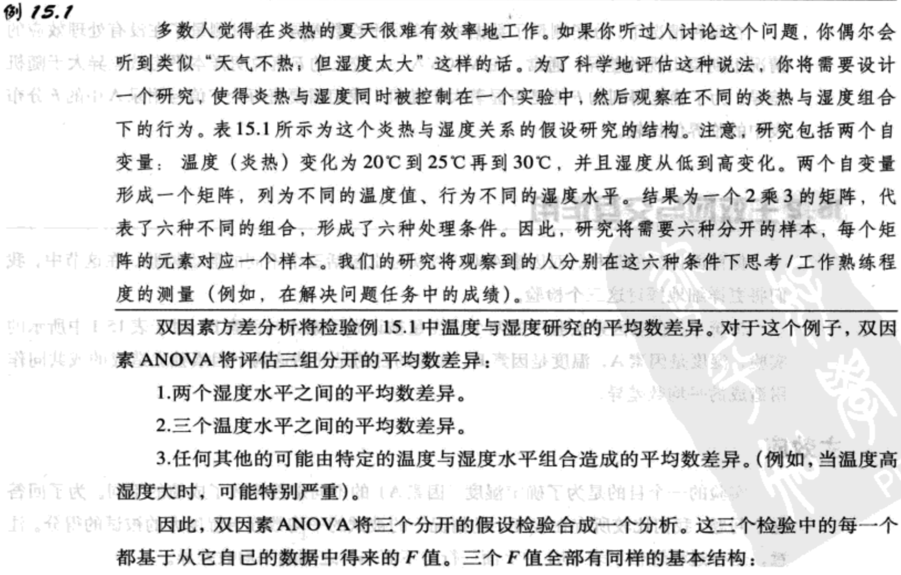
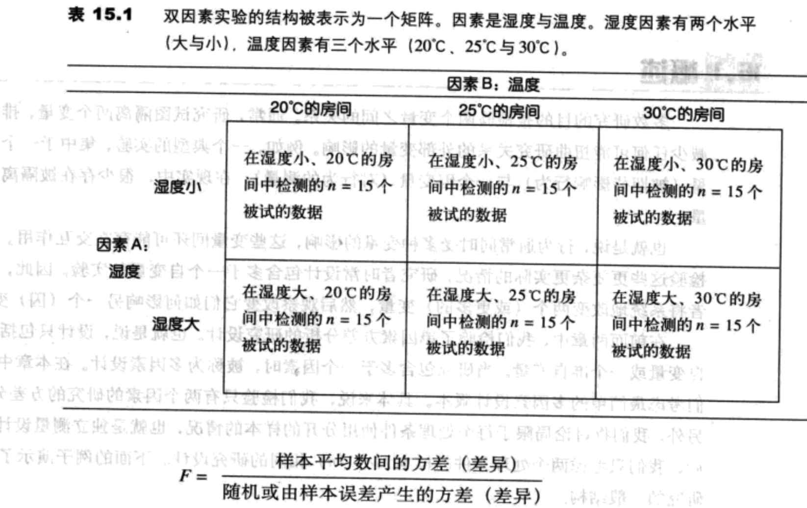

### 主效应与交互作用
#### 主效应
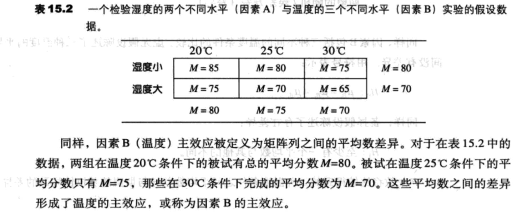

一个因素的不同水平之间的平均数差异被称为这个因素的`主效应`。当研究的设计被表现为一个矩阵时，一个因素决定行，另一个因素决定列。那么行与行之间的平均数差异描述了一个因素的主效应。列与列之间的平均数差异描述了另一个因素的主效应。

对于我们讨论的这个例子，因素A包括两个不同的湿度水平的比较。虚无假设将陈述在两个水平之间没有差异；也就是说，湿度没有影响成绩。用符号表示：

$H_0:\mu_{A_1}=\mu_{A_2}$

备择假设是湿度的两个不同水平产生了不同的效应：

$H_0:\mu_{A_1} \ne \mu_{A_2}$

为了评估这些假设，我们将计算比较了两个湿度水平之间的实际平均数差异与期望出现的随机性或样本误差的F分数。

    F=因素A的平均数之间的方差（差异） / 期望的随机/误差方差（差异）

    F=行的平均数之间的方差（差异） / 期望的随机/误差方差（差异）

同样，因素B包括三种不同的温度条件的比较。虚无假设陈述了三种温度的平均数之间没有差异。用符号表示：

$H_0:\mu_{B_1}=\mu_{B_2}=\mu_{B_3}$

同样，备择假设陈述了存在差异：

H1：至少有一个平均数与其他的不同。

F分数将比较得到的三种温度条件之间平均数差异与期望的随机性导致的差异。

    F=因素B的平均数之间的方差（差异） / 期望的随机/误差方差（差异）

    F=列的平均数之间的方差（差异） / 期望的随机/误差方差（差异）

#### 交互作用
两个因素间的`交互作用`发生在单个处理条件的平均数差异与总的因素的主效应不同时，当一个因素的效应依赖于另一个因素的不同水平时，那么在因素间存在交互作用。

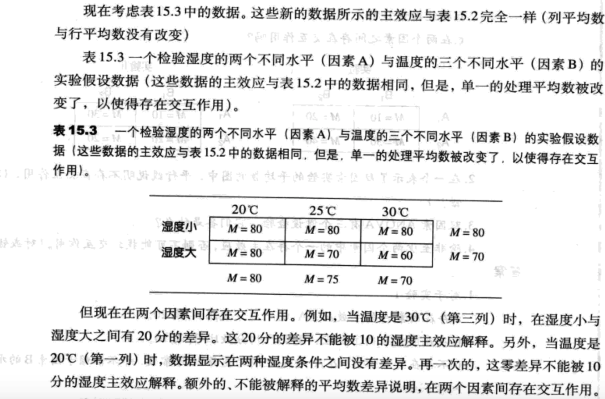

为了评估交互作用，双因素ANOVA首先需要识别不能被主效应解释的平均数差异。识别了额外的平均数差异后，这些差异被用下面的F分数评估：

    F=不能用主效应解释的方差（平均数差异） / 期望的随机/误差方差（差异）

这个F分数的虚无假设只是陈述了没有交互作用：

H0：在因素A和因素B之间没有交互作用。所有处理条件之间的平均数差异都可以被两个因素的主效应解释。

备择假设是在两个因素间存在交互作用：

H1：在两个因素存在交互作用。处理条件之间的平均数差异不能全部被两个因素的主效应解释。

### 符号与公式
双因素ANOVA由三个不同的假设检验组成：

1. 因素A的主效应（也称作A效应）。假定因素A被用于定义矩阵的行，因素A的主效应评估了行之间的平均数差异。
2. 因素B的主效应（也称作B效应）。假定因素B被用于定义矩阵的列，因素B的主效应评估了列之间的平均数差异。
3. 交互作用（也称作AxB交互作用）。交互作用评估了那些没有被总得因素A或因素B的主效应表示出来的处理平均数差异。

对于每个检验，我们要找出在处理间大于期望的随机性的平均数差异。在每种情况下，处理效应的大小将由F分数评估。这三个F分数有同样的基本结构：

    F=处理间方差（包括处理效应） / 期望的随机/误差方差（差异）（15.1）

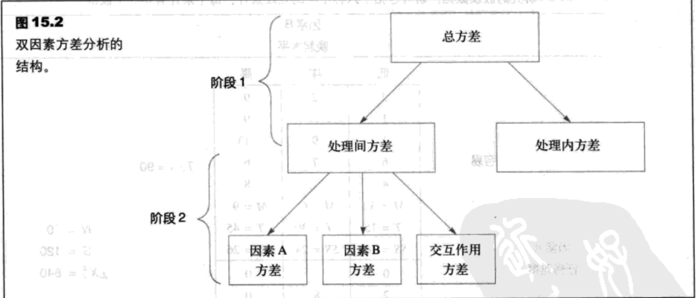

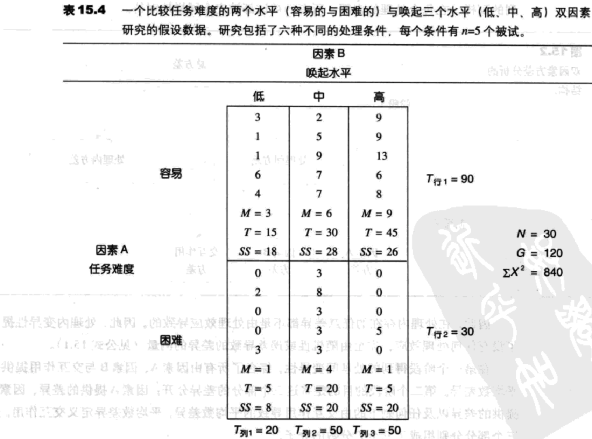
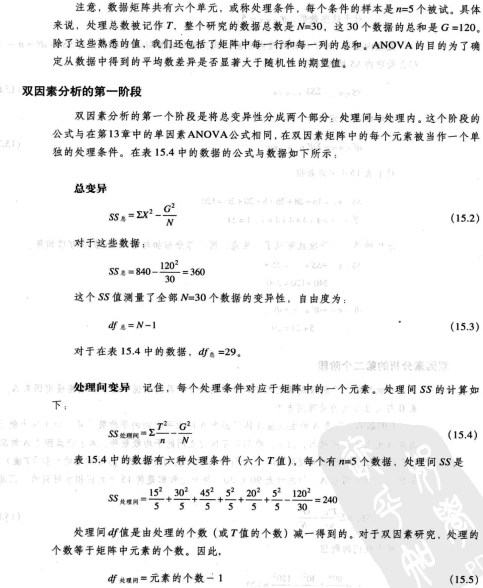
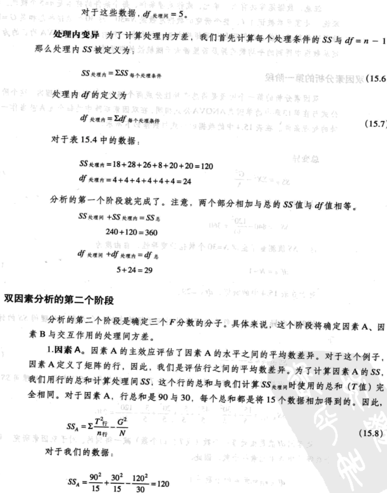

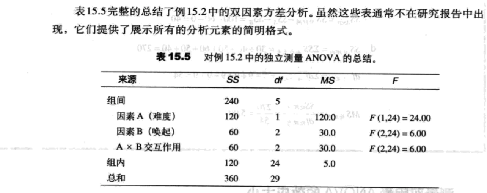

#### 测量双因素ANOVA的效应大小
在我们计算因素A的$\eta^2$前，我们需要先排除能用因素B与交互作用解释的差异性。得到的公式是：

对于因素A，$\eta^2=\frac{SS_A}{SS_{total}-SS_B-SS_{A \times B}}\ (15.14)$

注意，公式15.14的分母含有能用因素A解释的变异性和其他不能解释的变异性。因此，与此等价的一个公式是：

对于因素A，$\eta^2=\frac{SS_A}{SS_A+SS_{inner}}\ (15.15)$

同样，因素B和交互作用的$\eta^2$公式如下：

对于因素B，$\eta^2=\frac{SS_B}{SS_{total}-SS_A-SS_{A \times B}}=\frac{SS_B}{SS_B+SS_{inner}}\ (15.16)$

对于$A \times B$，$\eta^2=\frac{SS_{A \times B}}{SS_{total}-SS_A-SS_B}=\frac{SS_{A \times B}}{SS_{A \times B}+SS_{inner}}\ (15.17)$

由于每个$\eta^2$公式计算的百分率都不是基于分数的总变异性，这个结果通常被称作偏$\eta^2$。对于在例15.2中的数据，公式给出了下面的值：

因素A（难度）的$\eta^2=\frac{120}{360-60-60}=0.50$ （或50%）

因素B（唤起）的$\eta^2=\frac{60}{360-120-60}=0.33$ （或33%）

交互作用的$\eta^2=\frac{60}{360-120-60}=0.33$ （或33%）

### 解释双因素ANOVA的结果
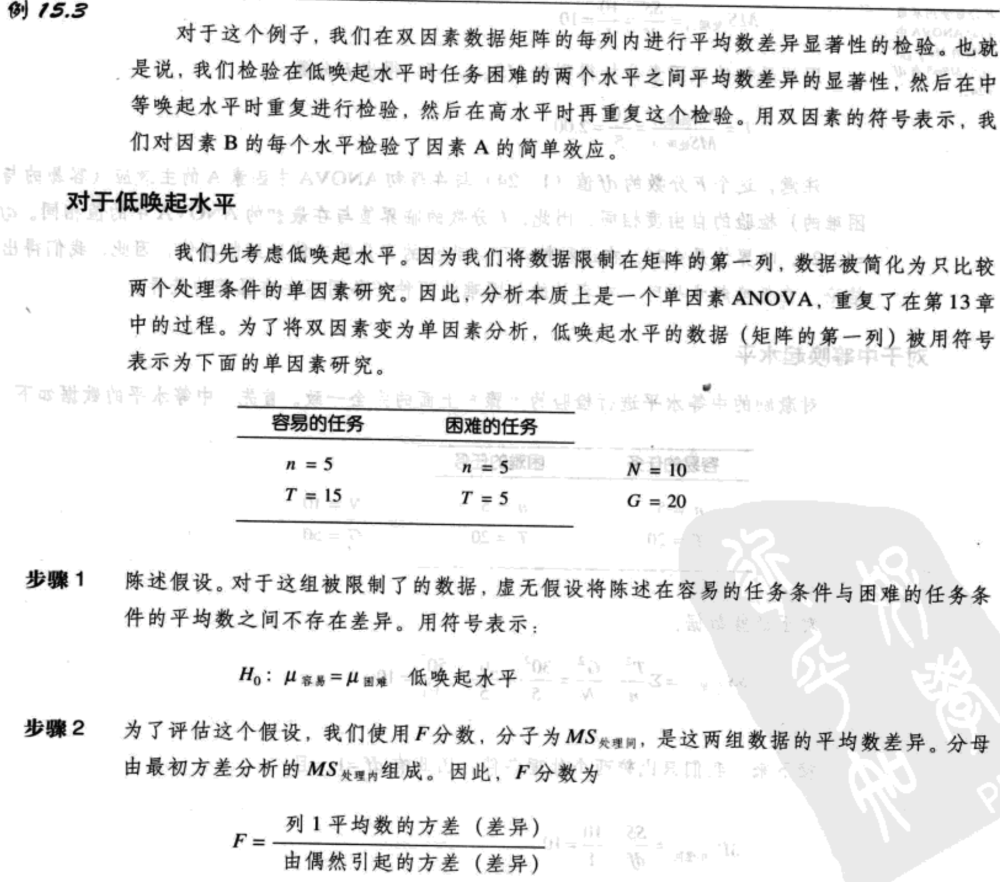
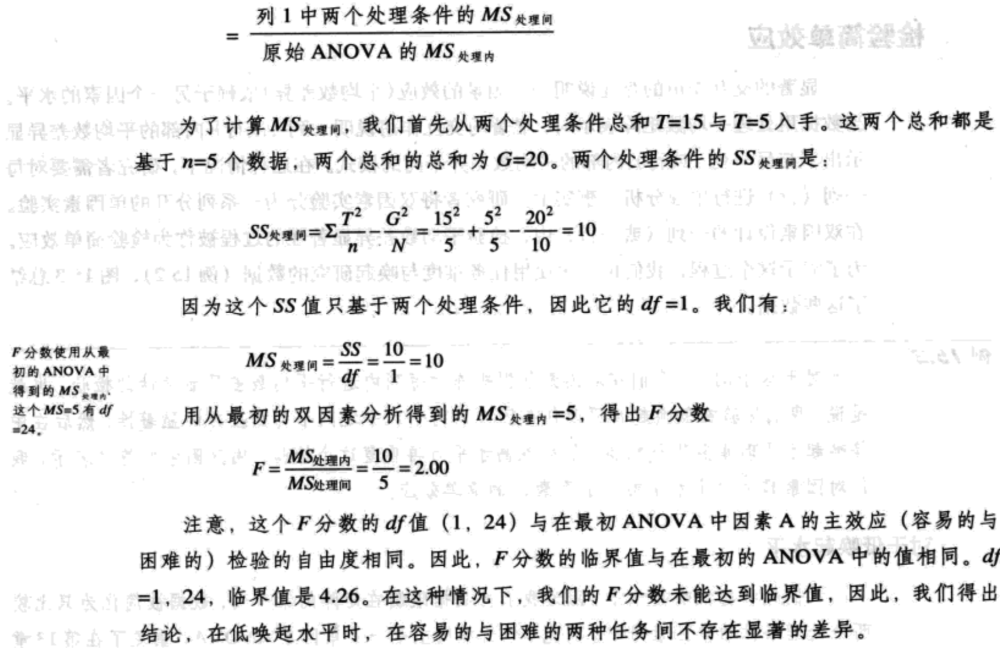
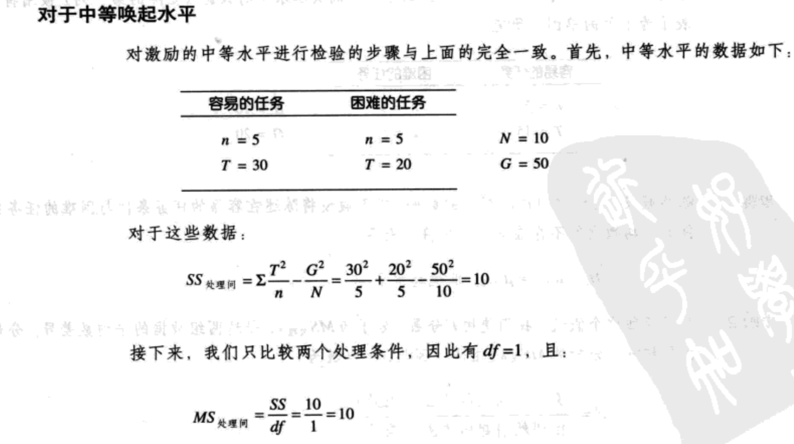
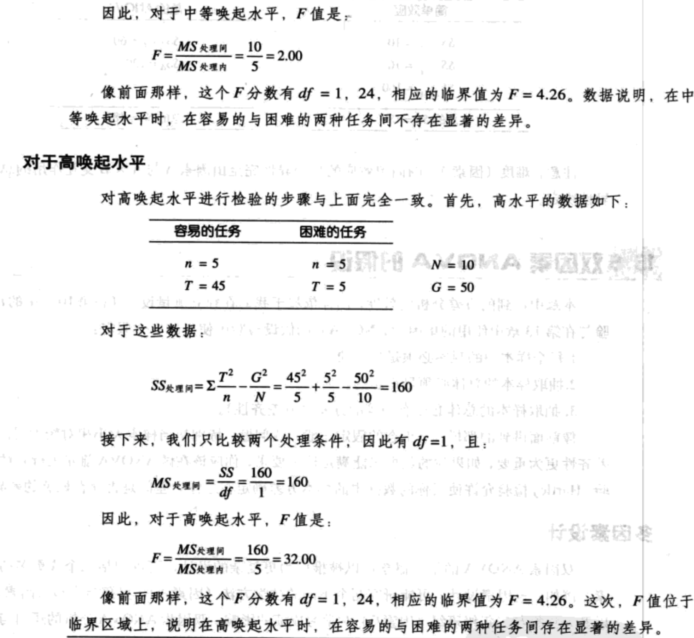

### 双因素ANOVA的假设
本章中讲到的方差分析的效应，同样依赖于我们在独立测量设计的假设检验中使用的三个假设：

1. 每个样本中的观察必须是独立的。
2. 抽取样本的总体必须是正态的。
3. 抽取样本的总体必须有相等的方差（方差齐性）。

#### 多因素设计
在三因素实验中，你将分别评估三个因素的主效应，并且你将评估一组两两交互的作用：$A \times B$，$B \times C$与$A \times C$。另外，额外的因素提供了存在三项交互作用的可能：$A \times B \times C$。