- [相关与非参数检验-顺序数据的统计方法](#%e7%9b%b8%e5%85%b3%e4%b8%8e%e9%9d%9e%e5%8f%82%e6%95%b0%e6%a3%80%e9%aa%8c-%e9%a1%ba%e5%ba%8f%e6%95%b0%e6%8d%ae%e7%9a%84%e7%bb%9f%e8%ae%a1%e6%96%b9%e6%b3%95)
  - [顺序量表的数据](#%e9%a1%ba%e5%ba%8f%e9%87%8f%e8%a1%a8%e7%9a%84%e6%95%b0%e6%8d%ae)
  - [Mann-Whitney检验 U检验：独立测量t检验的替代方法](#mann-whitney%e6%a3%80%e9%aa%8c-u%e6%a3%80%e9%aa%8c%e7%8b%ac%e7%ab%8b%e6%b5%8b%e9%87%8ft%e6%a3%80%e9%aa%8c%e7%9a%84%e6%9b%bf%e4%bb%a3%e6%96%b9%e6%b3%95)
    - [Mann-Whitney检验的虚无假设](#mann-whitney%e6%a3%80%e9%aa%8c%e7%9a%84%e8%99%9a%e6%97%a0%e5%81%87%e8%ae%be)
    - [Mann-Whitney U假设检验完整例子](#mann-whitney-u%e5%81%87%e8%ae%be%e6%a3%80%e9%aa%8c%e5%ae%8c%e6%95%b4%e4%be%8b%e5%ad%90)
    - [Mann-Whitney U的假设检验](#mann-whitney-u%e7%9a%84%e5%81%87%e8%ae%be%e6%a3%80%e9%aa%8c)
    - [Mann-Whitney U的正态近似](#mann-whitney-u%e7%9a%84%e6%ad%a3%e6%80%81%e8%bf%91%e4%bc%bc)
  - [Wilcoxon符号秩和检验：重复测量t检验的替代方法](#wilcoxon%e7%ac%a6%e5%8f%b7%e7%a7%a9%e5%92%8c%e6%a3%80%e9%aa%8c%e9%87%8d%e5%a4%8d%e6%b5%8b%e9%87%8ft%e6%a3%80%e9%aa%8c%e7%9a%84%e6%9b%bf%e4%bb%a3%e6%96%b9%e6%b3%95)
    - [Wilcoxon T假设检验完整例子](#wilcoxon-t%e5%81%87%e8%ae%be%e6%a3%80%e9%aa%8c%e5%ae%8c%e6%95%b4%e4%be%8b%e5%ad%90)
    - [Wilcoxon T检验的正态近似](#wilcoxon-t%e6%a3%80%e9%aa%8c%e7%9a%84%e6%ad%a3%e6%80%81%e8%bf%91%e4%bc%bc)
  - [Kruskal-Wallis检验：独立测量ANOVA的替代方法](#kruskal-wallis%e6%a3%80%e9%aa%8c%e7%8b%ac%e7%ab%8b%e6%b5%8b%e9%87%8fanova%e7%9a%84%e6%9b%bf%e4%bb%a3%e6%96%b9%e6%b3%95)
    - [Kruskal-Wallis检验的虚无假设](#kruskal-wallis%e6%a3%80%e9%aa%8c%e7%9a%84%e8%99%9a%e6%97%a0%e5%81%87%e8%ae%be)
    - [Kruskal-Wallis检验的公式与符号](#kruskal-wallis%e6%a3%80%e9%aa%8c%e7%9a%84%e5%85%ac%e5%bc%8f%e4%b8%8e%e7%ac%a6%e5%8f%b7)
  - [Fridman检验：重复测量ANOVA的替代方法](#fridman%e6%a3%80%e9%aa%8c%e9%87%8d%e5%a4%8d%e6%b5%8b%e9%87%8fanova%e7%9a%84%e6%9b%bf%e4%bb%a3%e6%96%b9%e6%b3%95)
    - [Fridman检验的虚无假设](#fridman%e6%a3%80%e9%aa%8c%e7%9a%84%e8%99%9a%e6%97%a0%e5%81%87%e8%ae%be)
    - [Fridman检验的符号与计算](#fridman%e6%a3%80%e9%aa%8c%e7%9a%84%e7%ac%a6%e5%8f%b7%e4%b8%8e%e8%ae%a1%e7%ae%97)

## 相关与非参数检验-顺序数据的统计方法
### 顺序量表的数据
1. Mann-Whitney检验使用从两个不同样本中得到的数据来评估两种处理条件或两个总体之间的差异。 Mann-Whitney检验可以被看作是独立测量t检验的代替。
2. Wilcoxcon检验使用从重复测量设计中得到的数据来评估两种处理条件之间的差异。这个检验是重复测量t检验的代替。 
3.  Kruskal-Wallis检验使用从三个或更多不同的样本中得到的数据来评估在三个或更多处理条件（或总体）之间的差异。Kruskal-Wallis检验是单因素、独立测量方差分析的代替。
4.  Friedman检验使用从重复测量设计中得到的数据来比较在三个或更多的处理条件之间的差异。这个检验是重复测量方差分析的代替。

### Mann-Whitney检验 U检验：独立测量t检验的替代方法
两个处理之间的真实差异应该导致一个样本的数据普遍大于另一个样本的数据。如果将两个样本结合在一起，然后将所有数据按序排列在一条线上，那么一个样本中的数据应该集中在线的一端，另一个样本中的数据应该集中在另一端。

另一方面，如果处理间不存在差异，那么大小数据均匀混合，因为不存在一组数据系统地大于另一组数据的理由。这种情形如图20.1所示。

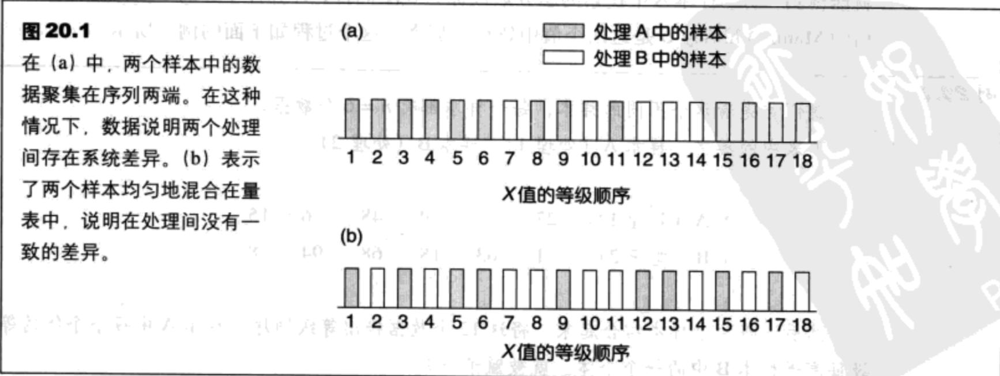

#### Mann-Whitney检验的虚无假设
H0：两个处理之间不存在差异。因此，不存在一个处理条件的数据等级系统地高于（或低于）另一个处理条件的等级的趋势。

H1：两个处理之间存在差异。因此，一个处理条件的数据等级系统地高于（或低于）另一个处理条件的等级。

#### Mann-Whitney U假设检验完整例子
对于样本A：

$U_A=n_An_B+\frac{n_A(n_A+1)}{2}-\sum R_A\ (20.2)$

对于样本B：

$U_B=n_An_B+\frac{n_B(n_B+1)}{2}-\sum R_B\ (20.3)$

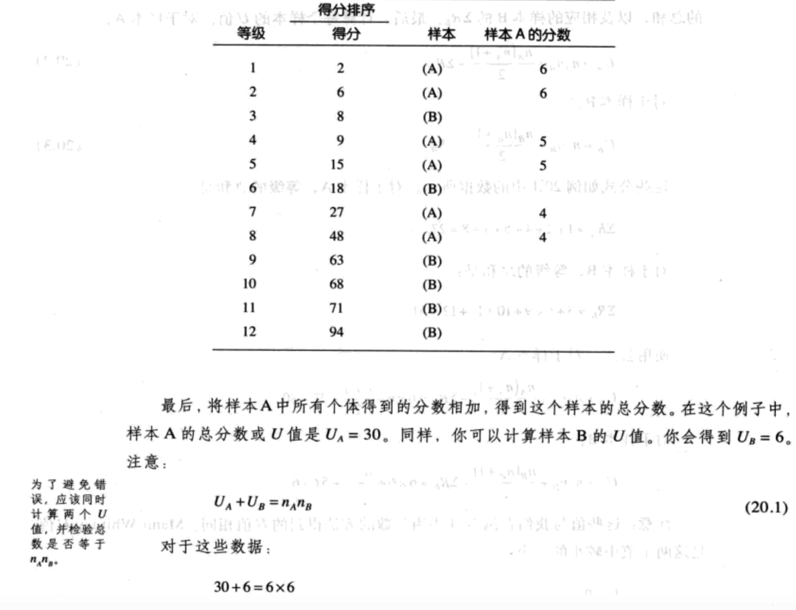

#### Mann-Whitney U的假设检验
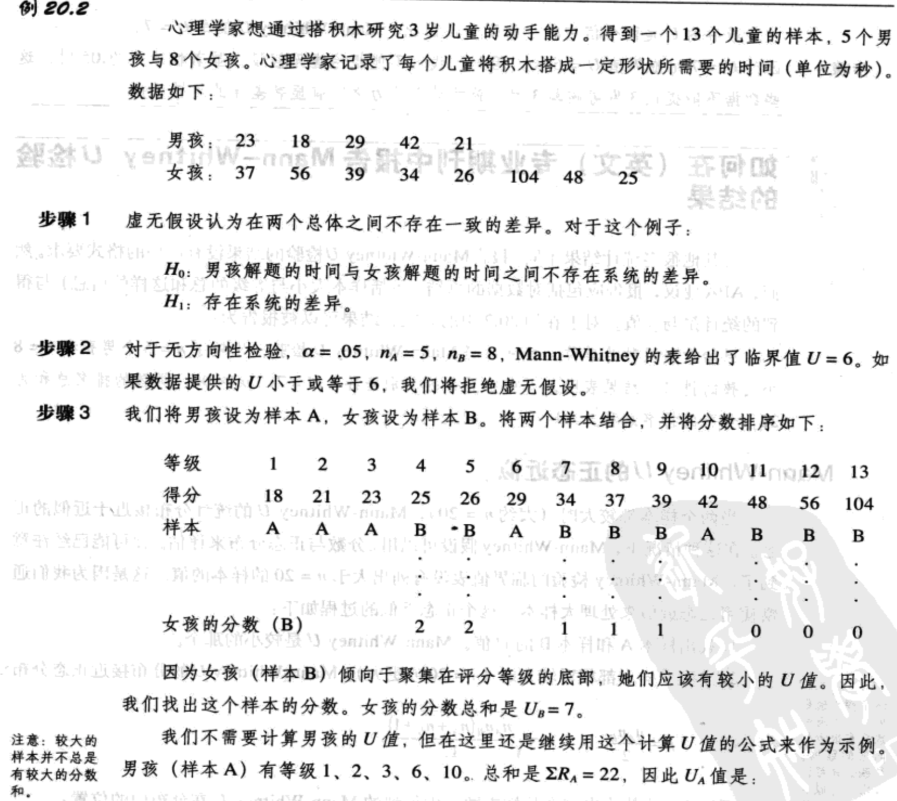
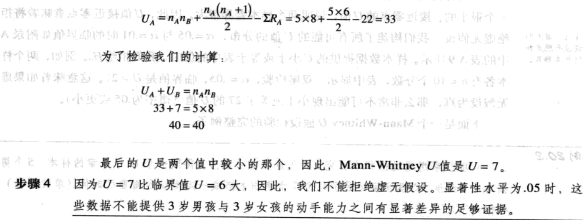

#### Mann-Whitney U的正态近似
当两个样本都较大时（大约n=20），Mann-Whitney U的统计分布接近于近似的正态。在这种情况下，Mann-Whitney假设可以用z分数与正态分布来评估。你可能已经注意到了，Mann-Whitney检验的临界值表没有列出大于n=20的样本的值。这是因为我们通常使用正态近似来处理大样本。这个正态近似的过程如下：

1. 找出样本A和样本B的U值。Mann-Whitney U是较小的那个。
2. 当两个样本都相对较大时（n=20或更大），Mann-Whitney U的分布接近正态分布

$\mu=\frac{n_A n_B}{2}\ \sigma=\sqrt{\frac{n_A n_B(n_A+n_B+1)}{12}}$

可以用z分数找出这个从样本数据中得到的Mann-Whitney U在分布中的位置：  

$z=\frac{X-\mu}{\sigma}=\frac{U-\frac{n_A n_B}{2}}{\sqrt{\frac{n_A n_B(n_A+n_B+1)}{12}}}\ (20.4)$

3. 使用正态分布表建立z分数的临界区域。例如，$\alpha=.05$，临界值是$\pm 1.96$。 下面是一个Mann-Whitney U的正态近似的例子。

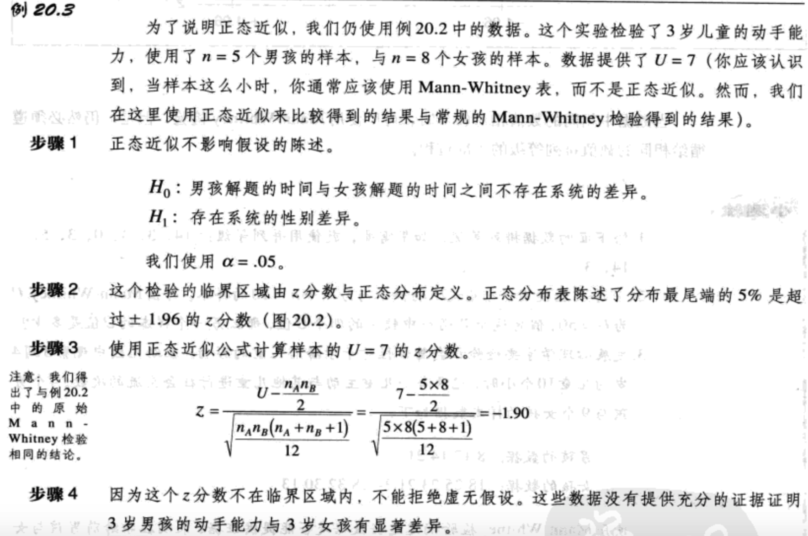

### Wilcoxon符号秩和检验：重复测量t检验的替代方法
Wilcoxon检验用重复测量实验中得到的数据来评估两个处理之间的差异。回想一下，重复测量研究只涉及一个样本，样本中的每个个体都被测量两次：一次在第一个处理的时候；另一次在第二个处理的时候。计算每个个体的两个数据之间的差异，得到差异分数的样本。Wilcoxon检验的数据由重复测量设计中的差异分数组成。检验要求将这些差异按照绝对值从小到大（不考虑符号方法）。这个过程如下面的例子演示。

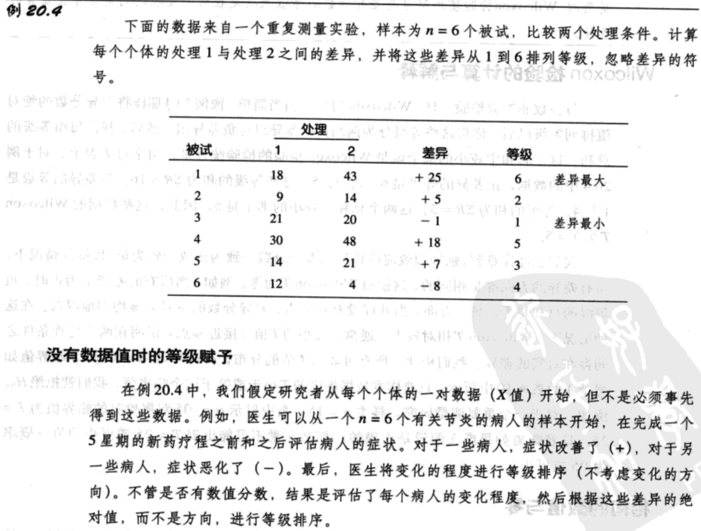
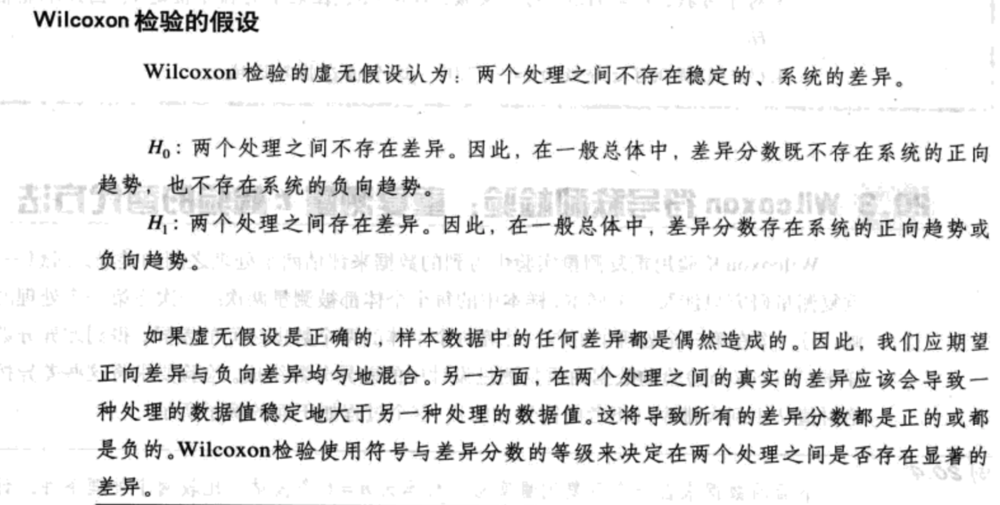

#### Wilcoxon T假设检验完整例子
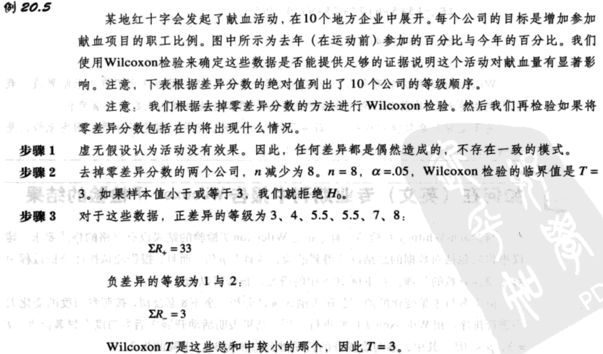
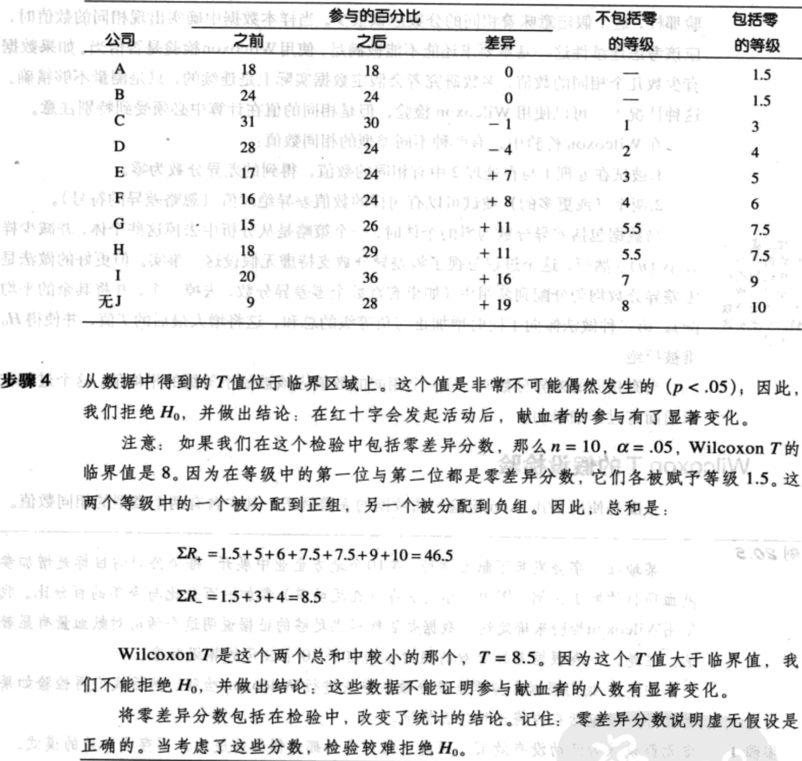

#### Wilcoxon T检验的正态近似
当样本相对较大时，Wilcoxon T值接近正态分布。在这种情况下，就可以使用z分数统计与正态分布来做检验，而不是在Wilcoxon表中查找T值。当样本大小大于20时，正态近似的结果变得非常精确。Wilcoxon表通常不提供大于n=50的样本临界值，因此必须使用正态近似。Wilcoxon T的正态近似的过程如下：

1. 找出正等级与负等级的总和。Wilcoxon T是较小的那个。
2. 如果n大于20，Wilcoxon T值形成正态近似分布，平均数为：$\mu=\frac{n(n+1)}{4}$，标准差为$\sigma=\sqrt{\frac{n(n+1)(2n+1)}{24}}$  
3. 从样本数据中得到的Wilcoxon T在这个分布上相应的z分数为$z=\frac{T-\mu}{\sigma}=\frac{T-\frac{n(n+1)}{4}}{\sqrt{\frac{n(n+1)(2n+1)}{24}}}\ (20.5)$。用正态分布表确定z分数的临界区域。例如，$\alpha=.05$，临界值是$\pm 1.96$。

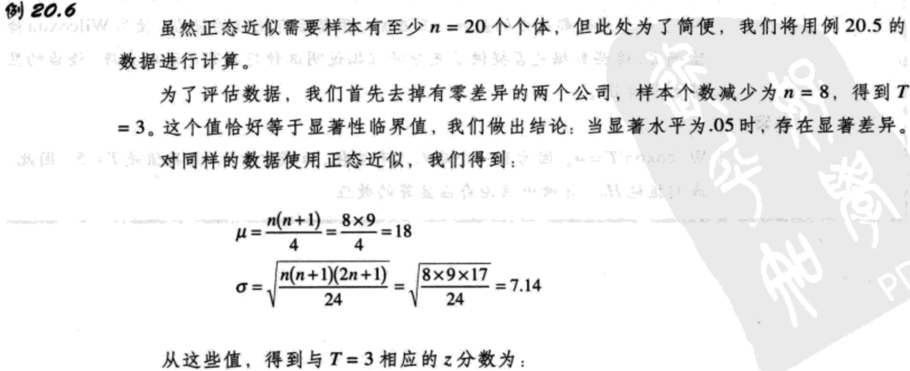
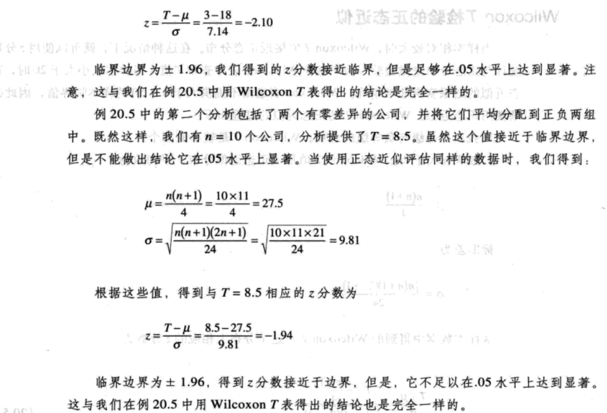

### Kruskal-Wallis检验：独立测量ANOVA的替代方法
Kruskal-Wallis检验用独立测量设计的数据评估三个或更多的处理条件（或总体）之间的差异。这个检验是单因素方差分析的代替。方差分析需要可以被用来计算平均数与方差的数值。而Kruskal-Wallis检验只要求将个体的测量结果按等级排序。你会发现Kruskal-Wallis检验与前面介绍的Mann-Whitney检验相似。然而，Mann-Whitney检验只能比较两个处理，而Kruskal-Wallis检验可以用于比较三个或更多的处理。

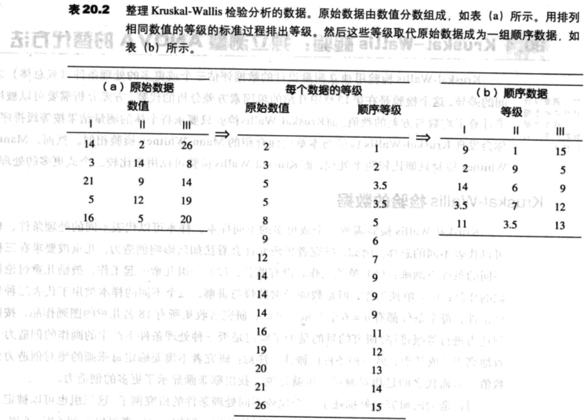

#### Kruskal-Wallis检验的虚无假设
与其他顺序数据的检验方法一样，Kruskal-Wallis检验的虚无假设的陈述不甚具体。通常，虚无假设表述为处理之间不存在差异。具体来说，H0认为不存在一个处理条件的等级系统地高于（或低于）其他处理条件的等级的趋势。通常，我们使用概念“系统的差异”来陈述H0与H1。因此，Kruskal-Wallis检验的假设为：

H0：不存在一个处理条件的等级系统地高于或低于其他处理条件的等级的趋势。在处理间不存在差异。

H1：一个处理条件的等级系统地高于或低于其他处理条件的等级。在处理间存在差异。

#### Kruskal-Wallis检验的公式与符号
1. 数据由三个（或更多）代表不同处理条件或不同总体的不同样本组成。
2. 将不同的样本结合，将整个组等级排序。
3. 个体被重新归入到原来的样本组，每个被试的分数是第二步中得到的顺序等级。

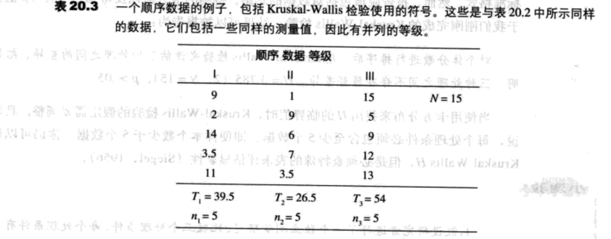

表20.3显示了一组顺序数据以及在Kruskal-Wallis公式中用到的符号。这些值是在例20.7中得到的等级。符号相对比较简单，并包括以下的值：

1. 将每个处理的等级相加，得到那个处理条件的等级总和或T值。T值将被用在Kruskal-Wallis公式中。
2. 每个处理条件的被试个数用小写字母n表示。
3. 整个研究的被试总个数用大写字母N表示。

Kruskal-Wallis公式提供的统计量通常被表示为H，它的分布大致与卡方分布相同，自由度定义为处理条件的个数减一。对于表20.3中的数据，有3个处理条件，因此df=2。Kruskal-Wallis统计的公式为：

$H=\frac{12}{N(N+1)}(\sum\frac{T^2}{n})-3(N+1)\ (20.6)$

用表20.3中的数据，Kruskal-Wallis公式得出卡方的值：

$H=\frac{12}{15 \times 16}(\frac{39.5^2}{5}+\frac{26.5^2}{5}+\frac{54^2}{5})-3 \times 16=3.785$

df=2，卡方分布表列出了临界值为5.99，$\alpha=.05$。因为得出的卡方值（3.875）小于临界值，我们的统计判定是不能拒绝H0。数据不能提供充分的证据表明在三种处理之间存在显著差异。

### Fridman检验：重复测量ANOVA的替代方法
Friedman检验使用重复测量设计中得到的数据，评估三个或更多的处理条件之间的差异。这个检验是重复测量方差分析的代替。然而，方差分析需要可以用于计算平均数与方差的数值分数。而Friedman检验只需要你能够对个体变量进行等级排序。Friedman检验与Wilcoxon检验相似。然而，Wilcoxon检验只限于比较两个处理，而Friedman检验被用于比较三个或更多的处理。

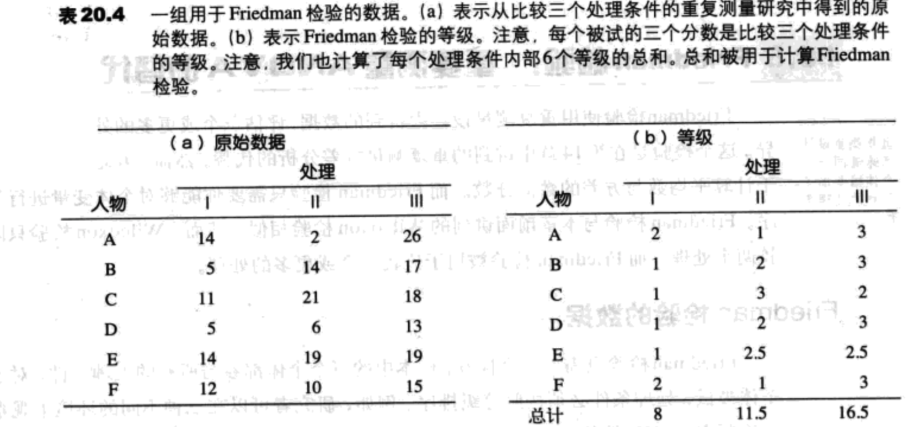

#### Fridman检验的虚无假设
H0：在处理之间不存在差异。因此，一个处理条件的等级不应该系统地大于或小于其他处理条件的等级。

H1：在处理之间存在差异。因此，至少有一个处理条件的等级系统地大于或小于其他处理条件的等级。

#### Fridman检验的符号与计算
每个处理的等级的总和用符号R表示，数字下标可以被用来表示不同的处理条件。例如，在表20.4（b）中，处理I的等级总和为R1=8，处理II有R2=11.5，处理III有R3=16.5。

Fridman检验的其他符号包括符号n和k，分别表示样本中个体的个数以及处理条件的个数。对于表20.4（b）中的数据，n=6，k=3。 Fridman检验通过计算下面的检验统计量，评估处理之间的差异：

$\chi^2_r=\frac{12}{nk(k+1)}\sum R^2-3n(k+1)\ (20.7)$

自由度为k-1。

用表20.4（b）中的数据，统计量为：

$\chi^2_r=\frac{12}{6 \times 3 \times 4}(8^2+11.5^2+16.5^2)-3 \times 6 \times 4=6.08$

df=k-1=2，卡方的临界值是5.99。因此拒绝虚无假设，并做出结论：三个处理之间存在显著的差异。