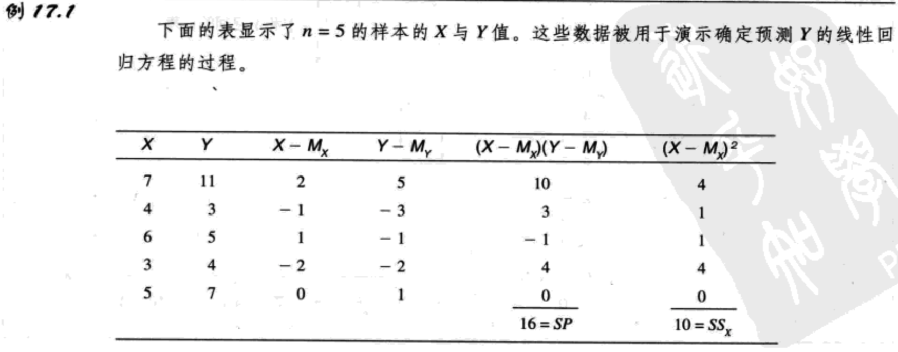
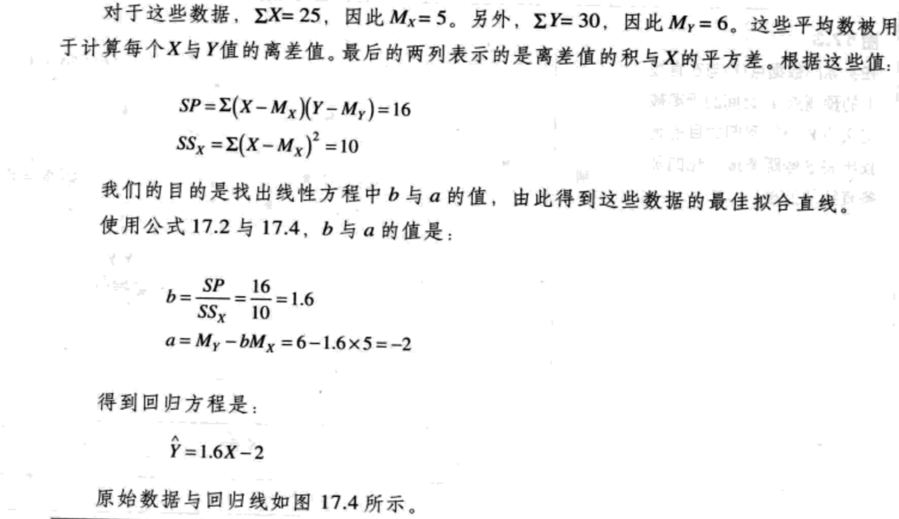
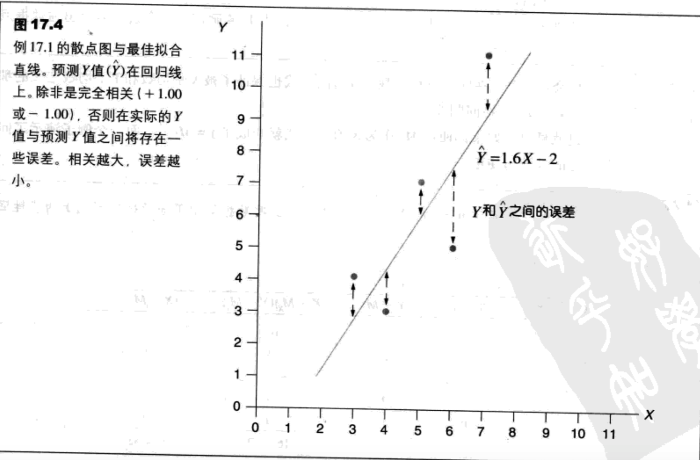
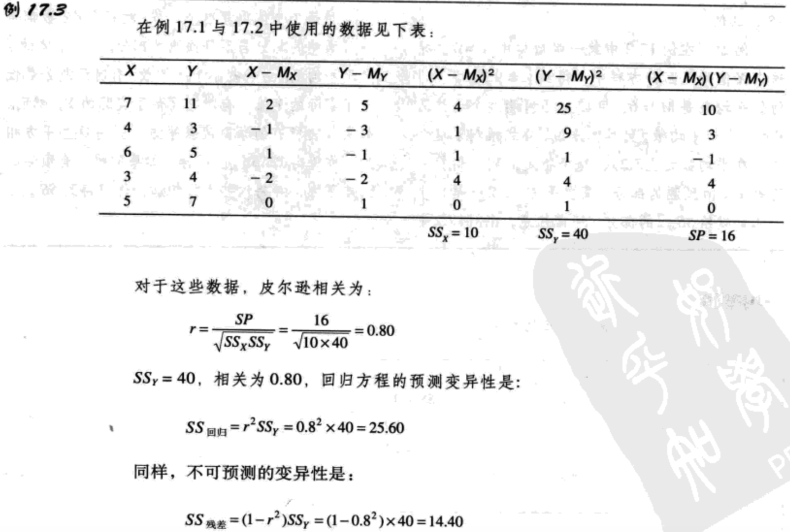
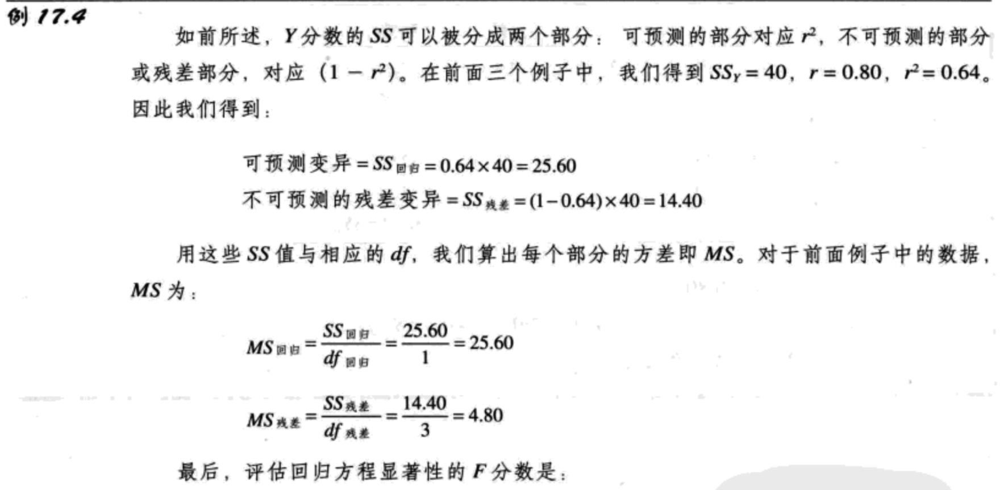
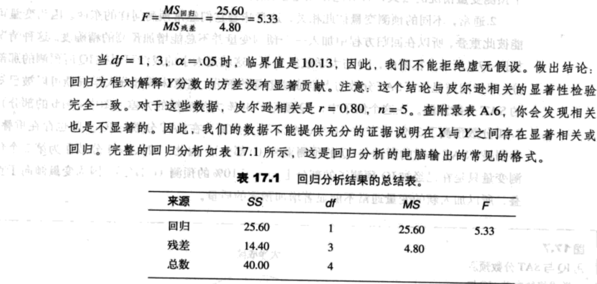
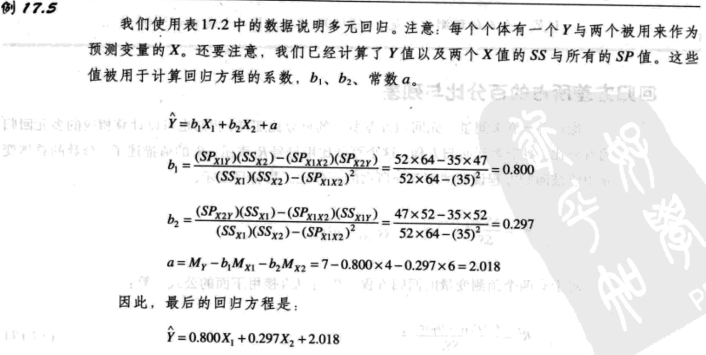
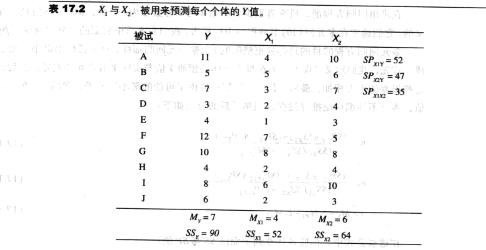

- [相关与非参数检验-回归](#%e7%9b%b8%e5%85%b3%e4%b8%8e%e9%9d%9e%e5%8f%82%e6%95%b0%e6%a3%80%e9%aa%8c-%e5%9b%9e%e5%bd%92)
  - [线性方程与回归](#%e7%ba%bf%e6%80%a7%e6%96%b9%e7%a8%8b%e4%b8%8e%e5%9b%9e%e5%bd%92)
    - [线性方程](#%e7%ba%bf%e6%80%a7%e6%96%b9%e7%a8%8b)
    - [最小二乘](#%e6%9c%80%e5%b0%8f%e4%ba%8c%e4%b9%98)
    - [标准化回归方程](#%e6%a0%87%e5%87%86%e5%8c%96%e5%9b%9e%e5%bd%92%e6%96%b9%e7%a8%8b)
    - [估计的标准误](#%e4%bc%b0%e8%ae%a1%e7%9a%84%e6%a0%87%e5%87%86%e8%af%af)
    - [标准误与相关的关系](#%e6%a0%87%e5%87%86%e8%af%af%e4%b8%8e%e7%9b%b8%e5%85%b3%e7%9a%84%e5%85%b3%e7%b3%bb)
  - [回归方程的显著性检验：回归分析](#%e5%9b%9e%e5%bd%92%e6%96%b9%e7%a8%8b%e7%9a%84%e6%98%be%e8%91%97%e6%80%a7%e6%a3%80%e9%aa%8c%e5%9b%9e%e5%bd%92%e5%88%86%e6%9e%90)
  - [有两个预测变量的多元回归](#%e6%9c%89%e4%b8%a4%e4%b8%aa%e9%a2%84%e6%b5%8b%e5%8f%98%e9%87%8f%e7%9a%84%e5%a4%9a%e5%85%83%e5%9b%9e%e5%bd%92)
    - [两个预测变量的回归方程](#%e4%b8%a4%e4%b8%aa%e9%a2%84%e6%b5%8b%e5%8f%98%e9%87%8f%e7%9a%84%e5%9b%9e%e5%bd%92%e6%96%b9%e7%a8%8b)
    - [回归方差所占的百分比与残差](#%e5%9b%9e%e5%bd%92%e6%96%b9%e5%b7%ae%e6%89%80%e5%8d%a0%e7%9a%84%e7%99%be%e5%88%86%e6%af%94%e4%b8%8e%e6%ae%8b%e5%b7%ae)
    - [根据残差计算$R^2$与$1-R^2$](#%e6%a0%b9%e6%8d%ae%e6%ae%8b%e5%b7%ae%e8%ae%a1%e7%ae%97r2%e4%b8%8e1-r2)
    - [估计的标准误](#%e4%bc%b0%e8%ae%a1%e7%9a%84%e6%a0%87%e5%87%86%e8%af%af-1)
    - [多元回归方程的显著性检验：回归分析](#%e5%a4%9a%e5%85%83%e5%9b%9e%e5%bd%92%e6%96%b9%e7%a8%8b%e7%9a%84%e6%98%be%e8%91%97%e6%80%a7%e6%a3%80%e9%aa%8c%e5%9b%9e%e5%bd%92%e5%88%86%e6%9e%90)

## 相关与非参数检验-回归
### 线性方程与回归
用于找出一组数据的最佳拟合直线的统计技术被称为`回归`，作为结果的直线被称为回归线。

#### 线性方程
通常，在两个变量X与Y之间的线性关系，可以被表示为公式：$Y=bX+a\ (17.1)$，a与b是固定的常数。

#### 最小二乘
为了确定线与数据点的拟合度，第一步是定义线与每个数据点之间的算术距离。对于数据中的每个X值，线性方程将在线上确定Y值。这个值是预测的Y值，被称为$\hat{Y}$。在这个预测值与数据的实际Y值之间的距离为：

距离值=$Y-\hat{Y}$

误差平方和=$\sum(Y-\hat{Y})^2$

现在我们可以将最佳拟合线定义为误差平方和最小的那条线。相应的方法被称为`最小二乘法`。

用符号表示，线性方程的形式为：$\hat{Y}=bX+a$

$b=\frac{SP}{SS_X}\ (17.2)$，其中SP是积和，$SS_X$是X的平方和。

另一个经常使用的斜率公式是基于X和Y的标准差。这个公式是：$b=r\frac{S_Y}{S_X}\ (17.3)$

其中$S_Y$是Y分数的标准差，$S_X$是X分数的标准差。公式中参数a的值为：$a=M_Y-bM_X\ (17.4)$

`Y的回归方程`是线性方程$\hat{Y}=bX+a\ (17.5)$。其中常数b由公式17.2或17.3确定，常数a由公式17.4确定。这个公式能得出在数据点与直线之间的最小的平方误差。

#### 标准化回归方程
迄今为止，我们讲过了原始数据的回归方程，然而，研究者偶尔也会在找出回归方程之前将X与Y标准化为z分数。这样，得到的公式通常被称为`标准化回归方程`，与原始分数版本相比，它的形式大大被简化了。因为z分数是标准化的。具体来说，一组z分数的平均数总是0，标准差总是1。因此，标准化回归方程变成了：

$\hat{z}_Y=\beta z_X\ (17.6)$

首先注意，我们现在用每个X值的z分数来预测相应的Y值的z分数。另外，注意，斜率常数在原始分数公式中用b表示，现在则用$\beta$表示。因为两组z分数的平均数都是零，因此回归方程中的常数a消失了。最后，当变量X被用来预测变量Y时，$\beta$的值等于X与Y的皮尔逊相关。因此，标准回归方程也可以写成：

$\hat{z}_Y=r z_X\ (17.7)$

因为将原始分数变为z分数的过程往往繁琐，研究者通常用计算原始分数回归方程的版本（公式17.5）来代替标准化形式。

#### 估计的标准误
`估计的标准误`衡量了回归线与实际的数据点之间的标准距离。

为了计算估计的标准误，我们首先需要找出离差的平方和（SS）。离差即实际的Y（从数据中得到的）与预测$\bar{Y}$（从回归线上得到的）之间的距离。其平方和通常被称为SS残差。

SS残差=$\sum(Y-\bar{Y})^2\ (17.8)$

得到的SS值然后除以其自由度，得到了方差：

方差=$\frac{SS}{df}$

估计的标准误的自由度是df=n-2。自由度为n-2，而不是习惯的n-1，理由是我们现在只测量到一条线的离差，而不是到平均数的离差。我们必须知道SP才能找出回归线的斜率（公式中的b值）。而为了计算SP，你必须同时知道X与Y的平均数。找出这两个平均数对数据的变异性加上了两重限制，因此只有n-2的自由度（对SS残差df=n-2的一个更直观的解释是，恰好两个点确定一条直线。如果自由两个数据点，那么，它们总是能完美地与直线拟合，因此将不存在误差。只有当你有多于两个点时，才存在一些决定最佳拟合线的自由）。

计算估计的标准误的最后一步是计算方差的平方根，来得出标准距离。最好的公式是：

估计的标准误=$\sqrt{\frac{SS_{residual}}{df}}=\sqrt{\frac{\sum(Y-\hat{Y})^2}{n-2}}\ (17.9)$

#### 标准误与相关的关系
在第16章中，我们观察到相关的平方提供了对预测的精确性的测量：$r^2$是决定系数，因为它确定了Y的变异性中可以被XY关系解释的那部分的比例。

因为$r^2$测量了Y的变异性中可以被回归方程预测的那部分，我们可以使用$1-r^2$来测量没有预测的部分。因此：

预测变异性=$SS_{regression}=r^2SS_Y\ (17.10)$

不可预测的变异性=$SS_{residual}=(1-r^2)SS_Y\ (17.11)$

注意：当r=1.00时，预测是完美的，没有残差。当相关接近零点时，数据点远离回归线，残差变大。用公式17.11计算$SS_{regression}$，得到估计的标准误为：

估计的标准误=$\sqrt{\frac{SS_{regression}}{df}}=\sqrt{\frac{(1-r^2)SS_Y}{n-2}}$

### 回归方程的显著性检验：回归分析
两个MS值被定义为：
$MS_{regression}=\frac{SS_{regression}}{df_{regression}}(df=1)$

$MS_{residual}=\frac{SS_{residual}}{df_{residual}}(df=1)$

F分数：

$F=\frac{MS_{regression}}{MS_{residual}}(df=1,n-2)\ (17.12)$

SS与自由度的完整分析如图17.6所示。

### 有两个预测变量的多元回归
#### 两个预测变量的回归方程
我们将两个预测变量表示为$X_1$与$X_2$，试图预测的变量被表示为Y。那么，有两个预测变量的多元回归方程一般形式为：

$\hat{Y}=b_1X_1+b_2X_2+a\ (17.13)$

如果三个变量$X_1$、$X_2$与Y，全部被标准化为z分数，那么多元回归方程的标准化形式预测了每个Y值的分数。标准化形式是：

$\hat{z_Y}=\beta_1z_{X_1}+\beta_2z_{X_2}\ (17.14)$

多元回归方程的目的是得到更精确的$\hat{Y}$。像一元回归那样，这个目标由最小二乘法达成。首先，我们定义“误差”为每个个体的预测Y值与实际Y值的差异。然后，将这些误差的平方相加。最后，我们计算那些提供了可能得最小误差平方和的$b_1$、$b_2$与a的值。最后的公式如下：

$b_1=\frac{SP_{X1Y}SS_{X2}-SP_{X1X2}SP_{X2Y}}{SS_{X1}SS_{X2}-(SP_{X1X2})^2}\ (17.15)$

$b_2=\frac{SP_{X2Y}SS_{X1}-SP_{X1X2}SP_{X1Y}}{SS_{X1}SS_{X2}-(SP_{X1X2})^2}\ (17.16)$

$a=M_Y-b_1M_{X1}-b_2M_{X2}\ (17.17)$

- $SS_{X1}$是$X_1$的离差平方和
- $SS_{X2}$是$X_2$的离差平方和
- $SS_{X1Y}$是$X_1$与Y的离差积和
- $SS_{X2Y}$是$X_2$与Y的离差积和
- $SS_{X1X2}$是$X_1$与$X_2$的离差积和

#### 回归方差所占的百分比与残差
$R^2$的值描述了Y分数的总体变异中能被回归方程说明的那部分所占的百分比。用符号表示：

$R^2=\frac{SS_{regression}}{SS_Y}$ 或 $SS_{regression}=R^2SS_Y$

对于有两个预测变量的回归方程，$R^2$可以直接用下面的公式计算：

$R^2=\frac{b_1SP_{X1Y}+b_2SP_{X2Y}}{SS_Y}\ (17.18)$

对于表17.2中的数据，我们得到的值是：

$R^2=\frac{0.800 * 52 + 0.297 * 47}{90}=0.617$(或 61.7%)

#### 根据残差计算$R^2$与$1-R^2$
$R^2$的值也可以通过计算残差，然后计算残差平方和得到。也就是$SS_{residual}$，它测量了Y的变异中未被预测的那部分，等于$(1-R^2)SS_Y$。对于表17.2中的数据，我们首先使用多元回归方程来计算每个个体的$\hat{Y}$，找出残差并将之平方和过程如表17.3所示。

注意，残差平方和，即$SS_Y$中未被预测的那部分是34.44。这个值对应着38.3%的Y变异：

$\frac{SS_{residual}}{SS_Y}=\frac{34.44}{90}=0.383$（或38.3%）

因为不可预测的变异的那部分是1-$R^2$=38.3%，我们再一次做出结论可预测的部分是$R^2$=61.7%。

#### 估计的标准误
$MS_{residual}=\frac{SS_{residual}}{df}$

估计标准误=$\sqrt{MS_{residual}}$

#### 多元回归方程的显著性检验：回归分析
与一元公式一样，我们可以通过计算F分数来评估多元回归方程的显著性，F分数可以确定方程是否显著的预测了Y的方差的一部分。Y的总变异被分为两个部分：$SS_{regression}$与$SS_{residual}$。当有两个预测变量时，$SS_{regression}$的df=2，$SS_{residual}$的df=n-3。因此，F分数的两个MS值是：

$MS_{regression}=\frac{SS_{regression}}{2}\ (17.19)$

以及，

$MS_{residual}=\frac{SS_{residual}}{n-3}\ (17.20)$

表17.2中，n=10的数据有$R^2=0.617$（或61.7%），$SS_Y=90$。因此：

$SS_{regression}=R^2SS_Y=0.617 * 90 = 55.53$

$SS_{residual}=(1-R^2)SS_Y=0.383 * 90 = 34.47$

因此，

$MS_{regression}=\frac{55.53}{2}=27.77$

$MS_{residual}=\frac{34.47}{7}=4.92$

$F=\frac{MS_{regression}}{MS_{residual}}=\frac{27.77}{4.92}=5.64$

当df=2，7，$\alpha=.05$时，这个F分数达到显著，因此，我们可以得出结论回归方程对Y分数方差的贡献达到显著。回归分析的总结如下表所示。

来源 | SS | df | MS | F
---|----|----|----|--
回归 | 55.53 | 2 | 27.77 | 5.64
残差 | 34.47 | 7 | 4.92
总和 | 90.00 | 9
