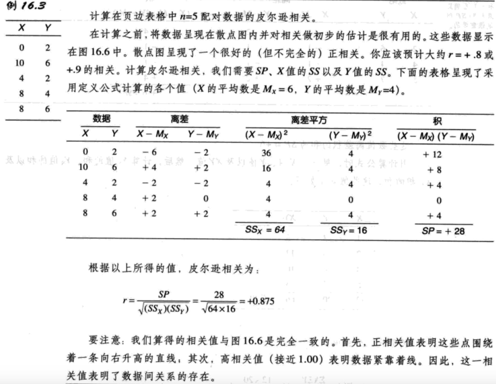
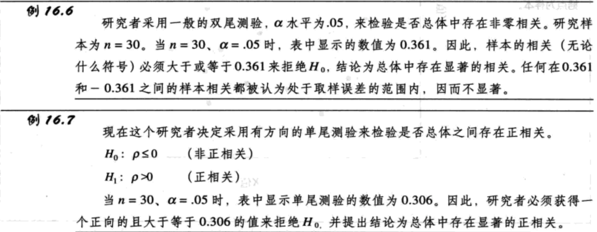
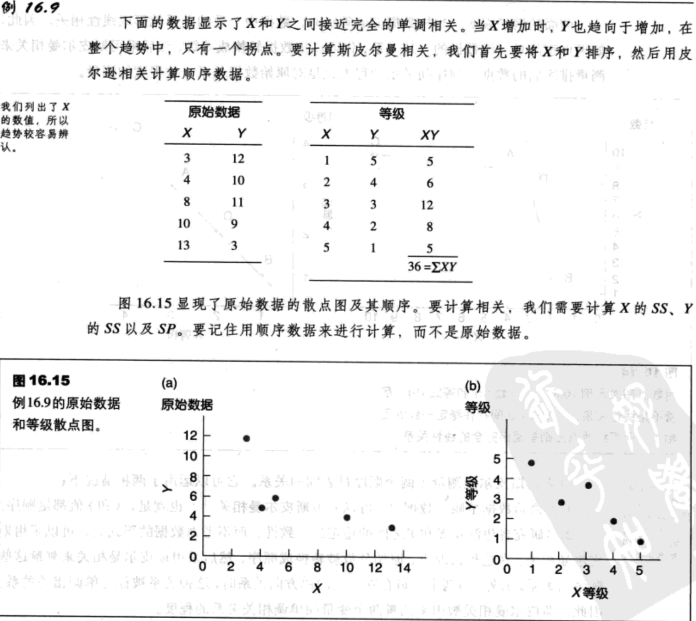
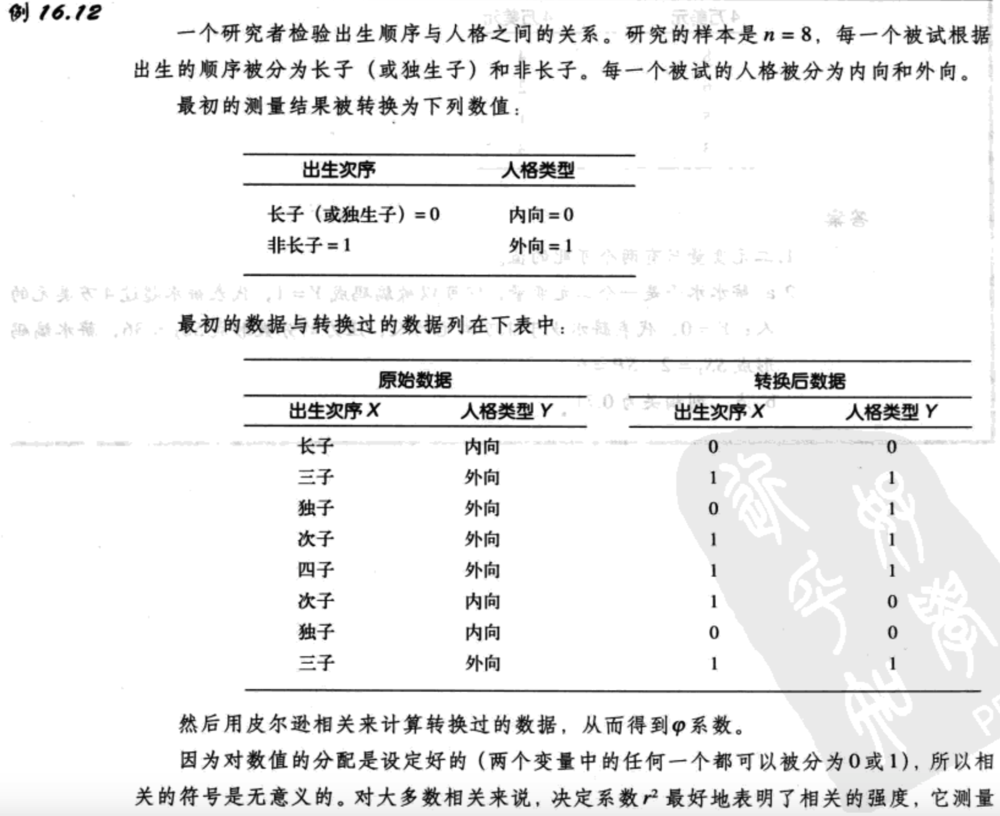

- [相关与非参数检验-相关](#%e7%9b%b8%e5%85%b3%e4%b8%8e%e9%9d%9e%e5%8f%82%e6%95%b0%e6%a3%80%e9%aa%8c-%e7%9b%b8%e5%85%b3)
  - [概述（关系的特点）](#%e6%a6%82%e8%bf%b0%e5%85%b3%e7%b3%bb%e7%9a%84%e7%89%b9%e7%82%b9)
  - [皮尔逊相关](#%e7%9a%ae%e5%b0%94%e9%80%8a%e7%9b%b8%e5%85%b3)
    - [比较SP与SS公式](#%e6%af%94%e8%be%83sp%e4%b8%8ess%e5%85%ac%e5%bc%8f)
    - [皮尔逊相关的计算](#%e7%9a%ae%e5%b0%94%e9%80%8a%e7%9b%b8%e5%85%b3%e7%9a%84%e8%ae%a1%e7%ae%97)
    - [皮尔逊相关与z分数](#%e7%9a%ae%e5%b0%94%e9%80%8a%e7%9b%b8%e5%85%b3%e4%b8%8ez%e5%88%86%e6%95%b0)
  - [理解和解释皮尔逊相关](#%e7%90%86%e8%a7%a3%e5%92%8c%e8%a7%a3%e9%87%8a%e7%9a%ae%e5%b0%94%e9%80%8a%e7%9b%b8%e5%85%b3)
  - [皮尔逊相关的假设检验](#%e7%9a%ae%e5%b0%94%e9%80%8a%e7%9b%b8%e5%85%b3%e7%9a%84%e5%81%87%e8%ae%be%e6%a3%80%e9%aa%8c)
    - [假设](#%e5%81%87%e8%ae%be)
    - [相关检验的自由度](#%e7%9b%b8%e5%85%b3%e6%a3%80%e9%aa%8c%e7%9a%84%e8%87%aa%e7%94%b1%e5%ba%a6)
    - [假设检验](#%e5%81%87%e8%ae%be%e6%a3%80%e9%aa%8c)
  - [斯皮尔曼相关](#%e6%96%af%e7%9a%ae%e5%b0%94%e6%9b%bc%e7%9b%b8%e5%85%b3)
    - [计算斯皮尔曼相关](#%e8%ae%a1%e7%ae%97%e6%96%af%e7%9a%ae%e5%b0%94%e6%9b%bc%e7%9b%b8%e5%85%b3)
    - [为相同的数据排序](#%e4%b8%ba%e7%9b%b8%e5%90%8c%e7%9a%84%e6%95%b0%e6%8d%ae%e6%8e%92%e5%ba%8f)
    - [斯皮尔曼的特殊公式](#%e6%96%af%e7%9a%ae%e5%b0%94%e6%9b%bc%e7%9a%84%e7%89%b9%e6%ae%8a%e5%85%ac%e5%bc%8f)
    - [斯皮尔曼相关的显著性检验](#%e6%96%af%e7%9a%ae%e5%b0%94%e6%9b%bc%e7%9b%b8%e5%85%b3%e7%9a%84%e6%98%be%e8%91%97%e6%80%a7%e6%a3%80%e9%aa%8c)
  - [其他关系的测量](#%e5%85%b6%e4%bb%96%e5%85%b3%e7%b3%bb%e7%9a%84%e6%b5%8b%e9%87%8f)
    - [点二列相关及用$r^2$衡量大小](#%e7%82%b9%e4%ba%8c%e5%88%97%e7%9b%b8%e5%85%b3%e5%8f%8a%e7%94%a8r2%e8%a1%a1%e9%87%8f%e5%a4%a7%e5%b0%8f)
    - [φ系数](#%cf%86%e7%b3%bb%e6%95%b0)

## 相关与非参数检验-相关
### 概述（关系的特点）
1. 关系的方向。正相关与负相关。
2. 关系的形式。线性或非线性。
3. 关系的程度。完全相关总是以1.00（或-1.00）加以表示，0相关表示完全不匹配。

### 皮尔逊相关
皮尔逊相关测量两个变量间线性关系的程度和方向。皮尔逊相关用r表示。在概念上，这个相关的计算方法是：

    r=X和Y共同变化的程度/X和Y单独变化的程度=X和Y的共变性/X和Y各自的变异性

离差积的和（SP）：$SP=\sum(X-M_X)(Y-M_Y)\ (16.1)$

- $M_X$是X值的平均值
- $M_Y$是Y值的平均值

计算公式：$SP=\sum XY-\frac{\sum X \sum Y}{n}\ (16.2)$

#### 比较SP与SS公式
对比第4章中SS定义公式：$SS=\sum(X-M)^2=\sum(X-M)(X-M)$

SS计算公式：$SS=\sum X^2-\frac{(\sum X^2)}{n}$

#### 皮尔逊相关的计算
皮尔逊相关包括了X和Y的共变性（分子）与X和Y各自的变异性（分母）之间的比率。在皮尔逊r公式中，我们用SP来测量X和Y的共变性。X和Y的变异性则用X和Y的SS来测量。根据这些定义，皮尔逊相关的公式为：$r=\frac{SP}{\sqrt{SS_XSS_Y}}\ (16.3)$

#### 皮尔逊相关与z分数
皮尔逊相关测量了一个个体在X分布上的位置与Y分布上的位置之间的关系。例如，正相关意味着在X上获得高分数个体在Y上也倾向获得高分数。同样，负相关意味着在X上分数高的个体倾向于获得在Y上得低分。

z分数提供了一个精确的方式来指出一个分数在分布中的位置。因为皮尔逊相关测量的是位置的关系，又因为z分数具体指明了位置，所以皮尔逊相关的公式可以用z分数表示：$r=\frac{\sum Z_XZ_Y}{n}\ (16.4)$

在这个公式中，$Z_X$是指每个个体在X分布上的位置，$Z_Y$是指Y分布上的位置。z分数的积（就像离差的积）决定了相关的强度和方向。

注：公式16.4采用z分数计算相关，其假设是你根据X和Y的总体标准差来获得z分数。如果你使用样本标准差（df=n-1），那么公式变成：$r=\frac{\sum Z_XZ_Y}{(n-1)}$

### 理解和解释皮尔逊相关
在采用相关的时候，还有其他几个因素需要考虑：

1. 相关只是描述了两个变量之间的关系，它没有解释为什么两个变量存在联系。特别是相关无法解释两个变量之间的因果关系。
2. 相关的值受数据所呈现的全距的影响。
3. 被称为奇异值的一个或两个极端数据对相关值有巨大的影响。
4. 在一个+.5相关是0到1.00之间的一半，因此呈现了一个中等的关系。但是，相关不能解释成比例。

$r^2$的值被称为`决定系数`。因为它测量了一个变量的变异中由另一个变量的变异而决定的概率。例如，一个相关为r=0.80（或-0.80）意味着Y变量中$r^2=0.64$（或64%）的变化是由其和X的关系决定的。

### 皮尔逊相关的假设检验
#### 假设

$H_0:\rho=0$

$H_1:\rho \neq 0$

假设检验的目的在于对下面的二者进行取舍：

1. 非零的样本相关是由偶然因素决定的。也就是说，总体没有相关，样本所得的值是因为样本取样误差的结果。这种情况用$H_0$表示。
2. 样本的非零相关精确地代表了总体真实的非零相关。这种情况用$H_1$表示。

#### 相关检验的自由度
皮尔逊相关的假设检验的自由度为df=n-2。对这个数值的一个直觉的解释就是一个样本中有n=2个数据点没有自由度。并且，当只有两个数据时，样本的相关一定是r=+1.00或r=-1.00的完全相关。例如，如果你从图16.12中选择任何两个数据，这两个点就会形成一条完全的直线。因此，只有当数据包含两个以上的点时，样本的相关才能自由地变化。所以，df=n-2。

#### 假设检验
我们可以用t检验或F检验来进行假设检验，但结果已总结并显示在附录A的表A.6中。这个表格是建立在如果总体的相关为零，样本的相关也应当为零的概念基础上。并且这个表格显示了当总体相关为0时，可能获得的样本相关的范围。

### 斯皮尔曼相关
斯皮尔曼相关的一致性来自于一个简单的观察事实：当两个变量一致相关，它们的数值等次就会是线性相关的。例如，一个完全一致的正相关表明，每当X变量增加，Y变量同样也增加。这时，X的最小值与Y的最小值相对应，X的次小值与Y的次小值相对应，以此类推。

总之，斯皮尔曼测量了两个顺序变量表间的关系。它可以运用于两种情况：

1. 当原始数据是顺序数据时，可以采用斯皮尔曼相关——也就是，X和Y都是顺序的。
2. 当研究者想测量X和Y之间的稳定的一致性，而不考虑数据的形式时，可以采用斯皮尔曼相关。在这种情况下，原始分数被转换成顺序，然后采用斯皮尔曼相关来测量这些顺序的关系。另外，当两个变量存在一致的单方向关系时，这种关系被称为单调相关关系。因此，斯皮尔曼相关被用来测量两个变量间单调相关关系的程度。

#### 计算斯皮尔曼相关

#### 为相同的数据排序
在用斯皮尔曼公式时要为数据排序，这由以下两个步骤完成：

1. 将所有的数据从小到大排列，把相同的数据都排列进去。
2. 按顺序为每一个数据排序（第一、第二）。
3. 当两个（或更多）数据相同时，计算这些数据顺序的平均数，然后将平均数作为最终的顺序分配到每个数值中。

#### 斯皮尔曼的特殊公式
$r_s=1-\frac{6\sum D^2}{n(n^2-1)}\ (16.5)$

其中D是每一个个体X的顺序和Y的顺序的不同。

#### 斯皮尔曼相关的显著性检验
在皮尔逊相关中，希腊字母$\rho$用来代表总体相关。$\rho_s$来代表总体参数。这个符号与样本统计量的$r_s$是一致的。虚无假设为总体的变量间不存在相关（没有单调关系），用符号表示为：

$H_0:\rho_s=0$（总体相关为0）

备择假设认为总体之间存在非零相关，用符号表示为：

$H_1:\rho_s \ne 0$（总体间存在相关）

### 其他关系的测量
#### 点二列相关及用$r^2$衡量大小
点二列相关被用于测量两个变量的相关，其中一个变量是一般的数值型变量，而另一个变量则只有两个值。只有两个值的变量被称为二元变量。二元变量的例子有：

1. 男性和女性
2. 大学生和非大学生
3. 一个任务的成功和失败

要计算点二列相关，二元变量必须转换成数据变量，将其中一类赋值为0，而另一类赋值为1。然后再使用一般的皮尔逊相关来计算转换后的数据。

在表16.3的右边，我们将数据整理为点二列相关的形式。我们用原始的记忆分数作为每个个体的X值，我们形成了一个新的变量，Y代表每个个体的处理情况。在这种情况下，我们采用Y=1代表在表象情况下的被试，Y=0代表没有在表象情况下的被试。

表16.3的数据最初呈现在第10章中时，我们采用了独立t检验，得r=4.00，df=18。我们通过计算$r^2$来测量处理的效应大小和所能解释的方差的比例，得$r^2=0.47$。

计算点二列相关同样得到r值，X值得到SS=680，Y得到SS=5.00，Y偏离积的和为SP=40。点二列相关为：

$r=\frac{SP}{\sqrt{SS_X \times SS_Y}}=\frac{40}{\sqrt{680 \times 5}}=0.686$

点二列相关的平方值为$r^2=(0.686)^2=0.47$，这个值恰恰是效应的大小。

#### φ系数
当从每个个体测量到的两个变量都是二元变量时，两个变量的相关就称为$\varphi$系数。对$\varphi$系数的计算要进行两个步骤：

1. 将每一个二元变量转换成数值变量。将每一个变量的一种类型定义为0，而另一个定义为1。
2. 采用常用的皮尔逊相关公式来计算转换后的数值。

