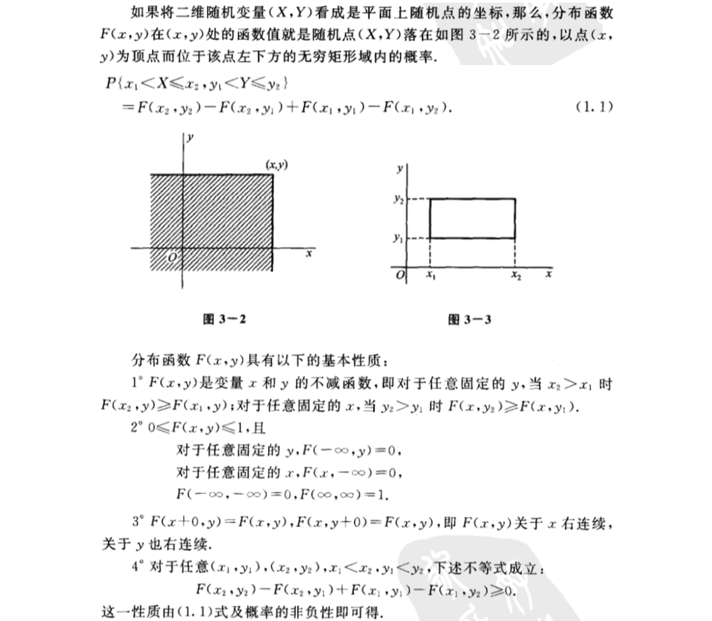
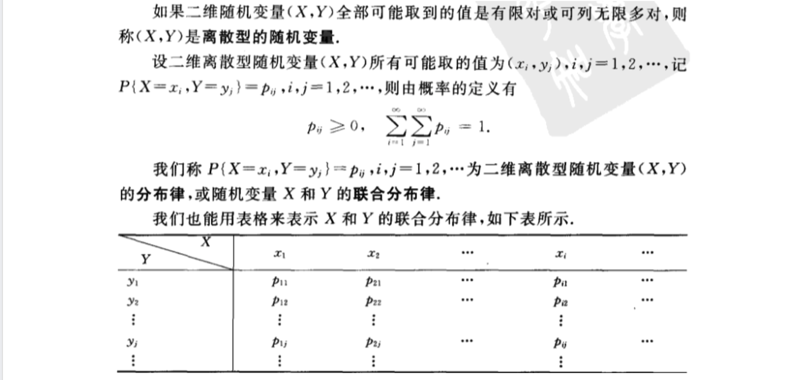
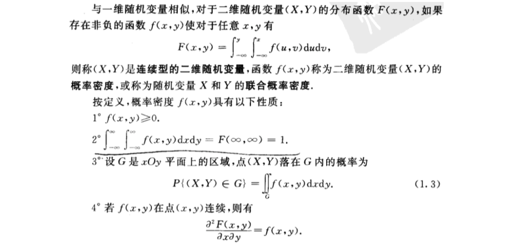
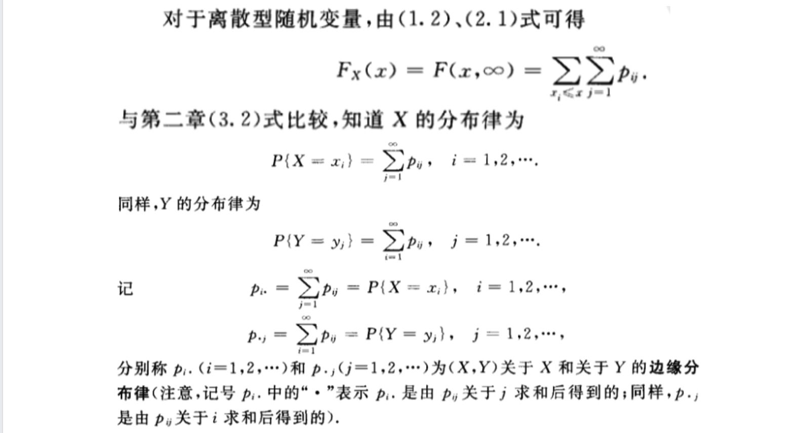
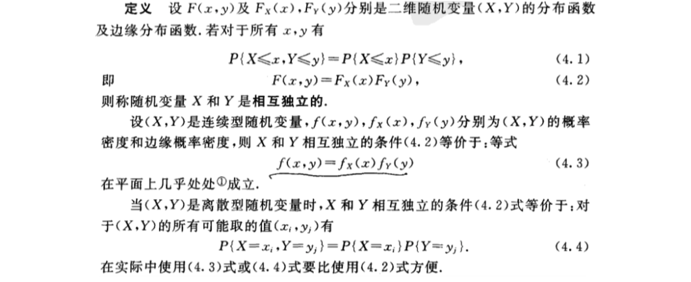
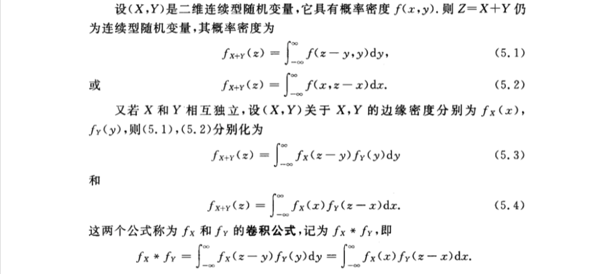
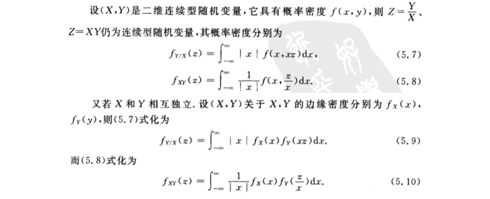
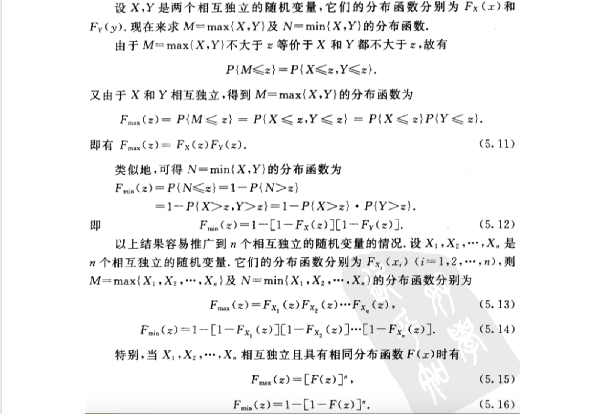

- [第三章 多维随机变量及其分布](#%e7%ac%ac%e4%b8%89%e7%ab%a0-%e5%a4%9a%e7%bb%b4%e9%9a%8f%e6%9c%ba%e5%8f%98%e9%87%8f%e5%8f%8a%e5%85%b6%e5%88%86%e5%b8%83)
  - [1 二维随机变量](#1-%e4%ba%8c%e7%bb%b4%e9%9a%8f%e6%9c%ba%e5%8f%98%e9%87%8f)
    - [离散型的二维随机变量](#%e7%a6%bb%e6%95%a3%e5%9e%8b%e7%9a%84%e4%ba%8c%e7%bb%b4%e9%9a%8f%e6%9c%ba%e5%8f%98%e9%87%8f)
    - [连续型的二维随机变量](#%e8%bf%9e%e7%bb%ad%e5%9e%8b%e7%9a%84%e4%ba%8c%e7%bb%b4%e9%9a%8f%e6%9c%ba%e5%8f%98%e9%87%8f)
  - [2 边缘分布](#2-%e8%be%b9%e7%bc%98%e5%88%86%e5%b8%83)
    - [离散型随机变量的边缘分布](#%e7%a6%bb%e6%95%a3%e5%9e%8b%e9%9a%8f%e6%9c%ba%e5%8f%98%e9%87%8f%e7%9a%84%e8%be%b9%e7%bc%98%e5%88%86%e5%b8%83)
    - [连续型随机变量的边缘分布](#%e8%bf%9e%e7%bb%ad%e5%9e%8b%e9%9a%8f%e6%9c%ba%e5%8f%98%e9%87%8f%e7%9a%84%e8%be%b9%e7%bc%98%e5%88%86%e5%b8%83)
  - [3 条件分布](#3-%e6%9d%a1%e4%bb%b6%e5%88%86%e5%b8%83)
    - [离散型随机变量的条件分布](#%e7%a6%bb%e6%95%a3%e5%9e%8b%e9%9a%8f%e6%9c%ba%e5%8f%98%e9%87%8f%e7%9a%84%e6%9d%a1%e4%bb%b6%e5%88%86%e5%b8%83)
    - [连续型随机变量的条件分布](#%e8%bf%9e%e7%bb%ad%e5%9e%8b%e9%9a%8f%e6%9c%ba%e5%8f%98%e9%87%8f%e7%9a%84%e6%9d%a1%e4%bb%b6%e5%88%86%e5%b8%83)
  - [4 相互独立的随机变量](#4-%e7%9b%b8%e4%ba%92%e7%8b%ac%e7%ab%8b%e7%9a%84%e9%9a%8f%e6%9c%ba%e5%8f%98%e9%87%8f)
    - [二维正态随机变量的独立性](#%e4%ba%8c%e7%bb%b4%e6%ad%a3%e6%80%81%e9%9a%8f%e6%9c%ba%e5%8f%98%e9%87%8f%e7%9a%84%e7%8b%ac%e7%ab%8b%e6%80%a7)
  - [5 两个随机变量的函数的分布](#5-%e4%b8%a4%e4%b8%aa%e9%9a%8f%e6%9c%ba%e5%8f%98%e9%87%8f%e7%9a%84%e5%87%bd%e6%95%b0%e7%9a%84%e5%88%86%e5%b8%83)
    - [（一）Z=X+Y的分布](#%e4%b8%80zxy%e7%9a%84%e5%88%86%e5%b8%83)
      - [卷积公式](#%e5%8d%b7%e7%a7%af%e5%85%ac%e5%bc%8f)
      - [正态随机变量的线性组合](#%e6%ad%a3%e6%80%81%e9%9a%8f%e6%9c%ba%e5%8f%98%e9%87%8f%e7%9a%84%e7%ba%bf%e6%80%a7%e7%bb%84%e5%90%88)
    - [（二）Z=X/Y的分布、Z=XY的分布](#%e4%ba%8czxy%e7%9a%84%e5%88%86%e5%b8%83zxy%e7%9a%84%e5%88%86%e5%b8%83)
    - [（三）M=max{X,Y}及N=min{X,Y}的分布](#%e4%b8%89mmaxxy%e5%8f%8anminxy%e7%9a%84%e5%88%86%e5%b8%83)

# 第三章 多维随机变量及其分布
## 1 二维随机变量
**定义** 设(X,Y)是二维随机变量，对于任意实数x，y，二元函数：

$F(x,y)=P\{(X \le x) \cap (Y \le y)\}$

记成 $P\{X \le x,Y \le y\}$

称为二维随机变量(X,Y)的`分布函数`，或称为随机变量X和Y的`联合分布函数`。

### 离散型的二维随机变量

### 连续型的二维随机变量

## 2 边缘分布

### 离散型随机变量的边缘分布

### 连续型随机变量的边缘分布

## 3 条件分布
### 离散型随机变量的条件分布

### 连续型随机变量的条件分布

## 4 相互独立的随机变量

### 二维正态随机变量的独立性

## 5 两个随机变量的函数的分布
### （一）Z=X+Y的分布
#### 卷积公式

#### 正态随机变量的线性组合

### （二）Z=X/Y的分布、Z=XY的分布

### （三）M=max{X,Y}及N=min{X,Y}的分布

