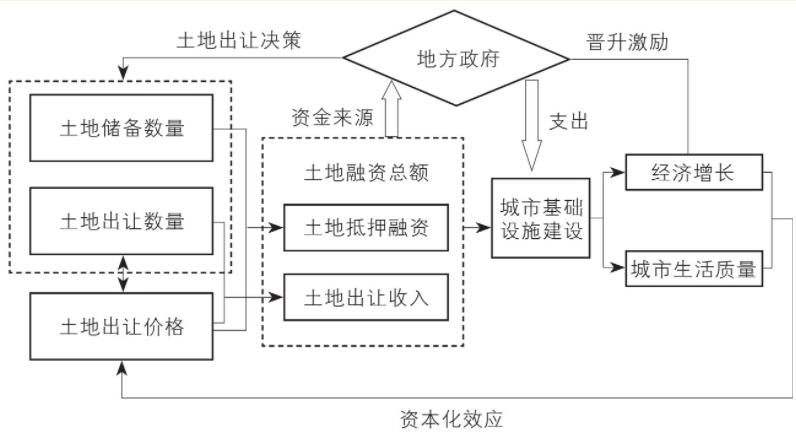
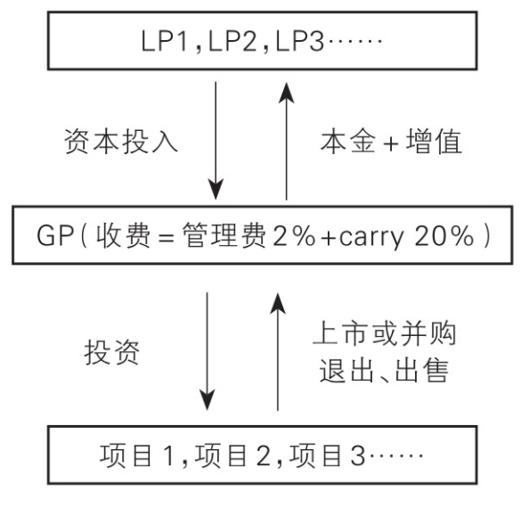

    作者: 兰小欢
    出版社: 上海人民出版社
    出品方: 世纪文景
    副标题: 中国政府与经济发展
    出版年: 2021-8
    页数: 340
    定价: 65.00元
    装帧: 平装
    ISBN: 9787208171336

[豆瓣链接](https://book.douban.com/subject/35546622/)

- [上篇 微观机制](#上篇-微观机制)
- [第一章 地方政府的权力与事务](#第一章-地方政府的权力与事务)
  - [第一节 政府治理的特点](#第一节-政府治理的特点)
  - [第二节 外部性与规模经济](#第二节-外部性与规模经济)
    - [公共物品和服务的边界](#公共物品和服务的边界)
    - [人口密度、地理与文化差异](#人口密度地理与文化差异)
    - [行政交界地区的经济发展](#行政交界地区的经济发展)
  - [第三节 复杂信息](#第三节-复杂信息)
    - [信息与权力](#信息与权力)
    - [信息获取与隐瞒](#信息获取与隐瞒)
  - [第四节 激励相容](#第四节-激励相容)
    - [垂直管理](#垂直管理)
    - [地方管理](#地方管理)
    - [小结：事权划分三大原则](#小结事权划分三大原则)
  - [第五节 招商引资](#第五节-招商引资)
- [第二章 财税与政府行为](#第二章-财税与政府行为)
  - [第一节 分税制改革](#第一节-分税制改革)
  - [第二节 土地财政](#第二节-土地财政)
    - [招商引资与税收](#招商引资与税收)
    - [初探土地财政](#初探土地财政)
    - [税收、地租与地方政府竞争](#税收地租与地方政府竞争)
  - [第三节 纵向不平衡与横向不平衡](#第三节-纵向不平衡与横向不平衡)
    - [基层财政困难](#基层财政困难)
    - [地区间不平等](#地区间不平等)
- [第三章 政府投融资与债务](#第三章-政府投融资与债务)
  - [第一节 城投公司与土地金融](#第一节-城投公司与土地金融)
    - [地方政府融资平台：从成都“宽窄巷子”说起](#地方政府融资平台从成都宽窄巷子说起)
    - [工业园区开发：苏州工业园区vs华夏幸福](#工业园区开发苏州工业园区vs华夏幸福)
  - [第二节 地方政府债务](#第二节-地方政府债务)
    - [为政府开发融资：国家开发银行与城投债](#为政府开发融资国家开发银行与城投债)
    - [地方债务与风险](#地方债务与风险)
    - [地方债的治理与改革](#地方债的治理与改革)
  - [第三节 招商引资中的地方官员](#第三节-招商引资中的地方官员)
    - [官员政绩与激励机制](#官员政绩与激励机制)
    - [腐败与反腐败](#腐败与反腐败)
- [第四章 工业化中的政府角色](#第四章-工业化中的政府角色)
  - [第一节 京东方与政府投资](#第一节-京东方与政府投资)
  - [第二节 光伏发展与政府补贴](#第二节-光伏发展与政府补贴)
  - [第三节 政府产业引导基金](#第三节-政府产业引导基金)
- [下篇 宏观现象](#下篇-宏观现象)
- [第五章 城市化与不平衡](#第五章-城市化与不平衡)

# 上篇 微观机制
# 第一章 地方政府的权力与事务
## 第一节 政府治理的特点
图1-1描绘了中国的五级政府管理体系：中央—省—市—县区—乡镇。

- 中央与地方政府。央地关系历来是研究很多重大问题的主线。一方面，维持大一统的国家必然要求维护中央权威和统一领导；另一方面，中国之大又决定了政治体系的日常运作要以地方政府为主。
- 党和政府。中国共产党对政府的绝对领导是政治生活的主题。简单说来，党负责重大决策和人事任免，政府负责执行，但二者在组织上紧密交织、人员上高度重叠，很难严格区分。本书主题是经济发展，无须特别强调党政之分，原因有三。其一，地方经济发展依托地方政府。地方党委书记实质上依然是地方官，权力通常无法超越本地。其二，制约政府间事权划分的因素，也制约着各级党委的分工。比如，信息沟通既是困扰上下级政府的难题，也是困扰上下级党委的难题。所以在讨论事权划分原理时，无须特别区分党和政府。其三，地方经济事务由政府部门推动和执行。虽然各部门都由党委领导，但地方上并无常设的专职党委机构来领导日常经济工作。
- 条块分割，多重领导。我国政治体系的一个鲜明特点是“层层复制”：中央的主要政治架构，即党委、政府、人大、政协等，省、市、县三级都完全复制，即所谓“四套班子”。中央政府的主要部委，除外交部等个别例外，在各级政府中均有对应部门，比如中央政府有财政部、省政府有财政厅、市县政府有财政局等。这种从上到下的部门垂直关系，被称为“条条”，而横向的以行政区划为界的政府，被称为“块块”。大多数地方部门都要同时接受“条条”和“块块”的双重领导。
- 上级领导与协调。在复杂的行政体系中，权力高度分散在各部门，往往没有清晰的法律界限，所以一旦涉及跨部门或跨地区事务，办起来就比较复杂，常常理不清头绪，甚至面对相互矛盾的信息。部门之间也存在互相扯皮的问题，某件事只要有一个部门反对，就不容易办成。尤其当没有清楚的先例和流程时，办事人员会在部门之间“踢皮球”，或者干脆推给上级，所以权力与决策会自然而然向上集中。制度设计的一大任务就是要避免把过多决策推给上级，减轻上级负担，提高决策效率，所以体制内简化决策流程的原则之一，就是尽量在能达成共识的最低层级上解决问题。若是部门事务，本部门领导就可以决定；若是经常性的跨部门事务，则设置上级“分管领导”甚至“领导小组”来协调推进。比如经济事务，常常需要财政、工商、税务、发改委等多部门配合，因为发展经济是核心任务，所以地方大都有分管经济的领导，级别通常较高，比如常务副市长（一般是市委常委）。
- 官僚体系。科举选拔出的官僚，既为政治领导，也为道德表率，不仅是政治体制的核心，也是维护国家和社会统一的文化与意识形态载体。这一体系的三大特点延续至今：官员必须学习和贯彻统一的意识形态；官员由上级任命；地方主官需要在多地轮换任职。在维持大一统的前提下，这些特点都是央地关系平衡在人事制度上的体现。

## 第二节 外部性与规模经济
### 公共物品和服务的边界
按照经典经济学的看法，政府的核心职能是提供公共物品和公共服务，比如国防和公园。这类物品一旦生产出来，大家都能用，用的人越多就越划算——因为建造和维护成本也分摊得越薄，这就是“规模经济”。但绝大部分公共物品只能服务有限人群。一个公园虽然免费，但人太多就会拥挤，服务质量会下降，且住得远的人来往不便，所以公园不能只建一个。一个城市总要划分成不同的区县，而行政边界的划分跟公共服务影响范围有关。一方面，因为规模经济，覆盖的人越多越划算，政区越大越好；另一方面，受制于人们获取这些服务的代价和意愿，政区不能无限扩大。

政府公共服务的覆盖范围也与技术和基础设施有关。比如《新闻联播》，是不是所有人都有电视或网络可以收看？是不是所有人都能听懂普通话？是不是所有人的教育水平都能听懂基本内容？这些硬件和软件的基础非常重要。所以秦统一六国后，立刻就进行了“车同轨、书同文”以及统一货币和度量衡的改革。

以公共物品的规模经济和边界为切入点，也可以帮助理解中央和地方政府在分工上的一些差异。比如国防支出几乎全部归中央负担，因为国防体系覆盖全体国民，不能遗漏任何一个省。而中小学教育受制于校舍和老师等条件，规模经济较小，主要覆盖当地人，所以硬件和教师支出大都归地方负担。但教材内容却不受物理条件限制，而且外部性极强。如果大家都背诵李白、杜甫、司马迁的作品，不仅能提高自身素养，而且有助于彼此沟通，形成共同的国民意识，在一些基本问题和态度上达成共识。所以教育的日常支出虽由地方负责，但教材编制却由中央主导，教育部投入了很多资源。

### 人口密度、地理与文化差异
假如各个市、各个县所提供的公共服务性质和内容都差不多，基础设施水平也没什么差异，那各地的行政区划面积是不是就该相等呢？

第一个重要因素是人口密度。按人口密度划分行政区域的思路非常自然。提供公共物品和服务需要成本，人多，不仅税收收入多，而且成本能摊薄，实现规模收益。人口稠密的地方，在比较小的范围内就可以服务足够多的人，实现规模收益，因此行政区域面积可以小一些；而地广人稀的地方，行政区域就该大一些。中国历代最重要的基层单位是县，而县域的划分要依据人口密度，这是早在秦汉时期就定下的基本规则之一，所谓“民稠则减，稀则旷”（《汉书·百官公卿表》）。随着人口密度的增加，行政区域的面积应该越变越小，数目则应该越变越多。所以随着古代经济中心和人口从北方转移到南方，行政区划也就慢慢从“北密南稀”变成了“南密北稀”。以江西为例，西汉时辖19县，唐朝变成34县，南宋时更成为粮食主产区，达到68县，清朝进一步变成81县。

第二个重要因素是地理条件。古代交通不便，山川河流也就成了行政管理的自然边界，历史地理学家称之为“随山川形变”，由唐朝开国后提出：“然天下初定，权置州郡颇多，太宗元年，始命并省，又因山川形便，分天下为十道”（《新唐书·地理志》）。所谓“十道”，基本沿长江、黄河、秦岭等自然边界划分。唐后期演化为40余方镇，很多也以山川为界，比如江西和湖南就以罗霄山脉为界，延续至今。现今省界中仍有不少自然边界：海南自不必说，山西、陕西以黄河为界，四川、云南、西藏则以长江（金沙江）为界，湖北、重庆以巫山为界，广东、广西则共属岭南。

第三个重要因素是语言文化差异。汉语的方言间有差异，汉语与少数民族语言也有差异。若语言不通，政务管理或公共服务可能就需要差异化，成本会因此增加，规模收益降低，从而影响行政区域划分。当然，语言差异和地理差异高度相关。方言之形成，多因山川阻隔而交流有限。

### 行政交界地区的经济发展
这一俗称“三不管地带”的现象，也可以用公共物品规模效应和边界的理论来解释。首先，一省之内以省会为政治经济中心，人口最为密集，公共物品的规模经济效应最为显著。但几乎所有省会（除南京和西宁外）无一临近省边界，这种地理距离限制了边界地区获取公共资源。其次，省边界的划分与地理条件相关。诸多省界县位于山区，坡度平均要比非省界县高35%，不利于经济发展，比如山西、河北边界的太行山区，江西、福建边界的武夷山区，湖北、河南、安徽边界的大别山区等。再次，省界划分虽与方言和地方文化有关，但并不完全重合。一省之内主流文化一般集中在省会周围，而省界地区往往是本省的非主流文化区，其方言也有可能与主流不同。

从公共物品角度看，边界地区首先面临的是基础设施如道路网络的不足。20世纪八九十年代，省边界处的“断头路”并不罕见。1992年我从内蒙古乘车到北京，途经山西和河北，本来好好的路，到了省界处路况就变差，常常要绕小道。若是晚间，还有可能遇到“路霸”。即使到了2012年，路网交通中的“边界效应”（省界地区路网密度较低）依然存在，虽然比以前改善了很多。

另一个曾长期困扰边界公共治理的问题是环境污染，尤其是跨省的大江、大河、大湖，比如淮河、黄河、太湖等流域的污染。这是典型的跨区域外部性问题。

行政边界影响经济发展，地方保护主义和市场分割现象今天依然存在，尤其在生产要素市场上，用地指标和户籍制度对土地和人口流动影响很大。从长期看，消除这种现象需要更深入的市场化改革。但在中短期内，调整行政区划、扩大城市规模乃至建设都市圈也能发挥作用。

区域性整合的基本单位是城市，但在城市内部，首先要整合城乡。在市管县体制下，随着城市化的发展，以工业和服务业为经济支柱的市区和以农业为主的县城之间，对公共服务需求的差别会越来越大。调和不同需求、利用好有限的公共资源，就成了一大难题。改革思路有二：一是加强县的独立性和自主性，弱化其与市区的联系。第二章将展开讨论这方面的改革，包括扩权强县、撤县设市、省直管县等。二是扩张城市，撤县设区。1983—2015年，共有92个地级市撤并了134个县或县级市。比如北京市原来就8个区，现在是16个，后来的8个都是由县改区，如通州区（原通县）和房山区（原房山县）。上海现有16个市辖区，青浦、奉贤、松江、金山等区也是撤县设区改革的结果。

## 第三节 复杂信息
### 信息与权力
我国政府各层级之间的职能基本同构，上级领导下级。原则上，上级对下级的各项工作都有最终决策权，可以推翻下级所有决定。但上级不可能掌握和处理所有信息，所以很多事务实际上由下级全权处理。即使上级想干预，常常也不得不依赖下级提供的信息。

所以上级虽然名义上有最终决定权，拥有“形式权威”，但由于信息复杂、不易处理，下级实际上自主性很大，拥有“实际权威”。维护两类权威的平衡是政府有效运作的关键。若下级有明显信息优势，且承担主要后果，那就该自主决策。若下级虽有信息优势，但决策后果对上级很重要，上级就可能多干预。但上级干预可能会降低下级的工作积极性，结果不一定对上级更有利。

在实际工作中，“上级干预”和“下级自主”之间，没有黑白分明的区别，是个程度问题。工作总要下级来做，不可能没有一点自主性；下级也总要接受上级的监督和评价，不可能完全不理上级意见。但无论如何，信息优势始终是权力运作的关键要素。下级通常有信息优势，所以如果下级想办某件事，只要上级不明确反对，一般都能办，即使上级反对也可以变通着干，所谓“县官不如现管”；如果下级不想办某事，就可以拖一拖，或者干脆把皮球踢给上级，频繁请示，让没有信息优势的上级来面对决策的困难和风险，最终很可能就不了了之。即使是上级明确交代的事情，如果下级不想办，那办事的效果也会有很大的弹性，所谓“上有政策，下有对策”。

### 信息获取与隐瞒
因为关键信息可能产生重大实际影响，所以也可能被利益相关方有意扭曲和隐瞒，比如地方的GDP数字。政府以经济建设为中心，国务院每年都有GDP增长目标，所以GDP增长率的高低也是衡量地方官员政绩的重要指标。绝大部分省份公布的增长目标都会高于中央，而绝大多数地市的增长目标又会高于本省。比如2014年中央提出的增长目标是7.5%，但所有省设定的目标均高于7.5%，平均值是9.7%。到了市一级，将近九成的市级目标高于本省，平均值上涨到10.6%。

因为下级可能扭曲和隐瞒信息，所以上级的监督和审计就非常必要，既要巡视督察工作，也要监督审查官员。但监督机制本身也受信息的制约。我举两个例子，第一个是国家土地督察制度。城市化过程中土地价值飙升，违法现象（越权批地、非法占用耕地等）层出不穷，且违法主体很多是地方政府或相关机构，其下属的土地管理部门根本无力防范和惩处。2006年，中央建立国家土地督察制度，在国土资源部（现改为自然资源部）设立国家土地总督察（现改为国家自然资源总督察），并向地方派驻国家土地监督局（现改为国家自然资源督察局）。这一督察机制总体上遏制了土地违法现象。但中央派驻地方的督察局只有9个，在督察局所驻城市，对土地违法的震慑和查处效果比其他城市更强，这种明显的“驻地效应”折射出督察机制受当地信息制约之影响。

第二个例子是水污染治理。与GDP数字相比，水污染指标要简单得多，收集信息也不复杂，所以中央环保部门早在20世纪90年代就建立了“国家地表水环境监测系统”，在各主要河流和湖泊上设置了水质自动监测站，数据直报中央。但在20世纪90年代，经济发展目标远比环保重要，所以这些数据主要用于科研而非环保监督。2003年，中央提出“科学发展观”，并且在“十五”和“十一五”规划中明确了降低水污染的具体目标，地方必须保证达标。虽然数据直报系统杜绝了数据修改，但并不能完全消除信息扭曲。一个监测站只能监测上游下来的水，监测不到本站下游的水，所以地方政府只要重点降低监测站上游的企业排污，就可以改善上报的污染数据。结果与监测站下游的企业相比，上游企业的排放减少了近六成。虽然总体污染水平降低了，但污染的分布并不合理，上游企业承担了过度的环保成本，可能在短期内降低了其总体效益。

正因为信息复杂多变，模糊不清的地方太多，而政府的繁杂事权又没有清楚的法律界定，所以体制内的实际权力和责任都高度个人化。

因为信息复杂，不可信的信息比比皆是，而权力和责任又高度个人化，所以体制内的规章制度无法完全取代个人信任。上级在提拔下级时，除考虑工作能力外，关键岗位上都要尽量安排信得过的人。

## 第四节 激励相容
如果一方想做的事，另一方既有意愿也有能力做好，就叫`激励相容`。

上级政府想做的事大概分两类，一类比较具体，规则和流程相对明确，成果也比较容易衡量和评价。另一类比较抽象和宽泛，比如经济增长和稳定就业，上级往往只有大致目标，需要下级发挥主动性和创造性调动资源去达成。对于这两类事务，事权划分是不同的。

### 垂直管理
在专业性强、标准化程度高的部门，具体而明确的事务更多，更倾向于垂直化领导和管理。比如海关，主要受上级海关的垂直领导，所在地政府的影响力较小。这种权力划分符合激励相容原则：工作主要由系统内的上级安排，所以绩效也主要由上级评价，而无论是职业升迁还是日常福利，也都来自系统内部。

还有一些部门，虽然工作性质也比较专业，但与地方经济密不可分，很多工作需要本地配合，如果完全实行垂直管理可能会有问题。比如工商局，在1999年的改革中，“人财物”收归省级工商部门统管，初衷是为了减少地方政府对工商部门的干扰，打破地方保护，促进统一市场形成。但随着市场经济的蓬勃发展和多元化，工商局的行政手段的效力一直在减弱，而垂直管理带来的激励不相容问题也越来越严重。工商工作与所在地区密不可分，但因为垂直管理，当地政府对工商系统的监督和约束都没有力度。在一系列事故尤其是2008年震动全国的“毒奶粉”事件之后，2011年中央再次改革，恢复省级以下工商部门的地方政府分级管理体制，经费和编制由地方负担，干部升迁改为地方与上级工商部门双重管理，以地方管理为主。2018年机构改革后，工商局并入市场监督管理局，由地方政府分级管理。

当上下级有冲突的时候，改革整个部门的管理体制只是解决方式之一，有时“微调”手段也很有效。拿环保来说，在很长一段时间内，上级虽重视环境质量，但下级担心环保对经济发展的负面影响。上下级间的激励不相容，导致政策推行不力，环境质量恶化。但随着技术进步，中央可以直接监控污染企业。2007年，国家环保总局把一些重污染企业纳入国家重点监控企业名单，包括3 115家废水排放企业，3 592家废气排放企业，以及658家污水处理厂。这些企业都要安装一套系统，自动记录实时排放数据并直接传送到国家环保监控网络。这套技术系统限制了数据造假，加强了监管效果，大幅降低了污染，但没有从根本上改变环保管理体制，日常执法依然由地方环保部门负责。

随着中央越来越重视环保，跨地区协调的工作也越来越多，环保部门的权力也开始上收。2016年，省级以下环保机构调整为以省环保厅垂直领导为主，所在地政府的影响大大降低。这次调整吸取了工商行政管理体制改革中的一些教训。比如在工商部门垂直领导时期，不仅市级领导干部由省里负责，市级以下的领导也基本由省里负责，这就不利于市县上下级的沟通和制约。所以在环保体制改革中，县环保局调整为市局的派出分局，由市局直接管理，领导班子也由市局任免。

### 地方管理
对于更宏观的工作，比如发展经济，涉及方方面面，需要地方调动各种资源。激励相容原则要求给地方放权：不仅要让地方负责，也要与地方分享发展成果；不仅要能激励地方努力做好，还要能约束地方不要搞砸，也不要努力过头。做任何事都有代价，最优的结果是让效果和代价匹配，而不是不计代价地达成目标。若不加约束，地方政府要实现短期经济高速增长目标并不难，可以尽情挥霍手中的资源，大肆借债、寅吃卯粮来推高增长数字，但这种结果显然不是最优的。

### 小结：事权划分三大原则
三大原则：`公共服务的规模经济`、`信息复杂性`、`激励相容`。

三大原则的共同主题是处理不同群体的利益差别与冲突。从公共服务覆盖范围角度看，不同人对公共服务的评价不同，享受该服务的代价不同，所以要划分不同的行政区域。从信息复杂性角度看，掌握不同信息的人，看法和判断不同，要把决策权交给占据信息优势的一方。从激励相容角度看，上下级的目标和能力不同，所以要设立有效的机制去激励下级完成上级的目标。假如不同群体间完全没有差别和冲突，那事权如何划分就不重要，对结果影响不大。完全没有冲突当然不可能，但如果能让各个群体对利益和代价的看法趋同，也能消解很多矛盾，增强互信。所以国家对其公民都有基本的共同价值观教育，包括历史教育和国家观念教育。而对官员群体，我国自古以来就重视共同价值观的培养与教化，今天依然如此。

## 第五节 招商引资
地方政府的权力非常广泛。就发展经济而言，其所能调动的资源和采取的行动远远超过主流经济学强调的“公共服务”或“公共物品”范围。

要招商，就要有工业园区或产业园区，这涉及土地开发、产业规划、项目运作等一系列工作，第二章至第四章会详细解释。这里只要了解：地方政府是城市土地的所有者，为了招商引资发展经济，会把工业用地以非常优惠的价格转让给企业使用，并负责对土地进行一系列初期开发，比如“七通一平”（通电、通路、通暖、通气、给水、排水、通信，以及平整场地）。

对于规模较大的企业，地方通常会给予很多金融支持。比如以政府控制的投资平台入股，调动本地国企参与投资，通过各种方式协助企业获得银行贷款，等等。对一些业务比较复杂、所在行业管制较严的企业，地方也会提供法律和政策协助。比如一些新能源汽车企业，并没有生产汽车的牌照，而要获取牌照（无论是新发，还是收购已有牌照）很不容易，需要和工信部、发改委等中央部门打交道，这其中企业的很多工作都有地方政府的协助。与企业相比，地方政府更加熟悉部委人脉和流程。再比如近年兴起的网络安全和通信服务行业，都受国家管制，需要地方协助企业去获得各类许可。还有些行业对外商投资有准入限制，也需要地方政府去做很多协助落地的工作。

地方政府还可以为企业提供补贴和税收优惠。补贴方式五花八门，比如研发补贴和出口补贴等。常见的税收优惠如企业所得税的“三免三减半”，即对新开业企业头三年免征所得税，之后三年减半征收。还有一些针对个人的税收优惠政策。比如对于规模很大的企业，地方政府常常对部分高管的个人收入所得税进行返还。我国高收入人群的所得税边际税率很高，年收入超过96万元的部分税率是45%，所以税收返还对高管个人来说有一定吸引力。对企业高管或特殊人才，若有需要，地方政府也会帮助安排子女入学、家人就医等。

创造就业是地方经济工作的重点，也是维护社会稳定不可或缺的条件。对新设的大中型企业，地方政府会提供很多招工服务，比如协助建设职工宿舍、提供公共交通服务等。大多数城市还对高学历人才实行生活或住房补贴。

总的来说，对企业至关重要的生产要素，地方政府几乎都有很强的干预能力。其中土地直接归政府所有，资金则大多来自国有银行主导的金融体系和政府控制的其他渠道，比如国有投融资平台。对于劳动力，政府控制着户口，也掌握着教育和医疗等基本服务的供给，还掌握着土地供应，直接影响住房分配。而生产中的科技投入，也有相当大一部分来自公立大学和科研院所。除此之外，地方政府还有财税政策、产业政策、进出口政策等工具，都可能对企业产生重大影响。

# 第二章 财税与政府行为
## 第一节 分税制改革
1994年的分税制改革把税收分为三类：中央税（如关税）、地方税（如营业税）、共享税（如增值税）。同时分设国税、地税两套机构，与地方财政部门脱钩，省以下税务机关以垂直管理为主，由上级税务机构负责管理人员和工资。这种设置可以减少地方政府对税收的干扰，保障中央税收收入，但缺点也很明显：两套机构导致税务系统人员激增，提高了税收征管成本，而且企业需要应付两套人马和审查，纳税成本也高。2018年，分立了24年的国税与地税再次开始合并。

`分税制改革`中最重要的税种是`增值税`，占全国税收收入的1/4。改革之前，增值税（即产品税）是最大的地方税，改革后变成共享税，中央拿走75%，留给地方25%。

成功的政策背后是成功的协商和妥协，而不是机械的命令与执行，所以理解利益冲突，理解协调和解决机制，是理解政策的基础。

`企业所得税`是我国的第二大税种，2018年占全国税收收入的23%。2002年改革之前，企业所得税按行政隶属关系上缴：中央企业交中央，地方企业交地方。地方企业比中央企业多，所以六成以上的所得税交给了地方。地方政府自然就有动力创办价高利大的企业，比如烟厂和酒厂，这些都是创税大户。20世纪90年代，各地烟厂、酒厂越办越多，很多地方只抽本地牌子的烟、喝本地牌子的啤酒，这种严重的地方保护主义不利于形成全国统一市场，也不利于缩小地区间的经济差距。在2002年的所得税改革中，除一些特殊央企的所得税归中央外，所有企业的所得税中央和地方六四分成（仅2002年当年为五五分）。为防止地方收入下降，同样也设置了税收返还机制，并把2001年的所得税收入定为返还基数。所以2001年的最后两个月，地方集中征税做大基数，财政部和国务院办公厅不得不强调“地方各级人民政府要从讲政治的高度，进一步提高认识，严格依法治税，严禁弄虚作假。2002年1月国务院有关部门将组织专项检查，严厉查处作假账和人为抬高基数的行为。对采取弄虚作假手段虚增基数的地方，相应扣减中央对地方的基数返还，依法追究当地主要领导和有关责任人员的责任。”

分税制是20世纪90年代推行的根本性改革之一，也是最为成功的改革之一。改革扭转了“两个比重”不断下滑的趋势（图2-2）：中央占全国预算收入的比重从改革前的22%一跃变成55%，并长期稳定在这一水平；国家预算收入占GDP的比重也从改革前的11%逐渐增加到了20%以上。改革大大增强了中央政府的宏观调控能力，为之后应付一系列重大冲击（1997年亚洲金融危机、2008年全球金融危机和汶川地震等）奠定了基础，也保障了一系列重大改革（如国企改革和国防现代化建设）和国家重点建设项目的顺利实施。分税制也从根本上改变了地方政府发展经济的模式。

## 第二节 土地财政
### 招商引资与税收
因为绝大多数税收征收自企业，且多在生产环节征收，所以地方政府重视企业而相对轻视民生，重视生产而相对轻视消费。以增值税为例，虽然企业可以层层抵扣，最终支付税金的一般是消费者（增值税发票上会分开记录货款和税额，消费者支付的是二者之和），但因为增值税在生产环节征收，所以地方政府更加关心企业所在地而不是消费者所在地。这种倚重生产的税制，刺激了各地竞相投资制造业、上马大项目，推动了制造业迅猛发展，加之充足高效的劳动力资源和全球产业链重整等内外因素，我国在短短二三十年内就成为世界第一制造业大国。当然，这也付出了相应的代价。比如说，地方为争夺税收和大工业项目，不惜放松环保监督，损害了生态环境，推高了过剩产能。2007—2014年，地方政府的工业税收收入中，一半来自过剩产能行业。而在那些财政压力较大的地区，工业污染水平也普遍较高。

不仅九成的税收征收自企业，税收之外的其他政府收入基本也都征收自企业，比如土地转让费和国有资本经营收入等。社保费中个人缴纳的比例也低于企业缴纳的比例。所以在分税制改革后的头些年，地方政府在财政支出上向招商引资倾斜（如基础设施建设、企业补贴等），而民生支出（教育、医疗、环保等）相对不足。

总的来看，分税制改革后，地方政府手中能用来发展经济的资源受到了几方面的挤压。首先，预算内财政支出从重点支持生产建设转向了重点支持公共服务和民生。20世纪90年代中后期，财政支出中“经济建设费”占40%，“社会文教费”（科教文卫及社会保障）只占26%。到了2018年，“社会文教费”支出占到了40%，“经济建设费”则下降了。其次，分税制改革前，企业不仅缴税，还要向地方政府缴纳很多费（行政收费、集资、摊派、赞助等），这部分预算外收入在改革后大大减少。90年代中后期，乡镇企业也纷纷改制，利润不再上缴，基层政府的预算外收入进一步减少。最后，2001年的税改中，中央政府又拿走了所得税收入的60%，加剧了地方财政压力。地方不得不另谋出路，寻找资金来源，轰轰烈烈的“土地财政”就此登场。

### 初探土地财政
1994年分税制改革时，国有土地转让的决定权和收益都留给了地方。当时这部分收益很少。一来虽然乡镇企业当时还很兴盛，但它们占用的都是农村集体建设用地，不是城市土地。二来虽然城市土地使用权当时就可以有偿转让，不必再像计划经济体制下那样无偿划拨，但各地为了招商引资（尤其是吸引外资），土地转让价格大都非常优惠，“卖地收入”并不多。

1998年发生了两件大事，城市土地的真正价值才开始显现。第一是单位停止福利分房，逐步实行住房分配货币化，商品房和房地产时代的大幕拉开。1997—2002年，城镇住宅新开工面积年均增速为26%，五年增长了近4倍。第二是修订后的《中华人民共和国土地管理法》开始实施，基本上锁死了农村集体土地的非农建设通道，规定了农地要想转为建设用地，必须经过征地后变成国有土地，这也就确立了城市政府对土地建设的垄断权力。

2001年，为治理土地开发中的腐败和混乱，国务院提出“大力推行招标拍卖”。2002年，国土部明确四类经营用地（商业、旅游、娱乐、房地产）采用“招拍挂”制度。于是各地政府开始大量征收农民土地然后有偿转让，土地财政开始膨胀。土地出让收入从2001年开始激增，2003年就已经达到了地方公共预算收入的55%（图2-4）。2008年全球金融危机之后，在财政和信贷政策的共同刺激之下，土地转让收入再上一个台阶，2010年达到地方公共预算收入的68%。最近两年这一比重虽有所下降，但土地转让收入的绝对数额还在上涨，2018年达到62 910亿元，比2010年高2.3倍。

所谓“土地财政”，不仅包括巨额的土地使用权转让收入，还包括与土地使用和开发有关的各种税收收入。其中大部分税收的税基是土地的价值而非面积，所以税收随着土地升值而猛增。这些税收分为两类，一类是直接和土地相关的税收，主要是土地增值税、城镇土地使用税、耕地占用税和契税，其收入百分之百归属地方政府。2018年，这四类税收共计15 081亿元，占地方公共预算收入的15%，相当可观。另一类税收则和房地产开发和建筑企业有关，主要是增值税和企业所得税。2018年，这两种税收中归属地方的部分（增值税五成，所得税四成）占地方公共预算收入的比重为9%。若把这些税收与土地转让收入加起来算作“土地财政”的总收入，2018年“土地财政”收入相当于地方公共预算收入的89%，是名副其实的“第二财政”。

### 税收、地租与地方政府竞争
以行政区划为单位、以税收和土地为手段展开招商引资竞争，且在上下级政府间层层承包责任和分享收益，这一制度架构对分税制改革后经济的飞速发展，无疑有很强的解释力。但随着时代发展，这种模式的弊端和负面效果也越来越明显，需要改革。首先是地方政府的债务问题（见第三章）。土地的资本化运作，本质是把未来的收益抵押到今天去借钱，如果借来的钱投资质量很高，转化成了有价值的资产和未来更高的收入，那债务就不是大问题。但地方官员任期有限，难免会催生短视行为，寅吃卯粮，过度借债去搞大项目，搞“面子工程”，功是留在当代了，利是不是有千秋，就是下任领导的事了。如此一来，投资质量下降，收益不高，债务负担就越来越重。

若仅仅只是债务问题，倒也不难缓解。最近几年实施了一系列财政和金融改革，实际上已经遏制住了债务的迅猛增长。但经济增速随之放缓，说明资源的使用效率仍然不高。就拿土地来说，虽然各地都有动力调配好手中的土地资源，平衡工业和商住用地供给，但在全国范围内，土地资源和建设用地分配却很难优化。地区间虽然搞竞争，但用地指标不能跨省流动到效率更高的地区。珠三角和长三角的经济突飞猛进，人口大量涌入，却没有足够的建设用地指标，工业和人口容量都遭遇了人为的限制。寸土寸金的上海，却保留着289.6万亩农田（2020年的数字），可以说相当不经济。同时，中西部却有大量闲置甚至荒废的产业园区。虽然地广人稀的西北本就有不少荒地，所以真实的浪费情况可能没有媒体宣扬的那么夸张，但这些用地指标本可以分给经济更发达的地区。如果竞争不能让资源转移到效率更高的地方，那这种竞争就和市场竞争不同，无法长久地提高整体效率。一旦投资放水的闸门收紧，经济增长的动力立刻不足。

2020年，中共中央和国务院发布的《关于构建更加完善的要素市场化配置体制机制的意见》中，放在最前面的就是“推进土地要素市场化配置”。要求不仅要在省、市、县内部打破城乡建设用地之间的市场壁垒，建设一个统一的市场，盘活存量建设用地，而且要“探索建立全国性的建设用地、补充耕地指标跨区域交易机制”，以提高土地资源在全国范围内的配置效率。

## 第三节 纵向不平衡与横向不平衡
### 基层财政困难
从全国平均来看，地方财政预算收入（本级收入加上级转移支付）普遍仅够给财政供养人员发工资，但地区间差异很大。在东部沿海，随着工业化和城市化的大发展，可以从“土地财政”中获取大量额外收入，一手靠预算财政“吃饭”，一手靠土地财政“办事”。但在很多中西部县乡，土地并不值钱，财政收入可能连发工资都不够，和用于办事的钱相互挤占，连“吃饭财政”都不算，要算“讨饭财政”。基层政府一旦没钱，就会想办法增收，以保持正常运转。20世纪90年代末到21世纪初，农村基层各种乱收费层出不穷，农民的日子不好过，干群关系紧张，群体性事件频发。基层政府各种工程欠款（会转化为包工头拖欠农民工工资，引发讨薪事件）、拖欠工资、打白条等，层出不穷。

农村税费改革降低了农民负担，但也让本就捉襟见肘的基层财政维持起来更加艰难，所以之后的改革就加大了上级的统筹和转移支付力度。

1. 是把农村基本公共服务开支纳入国家公共财政保障范围，由中央和地方政府共同负担。比如2006年开始实施的农村义务教育经费保障机制改革，截至2011年，中央财政一共安排了3 300亿元农村义务教育改革资金，为约1.3亿名农村义务教育阶段的学生免除了学杂费和教科书费。再比如2003年开始的新型农村合作医疗制度（“新农合”）与2009年开始的新型农村社会养老保险制度（“新农保”）等，均有从中央到地方的各级财政资金参与。
2. 是在转移支付制度中加入激励机制，鼓励基层政府达成特定目标，并给予奖励。比如2005年开始实施的“三奖一补”，就对精简机构和人员的县乡政府给予奖励。冗员过多一直是政府顽疾，分税制改革后建立的转移支付体系中，相当一部分转移支付是为了维持基层政府正常运转和保障人员工资。财政供养人员（即有编制的人员）越多，得到的转移支付越多，这自然会刺激地方政府扩编。从1994年到2005年，地方政府的财政供养人员（在职加退休）猛增了60%，从2 981万人增加到4 778万人。2005年实行“三奖一补”之后，2006年财政供养人口下降了318万。之后又开始缓慢上升，2008年达到4 631万。2009年后，财政供养人员的数据不再公布。
3. 是把基层财政资源向上一级政府统筹，比如2003年开始试点的“乡财县管”改革。农村税费改革后，乡镇一级的财政收入规模和支出范围大大缩减，乡镇冗员问题、管理问题、债务问题就变得突出。通过预算共编、票据统管、县乡联网等手段，把乡镇财政支出的决定权上收到县，有利于规范乡镇行为，也有利于在县域范围内实现乡镇之间公共服务的均等化。根据财政部网站，截至2012年底，86%的乡镇都已经实施了“乡财县管”。

“乡财县管”和“省直管县”改革，实质上把我国五级的行政管理体制（中央—省—市—区县—乡镇）在财政管理体制上“拉平”了，变成了三级体制（中央—省—市县）。县里的财政实力固然是强了，但是否有利于长远经济发展，则不一定。“省直管县”这种做法源于浙江，20世纪90年代就在全省施行，效果很好。但浙江情况特殊，县域经济非常强劲，很多县乃至乡镇都有特色产业集群。2019年，浙江省53个县（含县级市）里，18个是全国百强县。但在其他一些省份，“省直管县”改革至少遭遇了两个困难。首先是省里管不过来。改革前，一个省平均管12个市，改革后平均管52个市县。钱和权给了县，但监管跟不上，县域出现了种种乱象，比如和土地有关的腐败盛行。其次，县市关系变动不一定有利于县的长远发展。以前县归市管，虽受一层“盘剥”，但跟市区通常还是合作大于竞争。但改革以后，很多情况下竞争就大于合作了，导致县域经济“孤岛化”比较严重。尤其在经济欠发达地区，市的实力本就不强，现在进一步分裂成区和县，更难以产生规模和集聚效应。

### 地区间不平等
中央对地方的转移支付大概可以分为两类：一般性转移支付（2009年之后改称“均衡性转移支付”）和专项转移支付。简单来说，前者附加条件少，地方可自行决定用途，而后者必须专款专用。为什么要指定资金用途、不让地方自主决策呢？因为无条件的均衡性转移支付是为了拉平地区差距，所以越穷的地方拿到的钱越多，地方也就越缺乏增收动力。而且均衡性转移支付要保证政府运作和公务员工资，可能会刺激财政供养人员增加，恶化冗员问题。

# 第三章 政府投融资与债务
## 第一节 城投公司与土地金融
实业投资要比金融投资复杂得多，除了考虑时间、利率、风险等基本要素之外，还要处理现实中的种种复杂情况。基金经理从股票市场上买入千百个散户手中的股票，和地产开发商从一片土地上拆迁掉千百户人家的房子，虽然同样都是购买资产，都算投资，但操作难度完全不同。后者若没有政府介入，根本干不成。实业投资通常是个连续的过程，需要不断投入，每个阶段打交道的对象不同，所需的专业和资源不同，要处理的事务和关系也不同。任一阶段出了纰漏，都会影响整个项目。就拿盖一家商场来说，前期的土地拆迁、中期的开发建设、后期的招商运营，涉及不同的专业和事务，往往由不同的主体来投资和运作，既要考虑项目整体的连续性，也要处理每一阶段的特殊性。

### 地方政府融资平台：从成都“宽窄巷子”说起
法律规定，地方政府不能从银行贷款，2015年之前也不允许发行债券，所以政府要想借钱投资，需要成立专门的公司。这类公司大都是国有独资企业，一般统称为“地方政府融资平台”。

“宽窄巷子”这个项目，投融资结构比较简单，从立项开发到运营管理，由政府和国企一手包办。“宽窄巷子”处于历史文化保护区域，开发过程涉及保护、拆迁、修缮、重建等复杂问题，且投资金额很大，周期很长，盈利前景也不明朗，民营企业难以处理。因此这个项目从2003年启动至今，一直由两家市属全资国企一手操办：2007年之前由成都城投集团负责，之后则由成都文旅集团接手。2008年景区开放，一边运营一边继续开发，直到2019年6月，首期开发才正式完成，整整花了16年。从文旅集团接手开始算，总共投入约6.5亿元，其中既有银行贷款和自有收入，也有政府补贴。

成都文旅集团具有政府融资平台类公司的典型特征。

1. 它持有从政府取得的大量土地使用权。这些资产价值不菲，再加上公司的运营收入和政府补贴，就可以撬动银行贷款和其他资金，实现快速扩张。2007年，公司刚成立时注册资本仅5亿元，主业就是开发“宽窄巷子”。2018年，注册资本已达31亿元，资产204亿元，下属23家子公司，项目很多。
2. 盈利状况依赖政府补贴。2015—2016年，成都文旅集团的净利润为6 600多万元，但从政府接收到的各类补贴总额超过2亿元。补贴种类五花八门，除税收返还之外，还有纳入公共预算的专项补贴。比如成都市公共预算内有一个旅游产业扶持基金，2012—2015年间，每年补贴文旅集团1亿元以上。政府还可以把土地使用权有偿转让给文旅集团，再以某种名义将转让费原数返还，作为补贴。2015年新《预算法》要求清理各种补贴。2017—2018年，文旅集团的净利润近1.4亿元，补贴则下降到不足4 000万元。
3. 政府的隐性担保可以让企业大量借款。银行对成都文旅集团的授信额度为176亿元，而文旅集团发行的债券，评级也是AA+。该公司是否应有这么高的信用，见仁见智。但市场一般认为，融资平台公司背后有政府的隐性担保。所谓“隐性”，是因为《担保法》规定政府不能为融资平台提供担保。但其实政府不断为融资平台注入各类资产，市场自然认为这些公司不会破产，政府不会“见死不救”，所以风险很低。

### 工业园区开发：苏州工业园区vs华夏幸福
苏州工业园区是规模最大也是最成功的国家级开发区之一，占地278平方公里。2019年，园区GDP为2 743亿元，公共财政预算收入370亿元，经济体量比很多地级市还大。如此大规模园区的开发和运营，自然要比“宽窄巷子”复杂得多，参与公司众多，主力是两家国企：兆润集团负责土地整理和基础设施建设（土地一级开发），2019年底刚上市的中新集团负责建设、招商、运营（土地二级开发）。

兆润集团（全称“苏州工业园区兆润投资控股集团有限公司”）就是一家典型的融资平台公司。这家国有企业由园区管委会持有100%股权，2019年注册资本169亿元，主营业务是典型的“土地金融”：管委会把土地以资本形式直接注入兆润，由它做拆迁及“九通一平”等基础开发，将“生地”变成可供使用的“熟地”，再由管委会回购，在土地市场上以招拍挂等形式出让，卖给中新集团这样的企业去招商和运营。兆润集团可以用政府注入的土地去抵押贷款，或用未来土地出让受益权去质押贷款，还可以发债，而还款来源就是管委会回购土地时支付的转让费及各种财政补贴。兆润集团手中土地很多，在高峰期的2014年末，其长期抵押借款超过200亿元，质押借款超过100亿元。

与成都宽窄巷子或上海新天地这样的商业项目相比，开发工业园区更像基础设施项目，投资金额大（因为面积大）、盈利低，大都由融资平台类国企主导开发，之后交给政府去招商引资。而招商引资能否成功，取决于地区经济发展水平和营商环境。像上海和苏州工业园区这种地方，优秀企业云集，所以招商的重点是“优中选优”，力争更好地聚合本地产业资源和比较优势。

而在很多中西部市县，招商就困难多了。地理位置不好，经济发展水平不高，政府财力和人力都有限，除了一些土地，没什么家底。因此有些地方干脆就划一片地出来，完全依托民营企业来开发产业园区，甚至连招商引资也一并委托给这些企业。

这类民企的代表是华夏幸福，这家上市公司的核心经营模式是所谓的“产城结合”，即同时开发产业园区和房地产。简单来说，政府划一大片土地给华夏幸福，既有工业用地，也有商住用地，面积很大，常以“平方公里”为度量单位。华夏幸福不仅负责拆迁和平整，也负责二级开发。在让该公司声名大噪的河北固安高新区项目中，固安县政府签给华夏幸福的土地总面积超过170平方公里。

用房地产的盈利去反哺产业园区，这听起来很像第二章所描述的政府“土地财政”：一手低价供应工业用地，招商引资，换取税收和就业；一手高价供应商住用地，取得卖地收入。但政府“亏本”招商引资，图的是税收和就业，可作为民企的华夏幸福，又能从工业园区发展中得到什么呢？答案是它也可以和政府分享税收收益。园区内企业缴纳的税收（地方留存部分），减去园区运营支出，华夏幸福和政府可按约定比例分成。按照法律，政府不能和企业直接分享税收，但可以购买企业服务，以产业发展服务费的名义来支付约定的分成。

政府付费使用私营企业开发建设的基础设施（如产业园区），不算什么新鲜事。这种模式叫`“政府和社会资本合作”（Public-Private Partnership, PPP）`。

## 第二节 地方政府债务
图3-1总结了“土地财政”和“土地金融”的逻辑。1994年分税制改革后，中央拿走了大部分税收。但因为有税收返还和转移支付，地方政府维持运转问题不大。但地方还要发展经济，要招商引资，要投资，都需要钱。随着城市化和商品房改革，土地价值飙升，政府不仅靠土地使用权转让收入支撑起了“土地财政”，还将未来的土地收益资本化，从银行和其他渠道借入了天量资金，利用“土地金融”的巨力，推动了快速的工业化和城市化。但同时也积累了大量债务。这套模式的关键是土地价格。只要不断地投资和建设能带来持续的经济增长，城市就会扩张，地价就会上涨，就可以偿还连本带利越滚越多的债务。可经济增速一旦放缓，地价下跌，土地出让收入减少，累积的债务就会成为沉重的负担，可能压垮融资平台甚至地方政府。

### 为政府开发融资：国家开发银行与城投债
20世纪八九十年代，大部分城市建设经费要靠财政拨款。1994年分税制改革后，地方财力吃紧，城市化又在加速，城建经费非常紧张，如果继续依靠财政从牙缝里一点点抠，大规模城建恐怕遥遥无期。但要想在城市建设开发中引入银行资金，需要解决三个技术问题。第一，需要一个能借款的公司，因为政府不能直接从银行贷款；第二，城建开发项目繁复，包括自来水、道路、公园、防洪，等等，有的赚钱，有的赔钱，但缺了哪个都不行，所以不能以单个项目分头借款，最好捆绑在一起，以赚钱的项目带动不赚钱的项目；第三，仅靠财政预算收入不够还债，要能把跟土地有关的收益用起来。

为解决这三个问题，城投公司就诞生了。发明这套模式的是国家开发银行。1998年，国家开发银行（以下简称“国开行”）和安徽芜湖市合作，把8个城市建设项目捆绑在一起，放入专门创立的城投公司芜湖建投，以该公司为单一借款人向国开行借款10.8亿元。这对当时的芜湖来说是笔大钱，为城市建设打下了基础。当时还不能用土地生财，只能靠市财政全面兜底，用预算安排的偿还基金做偿债来源。2002年，全国开始推行土地“招拍挂”，政府授权芜湖建投以土地出让收益做质押作为还款保证。2003年，在国开行和天津的合作中，开始允许以土地增值收益作为贷款还款来源。这些做法后来就成了全国城投公司的标准模式。

国开行是世界上最大的开发性银行，2018年资产规模超过16万亿元人民币，约为世界银行的5倍。2008年之前，国开行是城投公司最主要的贷款来源。2008年“4万亿”财政金融刺激之后，各种商业银行包括“工农中建”四大行和城市商业银行（以下简称“城商行”），才开始大规模贷款给城投公司。2010年，在地方融资平台公司的所有贷款中，国开行约2万亿元，四大行2万亿元，城商行2.2万亿元，其他股份制银行与农村合作金融机构合计1万亿元，城商行已经和国开行、四大行平起平坐。

城商行为融资平台贷款存在两大风险。

1. 基础设施建设项目周期长，需要中长期贷款。国开行是政策性银行，有稳定的长期资金来源，适合提供中长期贷款。但商业银行的资金大都来自短期存款，与中长期贷款期限不匹配，容易产生风险。
2. 四大行的存款来源庞大稳定，可以承受一定程度的期限错配。但城商行的存款来源并不稳定，自有资本也比较薄弱，所以经常需要在资本市场上融资，容易出现风险。

城投公司最主要的融资方式是银行贷款，其次是发行债券，即通常所说的城投债。与贷款相比，发行债券有两个理论上的好处。

1. 把债券卖给广大投资者可以分散风险，而贷款风险都集中在银行系统；
2. 债券可以交易，价格和利率时时变动，反映了市场对风险的看法。

但对城投债来说，这两个理论上的好处基本都不存在。

1. 绝大多数城投债都在银行间市场发行，七八成都被商业银行持有，流动性差，风险依然集中在银行系统。
2. 市场认为城投债有政府隐性担保，非常安全。缺钱的地方明明风险不小，但若发债时提高一点利率，也会受市场追捧。事实证明市场是理性的。城投债从2008年“4万亿”刺激后开始爆发，虽经历了大小数次改革和清理整顿，但整体违约率极低。

### 地方债务与风险
地方债总体水平虽然不低，但也不算特别高。就算占GDP六成，再加上中央政府国债，政府债务总额占GDP的比重也不足八成。相比之下，2018年美国政府债务占GDP的比重为107%，日本更是高达237%。而且我国地方政府借来的钱，并没有多少用于政府运营性支出，也没有像一些欧洲国家如希腊那样去支付社会保障，而主要是投资在了基础设施项目上，形成了实实在在的资产。虽然这些投资项目的回报率很低，可能平均不到1%，但如果“算大账”，事实上也拉动了GDP，完善了基础设施，方便了民众生活，整体经济与社会效益可能比项目回报率高。此外，我国政府外债很少。根据国家外汇管理局《2019年中国国际收支报告》中的数据，2019年末广义政府（政府加央行）的外债余额为3 072亿美元，仅占GDP的2%。

虽然从经济分析的角度看，地方政府投资的项目有很多外溢的经济效益和社会效益，但在现实世界里，还债需要借款人手中实打实的现金，虚的效益没用。融资平台投资回报率低，收入就低，还债就有困难。由于有地方政府背后支持，这些公司只要能还上利息和到期的部分本金，就能靠借新还旧来滚动和延续其余债务。但大多数融资平台收入太少，就算是只还利息也要靠政府补贴。2017年，除了北京、上海、广东、福建、四川和安徽等六省市外，其他省份的融资平台公司的平均收入，若扣除政府补贴，都无法覆盖债务利息支出。

### 地方债的治理与改革
重要的改革大概有四项。

1. 债务置换，从2015年新版《预算法》生效后开始，到2019年基本完成。简单来说，债务置换就是用地方政府发行的公债，替换一部分融资平台公司的银行贷款和城投债。这么做有三个好处。
   1. 利率从之前的7%—8%甚至更高，降低到了4%左右，大大减少了利息支出，缓解了偿付压力。低利率也有利于改善资本市场配置资金的效率。融资平台占用了大量银行贷款，也发行了大量城投债，因为有政府隐性担保，市场认为这些借款风险很低，但利率却高达7%—8%，银行（既是贷款主体，也是城投债主要买家）当然乐于做大这个低风险高收益的业务，不愿意冒险借钱给其他企业，市场平均利率和融资成本也因此被推高。这种情况严重削弱了利率调节资金和风险的功能，需要改革。
   2. 与融资平台贷款和城投债相比，政府公债的期限要长得多。因为基础设施投资的项目周期也很长，所以债务置换就为项目建设注入了长期资金，不用在短期债务到期后屡屡再融资，降低了期限错配和流动性风险。
   3. 至少从理论上说，政府信用要比融资平台信用更高，债务置换因此提升了信用级别。
2. 推动融资平台转型，厘清与政府之间的关系，剥离其为政府融资的功能，同时破除政府对其形成的“隐性”担保。融资平台公司业务中一些公共服务性质强的城建或基建项目，可以剥离出来，让地方政府用债务置换的方式承接过去，也可以用PPP模式来继续建设。然而很多平台公司负债累累，地方政府有限的财力也只能置换一部分，剩余债务剥离不了，公司转型就很困难。而且要想转型为普通国企，公司的业务和治理架构都要改变，业务要能产生足够的现金流，公司领导也不能再由官员兼任。所以融资平台转型并不容易，目前还远未完成。在这种情况下要想遏制其债务继续增长，就要制止地方政府继续为其提供隐性担保。在近几年的多起法院判例中，地方政府提供的担保函均被判无效。
3. 约束银行和各类金融机构，避免大量资金流入融资平台。这部分监管的难点不在银行本身，而在各类影子银行业务。第六章会详谈相关改革，包括2018年出台的“资管新规”。
4. 问责官员，对过度负债的行为终身追责。这项改革从2016年开始。2018年，中共中央办公厅和国务院办公厅正式下发《地方政府隐性债务问责办法》，要求官员树立正确的政绩观，严控地方政府债务增量，终身问责，倒查责任。

## 第三节 招商引资中的地方官员
### 官员政绩与激励机制
从“胡萝卜”角度看，经济发展是地方官的主要政绩，对其声望和升迁有重要影响。而对广大普通政府工作人员而言，职务晋升机会虽然很少，但实际收入与本地财政情况密切相关，也和本部门、本单位的绩效密切相关，这些又都取决于本地的经济发展。从“大棒”角度看，一方面有党纪国法的监督惩罚体系，另一方面也有地区间招商引资的激烈竞争。为防止投资和产业流失，地方官员需要改善本地营商环境，提高效率。若某部门为了部门利益而损害整体营商环境，或部门间扯皮降低了行政效率，上级出于政绩考虑也会进行干预。

地方主官任期有限，要想在任内快速提升经济增长，往往只能加大投资力度，上马各种大工程、大项目。以市委书记和市长为例，在一个城市的平均任期不过三四年，而基础设施或工业项目最快也要两三年才能完成，所以“新官上任三把火”烧得又快又猛：上任头两年，基础设施投资、工业投资、财政支出往往都会快速上涨。而全国平均每年都有三成左右的地级市要更换市长或市委书记，所以各地的投资都热火朝天，“政治-投资周期”比较频繁。

”明确了“选人用人不能简单以地区生产总值及增长率论英雄”这项通知之后，再加上一系列财政和金融改革措施，地方GDP增长率和固定资产投资增长率开始下降。2019年，中共中央办公厅印发《党政领导干部考核工作条例》，明确在考核地方党委和政府领导班子的工作实绩时，要看“全面工作”，“看推动本地区经济建设、政治建设、文化建设、社会建设、生态文明建设，解决发展不平衡不充分问题，满足人民日益增长的美好生活需要的情况和实际成效”。

虽然地方官场的人情关系对于局部的政治经济生态会有影响，但是否重要到对整体经济现象有特殊的解释力，我持怀疑态度。一方面，地方之间有竞争关系，会限制地方官员恣意行事；另一方面，人情关系网依赖其中的关键人物，不确定性很大，有“一人得道鸡犬升天”，就有“树倒猢狲散”。但无论是张三得志还是李四倒霉，工作都还是一样要继续做，发展经济也一样还是地方政府工作的主题。

政绩和晋升无疑对地方一把手和领导班子成员非常重要，却无法激励绝大多数公务员。他们的日常工作与政绩关系不大，晋升希望也十分渺茫。在庞大的政府工作人员群体中，“县处级”及以上的干部大约只占总人数的1%。平均来说，在一个县里所有的正科实职干部中，每年升副县级的概率也就1%，而从副县级干部到县委副书记，还要经历好几个岗位和台阶，动辄数年乃至数十年。因此绝大多数政府工作人员最在意的激励并不是晋升，而是实际收入以及一些工作福利，包括工资、奖金、补助、补贴、实惠的食堂、舒适的办公条件，等等。这些收入和福利都与本地经济发展和地区财政紧密相关，在地区之间甚至同一地区的部门之间，差异很大。大部分人在日常工作中可以感受到这种差异，知道自己能从本地发展和本单位发展中得到实惠。若有基层部门破坏营商环境，也会受到监督和制约。

### 腐败与反腐败
从经济发展的角度看，我国的腐败现象有两个显著特点。

1. 腐败与经济高速增长长期并存。这与“腐败危害经济”这一过度简单化的主流观念冲突，以腐败为由唱空中国经济的预测屡屡落空。
2. 随着改革的深入，政府和市场间关系在不断变化，腐败形式也在不断变化。20世纪80年代的腐败案件大多与价格双轨制下的“官倒”和各种“投机倒把”有关；90年代的案件则多与国企改革和国有资产流失有关；21世纪以来，与土地开发相关的案件成了主流。

腐败大概可以分为两类。

1. “掠夺式”腐败，比如对私营企业敲诈勒索、向老百姓索贿、盗用挪用公款等，这类腐败对经济增长和产权保护极其有害。随着我国各项制度和法制建设的不断完善、各种监督技术的不断进步，这类腐败已大大减少。
2. “官商勾连共同发财式”腐败。比如官员利用职权把项目批给关系户企业，而企业不仅要完成项目、为官员贡献政绩，也要在私下给官员很多好处。这类腐败发生在招商引资过程中，而相关投资和建设可以促进经济短期增长，所以腐败在一段时期内可以和经济增长并存。

# 第四章 工业化中的政府角色
## 第一节 京东方与政府投资
2020年“双11”期间，戴尔27寸高清液晶显示屏在天猫的售价为949元。2008年，戴尔27寸液晶显示器售价7 599元，还远达不到高清，不是窄边框，也没有护眼技术。2020年，3 000多元就可以买到70寸的高清液晶电视，各种国产品牌都有。而在2008年，只有三星和索尼能生产这么大的液晶电视，售价接近40万元，是今天价格的100倍，在当时相当于北京、上海的小半套房。

惊人的价格下跌背后是技术进步和国产替代。显示屏和电视，硬件成本近八成来自液晶显示面板。2008年，面板行业由日韩和中国台湾企业主导，大陆企业的市场占有率可以忽略不计。2012年，我国进口显示面板总值高达500亿美元，仅次于集成电路、石油和铁矿石。到了2020年，大陆企业在全球市场的占有率已接近四成，成为世界第一，彻底摆脱了依赖进口的局面，涌现出了一批重量级企业，如京东方、华星光电、深天马、维信诺等。国产显示面板行业的崛起不仅推动了彩电和显示器等价格的直线下降，也推动了华为和小米等国产手机价格的下降，促成了使用液晶屏幕的各类国产消费电子品牌的崛起。

京东方前身是老国企“北京电子管厂”，经过不断改制和奋斗，21世纪初已经具备了生产小型液晶显示面板的能力。这些能力大多源自2005年在北京亦庄经济技术开发区建设的5代线，这是国内第二条5代线，当时非常先进，距离全球第一条5代线（韩国LG）的建成投产时间也不过三年。这条生产线收购自韩国企业，投资规模很大。当时的融资计划是设立一家公司在中国香港上市，为项目建设融资，但这个上市计划失败了。可生产线已经开始建设，各种设备的订单也已经下了，于是在北京市政府与国开行的协调下，9家银行组成银团，由建设银行北京分行牵头，贷款给京东方7.4亿美元。北京市政府也提供了28亿元的借款，以国资委的全资公司北京工业发展投资管理有限公司为借款主体。这笔政府借款后来转为了股份，在二级市场套现后还赚了一笔。此外，在5代线建设运营期间，北京市政府还先后给予两次政策贴息共1.8亿元，市财政局也给了一笔专项补助资金5 327万元。

天有不测风云。京东方5代线的运气不好，在液晶面板大起大落的行业周期中，投在了波峰，产在了波谷。其主打产品即17寸显示屏的价格从动工建设时的每片300美元暴跌到了量产时的每片150美元。2005年和2006年两年，京东方亏损了33亿元，北京市政府无力救助。若银团贷款不能展期，就会有大麻烦。银团贷款展期必须所有参与的银行都同意，而9家银行中出资最少的1家小银行不同意，反复协调后才做通工作，但其中的风险和难度也让京东方从此改变了融资模式。其后数条生产线的建设都采用股权融资：先向项目所在地政府筹集足够的资本金，剩余部分再使用贷款。

2008年，京东方决定在成都建设4.5代线，第一次试水新的融资模式。这条生产线总投资34亿元，其中向成都市两家城投公司定向增发股票18亿元，剩余16亿元采用银团贷款，由国开行牵头。两家城投公司分别是成都市政府的全资公司成都工业投资集团（现名成都产业投资集团）和成都高新区管委会的全资公司成都高新投资集团。这两家公司不仅有大量与土地开发和融资相关的业务（见第三章），也是当地国资最重要的产业投资平台。与北京5代线项目相比，成都4.5代线的资本金充足多了，京东方运气也好多了。这条以小屏幕产品为主的生产线，投产后正好赶上了智能手机的爆发，一直盈利，也为京东方布局手机屏幕领域占了先机。

但当时最赚钱的市场还是电视。主流的27寸和32寸大屏幕电视，显示面板完全依赖进口。但建设一条可生产大屏幕的6代线（可生产18—37寸屏幕）所需投资超过百亿元，融资是个大问题。2005—2006年，国内彩电巨头TCL、创维、康佳、长虹等计划联手解决“卡脖子”问题，于是拉来了京东方，在深圳启动了“聚龙计划”，想借助财力雄厚的深圳市政府的投资，在当地建设6代线。但信息流出后，日本夏普开始游说深圳市政府，提出甩开技术落后的京东方，帮深圳建设一条投资280亿元的7.5代线。由于夏普的技术和经验远胜京东方，深圳市政府于是在2007年与夏普签署合作协议，京东方出局，“聚龙计划”流产。但仅一个多月之后，夏普就终止了与深圳的合作。当时上海的上广电（上海广电信息产业股份有限公司）也计划和京东方在昆山合作建设一条6代线，但夏普再次上门搅局，提出与上广电合作，将京东方踢出局。随后不久，夏普再次找借口退出了与上广电的合作。

夏普的两次搅局推迟了我国高世代产线的建设，但也给了合肥一个与京东方合作的机会。2008年的合肥，财政预算收入301亿元，归属地方的只有161亿元，想建一条投资175亿元的6代线，非常困难，经济和政治决策风险都很大。但当时的合肥亟待产业升级、提振经济发展，领导班子下了很大决心，甚至传说一度要停了地铁项目来建设这条6代线。融资方案仍然采用京东方在成都项目中用过的股票定向增发，但因为投资金额太大、合肥政府财力不足，所以这次增发对象不限于政府，也面向社会资本。但合肥政府承诺出资60亿元，并承诺若社会资本参与不足、定向增发不顺利时，兜底出资90亿元，可以说是把家底押上了。在这个过程中，夏普又来搅局，但因为京东方已经吃过两次夏普的亏，所以在与合肥合作之初就曾问过市领导：如果夏普来了怎么办？领导曾表示过绝不动摇，所以这次搅局没有成功。

在合肥6代线项目的股票定向增发上，市政府参与的主体又是两家城投公司，市政府的全资公司合肥建投和高新区管委会的全资公司合肥鑫城。二者的参与带动了社会资本：2009年的这次定向增发一共融资120亿元，两家城投公司一共只出资了30亿元，其他8家社会投资机构出资90亿元。与成都项目类似，定向增发之外，京东方再次利用了国开行牵头的银团贷款，金额高达75亿元。

京东方后来又在合肥建设了8.5代（2014年投产）和10.5代生产线（2018年投产），吸引了大量上下游厂商落地合肥，形成了产业集群，使合肥成为我国光电显示产业的中心之一。

位列国内显示面板第二位的TCL华星光电虽然是民营企业，但同样也是在政府投资推动下发展的。2007年“聚龙计划”流产后，TCL集团的董事长李东生屡次尝试与外商合资引进高世代面板产线，均告失败，于是他与深圳市政府商议组建团队自主建设8.5代线。该项目计划投资245亿元，是深圳历史上最大的单体投资工业项目。首期出资100亿，TCL从社会上募集50亿，深圳市通过国资委旗下的投资公司深圳市投资控股有限公司出资50亿（具体由子公司深超投资执行）。这个项目风险很大，因为TCL和京东方不同，并没有相关技术储备和人才，基本依靠从台湾挖来的工程师团队。深圳市政府为降低风险，还将15%的股份卖给了三星。这些股份后来大部分被湖北省政府的投资基金收购，用于建设华星光电在武汉的生产线。2013—2017年，华星光电营业收入从155亿元涨到306亿元，净利润从3.2亿元涨到49亿元。正是因为有华星光电，在家电行业逐渐败退的TCL集团才成功转向面板生产，2019年正式更名为TCL科技。

新兴制造业在地理上的集聚效应很强，因为扎堆生产可以节约原材料和中间投入的运输成本，而且同行聚集在一起有利于知识和技术交流，外溢效应很强。因此产业集群一旦形成，自身引力会不断加强，很难被外力打破。但在产业发展早期，究竟在哪个城市形成产业集群，却有很多偶然因素。大部分新兴制造业对自然条件要求不高，不会特别依赖先天自然资源，而且我国基础设施发达，物流成本低，所以一些内陆的中心城市虽然没有沿海城市便利，但条件也不是差很多。这些城市若能吸引一些行业龙头企业落户，就有可能带来一大片相关企业，在新兴产业的发展中占得一席之地，比如合肥的京东方和郑州的富士康等。

京东方在合肥先后投资建设了三条生产线，吸引了大量配套企业，使合肥成为我国光电显示产业的主要基地之一。已如前文所述，这一产业使用的很多技术又与其他产业直接相关，比如芯片和半导体，所以合肥政府利用和京东方合作的经验和产业基础，后来又吸引了兆易创新等半导体行业龙头企业，设立了合肥长鑫，成为我国内存（DRAM）制造产业的中心之一。2008年至2019年，合肥的实际GDP（扣除物价因素）上涨了3.4倍，高于全国GDP同期上涨幅度（2.3倍）。2020年，合肥GDP总量破万亿，新晋“万亿GDP城市”（2020年末共有23个城市）。

## 第二节 光伏发展与政府补贴
实际上，经过当年的行业洗牌之后，我国的光伏产业已经成为全球龙头，国内企业（包括其海外工厂）的产能占全球八成。该产业的几乎全部关键环节，如多晶硅、硅片、电池、组件等，我国企业都居于主导地位。在规模经济和技术进步的驱动之下，光伏组件的价格在过去十年（2010—2019）下降了85%，同期的全球装机总量上升了16倍。我国国内市场也已成为全球最大的光伏市场，装机总量占全球的三分之一。

澳大利亚新南威尔士大学的马丁·格林（Martin Green）教授发展了很多新技术，极大提升了光伏发电的效率，被誉为“光伏之父”。他的不少学生后来都成了我国光伏产业的中坚，其中就包括施正荣博士。

2001年，施正荣在无锡市政府的支持下创办了尚德，占股25%，无锡的三家政府投资平台（如无锡国联发展集团）和五家地方国企（如江苏小天鹅集团）共出资600万美元，占股75%。2005年，尚德成为中国首家在纽交所上市的“民营企业”，因为在上市前引入了高盛等外资，收购了全部国资股份。施本人的持股比例也达到46.8%，上市后一跃成为中国首富。2005年，在江西新余市政府的一系列扶持之下，赛维集团成立。2007年就成为江西首家在纽交所上市的公司，创始人彭小峰成为江西首富。

2008年，各地加大了对基础设施和工业项目的投资，包括光伏。主要手段还是廉价土地、税收优惠、贴息贷款等。在刺激政策与地方政府的背书之下，尚德和赛维等龙头企业开始大规模负债扩张。2011年初，尚德规模已经不小，但无锡政府又提出“5年内再造一个尚德”，划拨几百亩土地，鼓励尚德再造一个5万人的工厂，并帮助其获得银行贷款。2011年，赛维已经成了新余财政的第一贡献大户，创造就业岗位2万个，纳税14亿元，相当于当年新余财政总收入的12%。

2011年的光伏出口中，57%出口欧洲，15%出口美国。虽然国内从2009年起也陆续引入了一些扶持和补贴政策（如“金太阳工程”），补贴光伏装机，但总量并不大。2010年，国内市场只占我国光伏企业销量的6%。

因为光伏发电成本远高于传统能源，所以光伏的海外需求也离不开政府补贴。欧洲的补贴尤其慷慨。德国不仅对装机有贷款贴息优惠，还在2000年就引入了后来被全球广泛借鉴的“标杆电价”补贴（feed-in tariff，FiT）。光伏要依靠太阳能，晚上无法发电，电力供应不稳定，会对电网造成压力，因此电网一般不愿意接入光伏电站。但在“标杆电价”制度下，电网必须以固定价格持续购买光伏电量，期限20年，该价格高于光伏发电成本。这种价格补贴会加到终端电价中，由最终消费者分摊。这个固定价格会逐渐下调，以刺激光伏企业技术进步，提高效率。

江苏省在2009年率先推出了与德国类似的“标杆电价”补贴，确定2009年光伏电站入网电价为每度2.15元，远高于每度约0.4元的煤电上网电价。补贴资金源于向省内电力用户（不包括居民和农业生产用电）收取电价附加费，建立省光伏发电扶持专项资金。为鼓励企业提高效率、降低成本，江苏将2010年和2011年的“标杆电价”降为每度1.7元和1.4元。

2011年，中央政府开始分阶段对光伏施行“标杆电价”补贴，要求电网按固定价格（1.15元／度）全额购买光伏电量，并从2013年起实行地区差别定价。具体来说，是把全国分为三类资源区，Ⅰ类是西北光照强的地区，Ⅱ类是中西部，Ⅲ类是东部，每度电上网电价分别定为0.9/0.98/1元。与当时煤电的平均上网电价约0.4元相比，相当于每度电补贴0.6元。对分布式光伏则每度电补贴0.42元。在资金来源方面，是向电力终端用户征收“可再生能源电价附加”，上缴中央国库，进入“可再生能源发展基金”。除中央的电价补贴之外，很多省市也有地方电价补贴。比如上海就设立了“可再生能源和新能源发展专项资金”，对光伏电站实行每度电0.3元的固定补贴，资金来自本级财政预算和本市实行的差别电价电费收入。

2016—2017年，我国两次调低三类地区的“标杆电价”至每度电0.65/0.75/0.85元，下降幅度达到28%/23%/15%。实际上，企业的效率提升和成本降幅远快于补贴降幅，同期光伏组件价格每年的下降幅度均超过30%，所以投资光伏电站有利可图，装机规模因此快速上升。2016—2017年两年，我国光伏组件产量占全球产量的73%，而光伏装机量占全球的51%，不仅是全球最大的产地，也成了最大的市场。

2018年6月，可再生能源补贴的拖欠总额达到1 200亿元。很多光伏电站建在阳光充足且地价便宜的西部，但当地人口密度低、经济欠发达，用电量不足，消纳不了这么多电。跨省配电不仅成本高，且面临配电体系固有的很多制度扭曲，所以电力公司经常以未拿到政府拖欠的补贴为由，拒绝给光伏电厂结算，导致甘肃、新疆等西部省份的“弃光”现象严重。

在这种大背景下，2018年5月31号“531新政”出台，大幅降低了补贴电价，也大幅缩减了享有补贴的新增装机总量，超过这个量的新增装机，不再能享受补贴指标。这个政策立即产生了巨大的行业冲击，影响不亚于当年欧美的“双反”。当年第四季度，政策重新转暖。9月，欧盟取消了对我国企业长达五六年的“双反”措施，光伏贸易恢复正常。欧盟的“双反”并未能挽救欧洲企业，除了在最上游的硅料环节，大多欧洲企业已经退出光伏产业。2019年，我国开始逐步退出固定电价的补贴方式，实行市场竞价。而由于多年的技术积累和规模经济，光伏度电成本已经逼近燃煤电价，正在迈入平价上网时代。

## 第三节 政府产业引导基金
图4-1描绘了私募基金的基本运作方式。出钱的人叫`“有限合伙人”`（limited partner，以下简称`LP`），管钱和投资的人叫`“普通合伙人”`（general partner，以下简称`GP`）。LP把钱交给GP投资和运作，同时付给GP两种费用：一种是基本管理费。一般是投资总额的2%，无论亏赚，每年都要交。另一种是绩效提成，行话叫`“carry”`。若投资赚了钱，GP要先偿还LP的本金和事先约定的基本收益（一般为8%），若还有多余利润，GP可从中提成，一般为20%。

GP的投资对象既可以是上市公司公开交易的股票（二级市场），也可以是未上市公司的股权（一级市场），还可以是上市公司的定向增发（一级半市场）。若投资未上市公司的股权，那最终的“退出”方式就有很多种，比如把公司包装上市后出售股权、把股权出售给公司管理层或其他投资者、把公司整体卖给另一家并购方等。

LP和GP这种特殊的称呼和合作方式，法律上称为“有限合伙制”。与常见的股份制公司相比，“有限合伙”最大的特点是灵活。股份制公司一般要求“同股同权”和“同股同利”。无论持股多少，每一股附带的投票权和分红权是一样的，持有的股票数量越多，权利越多。但在“有限合伙”中，出钱的是LP，做投资决定的却是GP，LP的权利相当有限。不仅如此，若最后赚了钱，最初基本没出钱的GP也可以分享利润的20%。此外，股份公司在注册时默认是永续经营的，但私募基金却有固定存续期，一般是7—10年。在此期限内，基金要经历募资、投资、管理、退出等四个阶段（统称“募投管退”），到期后必须按照合伙协议分钱和散伙。

与地方政府投资企业的传统方式相比，产业引导基金或投资基金有三个特点。

1. 大多数引导基金不直接投资企业，而是做LP，把钱交给市场化的私募基金的GP去投资企业。一支私募基金的LP通常有多个，不止有政府引导基金，还有其他社会资本。因此通过投资一支私募基金，有限的政府基金就可以带动更多社会资本投资目标产业，故称为“产业引导”基金。同时，因为政府引导基金本身就是一支基金，投资对象又是各种私募基金，所以也被称为“基金中的基金”或`“母基金”（fund of funds, FOF）`。
2. 把政府引导基金交给市场化的基金管理人运作，实质上是借用市场力量去使用财政资金，其中涉及诸多制度改革，也在实践中遭遇了各种困难（见下文）。
3. 大多数引导基金的最终投向都是“战略新兴产业”，比如芯片和新能源汽车，而不允许投向基础设施和房地产，这有别于基础设施投资中常见的政府和社会资本合作的PPP模式（见第三章）。

政府不可以直接去资本市场上做股权投资，所以在设立引导基金之后，也需要成立专门的公司去管理和运营这支基金，通过这些公司把基金投资到其他私募基金手中。这些公司的运作模式大概分为三类。第一类与城投公司类似，是政府独资公司，如曾经投资过京东方的北京亦庄国投，就由北京经济技术开发区国有资产管理办公室持有100%股权。第二类是混合所有制公司。比如受托管理深圳市引导基金的深创投，其第一大股东是深圳市国资委，但持股占比只有28%左右。第三类则有点像上一章中介绍的华夏幸福。很多小城市的引导基金规模很小，政府没有能力也没有必要为其组建一家专业的基金管理公司，所以干脆把钱委托给市场化的母基金管理人去运营，比如盛世投资集团。

2007年，新修订的《合伙企业法》施行，LP/GP式的基金运作模式正式有了法律保障。本土第一批有限合伙制人民币基金随后成立。2008年，国务院为设立引导基金提供了政策基础，明确其宗旨是“发挥财政资金的杠杆放大效应，增加创业投资资本的供给，克服单纯通过市场配置创业投资资本的市场失灵问题”。明确了政府引导基金可以按照“母基金”的方式运作，可以引入社会资本共同设立“子基金”，增加对创业企业的投资。

政府的钱以“股权”形式进入还未上市的企业之后，如果有一天企业上市，这些“国有股份”怎么办？要不要按照规定在IPO（首次公开募股）时将10%的股份划转给社保基金？如果要划转，那无论是地方政府还是其他政府出资人，恐怕都不愿意。因此，为提高国有资本从事创业投资的积极性，2010年财政部等部门规定：符合条件的国有创投机构和国有创投引导基金，可在IPO时申请豁免国有股转持义务。

GP的收费也是个问题。虽然2%的管理费和20%的业绩提成是国际惯例，但如果掌管的是财政资金，也该收取这么高比例的提成么？2011年，财政部和发改委确认了财政资金与社会资本收益共享、风险共担的原则，明确了GP在收取管理费（一般按1.5%—2.5%）的基础上可以收取增值收益部分的20%，相当于承认了GP创造的价值，不再将GP仅仅视作投资“通道”。

引导基金大多采用“母基金”方式运行，与社会资本共同投资于市场化的私募基金，通过后者投资未上市公司的股权。这种模式的繁荣，需要三个条件：有大量的社会资本可以参与投资、有大量的私募基金管理人可以委托、有畅通的投资退出渠道。其中最重要的是畅通的资本市场退出渠道。

# 下篇 宏观现象
# 第五章 城市化与不平衡

