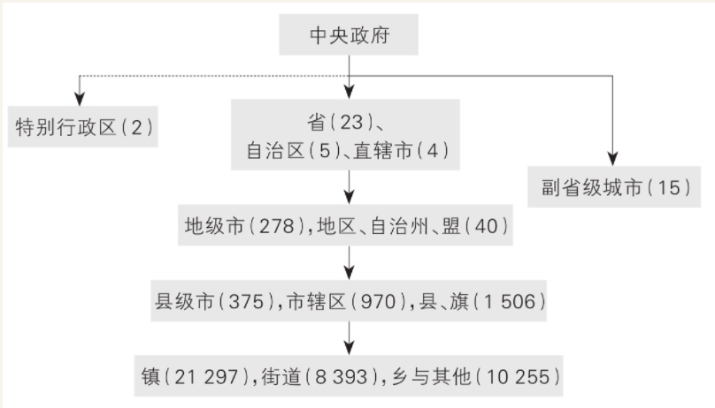

    作者: 兰小欢
    出版社: 上海人民出版社
    出品方: 世纪文景
    副标题: 中国政府与经济发展
    出版年: 2021-8
    页数: 340
    定价: 65.00元
    装帧: 平装
    ISBN: 9787208171336

[豆瓣链接](https://book.douban.com/subject/35546622/)

- [上篇 微观机制](#上篇-微观机制)
- [第一章 地方政府的权力与事务](#第一章-地方政府的权力与事务)
  - [第一节 政府治理的特点](#第一节-政府治理的特点)
  - [第二节 外部性与规模经济](#第二节-外部性与规模经济)
    - [公共物品和服务的边界](#公共物品和服务的边界)
    - [人口密度、地理与文化差异](#人口密度地理与文化差异)
    - [行政交界地区的经济发展](#行政交界地区的经济发展)
  - [第三节 复杂信息](#第三节-复杂信息)

# 上篇 微观机制
# 第一章 地方政府的权力与事务
## 第一节 政府治理的特点
图1-1描绘了中国的五级政府管理体系：中央—省—市—县区—乡镇。

- 中央与地方政府。央地关系历来是研究很多重大问题的主线。一方面，维持大一统的国家必然要求维护中央权威和统一领导；另一方面，中国之大又决定了政治体系的日常运作要以地方政府为主。
- 党和政府。中国共产党对政府的绝对领导是政治生活的主题。简单说来，党负责重大决策和人事任免，政府负责执行，但二者在组织上紧密交织、人员上高度重叠，很难严格区分。本书主题是经济发展，无须特别强调党政之分，原因有三。其一，地方经济发展依托地方政府。地方党委书记实质上依然是地方官，权力通常无法超越本地。其二，制约政府间事权划分的因素，也制约着各级党委的分工。比如，信息沟通既是困扰上下级政府的难题，也是困扰上下级党委的难题。所以在讨论事权划分原理时，无须特别区分党和政府。其三，地方经济事务由政府部门推动和执行。虽然各部门都由党委领导，但地方上并无常设的专职党委机构来领导日常经济工作。
- 条块分割，多重领导。我国政治体系的一个鲜明特点是“层层复制”：中央的主要政治架构，即党委、政府、人大、政协等，省、市、县三级都完全复制，即所谓“四套班子”。中央政府的主要部委，除外交部等个别例外，在各级政府中均有对应部门，比如中央政府有财政部、省政府有财政厅、市县政府有财政局等。这种从上到下的部门垂直关系，被称为“条条”，而横向的以行政区划为界的政府，被称为“块块”。大多数地方部门都要同时接受“条条”和“块块”的双重领导。
- 上级领导与协调。在复杂的行政体系中，权力高度分散在各部门，往往没有清晰的法律界限，所以一旦涉及跨部门或跨地区事务，办起来就比较复杂，常常理不清头绪，甚至面对相互矛盾的信息。部门之间也存在互相扯皮的问题，某件事只要有一个部门反对，就不容易办成。尤其当没有清楚的先例和流程时，办事人员会在部门之间“踢皮球”，或者干脆推给上级，所以权力与决策会自然而然向上集中。制度设计的一大任务就是要避免把过多决策推给上级，减轻上级负担，提高决策效率，所以体制内简化决策流程的原则之一，就是尽量在能达成共识的最低层级上解决问题。若是部门事务，本部门领导就可以决定；若是经常性的跨部门事务，则设置上级“分管领导”甚至“领导小组”来协调推进。比如经济事务，常常需要财政、工商、税务、发改委等多部门配合，因为发展经济是核心任务，所以地方大都有分管经济的领导，级别通常较高，比如常务副市长（一般是市委常委）。
- 官僚体系。科举选拔出的官僚，既为政治领导，也为道德表率，不仅是政治体制的核心，也是维护国家和社会统一的文化与意识形态载体。这一体系的三大特点延续至今：官员必须学习和贯彻统一的意识形态；官员由上级任命；地方主官需要在多地轮换任职。在维持大一统的前提下，这些特点都是央地关系平衡在人事制度上的体现。

## 第二节 外部性与规模经济
### 公共物品和服务的边界
按照经典经济学的看法，政府的核心职能是提供公共物品和公共服务，比如国防和公园。这类物品一旦生产出来，大家都能用，用的人越多就越划算——因为建造和维护成本也分摊得越薄，这就是“规模经济”。但绝大部分公共物品只能服务有限人群。一个公园虽然免费，但人太多就会拥挤，服务质量会下降，且住得远的人来往不便，所以公园不能只建一个。一个城市总要划分成不同的区县，而行政边界的划分跟公共服务影响范围有关。一方面，因为规模经济，覆盖的人越多越划算，政区越大越好；另一方面，受制于人们获取这些服务的代价和意愿，政区不能无限扩大。

政府公共服务的覆盖范围也与技术和基础设施有关。比如《新闻联播》，是不是所有人都有电视或网络可以收看？是不是所有人都能听懂普通话？是不是所有人的教育水平都能听懂基本内容？这些硬件和软件的基础非常重要。所以秦统一六国后，立刻就进行了“车同轨、书同文”以及统一货币和度量衡的改革。

以公共物品的规模经济和边界为切入点，也可以帮助理解中央和地方政府在分工上的一些差异。比如国防支出几乎全部归中央负担，因为国防体系覆盖全体国民，不能遗漏任何一个省。而中小学教育受制于校舍和老师等条件，规模经济较小，主要覆盖当地人，所以硬件和教师支出大都归地方负担。但教材内容却不受物理条件限制，而且外部性极强。如果大家都背诵李白、杜甫、司马迁的作品，不仅能提高自身素养，而且有助于彼此沟通，形成共同的国民意识，在一些基本问题和态度上达成共识。所以教育的日常支出虽由地方负责，但教材编制却由中央主导，教育部投入了很多资源。

### 人口密度、地理与文化差异
假如各个市、各个县所提供的公共服务性质和内容都差不多，基础设施水平也没什么差异，那各地的行政区划面积是不是就该相等呢？

第一个重要因素是人口密度。按人口密度划分行政区域的思路非常自然。提供公共物品和服务需要成本，人多，不仅税收收入多，而且成本能摊薄，实现规模收益。人口稠密的地方，在比较小的范围内就可以服务足够多的人，实现规模收益，因此行政区域面积可以小一些；而地广人稀的地方，行政区域就该大一些。中国历代最重要的基层单位是县，而县域的划分要依据人口密度，这是早在秦汉时期就定下的基本规则之一，所谓“民稠则减，稀则旷”（《汉书·百官公卿表》）。随着人口密度的增加，行政区域的面积应该越变越小，数目则应该越变越多。所以随着古代经济中心和人口从北方转移到南方，行政区划也就慢慢从“北密南稀”变成了“南密北稀”。以江西为例，西汉时辖19县，唐朝变成34县，南宋时更成为粮食主产区，达到68县，清朝进一步变成81县。

第二个重要因素是地理条件。古代交通不便，山川河流也就成了行政管理的自然边界，历史地理学家称之为“随山川形变”，由唐朝开国后提出：“然天下初定，权置州郡颇多，太宗元年，始命并省，又因山川形便，分天下为十道”（《新唐书·地理志》）。所谓“十道”，基本沿长江、黄河、秦岭等自然边界划分。唐后期演化为40余方镇，很多也以山川为界，比如江西和湖南就以罗霄山脉为界，延续至今。现今省界中仍有不少自然边界：海南自不必说，山西、陕西以黄河为界，四川、云南、西藏则以长江（金沙江）为界，湖北、重庆以巫山为界，广东、广西则共属岭南。

第三个重要因素是语言文化差异。汉语的方言间有差异，汉语与少数民族语言也有差异。若语言不通，政务管理或公共服务可能就需要差异化，成本会因此增加，规模收益降低，从而影响行政区域划分。当然，语言差异和地理差异高度相关。方言之形成，多因山川阻隔而交流有限。

### 行政交界地区的经济发展
这一俗称“三不管地带”的现象，也可以用公共物品规模效应和边界的理论来解释。首先，一省之内以省会为政治经济中心，人口最为密集，公共物品的规模经济效应最为显著。但几乎所有省会（除南京和西宁外）无一临近省边界，这种地理距离限制了边界地区获取公共资源。其次，省边界的划分与地理条件相关。诸多省界县位于山区，坡度平均要比非省界县高35%，不利于经济发展，比如山西、河北边界的太行山区，江西、福建边界的武夷山区，湖北、河南、安徽边界的大别山区等。再次，省界划分虽与方言和地方文化有关，但并不完全重合。一省之内主流文化一般集中在省会周围，而省界地区往往是本省的非主流文化区，其方言也有可能与主流不同。

从公共物品角度看，边界地区首先面临的是基础设施如道路网络的不足。20世纪八九十年代，省边界处的“断头路”并不罕见。1992年我从内蒙古乘车到北京，途经山西和河北，本来好好的路，到了省界处路况就变差，常常要绕小道。若是晚间，还有可能遇到“路霸”。即使到了2012年，路网交通中的“边界效应”（省界地区路网密度较低）依然存在，虽然比以前改善了很多。

另一个曾长期困扰边界公共治理的问题是环境污染，尤其是跨省的大江、大河、大湖，比如淮河、黄河、太湖等流域的污染。这是典型的跨区域外部性问题。

行政边界影响经济发展，地方保护主义和市场分割现象今天依然存在，尤其在生产要素市场上，用地指标和户籍制度对土地和人口流动影响很大。从长期看，消除这种现象需要更深入的市场化改革。但在中短期内，调整行政区划、扩大城市规模乃至建设都市圈也能发挥作用。

区域性整合的基本单位是城市，但在城市内部，首先要整合城乡。在市管县体制下，随着城市化的发展，以工业和服务业为经济支柱的市区和以农业为主的县城之间，对公共服务需求的差别会越来越大。调和不同需求、利用好有限的公共资源，就成了一大难题。改革思路有二：一是加强县的独立性和自主性，弱化其与市区的联系。第二章将展开讨论这方面的改革，包括扩权强县、撤县设市、省直管县等。二是扩张城市，撤县设区。1983—2015年，共有92个地级市撤并了134个县或县级市。比如北京市原来就8个区，现在是16个，后来的8个都是由县改区，如通州区（原通县）和房山区（原房山县）。上海现有16个市辖区，青浦、奉贤、松江、金山等区也是撤县设区改革的结果。

## 第三节 复杂信息

