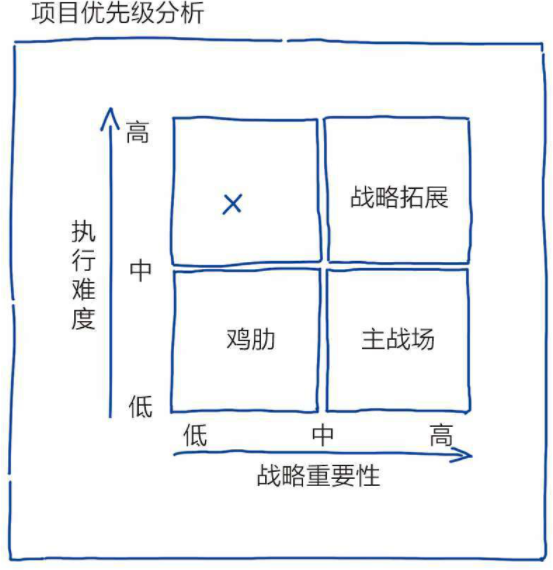

    作者: 周国元
    出版社: 人民邮电出版社
    出品方: 智元微库 OPEN MIND
    副标题: 如何想清楚、说明白、做到位
    出版年: 2021-1-1
    页数: 240
    定价: 69.8元
    装帧: 平装
    ISBN: 9787115552365

[豆瓣链接](https://book.douban.com/subject/35252834/)

- [认识结构化战略思维](#认识结构化战略思维)
  - [结构化战略思维是什么](#结构化战略思维是什么)
  - [维度：结构化战略思维的核心概念](#维度结构化战略思维的核心概念)
    - [重塑“问题观”](#重塑问题观)
      - [专业思维](#专业思维)
      - [战略思维](#战略思维)
    - [跨界的“简单按钮”](#跨界的简单按钮)
    - [MECE原则为核心](#mece原则为核心)
      - [公式法和子目录列举法](#公式法和子目录列举法)
      - [流程法和逻辑框架法](#流程法和逻辑框架法)
      - [从单一维度到多维度的飞跃](#从单一维度到多维度的飞跃)
  - [结构化战略思维四大原则](#结构化战略思维四大原则)

# 认识结构化战略思维
## 结构化战略思维是什么
麦肯锡结构化战略思维是一种学习如何学习的认知方法，是批判性思维（Critical Thinking）的一种存在形态，也是一套以数字和逻辑为基础的理性科学方法论和实用技巧。

`战略`是为长期维持可持续竞争优势设定的重要方针和计划，而不是短期制胜的商战技巧。在公司或个人发展的初始期和关键拐点，往往“选择比努力更重要”。`战略思维`是相对于`专家思维`的一种思考方法，它强迫我们放下过往的经验，从大局和“盒外”思考中长期的发展方向。

## 维度：结构化战略思维的核心概念
### 重塑“问题观”
#### 专业思维
`专业思维`是人们最熟悉的一种思维方式，这种自下而上的方法在主流教育体系中随处可见。自下而上是指学习知识的过程是厚积薄发的线性过程，把所有底层（“下”）细节知识点都掌握了再提炼对整体（“上”）的理解，只有在这时才能做出专业的判断。这种学习方法也催生了“专业思维”这种思维模式：只有学全学透后才能表达观点。

但自下而上的专业思维方式的局限性也十分明显。首先是学习周期长。随着学科细分和知识积累的指数倍增加，单个个体已经很难成为多领域的专家。VUCA时代已经不可能再见到文艺复兴时期达·芬奇般的传奇人物——可以在绘画、生物学、植物学和建筑学多个领域成为泰斗。

专业思维还有一个局限，如果专业和经验运用不当会严重限制创新。自下而上线性发展本身就排斥盒外思维的冲击。代代相传的经典不容置疑，就算已经脱离了社会现实和需求也无法自我修正。专家习惯从过往的方案出发考虑所有新问题。“手里有锤子，什么看着都像钉子”。

#### 战略思维
战略思维这种自上而下的方法从认知方向、顺序上颠覆了厚积薄发的传统专业思维。战略思维是“结构化战略思维”的简称。这种思维方式不会因缺乏相关的专业知识和经验而纠结，往往直接从问题本身（“上”）着手，仔细推敲问题本身的定义和准确性，用结构化战略思维“切”的方法分解问题，并用严谨的逻辑全面地提出假设，而后或通过对数据的采集与分析证实假设，或推翻已有假设并建立新的假设（“下”），如此循环而深入地验证假设。不断探究深“挖”问题核心，以获取问题的最终解决方案。

### 跨界的“简单按钮”
下面我们看几个常见的企业战略问题及标准回答，体会自上而下战略思维的初级“套路”。

    例1：企业转型问题
    问：一家企业如何转型？
    答：从3个层面来看这个问题——人、系统和流程。

    例2：成功要素问题
    问：如何才能把一个项目做成功？
    答：需要具备3个因素——团队的能力、动力和可调配的资源。

    例3：盈利能力问题
    问：企业如何提高净利？
    答：内部运营上注意2个方面——开源和节流。

    例4：新零售问题
    问：到底什么是新零售？
    马云回答：人、货、场。

### MECE原则为核心
MECE是英文“Mutually Exclusive，Collectively Exhaustive”的简写。

1. 子分类相互独立无重叠；
1. 子分类加起来穷尽全部可能。

在符合MECE原则的基础上，“切”问题主要有4种方法：公式法、子目录列举法、流程法和逻辑框架法（见图2-4）。

```mermaid
graph TD;
    r[切分问题]-->a[公式法]
    r-->b[子目录列举法]
    r-->c[流程法]
    r-->d[逻辑框架法]
```

#### 公式法和子目录列举法
先看看`公式法`的应用。

“解决净利问题，无非是从两个层面入手，一是开源，二是节流！”“开源节流”是解决净利问题的公理，因为它源于经典工商管理领域利润的计算公式：

    利润=收入-成本

如图2-5所示，提高净利的问题被分为两个符合MECE原则的支脉：增加销售收入和降低成本。这构成了第一层的问题分解。

```mermaid
graph TD;
    r[提高盈利水平]-->a[增加销售收入]
    r-->b[降低成本]
    a-->a1[增加销售数量]
    a-->a2[提升产品单价]
    b-->b1[降低固定成本]
    b-->b2[降低可变成本]
```

先看“增加销售收入”这个支脉，销售收入的计算又可借用以下公式：

    销售收入=单价×销售数量

销售数量的提升有哪几个核心贡献因素？根据经典`4P营销理论`，销售数量的提升因素除了价格之外还有产品、渠道和推广三大因素。4P营销理论也符合MECE原则，产品、价格、渠道和推广加起来是营销的穷尽组成部分，且相互独立不重叠。这样就套用了经典理论完成了“增加销售数量”支脉在第三层深度的分解（见图2-6）。

按照4P营销理论的逻辑，可以体系化地询问公司运作相关的细节问题。由于是基于高质量逻辑框架的输入，大多会赢得企业高管的信任，因此会得到高质量的一手信息，比如询问以下问题。

- 对比竞品，我们产品本身差异性如何？哪些是消费者感知到且愿意溢价购买的？
- 公司现在的渠道采用的是直营还是代理？如果是代理，有几级代理？销售状况如何？
- 公司现在的促销手段有哪些？跟竞争对手有何不同？
- 本行业在产品、渠道和促销等方面有何趋势？目前效果如何？

管理理论对感知价值也有相应的阐述：影响感知价值的因素包括品牌、原材料、包装和科技等。此时，同样在第三层细节，沿着“提升产品单价”的思路可以跟对方企业高管再进行一轮关于产品单价的探讨。

- 公司主流产品的品牌力如何？跟竞争对手有何区别？是否容易提升？
- 产品的原材料是否有特色？跟竞争对手的相对位置如何？
- 产品包装跟竞品的区别大吗？消费者是否会为更好的包装买单？
- 产品的科技含量高吗？技术是不是本类产品的一个壁垒？趋势如何？

```mermaid
graph TD;
    r[提高盈利水平]-->a[增加销售收入]
    r-->b[降低成本]
    a-->a1[增加销售数量]
    a-->a2[提升产品单价]
    b-->b1[降低固定成本]
    b-->b2[降低可变成本]
    a1-->a11[产品]
    a1-->a12[价格]
    a1-->a13[渠道]
    a1-->a14[推广]
    a2-->a21[品牌]
    a2-->a22[原材料]
    a2-->a23[包装]
    a2-->a24[科技]
```

按照管理理论，成本无非分为固定成本和可变成本，这是第二层的分解。固定成本是已经不可逆或不可收回的沉没成本，比如已经建成的厂房和生产线。在讨论成本节约时，往往更聚焦可变成本的优化提升空间。

按此逻辑，“节流”支脉的第三层聚焦在“切”可变成本。用子目录列举法可将可变成本切分为人力成本、原材料成本、研发成本、市场成本等（见图2-7）。接下来，按照此结构继续进行切分。

- 公司主要生产成本集中在人工、原材料还是其他方面？
- 生产规模化和自动化会不会大幅度降低生产成本？
- 人工成本占整体成本的比例，有无改进空间？

```mermaid
graph TD;
    r[提高盈利水平]-->a[增加销售收入]
    r-->b[降低成本]
    a-->a1[增加销售数量]
    a-->a2[提升产品单价]
    b-->b1[降低固定成本]
    b-->b2[降低可变成本]
    a1-->a11[产品]
    a1-->a12[价格]
    a1-->a13[渠道]
    a1-->a14[推广]
    a2-->a21[品牌]
    a2-->a22[原材料]
    a2-->a23[包装]
    a2-->a24[科技]
    b2-->b21[人力]
    b2-->b22[原材料]
    b2-->b23[研发]
    b2-->b24[市场]
```

#### 流程法和逻辑框架法
`流程法`和`逻辑框架法`也是在实战中经常用到的“切”的方法。流程法，顾名思义就是把问题按照某种流程步骤串起来。逻辑框架法是按照逻辑叙述常见的粗线条判断框架，比如内部vs外部、主观vs客观、优点vs缺点等对问题进行初步切分。

“提高净利的侧重点根据公司所处发展阶段不同而略有变化。比如初创企业通过单点的营销策划和渠道拓展往往可以快速提升收入，而成熟企业的解决方案则复杂得多，成熟企业更注重长期的产品差异和成本控制的系统化解法。”

再用流程法MECE地列出企业成长的S曲线的4个阶段，对号入座。

- 您公司现在处于什么阶段，是初创期、高速发展期、高峰瓶颈期，还是已经有下滑态势的夕阳或转型期？

分析得到明确回答之后（比如高峰瓶颈期的大企业），再回归到“提高企业净利”问题本身。这时可以以产品发展阶段为讨论主线，这也是一种广义的流程。制造业的产品基本都会经过研发、生产、市场和销售以及售后服务这4个流程阶段。“提高企业净利”的问题可以用这4个阶段来做第一步切分（见图2-8）。可细致地探讨以下问题。

- 公司研发的投入占收入的比例是多少？相对竞品，投入比例和收效如何？
- 生产总体是什么状况，有无优化空间（机械化、自动化和规模化）？
- 目前销售状况如何？销售投入和成本控制做得怎么样？
- 售后服务投入有多少？复购率怎么样？相对竞品，有无优势？

```mermaid
graph TD;
    r[提高净利润水平]-->a[研发]
    r-->b[生产]
    r-->c[市场和销售]
    r-->d[售后服务]
    a-->a1[研发人员人力成本]
    a-->a2[材料费]
    a-->a3[设备采购/折旧费]
    a-->a4[外包费用]
    b-->b1[生产人力]
    b-->b2[原材料]
    b-->b3[包装]
    b-->b4[科技]
    c-->c1[广告管理]
    c-->c2[销售渠道管理]
    c-->c3[促销政策管理]
    c-->c4[销售人员管理]
    c1-->c11[内部]
    c1-->c12[外部]
    c11-->c111[站内资源]
    c11-->c112[官方媒体]
    c11-->c113[社群社区]
    c12-->c121[广告联盟/DSP平台]
    c12-->c122[搜索引擎]
    c12-->c123[微信等自媒体]
    c12-->c124[媒体平台]
```

结构化“切”的高要求是遵循`“3-3原则”`，即面对任何问题，都能用维度准确“切”分，然后再纵向深入“挖”到至少第三层的细节。完成一次完整分解之后，能跳出已有的逻辑框架从全新的维度再做两次或以上类似的“切”和“挖”的练习，总共建造3个或以上不同的逻辑树，每个逻辑树都有至少三层细节。

#### 从单一维度到多维度的飞跃
直接看项目优先级分析图谱的一种二维度画法。如图2-10所示，该项目优先级关键图谱由两个坐标轴切分组成（几乎所有关键图谱都是从两个坐标轴开始）：X轴代表“战略重要性”，越向右数值越大，表明战略性越强；Y轴代表“执行难度”，越向上数值越大，表明执行难度越高。在每个轴的中部画一条逻辑上的分隔线，这样就出现了四个小区域，又称为象限。每个象限都是两个核心维度不同值域的组合，用来归纳项目特色。

以上项目优先级的战略图谱可以分为四个象限。

- 主战场：战略重要性高而执行难度低。这些项目往往与公司现有战略的核心一致，而且公司多年累积的各种竞争优势，比如研发、生产和销售等，都可以直接应用，是公司的核心业务。执行难度较低是相对本公司其他项目而言的，竞品公司很可能有不同的判断。如果项目落在这个象限，意味着项目是公司立足之本，要保证资源确保项目成功完成。
- 战略拓展：战略重要性高且执行难度高。这些项目常常代表公司未来发展方向，要进行战略布局。项目很可能跟公司本身的核心能力有偏差而导致执行难度偏高。比如一家一直对消费者（to C）服务的公司，在转战云服务等对公（to B）服务的时候，内部要相应做很多调整。如果项目落在这个象限，意味着公司管理层要做个判断，是否要破釜沉舟布局甚至允许初期的亏损。要衡量拓展项目与主战场的关系，尤其是在资源有限的情况下，平衡长期战略和短期获利。
- 鸡肋：战略重要性低且执行难度低。这些项目跟公司战略布局完全不一致，但由于执行难度低，如果利润空间还比较大，是值得重点讨论的。比如，大型家电制造业的企业有机会做房地产开发项目。鸡肋项目构成比较复杂，“食之无味，弃之可惜”，需要讨论和权衡。对于大型成熟企业来说，为一次性的非主营业务短期利润而投入相当大的资源，很有可能会分散精力甚至影响主营业务的发展。
- 必须砍掉的项目（X）：战略重要性低而执行难度高。这些项目被砍的原因毋庸置疑。但工作中经常会碰到类似“吃力不讨好”的项目，苟延残喘的原因也多种多样，有时是历史遗留的问题项目，项目前景堪忧但往往由于前期投入大而难以割舍；有时是公司战略方向变化导致项目适用性降低；有时甚至是需求端已经改变导致项目的意义不复存在。总之，如果项目落在这个象限，原则上，没开始的项目坚决不能开始，已经开始的项目要认真考虑如何止损。

如何把潜在净利加入到图谱？我们可以尝试用图形展示这个数值。如图2-11所示：

## 结构化战略思维四大原则

