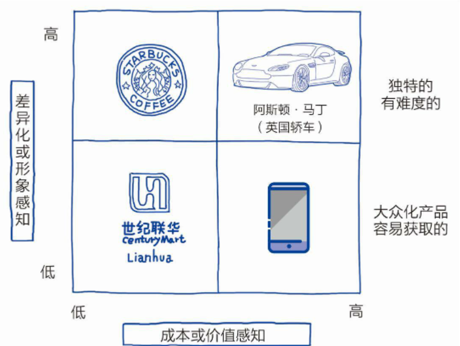

    作者: 周国元
    出版社: 人民邮电出版社
    出品方: 智元微库 OPEN MIND
    副标题: 如何想清楚、说明白、做到位
    出版年: 2021-1-1
    页数: 240
    定价: 69.8元
    装帧: 平装
    ISBN: 9787115552365

[豆瓣链接](https://book.douban.com/subject/35252834/)

- [认识结构化战略思维](#认识结构化战略思维)
  - [结构化战略思维是什么](#结构化战略思维是什么)
  - [维度：结构化战略思维的核心概念](#维度结构化战略思维的核心概念)
    - [重塑“问题观”](#重塑问题观)
      - [专业思维](#专业思维)
      - [战略思维](#战略思维)
    - [跨界的“简单按钮”](#跨界的简单按钮)
    - [MECE原则为核心](#mece原则为核心)
      - [公式法和子目录列举法](#公式法和子目录列举法)
      - [流程法和逻辑框架法](#流程法和逻辑框架法)
      - [从单一维度到多维度的飞跃](#从单一维度到多维度的飞跃)
  - [结构化战略思维四大原则](#结构化战略思维四大原则)
    - [PEST模型](#pest模型)
    - [波特五力模型](#波特五力模型)
    - [SWOT分析](#swot分析)
    - [麦肯锡7S模型](#麦肯锡7s模型)
    - [BCG矩阵](#bcg矩阵)
    - [消费者感知图](#消费者感知图)
- [结构化战略思维的应用](#结构化战略思维的应用)
  - [新麦肯锡五步法：结构化战略思维的综合运用](#新麦肯锡五步法结构化战略思维的综合运用)
  - [第一步：定义问题](#第一步定义问题)
    - [对问题本身的推敲是思辨者的行为特色](#对问题本身的推敲是思辨者的行为特色)
    - [定义正确问题的衡量标准](#定义正确问题的衡量标准)
  - [第二步：结构化分析](#第二步结构化分析)
  - [第三步：提出假设](#第三步提出假设)
    - [假设的功能](#假设的功能)
    - [提出假设的关键举措：头脑风暴](#提出假设的关键举措头脑风暴)
    - [提出假设时杜绝专家过早参与](#提出假设时杜绝专家过早参与)
  - [第四步：验证假设](#第四步验证假设)
    - [验证假设的功能和方法](#验证假设的功能和方法)
    - [实地调研的技巧](#实地调研的技巧)
  - [第五步：交付](#第五步交付)
    - [商务沟通的外部影响要素](#商务沟通的外部影响要素)
    - [商务沟通的3S原则](#商务沟通的3s原则)
    - [商务沟通的工具](#商务沟通的工具)
      - [金字塔原则](#金字塔原则)
      - [故事线](#故事线)
      - [SCP叙述框架](#scp叙述框架)
      - [点线大纲](#点线大纲)
      - [高效商务沟通需要注意的细节](#高效商务沟通需要注意的细节)
- [知识要点图解卡片](#知识要点图解卡片)

# 认识结构化战略思维
## 结构化战略思维是什么
麦肯锡结构化战略思维是一种学习如何学习的认知方法，是批判性思维（Critical Thinking）的一种存在形态，也是一套以数字和逻辑为基础的理性科学方法论和实用技巧。

`战略`是为长期维持可持续竞争优势设定的重要方针和计划，而不是短期制胜的商战技巧。在公司或个人发展的初始期和关键拐点，往往“选择比努力更重要”。`战略思维`是相对于`专家思维`的一种思考方法，它强迫我们放下过往的经验，从大局和“盒外”思考中长期的发展方向。

## 维度：结构化战略思维的核心概念
### 重塑“问题观”
#### 专业思维
`专业思维`是人们最熟悉的一种思维方式，这种自下而上的方法在主流教育体系中随处可见。自下而上是指学习知识的过程是厚积薄发的线性过程，把所有底层（“下”）细节知识点都掌握了再提炼对整体（“上”）的理解，只有在这时才能做出专业的判断。这种学习方法也催生了“专业思维”这种思维模式：只有学全学透后才能表达观点。

但自下而上的专业思维方式的局限性也十分明显。首先是学习周期长。随着学科细分和知识积累的指数倍增加，单个个体已经很难成为多领域的专家。VUCA时代已经不可能再见到文艺复兴时期达·芬奇般的传奇人物——可以在绘画、生物学、植物学和建筑学多个领域成为泰斗。

专业思维还有一个局限，如果专业和经验运用不当会严重限制创新。自下而上线性发展本身就排斥盒外思维的冲击。代代相传的经典不容置疑，就算已经脱离了社会现实和需求也无法自我修正。专家习惯从过往的方案出发考虑所有新问题。“手里有锤子，什么看着都像钉子”。

#### 战略思维
战略思维这种自上而下的方法从认知方向、顺序上颠覆了厚积薄发的传统专业思维。战略思维是“结构化战略思维”的简称。这种思维方式不会因缺乏相关的专业知识和经验而纠结，往往直接从问题本身（“上”）着手，仔细推敲问题本身的定义和准确性，用结构化战略思维“切”的方法分解问题，并用严谨的逻辑全面地提出假设，而后或通过对数据的采集与分析证实假设，或推翻已有假设并建立新的假设（“下”），如此循环而深入地验证假设。不断探究深“挖”问题核心，以获取问题的最终解决方案。

### 跨界的“简单按钮”
下面我们看几个常见的企业战略问题及标准回答，体会自上而下战略思维的初级“套路”。

    例1：企业转型问题
    问：一家企业如何转型？
    答：从3个层面来看这个问题——人、系统和流程。

    例2：成功要素问题
    问：如何才能把一个项目做成功？
    答：需要具备3个因素——团队的能力、动力和可调配的资源。

    例3：盈利能力问题
    问：企业如何提高净利？
    答：内部运营上注意2个方面——开源和节流。

    例4：新零售问题
    问：到底什么是新零售？
    马云回答：人、货、场。

### MECE原则为核心
MECE是英文“Mutually Exclusive，Collectively Exhaustive”的简写。

1. 子分类相互独立无重叠；
1. 子分类加起来穷尽全部可能。

在符合MECE原则的基础上，“切”问题主要有4种方法：公式法、子目录列举法、流程法和逻辑框架法（见图2-4）。

```mermaid
graph TD;
    r[切分问题]-->a[公式法]
    r-->b[子目录列举法]
    r-->c[流程法]
    r-->d[逻辑框架法]
```

#### 公式法和子目录列举法
先看看`公式法`的应用。

“解决净利问题，无非是从两个层面入手，一是开源，二是节流！”“开源节流”是解决净利问题的公理，因为它源于经典工商管理领域利润的计算公式：

    利润=收入-成本

如图2-5所示，提高净利的问题被分为两个符合MECE原则的支脉：增加销售收入和降低成本。这构成了第一层的问题分解。

```mermaid
graph TD;
    r[提高盈利水平]-->a[增加销售收入]
    r-->b[降低成本]
    a-->a1[增加销售数量]
    a-->a2[提升产品单价]
    b-->b1[降低固定成本]
    b-->b2[降低可变成本]
```

先看“增加销售收入”这个支脉，销售收入的计算又可借用以下公式：

    销售收入=单价×销售数量

销售数量的提升有哪几个核心贡献因素？根据经典`4P营销理论`，销售数量的提升因素除了价格之外还有产品、渠道和推广三大因素。4P营销理论也符合MECE原则，产品、价格、渠道和推广加起来是营销的穷尽组成部分，且相互独立不重叠。这样就套用了经典理论完成了“增加销售数量”支脉在第三层深度的分解（见图2-6）。

按照4P营销理论的逻辑，可以体系化地询问公司运作相关的细节问题。由于是基于高质量逻辑框架的输入，大多会赢得企业高管的信任，因此会得到高质量的一手信息，比如询问以下问题。

- 对比竞品，我们产品本身差异性如何？哪些是消费者感知到且愿意溢价购买的？
- 公司现在的渠道采用的是直营还是代理？如果是代理，有几级代理？销售状况如何？
- 公司现在的促销手段有哪些？跟竞争对手有何不同？
- 本行业在产品、渠道和促销等方面有何趋势？目前效果如何？

管理理论对感知价值也有相应的阐述：影响感知价值的因素包括品牌、原材料、包装和科技等。此时，同样在第三层细节，沿着“提升产品单价”的思路可以跟对方企业高管再进行一轮关于产品单价的探讨。

- 公司主流产品的品牌力如何？跟竞争对手有何区别？是否容易提升？
- 产品的原材料是否有特色？跟竞争对手的相对位置如何？
- 产品包装跟竞品的区别大吗？消费者是否会为更好的包装买单？
- 产品的科技含量高吗？技术是不是本类产品的一个壁垒？趋势如何？

```mermaid
graph TD;
    r[提高盈利水平]-->a[增加销售收入]
    r-->b[降低成本]
    a-->a1[增加销售数量]
    a-->a2[提升产品单价]
    b-->b1[降低固定成本]
    b-->b2[降低可变成本]
    a1-->a11[产品]
    a1-->a12[价格]
    a1-->a13[渠道]
    a1-->a14[推广]
    a2-->a21[品牌]
    a2-->a22[原材料]
    a2-->a23[包装]
    a2-->a24[科技]
```

按照管理理论，成本无非分为固定成本和可变成本，这是第二层的分解。固定成本是已经不可逆或不可收回的沉没成本，比如已经建成的厂房和生产线。在讨论成本节约时，往往更聚焦可变成本的优化提升空间。

按此逻辑，“节流”支脉的第三层聚焦在“切”可变成本。用子目录列举法可将可变成本切分为人力成本、原材料成本、研发成本、市场成本等（见图2-7）。接下来，按照此结构继续进行切分。

- 公司主要生产成本集中在人工、原材料还是其他方面？
- 生产规模化和自动化会不会大幅度降低生产成本？
- 人工成本占整体成本的比例，有无改进空间？

```mermaid
graph TD;
    r[提高盈利水平]-->a[增加销售收入]
    r-->b[降低成本]
    a-->a1[增加销售数量]
    a-->a2[提升产品单价]
    b-->b1[降低固定成本]
    b-->b2[降低可变成本]
    a1-->a11[产品]
    a1-->a12[价格]
    a1-->a13[渠道]
    a1-->a14[推广]
    a2-->a21[品牌]
    a2-->a22[原材料]
    a2-->a23[包装]
    a2-->a24[科技]
    b2-->b21[人力]
    b2-->b22[原材料]
    b2-->b23[研发]
    b2-->b24[市场]
```

#### 流程法和逻辑框架法
`流程法`和`逻辑框架法`也是在实战中经常用到的“切”的方法。流程法，顾名思义就是把问题按照某种流程步骤串起来。逻辑框架法是按照逻辑叙述常见的粗线条判断框架，比如内部vs外部、主观vs客观、优点vs缺点等对问题进行初步切分。

“提高净利的侧重点根据公司所处发展阶段不同而略有变化。比如初创企业通过单点的营销策划和渠道拓展往往可以快速提升收入，而成熟企业的解决方案则复杂得多，成熟企业更注重长期的产品差异和成本控制的系统化解法。”

再用流程法MECE地列出企业成长的S曲线的4个阶段，对号入座。

- 您公司现在处于什么阶段，是初创期、高速发展期、高峰瓶颈期，还是已经有下滑态势的夕阳或转型期？

分析得到明确回答之后（比如高峰瓶颈期的大企业），再回归到“提高企业净利”问题本身。这时可以以产品发展阶段为讨论主线，这也是一种广义的流程。制造业的产品基本都会经过研发、生产、市场和销售以及售后服务这4个流程阶段。“提高企业净利”的问题可以用这4个阶段来做第一步切分（见图2-8）。可细致地探讨以下问题。

- 公司研发的投入占收入的比例是多少？相对竞品，投入比例和收效如何？
- 生产总体是什么状况，有无优化空间（机械化、自动化和规模化）？
- 目前销售状况如何？销售投入和成本控制做得怎么样？
- 售后服务投入有多少？复购率怎么样？相对竞品，有无优势？

```mermaid
graph TD;
    r[提高净利润水平]-->a[研发]
    r-->b[生产]
    r-->c[市场和销售]
    r-->d[售后服务]
    a-->a1[研发人员人力成本]
    a-->a2[材料费]
    a-->a3[设备采购/折旧费]
    a-->a4[外包费用]
    b-->b1[生产人力]
    b-->b2[原材料]
    b-->b3[包装]
    b-->b4[科技]
    c-->c1[广告管理]
    c-->c2[销售渠道管理]
    c-->c3[促销政策管理]
    c-->c4[销售人员管理]
    c1-->c11[内部]
    c1-->c12[外部]
    c11-->c111[站内资源]
    c11-->c112[官方媒体]
    c11-->c113[社群社区]
    c12-->c121[广告联盟/DSP平台]
    c12-->c122[搜索引擎]
    c12-->c123[微信等自媒体]
    c12-->c124[媒体平台]
```

结构化“切”的高要求是遵循`“3-3原则”`，即面对任何问题，都能用维度准确“切”分，然后再纵向深入“挖”到至少第三层的细节。完成一次完整分解之后，能跳出已有的逻辑框架从全新的维度再做两次或以上类似的“切”和“挖”的练习，总共建造3个或以上不同的逻辑树，每个逻辑树都有至少三层细节。

#### 从单一维度到多维度的飞跃
直接看项目优先级分析图谱的一种二维度画法。如图2-10所示，该项目优先级关键图谱由两个坐标轴切分组成（几乎所有关键图谱都是从两个坐标轴开始）：X轴代表“战略重要性”，越向右数值越大，表明战略性越强；Y轴代表“执行难度”，越向上数值越大，表明执行难度越高。在每个轴的中部画一条逻辑上的分隔线，这样就出现了四个小区域，又称为象限。每个象限都是两个核心维度不同值域的组合，用来归纳项目特色。

以上项目优先级的战略图谱可以分为四个象限。

- 主战场：战略重要性高而执行难度低。这些项目往往与公司现有战略的核心一致，而且公司多年累积的各种竞争优势，比如研发、生产和销售等，都可以直接应用，是公司的核心业务。执行难度较低是相对本公司其他项目而言的，竞品公司很可能有不同的判断。如果项目落在这个象限，意味着项目是公司立足之本，要保证资源确保项目成功完成。
- 战略拓展：战略重要性高且执行难度高。这些项目常常代表公司未来发展方向，要进行战略布局。项目很可能跟公司本身的核心能力有偏差而导致执行难度偏高。比如一家一直对消费者（to C）服务的公司，在转战云服务等对公（to B）服务的时候，内部要相应做很多调整。如果项目落在这个象限，意味着公司管理层要做个判断，是否要破釜沉舟布局甚至允许初期的亏损。要衡量拓展项目与主战场的关系，尤其是在资源有限的情况下，平衡长期战略和短期获利。
- 鸡肋：战略重要性低且执行难度低。这些项目跟公司战略布局完全不一致，但由于执行难度低，如果利润空间还比较大，是值得重点讨论的。比如，大型家电制造业的企业有机会做房地产开发项目。鸡肋项目构成比较复杂，“食之无味，弃之可惜”，需要讨论和权衡。对于大型成熟企业来说，为一次性的非主营业务短期利润而投入相当大的资源，很有可能会分散精力甚至影响主营业务的发展。
- 必须砍掉的项目（X）：战略重要性低而执行难度高。这些项目被砍的原因毋庸置疑。但工作中经常会碰到类似“吃力不讨好”的项目，苟延残喘的原因也多种多样，有时是历史遗留的问题项目，项目前景堪忧但往往由于前期投入大而难以割舍；有时是公司战略方向变化导致项目适用性降低；有时甚至是需求端已经改变导致项目的意义不复存在。总之，如果项目落在这个象限，原则上，没开始的项目坚决不能开始，已经开始的项目要认真考虑如何止损。

如何把潜在净利加入到图谱？我们可以尝试用图形展示这个数值。如图2-11所示：

## 结构化战略思维四大原则
```mermaid
graph TD;
    r[结构化战略思维四大原则]-->a[数字说话FactBased]
    r-->b[洞见优于表象InsightDriven]
    r-->c[MECE原则]
    r-->d[假设为前提HypothesisDriven]
```

其中`数字说话`和`洞见优于表象`是偏重数字分析和高效交流的科学方法和行为准则，而`MECE原则`和`假设为前提`更多是指导思路的方法论。

利用维度切分和MECE原则创造出多个用于解决实际问题的全新理论框架，按照从宏观到微观、从外部到内部的顺序，审视一下最常见的几个经典管理学理论：从`宏观PEST模型`开始，到行业赛道吸引力的`波特五力模型`，然后是公司能力`SWOT分析`，再到内部公司管理的`麦肯锡7S模型`，最后看看多维度理论如`BCG矩阵`和`消费者细分市场感知分析`。

### PEST模型
`PEST模型`由哈佛经济学教授弗朗西斯·阿吉拉尔（Francis J.Aguilar）最早在1967年提出，是用来评判企业外部宏观经济大环境的理论框架。

```mermaid
graph TD;
    r[PEST模型]-->a[政治Politics]
    r-->b[经济Economy]
    r-->c[社会Society]
    r-->d[科技Technology]
```

头脑风暴的第一步是，要求团队把所有能想到的具体因素先罗列出来，然后再逐一排查、提炼和归类。如果大家踊跃参与讨论，白板慢慢地就会被头脑风暴产生的相关决策因素填满。

政局稳定、边境稳定、宗教信仰、人口数量、消费能力、军事能力、投资政策、法治程度、货币流动性、人口增长速度、人口素质、科技水平、发明创造、对外国资本的保护、医疗卫生、基础建设（如公路）、自然资源、政府科技投入、港口数量、互联网发展程度、工业现代化程度……

头脑风暴的第二步是提炼归类。作为主持人，你的主要任务是把以上的因素去除冗余，归纳成几个大的类别，并有意地引导大家用统一的MECE视角看待这些因素。梳理一下头脑风暴得出的因素，大概率会得到以下分类结果。

- 政治：政局稳定、边境稳定、对外国资本的保护、法治程度
- 经济：人口数量、人口增长速度、消费能力、投资政策、货币流动性、医疗卫生、基础建设（如公路）、自然资源、港口数量、互联网发展程度、工业现代化程度
- 军事：军事能力
- 文化：宗教信仰、人口素质
- 科技：科技水平、发明创造、政府科技投入

### 波特五力模型
```mermaid
graph TD;
    r[波特五力模型]-->a[潜在的新进入者的威胁]
    r-->b[供应商的议价能力]
    r-->c[同业竞争者的竞争程度]
    r-->d[购买者的议价能力]
    r-->e[替代品的威胁]
```

假设公司是专做早餐的餐饮业实体，是一家卖烧饼的店铺，并起了个非常有历史感的名字，叫“大郎烧饼”。

- 同品类竞争者：其他卖烧饼的，如“太郎烧饼”和“老狼烧饼”，直送网店
- 上游供应商：卖面的、卖炭的
- 下游消费者：顾客
- 替代品：街上的其他饭店、卖面包的、卖面条的、卖西方糕点的、卖包子的
- 潜在进入者：正在买设备的邻居、BAT互联网巨头的AI烘焙

### SWOT分析
```mermaid
graph TD;
    r[SWOT分析]-->a[Strengths优势]
    r-->b[Weaknesses劣势]
    r-->c[Opportunities机会]
    r-->d[Threats威胁]
```

整个模型只重点用了“内部vs外部”一刀来“切”公司管理问题，然后在内外部基础上，用“好vs坏”拼凑成4个象限。

- 优势：公司管理相关的有利的内部因素。
- 劣势：公司管理相关的不利的内部因素。
- 机会：公司管理相关的有利的外部因素。
- 威胁：公司管理相关的不利的外部因素。

### 麦肯锡7S模型
麦肯锡7S模型。这个模型是麦肯锡的两位咨询师小罗伯特·H.沃特曼（Robert H.Waterman，Jr.）和托马斯·彼得斯（Thomas Peters）在20世纪80年代初首次提出的，主要用来诠释公司各内部模块是如何相互作用的。

- Strategy战略：公司要建立相对竞争对手的可持续的竞争优势的计划。
- Structure结构：公司的组织架构，如汇报的链条。
- Systems系统：员工完成任务所用的系统和流程。
- Shared values共同价值观：公司的核心使命和文化。
- Style风格：公司决策和管理风格。
- Staff员工：组织成员。
- Skills能力：组织综合能力。

### BCG矩阵
BCG矩阵（又称“市场增长率–相对市场份额矩阵”）是由波士顿咨询公司（The Boston Consulting Group，BCG）创始人布鲁斯·亨德森（Bruce Henderson）于1970年首创的，是一种关于企业产品战略的评判框架。最初版本的BCG矩阵以“市场吸引力”与“企业实力”两个维度分别为X轴、Y轴。市场吸引力主要以市场销售总额的增长率来评判；企业实力包括市场占有率、技术、设备、资金利用能力等，往往以产品市场占有率作为评判标准。

- 现金牛产品：在饱和或略萎缩的成熟市场，该产品市场占有率高。比如，中国碳酸饮料市场逐渐饱和，可口可乐占有的市场份额较大，是一个现金牛产品。现金牛产品的战略方向是保证基本补给，争取在短时间内获取更多利润，为创新产品提供资金保障。
- 明星产品：在高速发展的增长市场，市场占有率高。比如，在电动汽车赛道，特斯拉就属于明星产品。明星产品的战略方向是抓住市场机会，倾尽投入，积极扩大经济规模，在提升本产品市场占有率的同时提高市场进入的壁垒。
- 问题产品：在高速发展的增长市场，市场占有率低。问题产品处于一个高增长的赛道，资本和潜在玩家都会涌入。在这样的市场中不进则退。针对这类产品的产品战略要么加大投入，把产品向明星产品品类推进，要么就止损放弃。
- 瘦狗产品：在饱和或略萎缩的成熟市场，市场占有率低。针对瘦狗产品，建议采用撤退战略，应减少产能，逐渐撤退；对那些销售增长率和市场占有率均极低的产品，应适时淘汰。

### 消费者感知图
消费者感知图的主要功能是细分消费者或购买者，并根据每个细分客户群体制定公司的产品战略。X轴是消费者对价值的追求，也称为“价值感知”。价值感知数值越大意味着产品的质量、原材料、技术和包装等因素越优秀。Y轴是消费者对品牌的追求，也称为“形象感知”。形象感知的数值越大表明产品品牌在消费者的思维空间中占比越大。

- 价格敏感型：对产品价值要求相对低，对品牌要求也相对低，最主要的决策因素往往是价格。对于这类消费者，企业要想方设法用规模化和自动化等降低成本的手段形成相对可持续的价格优势。
- 追求极致型：对产品价值要求高，对品牌要求也高，付费意愿偏强烈。对于这种消费者，产品一定要占据市场中价值感和品牌组合的制高点。比如苹果手机，一旦稳定成为市场上价值感和品牌的综合龙头，就能拥有让人嫉妒羡慕恨的品类最高定价权。
- 实用型：对产品价值要求高，对品牌要求低，是一群懂行并追求超强性价比的消费者。这些消费者对于广告等营销方法相对不敏感，总是在寻找价值感高且价格合理的产品。消费者更看重价廉物美的产品，比如一些非名牌手机，只用苹果手机一半的价格就能满足消费者对手机功能的全部需求。
- 虚荣型：对产品价值要求相对不敏感，但对品牌要求高，往往是一群追赶潮流并愿意为品牌溢价买单的消费者。比如对于某些特定消费者来说，星巴克咖啡本身并不是刚需，购买星巴克主要是为了体验品牌形象所映射的小资生活方式。

# 结构化战略思维的应用
## 新麦肯锡五步法：结构化战略思维的综合运用
面对大多数战略项目，麦肯锡通常会派遣一支3-5人组成的咨询师小组，用8~10周的时间完成。在团队构成上，这3-5人的团队由一个核心的项目组长EM（EngagementManager）负责带领2-3名组员；同时会有1名合伙人级别的咨询师指导，把控项目方向和进展，并引领与客户高层互动。在大多数情况下，团队成员对项目所涉及的具体业务并无可复制的专业经验，如果有需要，公司会指派内部或外部专家为项目做专业知识上的支持。

新麦肯锡五步法从项目管理的角度，串起战略项目解决从开始到交付的5个关键步骤：

    定义问题->结构化分析->提出假设->验证假设->交付

## 第一步：定义问题
### 对问题本身的推敲是思辨者的行为特色
示例：敲钉子的故事

>假设一位客户想外包一个简单的任务——将一根钉子敲入木板中。客户找来了D公司和M公司，想了解各自的解决方案。
>
>D公司是行业中有名的专业咨询公司，公司里有很多敲钉子的专家。D公司的方案一般是这样展示，在仔细观察了钉子和板子之后，D公司的销售代表直奔主题，不无夸张地说：
>
>“这个项目我们不光能做，D公司简直就是为这类项目而生的！”
>
>销售代表从“为什么是我们”开始并以此为中心展开陈述：“我们D公司采取世界领先的X技术敲钉子，拥有世界最大且材质最坚硬的锤子。我们人员的手臂最有力，锤子按照符合力学原理的完美运动轨迹落下，保证多快好省地一锤定音（钉子）。”在展示的最后，D公司销售代表会提供以前100次成功敲钉子的案例，然后低声说：“老客户有折扣。”
>
>客户听得频频点头：D公司的方案有历史数据支持，能够直接解决问题而且经济实惠。
>
>轮到M公司了，这是一家战略咨询公司，公司并没有派销售代表，只派了一位年轻合伙人。M公司的合伙人连钉子都没看，开口就问了一个问题：
>
>“我们为什么要敲这个钉子？”
>
>语惊四座！毕竟“甲方为王”的时代，谁敢对客户的想法产生疑问？
>
>但毕竟M公司合伙人背景光鲜亮丽，在行业里具有一定的威信，因此问题还是要回答的。
>
>客户回答：“我们要把板子A和板子B连接起来。”
>
>M公司合伙人追问：“为什么要连接起来？”
>
>客户回答：“我们要做一把椅子。”
>
>合伙人接着发问：“什么要做一把椅子？”
>
>客户有点不耐烦，回答：“我们要用椅子在新建的会议室里接待客人。”
>
>询问至此，M公司合伙人停止发问，陷入片刻的思考。经过三个连续“为什么”，他已经更多地了解到客户敲钉子的真正原因和诉求。客户敲钉子要解决的问题并不是连接木板，也不只是做椅子，而是要解决“在会议室待客用什么服务硬件”的问题。
>
>M公司合伙人和客户接下来的对话都围绕着用户群体画像和主要诉求、刚需进行。有多少因素能使宾客在会议室感觉舒适？是文化、舒适度、仪式感或便捷等显性诉求，还是更为隐晦的奢华感等心理满足？宾客对会议室硬件的要求是什么？
>
>初步与客户讨论需求之后，M公司合伙人会站在全球视野看待问题，与客户分享自己涉猎的具有国际视野的相关方案。会议室的坐具除了椅子之外，还有很多可选方案，比如日本的榻榻米、韩国的坐垫、因纽特人铺在地上的兽皮、欧美复古家具或现代简约沙发等，当然肯定离不开富含中国元素的庄重典雅的木制座椅，还有带有浓重地方特色的解决方案，如东北火炕等。如果时间允许，M公司合伙人还会谈谈未来的趋势。
>
>当然，这些都还只是假设，要想真正了解客户特定的需求，M公司合伙人还会建议客户做一个战略项目。
>
>本来信心满满的客户在听完M公司合伙人的讲解之后，有点焦虑。他开始认识到隐藏在“敲钉子”后面的真正的核心问题，陷入了沉思。

`战略思维`从全局高度把握问题的准确性，重点在于“为什么——解决什么问题”，并不聚焦“怎么做——实施的细节”。`专家思维`则往往把“为什么——解决什么的问题”当成已知，而侧重“怎么做——实施的细节”以及成果输出，比如“用什么方法、以什么速度和价格，在限定时间内敲钉子”。因此，在项目初期，战略思维更注重需求端的逻辑，而专家思维十分注重过往经验、专业和最佳解决方案。

### 定义正确问题的衡量标准
如何衡量是否“定义了正确的问题”？最直接的衡量标准就是，当这个正确的问题被解决后，相关的所有问题也会得到完全解决而没有后遗症。定义了正确的问题后，着手解决这个问题时就会发现问题表象发生了根本性的改变。被影响的人会在深层行为上发生变化，从而使问题完全得到解决，而不是“拆了东墙补西墙”的暂时缓解。

“问题定义工具箱”（见图5-2），在确认问题方向后，该工具可用于指导团队在细节层面精准把握问题定义的框架。

最基础需要解决的问题，定义不要太窄。`SMART原则`：`具体(specific)`,`可衡量(measurable)`,`能落地(action-oriented)`,`相关(relevant)`,`时间性强(time-bound)`

1. `背景(Perspective/context)`：背景的具体相关信息，如业界趋势、在行业中相对位置；
2. `成功标准(Criteria for success)`：明确项目的成功KPI,包括财务和非财务，必须与主要负责人达成一致；
3. `边界(Scope of solution space)`：划定项目边界，项目里面包括什么，不包括什么；
4. `限制条件(Constraints within solution space)`：明确解决方案的限制条件，如是否考虑并购等；
5. `责任人/相关人(Stakeholders)`：利用RACI等工具来明确谁是支持资源，谁是最终拍板的决策者；
6. `资源(Key sources of insight)`：主要资源，包括专家、数据库等。

注：`责任矩阵RACI`将相关人员分为四类：

1. 谁执行（R = Responsible），负责执行任务的角色，具体负责操控项目、解决问题。
2. 谁负责（A = Accountable），对任务负全责的角色，只有经其同意或签署之后，项目才能得以进行。
3. 咨询谁（C = Consulted），在任务实施前、中 提供指定性意见的人员。
4. 告知谁（I = Informed），及时被通知结果的人员，不必向其咨询、征求意见。
5. 有时又成为RASCI矩阵，即多了一个S：S(Support)支持者：有钱出钱，有力出力

## 第二步：结构化分析
“切”问题分为4种主要的方法：子目录列举法、公式法、流程法和逻辑框架法。

表6-1 归纳法和演绎法的逻辑对比

维度 | 归纳法 | 演绎法
---|-----|----
方法 | 自下而上 | 自上而下
依据 | 规律和趋势 | 事实、真相和法则
过程 | 观察一规律-假设-定律 | 理论-假设-观察-确认
结构 | 从具体事例到一般规律 | 从一般规律到具体事例

## 第三步：提出假设
### 假设的功能
从功能上看，`结构化分析`过程要提供问题解决的基本逻辑框架，而`提出假设`旨在生成相关假设，为后面验证假设做验证的标靶。“结构化分析”和“提出假设”往往同时发生，因为提出假设是建立在结构化分析的基础之上的。

结构化分析和提出假设在沟通方向上侧重不同。结构化分析侧重于外部沟通，主要用来确认方向性思路，如“团队将用什么方法或思路框架来解决问题”。而提出假设环节产出的一系列假设主要用于团队内部讨论和协作的“半成品”，为第四步验证假设的实地调研做充分准备。在结构化分析明确逻辑框架之后，假设清单的功能主要是，作为后续实地调研时团队统一的验证名录，又被称为“访谈提纲的主要内容”。

提出假设是自上而下方法论的核心原则（麦肯锡结构化战略思维四大原则之“假设为前提”）的实战落地。它要求团队在项目初期还没有进行实地调研和缺少必要专业知识输入的大背景下，用假设方式来准备可能的方案选项。

### 提出假设的关键举措：头脑风暴
在形式上，头脑风暴一般发生在有白板的会议室。团队选出一名协调者，他手持白板笔，主要责任是组织大家讨论并把要点总结、归类、提炼书并写在白板上。在一场头脑风暴会中，麦肯锡核心项目团队一般有3-5人，外加其他参与者，理想的人数应控制在3-8人之间，以确保讨论中的互动和个人贡献的最大化。

头脑风暴遵循3个原则：差异、平等和发散。

- “差异”是对假设本身的要求，同时也是对头脑风暴参与者的要求。头脑风暴鼓励不同的视角，因此，迥异的背景直接带来思考角度的多样性。如果参与者有相似的背景，就会导致思考同质化严重，群体讨论和个人思考的结果就会趋同，因而失去了一起讨论“风暴”的意义。
- “平等”能保证头脑风暴参与者破除壁垒，不受限制地阐述自己的看法。如前所述，在讨论中没有任何“愚蠢”的假设，也没有“更重要”的假设，头脑风暴是一种“对事不对人”的百家争鸣。
- 头脑风暴要有创造性。提出的假设可以是天马行空“发散”思维，越是盒外思维就越能挑战已有的固化思维，带来突破性创新的可能。头脑风暴鼓励用其他行业的成型经验跨界解决手中的问题。各种假设提出之后会被汇总整理，实践证明，那些“发散”不好归类的假设反而会给问题解决带来意想不到的启发。

### 提出假设时杜绝专家过早参与
提出假设的过程，尤其是最初期的头脑风暴活动，即使专家招之即来，也不能过早地让专家参与到讨论中。这是因为提出假设是自上而下思维方式的体现，它与以经验为导向的自下而上的思维方式截然不同，如果没有足够的经验来平衡，就会产生激烈的冲突。

专家如果没有经过体系化的结构化战略思维训练，势必会习惯于“专家思维”，也就是习惯性地跳过新麦肯锡五步法的前四步，而直接给出他的所谓“正确”答案。

## 第四步：验证假设
### 验证假设的功能和方法
为信息收集而做的验证假设调研工作分为两种：案头调研和实地调研。

- `案头调研`一般关注客户已有书面资料、互联网公共信息、专业期刊、各种行业报告和内部资料库等，通过调研者的消化和提升，总结出核心观点支持或否定之前提出的假设。然而，不管案头调研如何详尽，最终还要通过实地调研进行认真核实。
- `实地调研`是指在实验室或图书馆之外的地方实地收集一手客观数据，用严谨的逻辑验证之前假设的真伪，是结构化战略思维和实践奉行者必备的基本功。

调研收集信息的原则通常是，以第一手资料为主，尽可能多地收集一手资料；以二手资料为辅，在使用二手资料时要尽量验证资料来源的真实性和可靠性。

### 实地调研的技巧
很多时候，之前介绍的“切”问题而产出的“逻辑树”是为了给访谈者提供清晰脉络和明确引导，将访谈的效果最大化。这里列举几个重要的访谈原则和技巧。

1. 要对被访者有足够的尊重。尊重表现在通晓换位思考，懂得聆听和提炼。访谈是个互动性很强的过程。在访谈中，有经验的访谈者会试图理解对方的立场和对这次访谈的看法，时时观察对方的情绪波动。如果能及时捕捉并妥善处理一些细小的动作，如眼神中一闪即逝的犹豫或语调里一点点的不耐烦，就会使整个讨论气氛变得融洽，访谈进展顺利。相反，如果把访谈变成一个生硬而机械的流程，冷冰冰地问完既定的问题而全然不觉对方有抵触情绪，这样的访谈基本是浪费时间，甚至还会影响未来工作的顺利进行。
2. 对话中要输入新的增值信息。这要求访谈者具有足够的知识储备，并对商界发生的潮流保持敏感性，最好事先对被访谈企业和其主要竞品的具体信息做过相对充分的准备工作。被访者对本行业很熟悉，但对其他行业尤其是高速变化中的新兴行业，如社交电商等，很可能没有最新的知识储备。访谈者虽然专业深度不及被访者，但在知识面的广度上有得天独厚的优势，如果可以适时地输入新的增值信息或创造性的思路，被访者会感到谈话不是单方向的信息榨取，而是真正有营养的双向交流和头脑风暴。
3. 要有锲而不舍并以结果为导向的访谈态度。在彼此尊重又能提供增值信息的基础上，访谈者还要有非常强烈的结果导向意识，不达目的誓不罢休。新麦肯锡五步法在第三步提出假设中，会产出待验证的假设清单，这是访谈中需要调研的重点。有时，访谈特定专家的机会不仅难能可贵（如通过第三方服务公司邀请），而且很可能仅此一次。在整个访谈中，访谈者要围绕核心假设，与被访者交流，努力将其证真或证伪。访谈中要力争得出确切的结论；没有确切结论的访谈意味着在浪费时间和资源，也必定是个失败的访谈，需要后期复盘反省。
4. 访谈永远不是一次性的“交易”，访谈者与被访者要培养并建立长期信任关系。首先，双方在访谈前要充分准备，在访谈中要努力避免浪费对方的时间。在项目中，经常会发生多次访谈同一专家或高管的情况，访谈者要尽可能做好各项准备，比如提前设计访谈提纲和重新温习之前访谈记录以避免重复提问等。其次，访谈者应在讨论中始终保持“对事不对人”的客观立场，让被访者不会有被评估或追责的误解。
5. 访谈者要真心保护被访者，对被访者和正在解决的问题之间的微妙关系具有足够敏感度。在大多数情况下，汇总信息时要保持匿名，如果要实名引用被访者的陈述必须经过被访者的同意。脱离上下文的一次实名引述很可能会给被访者带来不必要的麻烦甚至伤害。

## 第五步：交付
每次高效的商务沟通都是精心策划的结果。在选择商务沟通的呈现形式和具体沟通内容时，我们要注意以下4个外部影响要素：时间、物理空间、目的和偏好。

### 商务沟通的外部影响要素
- 时间：根据项目的周期和进展来选择沟通方式和设计沟通内容。在1个月以内的短期项目中，时间因素相对简单，但要格外注意相关方，尤其是上级或客户，在沟通风格上，做适当的预期管理。比如，面对重视微观细节的领导者，沟通的频率和颗粒度都要有意识地提升。在项目周期比较长（1个月以上）的项目中，有必要设计比较正式的与各相关方的沟通计划，并明确告知相关方。在典型的8~10周的战略项目中，一般会有两次关键的汇报：发生在1个月左右被称为“中期汇报”的沟通，确保项目的方向正确并与相关方同步最新的信息；另一次是发生在最后一周的“最终汇报”，呈现最终交付物。除了这两次关键汇报，建议项目负责人提前与有影响力的决策者约好固定频率的简短非正式沟通，比如一周一次30分钟的电话、面谈，或至少以电子邮件形式的总结，以确保决策者的参与并及时提供反馈的机会。由于决策人的时间往往十分宝贵，预约一般都是先到先得，所以这个预约动作有时候戏称为“占坑儿的权益”。
- 物理空间：关键的商务沟通一定要提前准备好会议的场地和设备，这一切都出于对参会者的尊重。把控物理空间的细节，如投影仪、麦克风、座椅摆设、名签等，如果有远程参加会议的，还要注意音视频会议的设备调配等。设想参会者百忙之中抽出时间来开会，落座之后却发现展示团队手忙脚乱地在连接设备或接入远程视频，这会产生极大的负面影响：不但浪费所有人的时间，而且小事上的不周全会让参会者对将要呈现的内容品质产生怀疑，丢了关键的印象分。如果没有机会提前熟悉物理空间，团队负责人则应尽早到场做好准备。面对突发事件时，团队负责人也要创造性地利用所有呈现形式。如果投影仪不好用，也没有白板，团队负责人总有提前设计好的B计划，比如将准备好的印制材料分发给参会者，一边不慌不忙地口头讲解，一边安排团队成员修复设备使用。
- 目的：商业沟通要以结果为导向，要明确沟通想达到的目的。具体目的多种多样，比如计划得到参会者的同意，资源在多长时间内到位，等等。为了达到这些既定的目的，会议的主讲人或主持人的引导作用十分重要，当发现讨论过于发散，会议主持人要礼貌地提醒与会人员聚焦当前的议题。只在会上聚焦还远远不够，很多会议都存在会上很热闹、会下不了了之的有始无终的状况。因此，关键会议一定要安排专人做会议记录，总结会议要点，并在会议之后将其发送给所有相关人并确认。会议纪要中有一个重要的部分就是下一步的行动清单，遵循SMART原则：具体（Specific），可衡量（Measurable），能落地（Actionable），有时效（Time-Bound），并每项都有负责人（Responsible）。这套法则是传统时间管理SMART方法的变通。这些貌似强势的做法都是结果导向，把重大决策和后续的行动文字化，留下记录并确保项目按既定节奏推进。
- 听众的交流习惯/偏好：每个公司交流的风格不尽相同，项目团队应予以尊重并适应。对于重要的会议，要在开会前做好足够的工作，对参会者的背景、意愿、交流偏好和参会目的有初步的判断。比如，有些企业遵循等级森严的军事化管理，推崇严格上下级的命令式交流方式，就连会议座次和发言顺序都十分讲究，不鼓励任何“越级”交流。这就要求我们“接地气”，根据听众偏好调整商务沟通的形式，比如严谨的书面表述、详尽的支持文档和比较正式的口头陈述。而且，由于交流习惯的差异，在类似企业中，非正式的头脑风暴类讨论尽量控制在小范围的同级别管理者之间；跨层级的讨论往往成为领导者的“一言堂”，达不到预想的参与效果。而在比较活跃的企业中，尤其是偏年轻化的互联网企业，“不端不装”非正式但干货满满的直接交流被推崇，也要根据听众的交流偏好，重塑商务交流的方式。比如，以大量数字为导向的分析呈现，多用视频等直观且容易理解的媒介，直奔主题并加快交流节奏等。

### 商务沟通的3S原则
这里介绍一下麦肯锡商务沟通的`3S原则`，它包括严谨缜密的`战略（Thoughtful Strategy）`、`紧凑的结构（Tight Structure）`和`专业的风格（Professional Style）`。

- 严谨缜密的战略：重要的商务沟通需要宏观战略和具体战术部署。在沟通的内容和频率上，要保持平衡的“度”：“过度沟通”和“不充足沟通”同样会造成负面效果。而且，要认清内部交流和对外沟通是两种截然不同的交流方式，应予以严格区分：在对外沟通的授权人员、内容和方式等方面都要有明确的界定。比如，要在团队内部明确对外交流的规则，明确单一的对外信息出口以确保信息一致，杜绝项目内部敏感信息（如提出假设过程中生成的未被验证的假设清单）外泄。对外信息交流一般遵循“有效至简”的原则，即给相关方提供恰好足够的信息，冗余而无关的信息不利于听众聚焦，也容易使数据出错。
- 紧凑的结构：高效沟通必须有结构。拥有结构化战略思维能力后，对要解决的问题已经可以系统化地拆分，为沟通的结构打下坚实的基础。下面将要介绍的金字塔原则、故事线和SCP框架等商务沟通的工具，都可以帮助大家更有结构地沟通。比如，故事线把商业计划等商业沟通分成五大因素（为什么、用什么、怎么解决、为什么是你和投入产出），每个元素都是高效沟通必不可少的组成部分，是高效商务沟通的基础。后面会把故事线详细展开解释。这些框架并不意味着鼓励机械地照搬照抄，毕竟沟通有个性化的艺术成分。但只有在紧凑结构的基础上，沟通者再发挥个人风格，才能做到近乎完美的交流。
- 专业的风格：沟通的方式不同，专业的风格也各有特色。比如PPT，咨询公司非常强调PPT风格的统一。顶级战略咨询公司基本都有各自的专用色系：麦肯锡的蓝、波士顿咨询的绿和贝恩的红。色系会在所有PPT和其他展示媒介上反复强化，给观众强烈的视觉统一性，强化了品牌的识别度。除了颜色，咨询公司还强调视觉上的简洁。“少即是多”，专业交流是以“干货”和“洞见”服人，而不是靠酷炫的视觉设计，因此，任何分散观众注意力的浮夸修饰都被禁用。在PPT展示上，杜绝各种展示层面的雕虫小技，比如大小参差不齐的字号、花哨的颜色，以及飞进飞出的动画特效等。其他沟通方式也需要有专业的风格。比如商务交流的口头陈述要求有别于日常聊天，语气、情绪甚至用词都有讲究，要符合咨询师的专业身份。

### 商务沟通的工具
#### 金字塔原则
“`金字塔原则`就是，任何事情都可以归纳出一个中心论点，而此中心论点可由三至七个论据支持，这些一级论据本身也可以是个论点，被二级的三至七个论据支持，如此延伸，状如金字塔。”

不管是本书讨论的自上而下“切”的方法论，还是传统的自下而上厚积薄发的归纳总结，最终结果的呈现形式都是类似的塔状或树状结构。

金字塔结构的每一层相对于上一层节点也要符合`MECE原则`：每个论点或论据要相互独立不重叠；加起来是上一节点的全部相关内容。“独立不重叠”是必须遵守的原则，如果交叉或重叠，就会在逻辑上产生严重错误。

对于MECE原则“穷尽所有可能”的要求，在商务沟通时则会相对放宽。如果在沟通时穷尽所有可能，很多时候会造成过于冗长而重点不突出，因此可以适当挑选最重要的，注明“非穷尽”。

#### 故事线
“故事线”就是将故事的核心要素用最常用的顺序串联起来。商业计划书类文档都要遵守故事线原则。一般来讲，故事线是`5W2H分析法`（又叫七问分析法）的简化版。5W2H包括：为什么（Why）、用什么（What）、何人做（Who）、何时（When）、何地（Where）、如何做（How）、多少钱（How much）。其实，何时（When）、何地（Where）都可以包括在如何做（How）中，所以在这里，我把5W2H简化成3W2H（见图9-8）。

```mermaid
graph TD;
    r[3W2H]-->a[为什么Why]
    r-->b[用什么What]
    r-->c[怎么解决How]
    r-->d[为什么是你Who]
    r-->e[投入产出HowMuch]
    a-->a1[解决一个什么问题]
    a-->a2[这个市场有多大]
    b-->b1[解决方案产品或服务综述]
    c-->c1[什么原理和方法]
    c-->c2[商业模式]
    d-->d1[竞争优势分析]
    e-->e1[需要多少钱]
    e-->e2[什么时候能赚回来]
```

假设我们要做一个线上少儿英语学习平台，需要通过融资扩大影响力。如何用故事线的5个元素制定商业计划书吸引投资者呢？

- 为什么（Why）：为什么要做这样一个线上少儿英语学习产品，有什么样的市场需求没有被满足？因为少儿英语学习是刚需，而线下课堂虽然互动性强，但面临教师资源不平衡（如缺乏优质外教）、时间和场地不灵活、卫生消防风险等困境。
- 用什么（What）：用什么样的产品来满足这个需求？计划用纯线上解决方案作为线下英语教学的补充，自主研发的教务、小班课直播和互动课件体系，采用欧美外教和本地化的经典原版教材进行授课，突出好老师、好教材和好服务。
- 怎么做（How）：如何做这个线上产品，商业模式是什么？采用外教直播“一对多”小班课模式，盈利能力强。用免费、高质量的内容引流，降低获客成本。强大的信息储备、一流的教研能力和服务经验确保业界领先的实施落地。
- 为什么是你（Who）：凭什么由你来做的这个产品会优于其他已存在的竞品或潜在的进入者？竞争优势是什么？团队强，有多年的线上教学知识经验储备。核心战略投资方协力强，如线下导流等。
- 多少钱（How much）：公司需要多少钱，投资回报率（ROI）是多少？过往和预测的财务模型都说明该业务具有超强的盈利能力。提供财务模型，并聚焦成本结构及其基本假设。

#### SCP叙述框架
SCP是“规则/结构”（Structure）“行为”（Conduct）和“业绩”（Performance）的组合（见图9-9），被用来描述行业现状的叙述框架。

```mermaid
graph TD;
    r[SCP]-->a[规则结构Structure]
    r-->b[行为Conduct]
    r-->c[业绩Performance]
    a-->a1[此行业的核心商业模式是什么]
    b-->b1[主要玩家的管理战略是什么]
    c-->c1[衡量业绩的标准是什么]
```

- 规则/结构：聚焦一个特定行业/赛道，简洁地描述这个行业的整体商业模式，即规则。以前讨论过的行业吸引力波特五力模型在这里可以用来描述赛道。然后分析一下大多数企业的基本商业模式，比如轻资产/重资产、信息技术科技含量、品牌重要性、专业运营要求以及现金流要求等。
- 行为：由于有了主流商业模式，各个头部或特色企业利用什么样的管理战略赢得或守住自己的市场份额？例如，科技壁垒、IP品牌影响力、运营经验和成本优势、规模化生产和生态战术等。
- 业绩：由于这样的结构和相应的市场行为，行业中主要玩家的财务和非财务的业绩如何？财务业绩比较好理解，就是盈利情况和预计增幅等。非财务业绩包括流量、用户活跃度、品牌影响力等不能直接用金额匡算的价值。

SCP叙述框架用鲜明的线性叙述环环相扣地描述了某个商业赛道的状况，那么，如何在现状基础上引入“糟糕的世界”中“未被满足的刚需”呢？解法就是在SCP叙述框架中加入“冲击”（Impact），以此讲述“为什么”。

冲击是指重大的变化，可来自不同的源头，但它们在本质上影响甚至颠覆了原有的平衡。新的消费者/需求出现，或已有消费者的消费习惯和品位发生变化是主流的冲击。比如2010年以后，国内消费能力的崛起和消费水平升级，直接促使对咖啡的接受度提升，从而冲击了传统饮品的原有业态。宏观经济环境的变化、政府政策的改变甚至大规模的突发事件也可以对行业产生巨大冲击。比如在政策层面，政府大力度扶持芯片等战略行业，给予大力度资本倾斜和税收等优惠政策，直接影响产业结构的冲击。

假设要设计一个全新的音乐节，商业计划书必须先回答故事线的第一个问题，即“为什么”市场需要新的音乐节。项目的叙述可以这样开始。

- 总结句：音乐节是个相对艰难的赛道，大多数现有玩家处于亏损或微利状态。
- 规则/结构：音乐节进入门槛相对较低，潜在投资者误认为靠大量投资就能成功。音乐节是相对轻资产的行业，但音乐节对自身品牌、专业运营能力和成本控制要求较高。新品牌盈利需要3~5年以上的培育，周期较长。
- 行为：头部企业如摩登天空，其“草莓音乐节”聚焦小众民谣类，对粉丝具有一定的品牌号召力。外加多年运营经验及成本控制，逐渐呈良性发展。而单纯靠资本或政府支持进入的投机玩家往往难以立足。
- 业绩：音乐节赛道比其他娱乐形式（如影视）规模小，整个行业盈利状况一般。
- 冲击：当今市场发生了变化。“95后”甚至“00后”逐渐成为主流消费群体。他们消费能力强，对音乐节有新的需求：更偏向主流音乐、多元化品位、跨界（二次元、极限运动等）。目前，音乐节主要服务于“70后”“80后”人群，完全不能满足新消费群体的需求。

#### 点线大纲
简短介绍一个和“故事线”相辅相成的实用呈现工具：点线大纲。点线大纲是战略咨询公司内部常用的交流形式，主要作为沟通战略分析核心要点和支持素材的有效载体。点线大纲是“故事线”梗概的一种呈现形式，也是2~3层的金字塔问题分解纲要的文档备忘录呈现形式。

点线大纲的“点”是核心观点，在呈现过程中，每个第一层要点之前都要放置一个“点”符号来提引和间隔。而“线”是“点”再下一层分解的分论点或支持论据，在呈现上，在每个“点”的下面用短横线来提引和间隔。点线大纲既适用于讨论整个项目层面的故事线逻辑，也适用于讨论细节到每个要素的支持要点。

- “点”后面承接的是核心观点，意味着它必须是一个洞见或判断。
- “线”是下一层分解的分论点或支持论据。分论点要遵守MECE原则，也就是说，每个分论点之间相互独立不重叠，且加起来应该涵盖所有相关的观点。

#### 高效商务沟通需要注意的细节
“至简”就是在保证高效的前提下将内容的复杂度降到最低，这也是商务交流的指导原则，而能够化繁为简是思辨者在高效沟通中必须具备的核心能力。

设计大师西格尔提炼出的关于简化的3大核心要素：换位思考、提炼和清晰阐述。

- 换位思考：换位思考要求创业者从客户和听众的角度来看待自己的产品和服务，用心体会目标客户的需求和体验，用客户触点和路径设身处地地体会客户在产品全生命周期内可能提出的需求和遇到的问题。在交流的时候，创业者应从客户的角度去阐述，预先想清楚对客户需求和会遇到的问题的回应并及时沟通。
- 提炼：提炼需要我们反复磨炼沟通的内容。“少就是多”（Less is More），在不损失价值的情况下，给予消费者/听众最少的信息和选择。比如，美国非常受欢迎的线下店Trader Joe’s，还有最近进入中国的开市客（Costco），其成功的一个核心要素就是减少单品的数量。Trader Joe’s平均每个实体店只有4000个左右精选单品，是其他同类货场的1/10。这要求商家深谙消费者的购买标准和消费习惯，为消费者着想并提前为之做出选择。与选品相似，提炼在沟通中表现为不懈地总结归纳并迭代内容。提炼是个有意识的思考过程，也需要一定的创造力，在后续十大习惯的“总结提炼”的部分，我们将会对此进行更深入的探讨。
- 清晰阐述：清晰阐述要求有逻辑、温度和可信度的直白交流。沟通用语上用大白话而不是专业术语，不要听起来中规中矩、毫无特色或者只会“掉书袋”。在交流顺序上，开篇明义先说洞见，而不是流水账般絮叨很久，最后才说出结论。

# 知识要点图解卡片