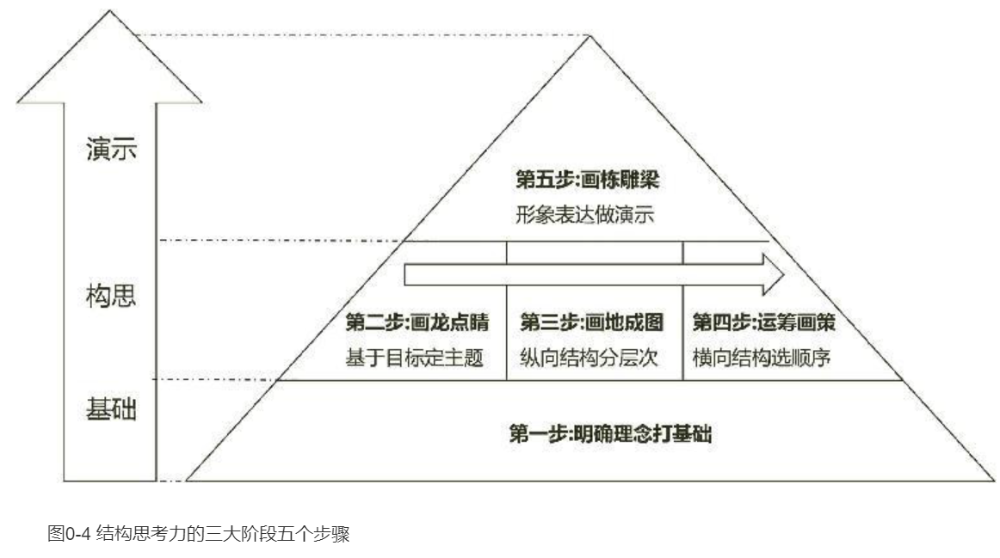

    作者: 李忠秋
    出版社: 电子工业出版社
    出版年: 2014-9-1
    页数: 208
    定价: 39.00
    装帧: 平装
    ISBN: 9787121239908

[豆瓣链接](https://book.douban.com/subject/26145094/)

- [导论 何为结构思考力?](#导论-何为结构思考力)
  - [Why——结构思考力的作用非凡](#why结构思考力的作用非凡)
  - [What——强调“先总后分”的立体化思考方式](#what强调先总后分的立体化思考方式)
  - [How——将结构思考力应用于思考和表达](#how将结构思考力应用于思考和表达)

# 导论 何为结构思考力?
## Why——结构思考力的作用非凡

类别 | 具备结构思考力的特点 | 不具备结构思考力的特点
---|------------|------------
解决问题 | 迅速抓住主要矛盾，忙而不乱应付任何问题 | 难以把握问题关键，经常遗漏关键要素
决策 | 能快速理出重点，果敢且科学做出决策 | 瞻前顾后，难以割舍，犹豫不决
写作 | 主题明确，结构严谨，层次清晰 | 找不到重点，大量文字和数字堆砌，结构混乱
表达、沟通 | 语言准确，思路清晰，能快速总结说话要点 | 很难把想要表达的思想在短时间内表达清楚
辅导 | 快速确定辅导目标，制定明确计划，理清核心 | 目标不明确，随机性较强，被辅导者难于理解

## What——强调“先总后分”的立体化思考方式
结构思考力是指以结构的视角从多个侧面全面而清晰的、强调`“先总后分”`的分析事物的一种方法。比如我们一起来思考这样一个问题：“如何能够将200ml的水装进100ml的杯子里？”

到现在稍微总结一下水之所以会流出来无外乎有三类原因：第一类原因是杯子本身，比如太小或没有张力；第二类原因是外部环境，比如有地球引力；第三类原因是水本身，比如它是液体会流动：

```mermaid
flowchart TB;
    r[200ml的水装进100ml的杯子水流出来的原因]-->a[杯子]
    r-->b[外部环境]
    r-->c[水]
```

结构思考力的核心理念源于芭芭拉·明托的《金字塔原理》一书。如图0-3所示，纵向结构上，每一组的观点都必须是其下一个层次观点的概括；横向结构上，每组各个观点互不重叠且有一定的逻辑顺序。

## How——将结构思考力应用于思考和表达

