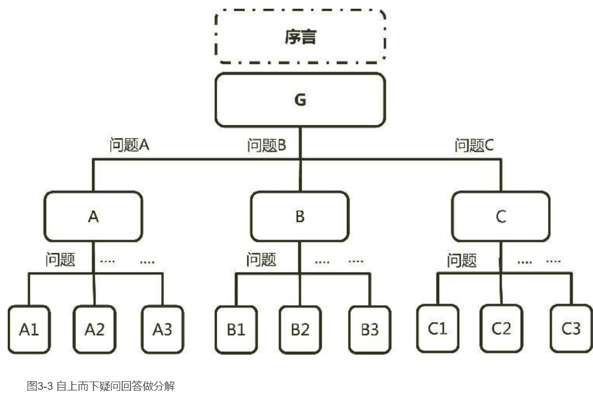

    作者: 李忠秋
    出版社: 电子工业出版社
    出版年: 2014-9-1
    页数: 208
    定价: 39.00
    装帧: 平装
    ISBN: 9787121239908

[豆瓣链接](https://book.douban.com/subject/26145094/)

- [导论 何为结构思考力?](#导论-何为结构思考力)
  - [Why——结构思考力的作用非凡](#why结构思考力的作用非凡)
  - [What——强调“先总后分”的立体化思考方式](#what强调先总后分的立体化思考方式)
  - [How——将结构思考力应用于思考和表达](#how将结构思考力应用于思考和表达)
- [明确理念打基础](#明确理念打基础)
  - [结构思考力的四个基本特点](#结构思考力的四个基本特点)
  - [结构化接收信息的三个步骤](#结构化接收信息的三个步骤)
- [基于目标定主题](#基于目标定主题)
  - [确定目标——让表达有的放矢](#确定目标让表达有的放矢)
    - [设定场景：提前设定表达场景](#设定场景提前设定表达场景)
    - [确定目标：目标是希望对方有哪些行为](#确定目标目标是希望对方有哪些行为)
  - [设定主题——让表达观点明确](#设定主题让表达观点明确)
    - [确定结论：一个为目标服务的结论](#确定结论一个为目标服务的结论)
    - [包装主题：一个打动人心的主题](#包装主题一个打动人心的主题)
  - [设计序言——让表达更吸引人](#设计序言让表达更吸引人)
    - [初步设计：完善序言的基本要素](#初步设计完善序言的基本要素)
    - [优选完善：根据需求选择不同模式](#优选完善根据需求选择不同模式)
- [纵向结构分层次](#纵向结构分层次)
  - [自上而下——疑问回答做分解](#自上而下疑问回答做分解)
  - [设想问题，从对方角度出发的新模式](#设想问题从对方角度出发的新模式)
  - [回答问题，提前想好答案事半功倍](#回答问题提前想好答案事半功倍)
  - [自下而上——概括总结做聚合](#自下而上概括总结做聚合)
  - [上下结合——两种方式不可分](#上下结合两种方式不可分)
- [横向结构选顺序](#横向结构选顺序)
  - [选择演绎——让说服更有力](#选择演绎让说服更有力)
  - [选择归纳——让要点更清晰](#选择归纳让要点更清晰)
  - [因需而动——两种顺序选其一](#因需而动两种顺序选其一)

# 导论 何为结构思考力?
## Why——结构思考力的作用非凡

类别 | 具备结构思考力的特点 | 不具备结构思考力的特点
---|------------|------------
解决问题 | 迅速抓住主要矛盾，忙而不乱应付任何问题 | 难以把握问题关键，经常遗漏关键要素
决策 | 能快速理出重点，果敢且科学做出决策 | 瞻前顾后，难以割舍，犹豫不决
写作 | 主题明确，结构严谨，层次清晰 | 找不到重点，大量文字和数字堆砌，结构混乱
表达、沟通 | 语言准确，思路清晰，能快速总结说话要点 | 很难把想要表达的思想在短时间内表达清楚
辅导 | 快速确定辅导目标，制定明确计划，理清核心 | 目标不明确，随机性较强，被辅导者难于理解

## What——强调“先总后分”的立体化思考方式
结构思考力是指以结构的视角从多个侧面全面而清晰的、强调`“先总后分”`的分析事物的一种方法。比如我们一起来思考这样一个问题：“如何能够将200ml的水装进100ml的杯子里？”

到现在稍微总结一下水之所以会流出来无外乎有三类原因：第一类原因是杯子本身，比如太小或没有张力；第二类原因是外部环境，比如有地球引力；第三类原因是水本身，比如它是液体会流动：

```mermaid
flowchart TB;
    r[200ml的水装进100ml的杯子水流出来的原因]-->a[杯子]
    r-->b[外部环境]
    r-->c[水]
```

结构思考力的核心理念源于芭芭拉·明托的《金字塔原理》一书。如图0-3所示，纵向结构上，每一组的观点都必须是其下一个层次观点的概括；横向结构上，每组各个观点互不重叠且有一定的逻辑顺序。


## How——将结构思考力应用于思考和表达


# 明确理念打基础
## 结构思考力的四个基本特点
>“董事长您好！刘经理来电话说系统出现突发状况，4点钟他无法参加会议了。小张说他晚一点开会没关系，明天再开也可以，但最好别11点30分之前开。可是会议室明天已经被别人预订了，但星期五是空着的。王总的秘书说，王总明天需要很晚才能从外地出差回来。我建议把会议的时间定在星期五的10点比较合适，您看行吗？”

```mermaid
graph TD;
    r[G今天下午4点的会议改在星期五10点]-->a[A参会人员星期五上午都方便]
    r-->b[B会议室周五还能预订]
    a-->a1[A1王总明天很晚才能从外地出差回来]
    a-->a2[A2刘经理4点钟因突发状况不能参会]
    a-->a3[A3小张说晚一点也没关系]
```

结构思考力的四个基本特点，即金字塔原理的四个基本原则：“结论先行”、“以上统下”、“归类分组”和“逻辑递进”。为了便于记忆，在此基础上提炼出“论证类比”四个关键字与四个特点一一对应：“论”对应结论先行；“证”对应以上统下，表示上面的结论是下面理由论证得来的；“类”对应归类分组；“比”对应逻辑递进，表示各种思想都需要通过对比的方式确定逻辑顺序（见图1-2）。


## 结构化接收信息的三个步骤
1. 识别信息中的事实、理由及结论。找出信息中哪些是观点类的，哪些是事实描述类的信息，观点类的信息中哪些是结论、哪些是支撑结论的理由，并将它们区分开。
   1. 寻找哪些是`观点`。何为观点？简单的理解是从一定的立场或角度出发，对事物或问题所持的看法。它是个人的看法区别于事实存在的。
   2. 确认哪个观点是`结论`。作为信息接收者想要知道对方到底想要表达什么就要明确其表达的结论。在众多的观点里如何判断哪个是对方想要表达的结论呢？结论在结构思考力当中也被称为“中心思想”。它首先是个观点，其次需要被别的观点（理由）或事实支撑，否则就不能称之为结论。
   3. 找出支持结论的理由。理由首先也是一个观点，是解释为什么结论可以被认可的原因，它告诉我们为什么可以相信这个结论。接下来就要判断这些观点中到底有哪些是支持结论的理由，因为只有结论被理由支撑了，才是有价值的结论。而且具备完整的结论、理由和事实的表达才会更加有说服力。

```mermaid
graph TD;
    r[结论]-->a[理由]
    r-->b[理由]
    a-->a1[事实]
    a-->a2[事实]
    a-->a3[事实]
    b-->b1[事实]
    b-->b2[事实]
```

2. 找到事实与观点的对应关系，并画出结构图。接下来找出这些事实与观点的对应关系，并依据事实、理由、结论的对应关系画出金字塔结构图。你要判断他结论的合理性就可以从以下两点出发：
   1. 看他提供的事实与数据是否真实。
   2. 这些事实与数据是否可以得出相应的理由、相应的理由是否可以得出最终的结论。
3. 一句话概括出所有内容。接收信息除了在前两步做到能够听清楚以外，最后还要用一句话概括出所有内容，做到说明白。

# 基于目标定主题
## 确定目标——让表达有的放矢
### 设定场景：提前设定表达场景
1. 确认目标前先设定好场景。我们需要提前设定好未来这一次表达的时间、地点、人物，你是谁，对方是谁，才能组织你的内容，而且这个场景越具体越好，因为即使同样的内容在不同场景下的目标可能都不相同。
2. 场景越具体内容才能更准确。场景设想越具体，越能保证目标和未来的结构更准确。
   1. 有一次在某通信公司上课，一个小组研讨的主题是“如何做好新春终端营销”，搭建出来的结构如图所示，一级目录包括“员工”、“渠道”、“客户”，等呈现环节的时候我就问他们设定的场景是什么呢？是跟谁说呢？上司、客户经理还是渠道商？他们才发现这事儿压根没想，只想了这件事到底该怎么干，而且发现无论跟谁说，这里也仅仅回答了“怎么做”的问题，而跟不同的对象说对方关心的“怎么样”的答案也不一样。

```mermaid
graph TD;
    r[如何做好新春终端营销]-->a[员工]
    r-->b[渠道]
    r-->c[客户]
    a-->a1[培训]
    a-->a2[营销]
    a-->a3[支撑]
    b-->b1[政策]
    b-->b2[宣传]
    b-->b3[铺货]
    c-->c1[宣传]
    c-->c2[促销]
    c1-->c11[主题]
    c1-->c12[方式]
    c2-->c21[送免]
    c2-->c22[礼物]
    c2-->c23[新春卡]
```

经过重新设定场景，我们确定这件事是给渠道商做动员。有了明确的场景，未来再设定目标和构建结构就简单多了。通过后面的步骤确定的目标是：① 希望他们全力在春节促销中完成终端销售任务；② 知道使用什么方法去卖这些产品。之后根据渠道经销商重点会关心的三个问题“有什么卖”、“为什么卖”（或者叫作“对他们有什么好处？”）和“怎么卖”搭建完的结构如图所示，更加清晰且有说服力。

```mermaid
graph TD;
    r[全面完成终端销售任务]--有什么卖-->a[三多]
    r--为什么卖-->b[包销赚大钱]
    r--怎么卖-->c[一免二送找对人]
    a-->a1[品牌多]
    a-->a2[模式多]
    a-->a3[机型多]
    b-->b1[包销有奖励]
    b-->b2[购机差价高]
    b-->b3[送电子券]
    c-->c1[免购机款]
    c-->c2[送费送礼]
    c-->c3[精准营销]
```

### 确定目标：目标是希望对方有哪些行为
这里的目标说的是，在你的一次表达之后，希望对方能有哪些行为。比如跟老板谈涨薪，你的目标可能是老板听完后马上决定给你加薪20%。比如你是向客户做一个产品推介，你的目标可能是客户听完以后了解产品并愿意掏钱购买产品。

这些行为要具体到现场是可以达成的，而不是你所表达的方案本身的目标。

`ABCD目标法`，每一条目标都要符合ABCD的标准：A代表受众（Actor）；B代表行为（Behavior），希望受众完成什么任务或表现出什么行为；C代表条件（Condition），在什么条件下；D代表程度（Degree），达到什么样的标准或水平。

比如作为资深的销售经理，想要用结构思考力将自己丰富的经验显性化地分享给销售员，他的目标可以定为：

1. 在我的引导下（C），新销售员（A）能够从我的故事中准确（D）总结出电话销售人员成功的关键要素（B）；
2. 根据我所提供案例中的信息（C），新销售员（A）能够运用我所教授的方法准确地（D）介绍产品利益点，并处理客户提出的异议（B）；
3. 在给定的客户信息及情境下（C），新销售员（A）能够准确（D）运用我所教授的方法与技巧进行电话销售全过程现场演练，完成销售任务（B）。

再比如，某银行的产品经理，希望针对客户经理进行“积分贷”产品的推介，未来能够提供客户在我行结算存款，进而实现小企业资金自求平衡。他的目标可能是

1. 在理念统一的前提下（C），客户经理（A）非常愿意（D）去跟新老客户推广“积分贷”产品（B）；
2. 在给定明确的需求下（C），客户经理（A）能够熟练（D）运用指定的营销技巧向客户推广“积分贷”产品（B）。

## 设定主题——让表达观点明确
首先要从主题上思考两个问题：

1. 你要说服对方接受你的什么观点；
2. 如何对这个观点进行包装，让观点更有吸引力。

### 确定结论：一个为目标服务的结论
表2-2 主题变化对比

原标题 | 修改后
----|----
×××银行信息安全的重要性 | 远离常见信息安全风险
绩效改革政策宣贯 | 绩效改革势在必行
“积分贷”产品介绍 | “积分贷”实现多方共赢
渠道管理方案介绍 | 我能实现渠道全面掌控
跨行资金归集产品推介 | 跨行资金归集是存款营销的重要手段
春节内部推荐政策 | 春节期间内推奖励翻番
×x公司战略规划报告 | 改革创新，降本增效，提升经营业绩
4G终端产品营销方案 | 加大资源投入，提升4G客户份额
房地产行业授信策略 | 房地产行业区域划分及授信策略建议
“心意保”产品介绍 | 员工专属产品“心意保”实惠多

### 包装主题：一个打动人心的主题
包装主题有三个基本原则：

1. 简单
2. 准确
3. 利益

表2-4 选题矩阵案例

包装主题 | 简单 | 准确 | 利益 | 总分
-----|----|----|----|---
今天你赚了吗？一调绩效，促发展 | 7 | 7 | 7 | 21
大家好才是真的好——绩效考核体系的构建目标 | 7 | 7 | 6 | 20
祝您致富——绩效考核攻策解读 | 6 | 7 | 7 | 20
我和我的小伙伴们都赚翻了一绩效考核政策精髓解读 | 8 | 9 | 8 | 25
致我们终将逝去的钱袋——构建业务发展的绩效体系 | 7 | 6 | 7 | 20
你好我好大家好—优化绩效体系引导说明 | 8 | 6 | 7 | 21
识势、顺势、借势——吃透用好绩效考核体系 | 6 | 7 | 8 | 21

表2-5 包装后主题与原主题的对比

原标题 | 修改后（副标题） | 包装后（主标题）
----|----------|---------
×××银行信息安全的重要性 | 远离常见信息安全风险 | 逃出虎口
绩效改革政策宣贯 | 绩效改革势在必行 | 聚焦利润，高效盈利
“积分贷”产品介绍 | “积分贷”实现多方共赢 | 小积分“贷”动大优惠
渠道管理方案介绍 | 我能实现渠道全面掌控 | 决胜生命线
跨行资金归集产品推介 | 跨行资金归集是存款营销的重要手段 | 把钱留住
春节内部推荐政策 | 春节期间内推奖励翻番 | 带着红包过大年
×x公司战略规划报告 | 改革创新，降本增效，提升经营业绩 | “药”不能停
4G终端产品营销方案 | 加大资源投入，提升4G客户份额 | 4G来了，你懂得
房地产行业区域划分及授信策略 | 房地产行业授信策略建议 | 因地制宜，进退有道
“心意保”产品介绍 | 员工专属产品“心意保”实惠多 | 发福利啦

## 设计序言——让表达更吸引人
### 初步设计：完善序言的基本要素
序言的讲故事结构包含4个要素：S是情景、C是冲突、Q是疑问、A是回答（解决方案），为便于记忆称为`SCQA`。

表2-6 序言的基本要素

- S(情景)：从我行实行企业业务专营模式以来，业务实现了快速增长
- C(冲突)：企业客户资金自身平衡问题成了制约业务进一步发展的瓶颈
- Q(疑问)：如何实现我行企业业务的可持续发展
- A(回答)：我部计划面向客户推介×××产品，实现业务联动、多方共赢

从我行实行企业业务专营模式以来，业务实现了快速增长，但小企业客户资金自身平衡问题成了制约业务进一步发展的瓶颈，如何实现我行企业业务的可持续发展？我部计划面向客户推介✕✕✕产品，实现业务联动、多方共赢。

- S（情景）需要让对方产生共鸣，必须让对方听完以后产生一种“对对，你说的没错”的反应。只有情景被认同了故事才能够继续发展。
- C（冲突）是打破开场时给对方的安全感，确认面临的问题。
- Q（疑问）是从对方的角度会关心的问题。
- A（回答）是基于这个问题我给你的回答。

### 优选完善：根据需求选择不同模式
一共有4种模式，分别是标准式、开门见山式、突出忧虑式、突出信心式（见图2-5）。

`标准式`：近年来，我行房地产业务得到快速发展，但随着房地产市场分化趋势日益明显，我行房地产业务面临的风险管理压力明显增大。因此我们应根据区域分化形势，确定差异化的授信政策。

```mermaid
flowchart LR
    A[情景]-->B[冲突]
    B-->C[解决方案]
```

`开门见山式`：我们应根据区域分化形势，确定差异化的授信政策。近年来，我行房地产业务得到快速发展，但随着房地产市场分化趋势日益明显，我行房地产业务面临的风险管理压力明显增大。

```mermaid
flowchart LR
    A[解决方案]-->B[情景]
    B-->C[冲突]
```

`突出忧虑式`：随着房地产市场分化趋势日益明显，我行房地产业务面临的风险管理压力明显增大。近年来，我行房地产业务得到快速发展，我们应根据区域分化形势，确定差异化的授信政策。

```mermaid
flowchart LR
    A[冲突]-->B[情景]
    B-->C[解决方案]
```

`突出信心式`：如何在确保实质风险可控的前提下，促进房地产业务快速发展？近年来，我行房地产业务得到快速发展，但随着房地产市场分化趋势日益明显，我行房地产业务面临的风险管理压力明显增大。因此我们应根据区域分化形势，确定差异化的授信政策。

```mermaid
flowchart LR
    X[疑问]-->A
    A[情景]-->B[冲突]
    B-->C[解决方案]
```

# 纵向结构分层次
## 自上而下——疑问回答做分解
通过疑问回答做分解可以达到两个目的：

1. 表达会非常吸引人，因为说的内容都是对方关心的问题；
2. 表达一定非常有说服力，因为对方关心的问题已经被一个一个解答过了。

自上而下疑问回答做分解构建金字塔结构的两个步骤，分别是设想问题、回答问题（见图3-3）。



## 设想问题，从对方角度出发的新模式
1. 转变为以对方需求为中心的思维模式
2. 通过5W2H确保问题被全面覆盖
   1. What：是什么？做什么？目的是什么？
   2. Why：为什么？为什么这样做？理由是什么？原因是什么？
   3. Who：谁来做？谁来负责？由谁来承担？谁来完成？
   4. When：什么时候开始做？什么时候完成？最佳时机是什么时候？
   5. Where：何处？在哪儿做？从哪儿入手做？
   6. How：如何做？怎么去做？从哪儿入手做？
   7. How much：做多少？完成量是多少？合格率是多少？费用是多少？
3. 掌握2W1H的简便方法，其实说的也是“是什么”、“为什么”和“如何做”三个方面，也就是2W1H（What、Why、How）。
4. 从2W1H到1—2—3简易结构思考力模型：1个中心思想，2W1H，3个理由

2W1H例子：

```mermaid
flowchart TB;
    r[xxx微信公众平台-您口袋里的心灵宝典]--What-->a[xxx微信公众平台-掌上的心灵宝典]
    r--Why-->b[给你的生活加点料]
    r--How-->c[三步法快速关注使用]
```

1—2—3模式的简易型结构思考力模型：

```mermaid
flowchart TB;
    r[1个中心思想]-->a[Why]
    r-->b[What]
    r-->c[How]
    a-->a1[理由1]
    a-->a2[理由2]
    a-->a3[理由3]
    b-->b1[理由1]
    b-->b2[理由2]
    b-->b3[理由3]
    c-->c1[理由1]
    c-->c2[理由2]
    c-->c3[理由3]
```

## 回答问题，提前想好答案事半功倍
1. 你的回答必须是结论.答案是结论才符合“结论先行”和“以上统下”这两条标准的要求。这里面的两个核心点大家体会一下：
   1. 结论先行，即每一个答案的本身就是一个结论，不能是“X框架特点的介绍”、“X框架特点的优劣势分析”。因为是结论才有可能回答上面设想的疑问，因为是结论才能引发下一个层级新的问题。
   2. 以上统下，就是下面的每一个都是回答上面问题的答案。

一家银行的产品经理，想要在一个高端客户产品推介会上介绍白金卡产品。设定的目标是：① 提高白金卡品牌知名度；② 达成现场营销；③ 树立本行企业形象。确定的主题是“非凡礼遇——✕✕✕白金卡你值得拥有”。

```mermaid
flowchart TB;
    r[xxx白金卡你值得拥有]--What-->a[白金卡介绍]
    r--Why-->b[产品优势分析]
    r--How-->c[办理流程]
```

后经讨论，把这个结论补充完整如下：

```mermaid
flowchart TB;
    r[xxx白金卡你值得拥有]--What-->a[为您量身定制的白金卡]
    r--Why-->b[与同业同类产品及我行其他产品对比有明显优势]
    r--How-->c[办理轻松便捷]
    a-->a1[高端定制]
    a-->a2[身份象征]
    a-->a3[借记卡]
    b-->b1[办理周期短]
    b-->b2[专属团队]
    b-->b3[费率优惠大]
    b-->b4[增值服务多]
    b-->b5[配套服务优]
    c-->c1[现有客户即可办理]
    c-->c2[办理渠道广泛]
```

2. 每个层级都需要是结论。比如某公司的营销负责人，向下属布置产品营销的任务，如图3-12所示，关于“如何做”的答案是“4P”，他在应用时存在的问题是4P本身不是结论，价格、产品、渠道、促销等都不是结论，仅仅是思考问题的一个框架而已。

```mermaid
flowchart TB;
    r[4P]-->a[价格Price]
    r-->b[产品Product]
    r-->c[渠道Place]
    r-->d[促销Promotion]
```

作为一种呈现的报告，要求这两个层次上都必须是结论。经过讨论后，把“4P”优化为“以4P为指导全面推进行动”，各层次内容的优化如图所示：

```mermaid
flowchart TB;
    r[以4P为指导全面推进行动]-->a[价格细分好]
    r-->b[产品融合好]
    r-->c[渠道协同好]
    r-->d[促销包装好]
```

一家大型国企县级公司的总经理，准备向市级公司总经理办公室汇报一个工作建议，希望增加市县资管专员这个岗位。设定的目标是希望领导能够同意方案，确定的主题是“让资源管理更高效——建议增加市县资管专岗专人”。图示是通过自上而下疑问回答做分解的方式搭建的金字塔结构，尽管设想问题和回答问题都比较全面，但因为各个层级的回答都不是结论，看到这样的框架后还是不知道他到底想要表达什么观点。

```mermaid
flowchart TB;
    r[建议增加资管专岗专人]--为什么-->a[现状及问题]
    r--如何增加-->b[增加方案]
    r--增加后效果如何-->c[效果评估]
    a-->a1[现状]
    a-->a2[问题]
    b-->b1[方式]
    b-->b2[数量]
    c-->c1[数据准确]
    c-->c2[业务发展]
    c-->c3[维护成本]
```

重新设想问题后又变为现象是什么？为什么会这样？解决方案是什么？实施后会有哪些效果？然后再一一回答。优化后的结构如图所示。

```mermaid
flowchart TB;
    r[建议增加资管专岗专人]--目前有哪些问题-->a[不能有效支撑生产]
    r--原因是什么-->b[系统和管理不完善]
    r--如何解决-->c[增配专人管理提高系统数据完整性准确性]
    r--效果会怎样-->d[降本增效]
    a-->a1[不知道规划]
    a-->a2[无法支撑集客发展]
    a-->a3[不知道故障处理]
    b-->b1[无专人管理]
    b-->b2[数据不完整不准确]
    c-->c1[配置专岗专人]
    c-->c2[一站式提升数据准确性]
    c-->c3[建立考核体系]
    d-->d1[增加准确性避免重复建设]
    d-->d2[加快集团业务响应速度]
    d-->d3[提升运维效率节省成本]
```

## 自下而上——概括总结做聚合
假设有人想给你的一位女性朋友介绍男朋友，你问他那个男人怎么样啊。他给你的回答是：“那个小伙子真是个不错的人，他的个头高高的、帅极了、富有人情味儿、思考的逻辑性很强、记忆力也是出类拔萃的、待人和蔼可亲、擅长数字方面的计算、是个非常潇洒的小伙子……”在他的表述中涉及了与这个人相关的8条非常零散的信息，你的第一感觉是这个人很不错，但到底哪儿不错呢？

我们可以通过结构思考力解决这个相亲的问题。

1. 罗列出这8条信息
2. 经过分析，这8个信息可以分为如下三类：
   1. 包括记忆力也是出类拔萃的、思考的逻辑性很强、擅长数字方面的计算，这三个信息都是跟“头脑”相关的；
   2. 包括富有人情味儿、待人和蔼可亲，这两个信息都是跟“待人”相关的；
   3. 包括个头高高的、帅极了、是个非常潇洒的小伙子，这三个信息都是跟“外表”相关的。

如图所示，完成了将大量的信息分类后放入金字塔结构中。

```mermaid
flowchart TB;
    r[G]-->a[头脑]
    r-->b[待人]
    r-->c[外表]
    a-->a1[思考的逻辑性很强]
    a-->a2[记忆力也是出类拔萃的]
    a-->a3[擅长数学方面的计算]
    b-->b1[富有人情味儿]
    b-->b2[待人和蔼可亲]
    c-->c1[个头高高的]
    c-->c2[帅极了]
    c-->c3[是个非常潇洒的小伙子]
```

将上面三个分类分别根据下面的要点进行概括总结，如图所示。最终清晰表述这个人：“这个小伙子的脑筋好、待人亲切且一表人才。”

```mermaid
flowchart TB;
    r[这个小伙子的脑筋好待人亲切且一表人才]-->a[脑筋好]
    r-->b[待人亲切]
    r-->c[一表人才]
    a-->a1[思考的逻辑性很强]
    a-->a2[记忆力也是出类拔萃的]
    a-->a3[擅长数学方面的计算]
    b-->b1[富有人情味儿]
    b-->b2[待人和蔼可亲]
    c-->c1[个头高高的]
    c-->c2[帅极了]
    c-->c3[是个非常潇洒的小伙子]
```

上述过程就是一个典型的自下而上概括总结式的过程，分为三个步骤。

1. 收集信息。将能够收集到的信息，全部罗列出来，比如上一个案例中的8个要点。
2. 分类。这个环节的原则是“归类分组”，确保同一组的思想都属于同一个范畴。
3. 概括总结。通过下面各个要点的观点，将每个分类概括出一个结论，当然还可以继续往上概括，直到金字塔结构的塔顶得出最终的结论为止。

## 上下结合——两种方式不可分
1. 用自上而下疑问回答做分解的方式搭框架
2. 用自下而上概括总结做聚合的方式完善框架

# 横向结构选顺序
## 选择演绎——让说服更有力
```
                G中心思想
                    |
A大前提-->B小前提-->C结论
```

演绎论证有两种形式，一种是`标准式`，另一种是`常见式`。演绎三段论就是标准式，而现象、原因、解决方案就是常见式。

```
标准式

    大前提          小前提          结论
[所有人都会死]-->[苏格拉底是人]-->[苏格拉底会死]

常见式

    现象                原因                解决方案
[业绩开始下滑]-->[人员能力有待提升]-->[抓紧内部课程开发与培训]
```

运用演绎常见式就是要将现象和原因区分开。比如，案例主题是“让✕✕✕产品‘High’起来，全年✕✕✕产品净增6 000户”，目标是向上司汇报如何提高✕✕✕产品的市场占有率，通过纵向结构搭建的框架如图所示。

```mermaid
flowchart TB;
    r[让xxx产品High起来 全年xxx产品净增6000户]--为什么-->a[产品重要指标落后]
    r--如何做-->b[出方案下目标分市场]
    a-->a1[进度落后]
    a-->a2[员工渠道劲头不足]
    a-->a3[发展空间大效益好]
    b-->b1[存量深度挖掘]
    b-->b2[新增积极拓展]
    b-->b3[员工发展激励]
```

当学完这部分内容之后，发现在“为什么”中有现象和原因混在一起的问题，所以信息接收者在接收汇报时就很难判断你的方案是否有效、是否解决了相关问题。经过讨论主框架，采用演绎的常见式之后，将现象和原因分开，优化后的框架如图所示。

```mermaid
flowchart TB;
    r[让xxx产品High起来 全年xxx产品净增6000户]--现象-->a[重要指标落后]
    r--原因-->b[产品发展规划使用及体验欠佳]
    r--解决方案-->c[全面政策优化]
    a-->a1[发展进度落后]
    a-->a2[客户投诉多]
    a-->a3[员工渠道劲头不足]
    b-->b1[发展规划开展欠佳]
    b-->b2[产品使用卡顿]
    b-->b3[体验营销牵引不利]
    c-->c1[大力拓展市场]
    c-->c2[不断优化产品]
    c-->c3[加强营销激励]
```

## 选择归纳——让要点更清晰
1. 在三种子顺序中选择一种分类方式。归纳结构共有三种子顺序。同一个任务可以按照时间、结构和重要性不同的方式来进行分类。
   - `时间顺序`：时间的先后顺序，彼此可能存在因果，也可能不存在因果；
   - `结构性顺序`：将整体分为部分，如按照顺时针，从上到下的顺序等；
   - `重要性顺序`：将事物按重要或非重要分组。
2. 运用`MECE（Mutually Exclusive Collectively Exhaustive）`确保分清、分尽

## 因需而动——两种顺序选其一
1. 演绎适用于需要说服对方时
2. 归纳适用于对方关注解决方案时
