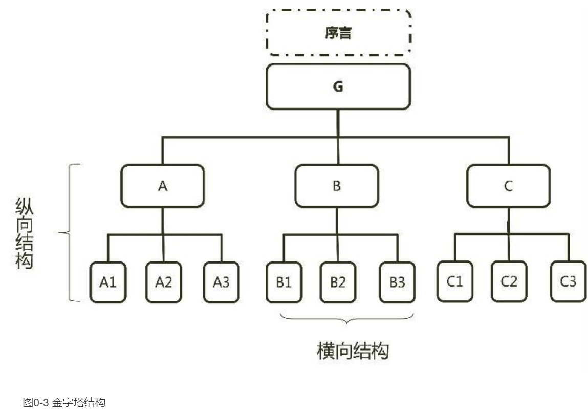

    作者: 李忠秋
    出版社: 电子工业出版社
    出版年: 2014-9-1
    页数: 208
    定价: 39.00
    装帧: 平装
    ISBN: 9787121239908

[豆瓣链接](https://book.douban.com/subject/26145094/)

- [导论 何为结构思考力?](#导论-何为结构思考力)
  - [Why——结构思考力的作用非凡](#why结构思考力的作用非凡)
  - [What——强调“先总后分”的立体化思考方式](#what强调先总后分的立体化思考方式)
  - [How——将结构思考力应用于思考和表达](#how将结构思考力应用于思考和表达)
- [明确理念打基础](#明确理念打基础)
  - [结构思考力的四个基本特点](#结构思考力的四个基本特点)
  - [结构化接收信息的三个步骤](#结构化接收信息的三个步骤)
- [基于目标定主题](#基于目标定主题)
  - [确定目标——让表达有的放矢](#确定目标让表达有的放矢)
    - [设定场景：提前设定表达场景](#设定场景提前设定表达场景)
    - [确定目标：目标是希望对方有哪些行为](#确定目标目标是希望对方有哪些行为)
  - [设定主题——让表达观点明确](#设定主题让表达观点明确)

# 导论 何为结构思考力?
## Why——结构思考力的作用非凡

类别 | 具备结构思考力的特点 | 不具备结构思考力的特点
---|------------|------------
解决问题 | 迅速抓住主要矛盾，忙而不乱应付任何问题 | 难以把握问题关键，经常遗漏关键要素
决策 | 能快速理出重点，果敢且科学做出决策 | 瞻前顾后，难以割舍，犹豫不决
写作 | 主题明确，结构严谨，层次清晰 | 找不到重点，大量文字和数字堆砌，结构混乱
表达、沟通 | 语言准确，思路清晰，能快速总结说话要点 | 很难把想要表达的思想在短时间内表达清楚
辅导 | 快速确定辅导目标，制定明确计划，理清核心 | 目标不明确，随机性较强，被辅导者难于理解

## What——强调“先总后分”的立体化思考方式
结构思考力是指以结构的视角从多个侧面全面而清晰的、强调`“先总后分”`的分析事物的一种方法。比如我们一起来思考这样一个问题：“如何能够将200ml的水装进100ml的杯子里？”

到现在稍微总结一下水之所以会流出来无外乎有三类原因：第一类原因是杯子本身，比如太小或没有张力；第二类原因是外部环境，比如有地球引力；第三类原因是水本身，比如它是液体会流动：

```mermaid
flowchart TB;
    r[200ml的水装进100ml的杯子水流出来的原因]-->a[杯子]
    r-->b[外部环境]
    r-->c[水]
```

结构思考力的核心理念源于芭芭拉·明托的《金字塔原理》一书。如图0-3所示，纵向结构上，每一组的观点都必须是其下一个层次观点的概括；横向结构上，每组各个观点互不重叠且有一定的逻辑顺序。

## How——将结构思考力应用于思考和表达

# 明确理念打基础
## 结构思考力的四个基本特点
>“董事长您好！刘经理来电话说系统出现突发状况，4点钟他无法参加会议了。小张说他晚一点开会没关系，明天再开也可以，但最好别11点30分之前开。可是会议室明天已经被别人预订了，但星期五是空着的。王总的秘书说，王总明天需要很晚才能从外地出差回来。我建议把会议的时间定在星期五的10点比较合适，您看行吗？”

```mermaid
graph TD;
    r[G今天下午4点的会议改在星期五10点]-->a[A参会人员星期五上午都方便]
    r-->b[B会议室周五还能预订]
    a-->a1[A1王总明天很晚才能从外地出差回来]
    a-->a2[A2刘经理4点钟因突发状况不能参会]
    a-->a3[A3小张说晚一点也没关系]
```

结构思考力的四个基本特点，即金字塔原理的四个基本原则：“结论先行”、“以上统下”、“归类分组”和“逻辑递进”。为了便于记忆，在此基础上提炼出“论证类比”四个关键字与四个特点一一对应：“论”对应结论先行；“证”对应以上统下，表示上面的结论是下面理由论证得来的；“类”对应归类分组；“比”对应逻辑递进，表示各种思想都需要通过对比的方式确定逻辑顺序（见图1-2）。

## 结构化接收信息的三个步骤
1. 识别信息中的事实、理由及结论。找出信息中哪些是观点类的，哪些是事实描述类的信息，观点类的信息中哪些是结论、哪些是支撑结论的理由，并将它们区分开。
   1. 寻找哪些是`观点`。何为观点？简单的理解是从一定的立场或角度出发，对事物或问题所持的看法。它是个人的看法区别于事实存在的。
   2. 确认哪个观点是`结论`。作为信息接收者想要知道对方到底想要表达什么就要明确其表达的结论。在众多的观点里如何判断哪个是对方想要表达的结论呢？结论在结构思考力当中也被称为“中心思想”。它首先是个观点，其次需要被别的观点（理由）或事实支撑，否则就不能称之为结论。
   3. 找出支持结论的理由。理由首先也是一个观点，是解释为什么结论可以被认可的原因，它告诉我们为什么可以相信这个结论。接下来就要判断这些观点中到底有哪些是支持结论的理由，因为只有结论被理由支撑了，才是有价值的结论。而且具备完整的结论、理由和事实的表达才会更加有说服力。

```mermaid
graph TD;
    r[结论]-->a[理由]
    r-->b[理由]
    a-->a1[事实]
    a-->a2[事实]
    a-->a3[事实]
    b-->b1[事实]
    b-->b2[事实]
```

2. 找到事实与观点的对应关系，并画出结构图。接下来找出这些事实与观点的对应关系，并依据事实、理由、结论的对应关系画出金字塔结构图。你要判断他结论的合理性就可以从以下两点出发：
   1. 看他提供的事实与数据是否真实。
   2. 这些事实与数据是否可以得出相应的理由、相应的理由是否可以得出最终的结论。
3. 一句话概括出所有内容。接收信息除了在前两步做到能够听清楚以外，最后还要用一句话概括出所有内容，做到说明白。

# 基于目标定主题
## 确定目标——让表达有的放矢
### 设定场景：提前设定表达场景
1. 确认目标前先设定好场景。我们需要提前设定好未来这一次表达的时间、地点、人物，你是谁，对方是谁，才能组织你的内容，而且这个场景越具体越好，因为即使同样的内容在不同场景下的目标可能都不相同。
2. 场景越具体内容才能更准确。场景设想越具体，越能保证目标和未来的结构更准确。
   1. 有一次在某通信公司上课，一个小组研讨的主题是“如何做好新春终端营销”，搭建出来的结构如图所示，一级目录包括“员工”、“渠道”、“客户”，等呈现环节的时候我就问他们设定的场景是什么呢？是跟谁说呢？上司、客户经理还是渠道商？他们才发现这事儿压根没想，只想了这件事到底该怎么干，而且发现无论跟谁说，这里也仅仅回答了“怎么做”的问题，而跟不同的对象说对方关心的“怎么样”的答案也不一样。

```mermaid
graph TD;
    r[如何做好新春终端营销]-->a[员工]
    r-->b[渠道]
    r-->c[客户]
    a-->a1[培训]
    a-->a2[营销]
    a-->a3[支撑]
    b-->b1[政策]
    b-->b2[宣传]
    b-->b3[铺货]
    c-->c1[宣传]
    c-->c2[促销]
    c1-->c11[主题]
    c1-->c12[方式]
    c2-->c21[送免]
    c2-->c22[礼物]
    c2-->c23[新春卡]
```

经过重新设定场景，我们确定这件事是给渠道商做动员。有了明确的场景，未来再设定目标和构建结构就简单多了。通过后面的步骤确定的目标是：① 希望他们全力在春节促销中完成终端销售任务；② 知道使用什么方法去卖这些产品。之后根据渠道经销商重点会关心的三个问题“有什么卖”、“为什么卖”（或者叫作“对他们有什么好处？”）和“怎么卖”搭建完的结构如图所示，更加清晰且有说服力。

```mermaid
graph TD;
    r[全面完成终端销售任务]--有什么卖-->a[三多]
    r--为什么卖-->b[包销赚大钱]
    r--怎么卖-->c[一免二送找对人]
    a-->a1[品牌多]
    a-->a2[模式多]
    a-->a3[机型多]
    b-->b1[包销有奖励]
    b-->b2[购机差价高]
    b-->b3[送电子券]
    c-->c1[免购机款]
    c-->c2[送费送礼]
    c-->c3[精准营销]
```

### 确定目标：目标是希望对方有哪些行为
这里的目标说的是，在你的一次表达之后，希望对方能有哪些行为。比如跟老板谈涨薪，你的目标可能是老板听完后马上决定给你加薪20%。比如你是向客户做一个产品推介，你的目标可能是客户听完以后了解产品并愿意掏钱购买产品。

这些行为要具体到现场是可以达成的，而不是你所表达的方案本身的目标。

`ABCD目标法`，每一条目标都要符合ABCD的标准：A代表受众（Actor）；B代表行为（Behavior），希望受众完成什么任务或表现出什么行为；C代表条件（Condition），在什么条件下；D代表程度（Degree），达到什么样的标准或水平。

比如作为资深的销售经理，想要用结构思考力将自己丰富的经验显性化地分享给销售员，他的目标可以定为：

1. 在我的引导下（C），新销售员（A）能够从我的故事中准确（D）总结出电话销售人员成功的关键要素（B）；
2. 根据我所提供案例中的信息（C），新销售员（A）能够运用我所教授的方法准确地（D）介绍产品利益点，并处理客户提出的异议（B）；
3. 在给定的客户信息及情境下（C），新销售员（A）能够准确（D）运用我所教授的方法与技巧进行电话销售全过程现场演练，完成销售任务（B）。

再比如，某银行的产品经理，希望针对客户经理进行“积分贷”产品的推介，未来能够提供客户在我行结算存款，进而实现小企业资金自求平衡。他的目标可能是

1. 在理念统一的前提下（C），客户经理（A）非常愿意（D）去跟新老客户推广“积分贷”产品（B）；
2. 在给定明确的需求下（C），客户经理（A）能够熟练（D）运用指定的营销技巧向客户推广“积分贷”产品（B）。

## 设定主题——让表达观点明确

