    作者:  [美] 彼得·圣吉 
    出版社: 中信出版社
    副标题: 学习型组织的艺术与实践
    译者: 张成林 
    出版年: 2009-10-1
    页数: 455
    定价: 58.00元
    装帧: 平装
    丛书: 第五项修炼系列
    ISBN: 9787508616827

[豆瓣链接](https://book.douban.com/subject/4051739/)

- [第一章 “给我一根足够长的杠杆……我就能用一只手撬动世界”](#%e7%ac%ac%e4%b8%80%e7%ab%a0-%e7%bb%99%e6%88%91%e4%b8%80%e6%a0%b9%e8%b6%b3%e5%a4%9f%e9%95%bf%e7%9a%84%e6%9d%a0%e6%9d%86%e6%88%91%e5%b0%b1%e8%83%bd%e7%94%a8%e4%b8%80%e5%8f%aa%e6%89%8b%e6%92%ac%e5%8a%a8%e4%b8%96%e7%95%8c)
- [第二章 你的组织有学习障碍吗？](#%e7%ac%ac%e4%ba%8c%e7%ab%a0-%e4%bd%a0%e7%9a%84%e7%bb%84%e7%bb%87%e6%9c%89%e5%ad%a6%e4%b9%a0%e9%9a%9c%e7%a2%8d%e5%90%97)
  - [7种学习障碍](#7%e7%a7%8d%e5%ad%a6%e4%b9%a0%e9%9a%9c%e7%a2%8d)
- [第三章 是系统的囚徒，还是我们自己思想的囚徒？](#%e7%ac%ac%e4%b8%89%e7%ab%a0-%e6%98%af%e7%b3%bb%e7%bb%9f%e7%9a%84%e5%9b%9a%e5%be%92%e8%bf%98%e6%98%af%e6%88%91%e4%bb%ac%e8%87%aa%e5%b7%b1%e6%80%9d%e6%83%b3%e7%9a%84%e5%9b%9a%e5%be%92)
- [第四章 第五项修炼的法则](#%e7%ac%ac%e5%9b%9b%e7%ab%a0-%e7%ac%ac%e4%ba%94%e9%a1%b9%e4%bf%ae%e7%82%bc%e7%9a%84%e6%b3%95%e5%88%99)
- [第五章 心灵的转变](#%e7%ac%ac%e4%ba%94%e7%ab%a0-%e5%bf%83%e7%81%b5%e7%9a%84%e8%bd%ac%e5%8f%98)
  - [正负反馈和延迟：系统思考的积木块](#%e6%ad%a3%e8%b4%9f%e5%8f%8d%e9%a6%88%e5%92%8c%e5%bb%b6%e8%bf%9f%e7%b3%bb%e7%bb%9f%e6%80%9d%e8%80%83%e7%9a%84%e7%a7%af%e6%9c%a8%e5%9d%97)
  - [正反馈：发现微小变化是如何增长的](#%e6%ad%a3%e5%8f%8d%e9%a6%88%e5%8f%91%e7%8e%b0%e5%be%ae%e5%b0%8f%e5%8f%98%e5%8c%96%e6%98%af%e5%a6%82%e4%bd%95%e5%a2%9e%e9%95%bf%e7%9a%84)
  - [负反馈：发现稳定因素和抵制的来源](#%e8%b4%9f%e5%8f%8d%e9%a6%88%e5%8f%91%e7%8e%b0%e7%a8%b3%e5%ae%9a%e5%9b%a0%e7%b4%a0%e5%92%8c%e6%8a%b5%e5%88%b6%e7%9a%84%e6%9d%a5%e6%ba%90)
  - [延迟：事情会发生的…...等时候一到](#%e5%bb%b6%e8%bf%9f%e4%ba%8b%e6%83%85%e4%bc%9a%e5%8f%91%e7%94%9f%e7%9a%84%e7%ad%89%e6%97%b6%e5%80%99%e4%b8%80%e5%88%b0)
- [第六章 自然的模板：识别支配事件的模式](#%e7%ac%ac%e5%85%ad%e7%ab%a0-%e8%87%aa%e7%84%b6%e7%9a%84%e6%a8%a1%e6%9d%bf%e8%af%86%e5%88%ab%e6%94%af%e9%85%8d%e4%ba%8b%e4%bb%b6%e7%9a%84%e6%a8%a1%e5%bc%8f)
  - [基本模式1 增长极限](#%e5%9f%ba%e6%9c%ac%e6%a8%a1%e5%bc%8f1-%e5%a2%9e%e9%95%bf%e6%9e%81%e9%99%90)
  - [基本模式2 转移负担](#%e5%9f%ba%e6%9c%ac%e6%a8%a1%e5%bc%8f2-%e8%bd%ac%e7%a7%bb%e8%b4%9f%e6%8b%85)
- [第七章 是自我局限，还是自我持续地增长](#%e7%ac%ac%e4%b8%83%e7%ab%a0-%e6%98%af%e8%87%aa%e6%88%91%e5%b1%80%e9%99%90%e8%bf%98%e6%98%af%e8%87%aa%e6%88%91%e6%8c%81%e7%bb%ad%e5%9c%b0%e5%a2%9e%e9%95%bf)
- [第八章 自我超越](#%e7%ac%ac%e5%85%ab%e7%ab%a0-%e8%87%aa%e6%88%91%e8%b6%85%e8%b6%8a)
  - [学习型组织的精神](#%e5%ad%a6%e4%b9%a0%e5%9e%8b%e7%bb%84%e7%bb%87%e7%9a%84%e7%b2%be%e7%a5%9e)
  - [超越与精通](#%e8%b6%85%e8%b6%8a%e4%b8%8e%e7%b2%be%e9%80%9a)
  - [自我超越的修炼](#%e8%87%aa%e6%88%91%e8%b6%85%e8%b6%8a%e7%9a%84%e4%bf%ae%e7%82%bc)
  - [保持必要的张力](#%e4%bf%9d%e6%8c%81%e5%bf%85%e8%a6%81%e7%9a%84%e5%bc%a0%e5%8a%9b)
  - [“结构性冲突”：你无能为力的力量](#%e7%bb%93%e6%9e%84%e6%80%a7%e5%86%b2%e7%aa%81%e4%bd%a0%e6%97%a0%e8%83%bd%e4%b8%ba%e5%8a%9b%e7%9a%84%e5%8a%9b%e9%87%8f)
  - [对真相的承诺](#%e5%af%b9%e7%9c%9f%e7%9b%b8%e7%9a%84%e6%89%bf%e8%af%ba)
  - [运用潜意识，就是说你真不必都想明白](#%e8%bf%90%e7%94%a8%e6%bd%9c%e6%84%8f%e8%af%86%e5%b0%b1%e6%98%af%e8%af%b4%e4%bd%a0%e7%9c%9f%e4%b8%8d%e5%bf%85%e9%83%bd%e6%83%b3%e6%98%8e%e7%99%bd)
  - [理性与直觉的融合](#%e7%90%86%e6%80%a7%e4%b8%8e%e7%9b%b4%e8%a7%89%e7%9a%84%e8%9e%8d%e5%90%88)
  - [看清我们与世界的联系](#%e7%9c%8b%e6%b8%85%e6%88%91%e4%bb%ac%e4%b8%8e%e4%b8%96%e7%95%8c%e7%9a%84%e8%81%94%e7%b3%bb)
  - [慈悲心](#%e6%85%88%e6%82%b2%e5%bf%83)
  - [对整体的承诺](#%e5%af%b9%e6%95%b4%e4%bd%93%e7%9a%84%e6%89%bf%e8%af%ba)
- [第九章 心智模式](#%e7%ac%ac%e4%b9%9d%e7%ab%a0-%e5%bf%83%e6%99%ba%e6%a8%a1%e5%bc%8f)
  - [在实践中进行心智模式的修炼](#%e5%9c%a8%e5%ae%9e%e8%b7%b5%e4%b8%ad%e8%bf%9b%e8%a1%8c%e5%bf%83%e6%99%ba%e6%a8%a1%e5%bc%8f%e7%9a%84%e4%bf%ae%e7%82%bc)
  - [心智模式的修炼](#%e5%bf%83%e6%99%ba%e6%a8%a1%e5%bc%8f%e7%9a%84%e4%bf%ae%e7%82%bc)
- [第十章 共同愿景](#%e7%ac%ac%e5%8d%81%e7%ab%a0-%e5%85%b1%e5%90%8c%e6%84%bf%e6%99%af)
  - [建立共同愿景的修炼](#%e5%bb%ba%e7%ab%8b%e5%85%b1%e5%90%8c%e6%84%bf%e6%99%af%e7%9a%84%e4%bf%ae%e7%82%bc)
  - [愿景的推广：加入、投入和顺从](#%e6%84%bf%e6%99%af%e7%9a%84%e6%8e%a8%e5%b9%bf%e5%8a%a0%e5%85%a5%e6%8a%95%e5%85%a5%e5%92%8c%e9%a1%ba%e4%bb%8e)
  - [共同愿景与第五项修炼](#%e5%85%b1%e5%90%8c%e6%84%bf%e6%99%af%e4%b8%8e%e7%ac%ac%e4%ba%94%e9%a1%b9%e4%bf%ae%e7%82%bc)
- [第十一章 团队学习](#%e7%ac%ac%e5%8d%81%e4%b8%80%e7%ab%a0-%e5%9b%a2%e9%98%9f%e5%ad%a6%e4%b9%a0)
  - [团队的智慧潜力](#%e5%9b%a2%e9%98%9f%e7%9a%84%e6%99%ba%e6%85%a7%e6%bd%9c%e5%8a%9b)
  - [团队学习的修炼](#%e5%9b%a2%e9%98%9f%e5%ad%a6%e4%b9%a0%e7%9a%84%e4%bf%ae%e7%82%bc)
    - [深度汇谈有三个必要的基本条件](#%e6%b7%b1%e5%ba%a6%e6%b1%87%e8%b0%88%e6%9c%89%e4%b8%89%e4%b8%aa%e5%bf%85%e8%a6%81%e7%9a%84%e5%9f%ba%e6%9c%ac%e6%9d%a1%e4%bb%b6)
    - [深度汇谈和商讨的平衡](#%e6%b7%b1%e5%ba%a6%e6%b1%87%e8%b0%88%e5%92%8c%e5%95%86%e8%ae%a8%e7%9a%84%e5%b9%b3%e8%a1%a1)
    - [反思、探寻与深度汇谈](#%e5%8f%8d%e6%80%9d%e6%8e%a2%e5%af%bb%e4%b8%8e%e6%b7%b1%e5%ba%a6%e6%b1%87%e8%b0%88)
    - [面对“现实”：冲突与习惯性防卫](#%e9%9d%a2%e5%af%b9%e7%8e%b0%e5%ae%9e%e5%86%b2%e7%aa%81%e4%b8%8e%e4%b9%a0%e6%83%af%e6%80%a7%e9%98%b2%e5%8d%ab)
    - [缺失的环节：实习演练](#%e7%bc%ba%e5%a4%b1%e7%9a%84%e7%8e%af%e8%8a%82%e5%ae%9e%e4%b9%a0%e6%bc%94%e7%bb%83)
- [附录一 各项学习修炼](#%e9%99%84%e5%bd%95%e4%b8%80-%e5%90%84%e9%a1%b9%e5%ad%a6%e4%b9%a0%e4%bf%ae%e7%82%bc)
- [附录二 系统基本模式](#%e9%99%84%e5%bd%95%e4%ba%8c-%e7%b3%bb%e7%bb%9f%e5%9f%ba%e6%9c%ac%e6%a8%a1%e5%bc%8f)
  - [1.有延迟的负反馈](#1%e6%9c%89%e5%bb%b6%e8%bf%9f%e7%9a%84%e8%b4%9f%e5%8f%8d%e9%a6%88)
  - [2.增长极限](#2%e5%a2%9e%e9%95%bf%e6%9e%81%e9%99%90)
  - [3.转移负担](#3%e8%bd%ac%e7%a7%bb%e8%b4%9f%e6%8b%85)
  - [特别案例：转移负担到介入者身上](#%e7%89%b9%e5%88%ab%e6%a1%88%e4%be%8b%e8%bd%ac%e7%a7%bb%e8%b4%9f%e6%8b%85%e5%88%b0%e4%bb%8b%e5%85%a5%e8%80%85%e8%ba%ab%e4%b8%8a)
  - [4.目标侵蚀](#4%e7%9b%ae%e6%a0%87%e4%be%b5%e8%9a%80)
  - [5.恶性竞争](#5%e6%81%b6%e6%80%a7%e7%ab%9e%e4%ba%89)
  - [6.强者愈强](#6%e5%bc%ba%e8%80%85%e6%84%88%e5%bc%ba)
  - [7.公地悲剧](#7%e5%85%ac%e5%9c%b0%e6%82%b2%e5%89%a7)
  - [8.饮鸩止渴](#8%e9%a5%ae%e9%b8%a9%e6%ad%a2%e6%b8%b4)
  - [9.增长与投入不足](#9%e5%a2%9e%e9%95%bf%e4%b8%8e%e6%8a%95%e5%85%a5%e4%b8%8d%e8%b6%b3)
- [附录三 U型过程](#%e9%99%84%e5%bd%95%e4%b8%89-u%e5%9e%8b%e8%bf%87%e7%a8%8b)

## 第一章 “给我一根足够长的杠杆……我就能用一只手撬动世界”
有五项新的构件技术正在逐步集中到学习型组织创新过程中。虽然是分别开发的，但就像任何技术集合一样，我认为它们中的每一项都将成为其他各项成功运用的关键。每一项技术对于从事真正“学习型”的、能持续开拓能力以实现自己最高理想的组织建设工作，都至关重要。这五项技术是：

- 系统思考(systems thinking)
    - 商业以及其他人类活动也是一种系统。这些活动也是由一系列相互关联的行动所组成的无形网络编织在一起，但这些活动之间的相互影响，常常需要很多年的时间才能完全显现出来。由于我们自己“身在此山中”，要看清整个系统演变的模式便是难上加难了。因此，我们总是把注意力集中在为系统的各个孤立组成部分拍摄快照上，然后纳闷为什么我们最深层的问题总是得不到解决。系统思考是一个概念框架，一个知识体系，一个在过去50年里开发出来的工具系列，它的功能是让各类系统模式全部清晰可见，并且帮助我们如何有效地改变这些模式。
- 自我超越(personal mastery)
    - 自我超越是不断澄清和加深我们的个人愿景的修炼，是持续集中我们的能量、增强我们的毅力，并客观地观察现实的修炼。因而，它是学习型组织的重要基石-或者说是学习型组织的精神基础。一个组织在学习方面的信念和能力，不会超过组织成员在这方面的信念和能力。这项修炼的根基在于东方和西方的精神传统，当然也存在于世俗生活传统中。
- 心智模式(mental models)
    - 心智模式是决定我们对世界的理解力和行为方式的那些根深蒂固的假设、归纳，甚至就是图像、画面或形象。我们通常不能察觉自己的心智模式以及它对自己行为的影响。心智模式的修炼要从省视自己开始-学习如何把我们内心的、有关世界的图像披露出来，让它们“浮出水面”，并严格仔细地加以审查。这项修炼好包括“富于学习性”的交流沟通：把对对方好奇的探寻与对自己想法的宣扬相结合，在有效地表达自己思想的同时，也开放自己的思想，以接受他人的影响。
- 共同愿景(shared vision)
    - 当真心的愿景建立起来的时候，人们都会力行卓越，用心学习，积极上进。这不是因为有人叫他们这么做，而是因为他们想这么做。虽然很多领导有个人愿景，但他们却从没能把它变为激励组织的共同愿景。很多时候，公司的共同愿景仅仅是围绕某个领导的个人魅力，或者使大家兴奋一时的某种危机。但是，如何可以挑选，大多数人不仅在危机时刻会选择一个高尚的目标，在所有时间里都会如此。
- 团队学习(team learning)
    - 团队学习的修炼要从“深度汇谈”(dialogue)开始。深度汇谈是团队成员“悬挂”(即暂时忘掉)假设和成见而进入真正的“共同思考”的过程。深度汇谈的修炼还需要学习如何辨别团队中那些妨害学习的交往模式。自我防卫的习惯模式常常是团队交往中根深蒂固的障碍。如果没有察觉，这种习惯模式就会妨碍学习。而如果有所察觉并且创造性地使它浮出水面，它还能加速学习进程。

从事一项修炼就意味着成为一个终身学习者，这个过程永无止境，你要花一辈子的时间来掌握和精通它。

系统思考成为`第五项修炼(fifth discipline)`。它是整合其他修炼的修炼，它把其他修炼融入一个条理清晰一致的理论和实践体系。它防止了其他修炼变成分散独立的花招，或最新流行的组织变革时尚。没有系统的观点，就不会想去了解各项修炼之间的关联。通过强化其他各项修炼，第五项修炼不断提醒我们：整体大于局部的组合。

## 第二章 你的组织有学习障碍吗？
### 7种学习障碍
- 障碍1 “我就是我的职位”
    - 当组织中的人们只关注自己的职位时，他们就对所有职位之间因相互关联而产生的结果缺乏责任感。另外，当结果令人失望时，要找出其原因也会很困难。
- 障碍2 “敌人在外部”
    - 当发生问题时，我们每个人都有这种倾向：去责怪我们身外的人或事。而有些组织则会把这种倾向提升成为命令，说：“你们必须找到问题的外部责任方，这是个原则。” “敌人在外部”这一障碍的症状，其实是“我就是我的职位”观念的副产品，是这种观念导致的结果-观察世界缺乏系统性。当我们只关注自己的职位时，我们就无法看清自己的行动在超越自己职位边界范围之外的影响。
- 障碍3 掌控的幻觉
    - 主动积极往往只是被动反应的一种伪装掩饰。无论在工商界还是在政界，如果我们只是对“外部的敌人”采取更积极的攻击性战斗，我们还是在被动反应-不管我们怎么称呼它。只有当我们认识到，我们是自己问题的始作俑者之一，才能达到真正的积极主动。这种主动是我们思考方法的结果，而不是我们情绪状态的产物。
- 障碍4 执着于事件
    - 组织机构中的交谈都被事件所主导：上个月的销售额、新的预算裁剪、上季度的利润、谁得到升迁或被解雇、竞争对手新推出的产品、我们推迟发布新产品的通知，等等。同时，媒体又在不断强化对短期事件的关注：无论如何，什么事超过两天就不是“新闻”了。强调事件导致了“事件式”的诠释描述：“今天道琼斯工业指数下降了16点”，报纸报道说，“因为昨天发布了第四季度利润走低的预期。”这类诠释也许没有错，但它转移了我们对事件背后长期规律性模式的注意力，干扰了我们对这些长期模式的理解力。
    - 如果大家的思想都被短期事件主导，那么一个组织就不可能持续地从事有创意的生成性学习。
- 障碍5 煮蛙寓言
    - 企业对缓慢积累的生存威胁普遍缺乏应对措施。
    - 学会观察缓慢、渐进的过程，要求我们放慢自己忙乱的脚步，去注意那些细微的，以及戏剧性的变化。假如你坐下来注视前方的那片潮水滩，刚开始看不出什么东西。但如果你花足够长的时间，大约十几分钟，潮水滩会突然在你眼前呈现出生命。其实那个美丽的生物世界一直都在那里，只是它运动速度太缓慢，我们不容易一开始就发现它。问题是我们的心总是被锁在一个固定频率上，好像只能观察到每分钟跳动78次的东西，而看不到每分钟跳动33 1/3次的东西。如果不学会放慢脚步，去察觉那些常常是最具危险性的渐变过程，我们就不能避免煮蛙的命运。
- 障碍6 从经验中学习的错觉
    - 我们遇到了组织机构的核心学习悖论：我们从经验中学习得最好，但许多最重要的决策所带来的结果恰恰是我们无法直接体验的。许多组织的最大的决定，会在数年或数十年的时间里、在整个系统范围内产生影响。
    - 如果决策的作用周期超过一两年，就很难看清并从中学习。
- 障碍7 管理团队的神话
    - 大多数经理人都觉得集体探寻本来就具有威胁性。学校教育告诉我们：永远不能承认我们不知道答案。而大多数公司还在强化这种训练，奖励善于推销自己观点的人，却忽视对复杂问题的探寻。即使我们感到没有把握，或者根本就不懂，我们还是学会了保护自己，避免由于暴露我们没有把握或无知所带来的痛苦。这一过程正好阻止了新知识的形成，而新知识是可能给我们带来威胁的。这样做的结果，就是阿吉里斯所说的“老练的无能”(skilled incompetence)-团队成员非常擅长躲避学习。

## 第三章 是系统的囚徒，还是我们自己思想的囚徒？
**系统思考的第一条原则：结构模式影响行为。** 当置身于同一个系统中时，人们无论有多大差别，都倾向于产生相似的行为结果。

典型的“管理自己的职位”这一做法的缺陷在于，你看不到自己与他人的订单之间相互作用而产生的影响，这些影响往往被你当做是“外部的”。

从系统角度看，对于任何复杂的情况，都有多层面的解释，如下图所示。在某种意义上，所有解释都是“正确的”，但这些解释的用途却各不相同。对事件的解释，比如“谁对谁做了什么”，注定会将持有这种观点的人局限在反应式的心态上。

```
系统结构    ->  行为模式    ->  事件
（有生成力的）  （回应式的）    （反应式的）
（generative） （responsive） （reactive）
```

“行为模式”描述的是看到长期趋势，并判断里面深藏的含义。比如，在啤酒游戏里，从行为模式角度的解释是：“生产和分销系统本来就受到市场波动的制约，会产生不稳定性，这种情况随着你远离零售商，越靠产业链上游就越严重。所以，啤酒厂迟早要发生严重的危机。”理解了行为模式，会帮助你从短期反应式心态中解脱出来；至少这种理解告诉我们，面对长期变化着的趋势，我们是能够作出回应的。

第三层，系统“结构上”的解释最不常见，但却最有利。它把重点放在回答以下问题上：“是什么导致了这样的行为模式？”在啤酒游戏中，结构上的解释必须能够说明，参与者各自下的订单、发的货，以及库存之间如何相互影响，产生了我们观察不到的不稳定和放大作用。为此必须考虑到，当系统固有的对新订单延迟送货的情况出现，以及延迟又引起更多的订单时，将会造成恶性循环。尽管它不多见，但结构上的解释如果很清楚，并得到广泛理解，那就能起到很大作用。

## 第四章 第五项修炼的法则
- 法则1 今天的问题来自昨天的“解决方法”
    - 把问题从系统的一部分转移到另一部分的解决方案，往往不会引起注意，因为，这里继承了新问题的人并不是原来那位“解决了”第一个问题的人。
- 法则2 你越使劲儿推，系统的反弹力越大
    - “补偿反馈”(compensating feedback)，即愿望良好的措施介入后引起系统的反应，结果抵消了介入行动所带来的好处。我们都知道遇到补偿反馈时是什么感觉：你越是使劲儿推，系统的反弹力越大；你越努力试图改进，似乎越要求你付出更多的努力。
- 法则3 情况变糟之前会先变好
    - “先好后糟”是许多管理措施的后果，正是它，使得政治性决策过程往往制造出毫无裨益的反效果。“政治性决策过程”是指在比较各类替代方案本身的价值之外，还考虑了各种其他因素的决策过程-如扩大自己的势力范围，“挣得体面”或者“讨好老板”。在复杂的人类系统中，总有无数种方法来让短期效果很好看。只不过补偿反馈的阴魂，会逐渐兜着圈子回来缠绕你。
- 法则4 选择容易的办法往往会无功而返
    - 我们都对使用熟悉的方法解决问题感到放心，总是坚持我们最了解的办法。有时，钥匙可能恰巧就在路灯下，但更多时候会藏在黑暗的地方。不管怎样，假如解决方法真的能那么轻易地被发现，或对每个人都那么明显，那它可能早就已经被发现了。用熟悉的方法使劲儿努力，再努力，而深层的根本问题并没有改变，或更加恶化，乃是“非系统思考”的可靠指示信号-我们经常把它称为“我们这儿需要更大号锤子”综合症。
- 法则5 疗法可能比疾病更糟糕
    - 短期改善引起长期依赖的现象如此普遍，以至于在系统思考中有了专门的名称，叫做“转移负担给介入者”。
- 法则6 快就是慢
    - 几乎所有自然系统，从生态系统到动物再到人类组织，都有天然固有的最佳成长速度。`最佳成长速度`，比可能的最快成长速度要慢很多。当增长过快时，系统自身会自动放慢速度来做补偿，这个过程可能会给组织的生存带来风险。从长期看，更快可能导致更慢，甚至完全停止。
- 法则7 因和果在时空中并不紧密相连
    - 放弃因和果在时空上紧密连接的观念。
- 法则8 微小的变革可能产生很大的成果-但最有效的杠杆常常最不易被发现
    - 微小的、集中的行动，如果选对地方，有时会带来可观的、可持续的改善。系统思考学者们把这个原则叫做“`杠杆作用`”(levelage)。寻找高杠杆效益的变革没有简单的规则可循，但有一些思考方法会使这项工作更有可能完成。起点之一，是学会观察事件背后的结构模式，而不是事件本身。
- 法则9 鱼和熊掌可以兼得-但不是马上
    - 从系统观点来看，有些棘手的悖论难题实际上完全不是什么难题。它们只不过是由于放弃了“过程”思考方法，而用“拍快照”方法所形成的人为难题。许多显见的悖论，如集中控制与局部控制、员工满意度与劳动力成本控制、奖励个人成果和体现集体价值等等，这些都是静态思考的产物。它们看上去是“非此即彼”的刚性选择，但那是因为我们处在固定的时空点考虑问题。
- 法则10 把大象切成两半得不到两头小象
    - 有些问题只能从观察生产、营销和研发等主要功能部门的互动中理解。但也有一些问题，是在某个功能部门之内就可以找到涉及整个系统的关键影响力。还有一些问题，是必须把整个产业的情况都考虑在内才能澄清。有一个重要原则，叫做`“系统边界原则”(principle of the system boundary)`，它告诉我们必须考虑到的互动因素，是对眼下某个具体问题最重要的因素，而不用考虑范围有限的组织边界。
    - 这个原则之所以难以实践，是因为组织的设计方式阻碍着人们去观察重要的互动关系。
    - 有时人们真会把大象分成两半。但你不会得到两头大象，你得到的是一团混乱。在这里“混乱”是指一个没有杠杆点可用的复杂的问题局面，杠杆效应存在于互动之中，如果你只看到你拥有的一部分，是不可能观察到互动关联的。
- 法则11 不去责怪
    - 系统思考告诉我们，分立的“他人”并不存在，你和那个被责怪者都是同一个系统的组成部分。

## 第五章 心灵的转变
高度发达的尖端预测工具和商务分析工具，以及精确的战略规划，通常都不能给企业带来管理的突破性进展。这些工具都是用来处理那种有着许多变量的复杂性问题，即“`细节复杂性`”(detail complexity)问题的。但是，还有另一种复杂性，即“`动态复杂性`”(dynamic complexity)。这种复杂性出现在因果关系很微妙的地方。那里，介入措施所带来的时空效果并不是显而易见的。通常的预测、规划和分析方法，都不足以处理带有动态复杂性的问题。依据一系列复杂的操作规范来组装一台机器，就是带有细节复杂性的任务，而在折扣零售店组织库存清单也是。但这些都不是带有动态复杂性的情况。

当同样的行动会带来并不相同的短期和长期效果的时候，动态复杂性就显现了。同样，当一个行动在局部产生一种结果，而在系统的另一部分却产生了截然不同的结果，这也有动态复杂性的作用。当显而易见的措施却产生了并非显而易见的结果，那也是动态复杂性的局面。

**在绝大多数管理工作中，真正的杠杆效益在于理解动态复杂性，而不是细节复杂性。**

系统思考修炼的实质是心灵的转变：
- 看清各种互相关联的结构，而不是线性的因果链。
- 看清各种变化的过程模式，而不是静态的“快照图像”。

系统思考的一个公理就是，每一个影响作用既是因，也是果。没有只存在于一个方向的作用。

### 正负反馈和延迟：系统思考的积木块
有两种不同类型的反馈过程：正反馈和负反馈。`正反馈(或放大反馈)`过程是增长的引擎。只要你处在增长的局面，一定就有正反馈作用。正反馈过程也可以产生加速的衰减：很小的衰减被放大成越来越严重的衰减，就像金融恐慌时银行财产的衰减情况一样。

`负反馈(稳定反馈)`起作用时，就有以目标为导向的表现。如果目标是稳定不动，那么负反馈的作用就像车上的刹车装置。如果目标是保持每小时60英里的速度，那么负反馈作用就会让车加速到每小时60英里，但不会再高。目标可以是明确的，例如公司的市场份额目标；也可以是隐性的，比如一个坏习惯，尽管我们声称要去掉，但还是坚持不改。

另外，许多反馈过程都有“`延迟`”，就是影响作用过程的间歇和中断，它使作用的结果逐渐才能显现出来。

系统思考语言中的所有观念，都是以这三个元素为基础建立的。

### 正反馈：发现微小变化是如何增长的
下面就是口口相传增加销售和满意度的正反馈示意图：


如果产品本身是个好产品，那么其销量越多，满意的顾客也越多。这意味着正面的评价也越多，进而会带来更多的销量，而更多的销量又将带来更广泛的好评，以此类推。反过来说，如果产品有缺陷，那么良性循环就变成了恶性循环：在购买了产品的顾客里，满意的人寥寥无几，也没什么正面评价，这将导致该产品的销量越来越少。正反馈环路的表现不是加速的增长，就是加速的衰减。

### 负反馈：发现稳定因素和抵制的来源
负反馈系统是寻求稳定的系统。和所有负反馈一样，关键要素指标，如体温，会逐渐调节到期望值，如下图：


在管理实践中发现负反馈作用的难点在于，目标往往是隐性的，而且根本没有人承认有负反馈作用存在。

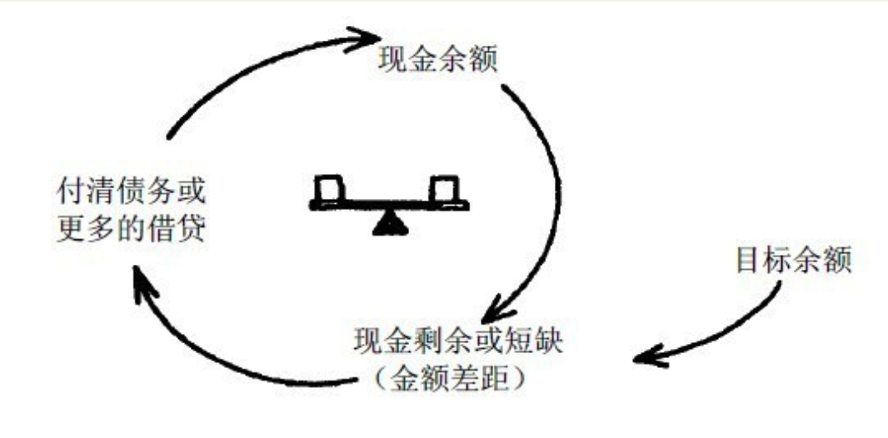

要看清楚上面这张图，从差距入手往往是最容易的。差距指的是期待值和现实存在之间的差异：在这里，我们手中缺少足够的现金，不能满足我们现金流的需要(换句话说，我们的期待和现实的现金金额之间存在着差距)。接着来看为了弥补这个差距所采取的措施：我们借钱，这使我们的现金金额增加，并使差距缩小了。

图中显示了一个平衡过程的运转，它总是以缩小期待值和现实存在之间的差异为目标。此外，目标值，也就是我们所期望的现金金额，会随着业务量的变化而升降。尽管如此，即使是目标正在变化，平衡过程仍会根据需要值来调整实际的现金金额。

### 延迟：事情会发生的…...等时候一到
延迟就是在行动和结果之间的间断和空隙。它可以让你行动过火，搞得适得其反；但如果你能够辨认并应对它，它又能给你带来积极的效果。

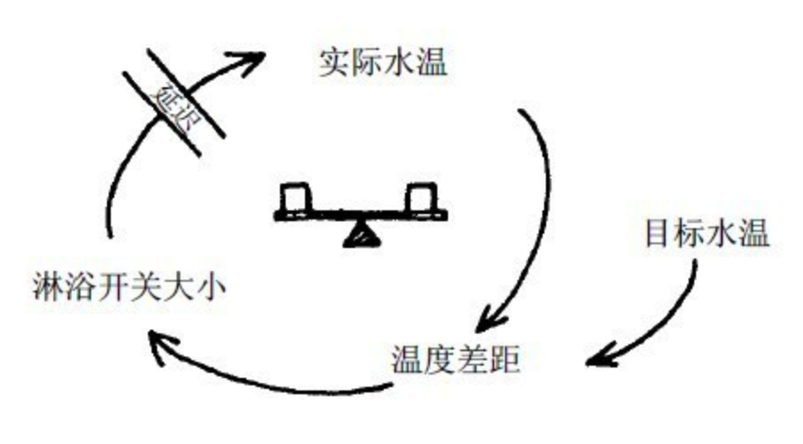

上图描绘的是伴随着延迟的负反馈过程：水温变化迟缓的淋浴。

带延迟的负反馈环路的经验和教训：过猛的行动会导致适得其反的结果，它不会帮你迅速实现目标，只会导致不稳定和震荡的情况。正反馈中的延迟也是同样的问题。

## 第六章 自然的模板：识别支配事件的模式
### 基本模式1 增长极限
- 定义
    - 一个正反馈(放大)过程开始启动，产生一个期望的结果。它创造一个成功增长螺旋，但也无意之中产生副作用(在负反馈过程中显现的)，从而使增长放缓。
- 管理原则
    - 不要强行推动增长，要消除限制增长的因素。
- 结构
    - 每个增长极限的案例中都有一个正反馈(放大)过程，在一段时间里它自己就会产生增长或改进作用。然后它会碰到一个负反馈(稳定)环路，后者开始发挥限制增长的作用，改进速度会因此放缓，甚至完全停止。

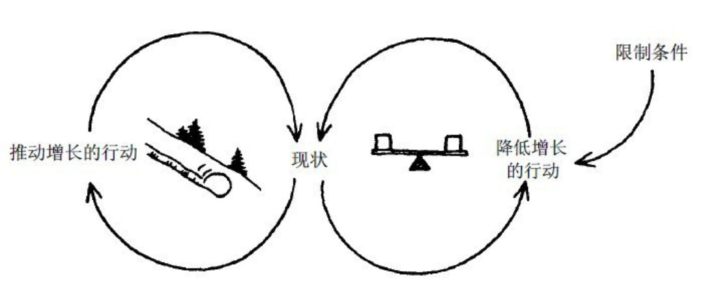

要理解增长极限模式图，首先应当看懂正反馈增长环路，它是最初提供增长势头的结构模式。

例子1


增加新产品会产生利润，利润增加会再投入到更多的新产品开发中。然而，到了一定阶段，影响作用会发生变化-比如这里，研发经费增加到一定程度，会逐渐导致研发工作复杂程度太高。结果是，如果不把高级工程师的宝贵时间从产品研发分散到管理上，就无法保证对研发工作实施足够的管理。经过一段时间的延迟(延迟的时间长短依赖于增长率、产品复杂程度和工程师的管理技能)，新产品推出的速度就会放缓，从而降低整个企业的增长速度。

例子2


专业组织，如律师事务所或咨询公司。一开始规模较小的时候它们增长非常快，职业晋升机会也非常多，公司士气高涨，年轻有为的员工激情迸发，并期待在10年内成为合伙人。但是随着公司发展壮大，它的增长速度也放缓了。也许它的缝隙市场已经开始饱和；也许到了一定规模以后，创始合伙人对保持快速增长再也没什么兴趣了。不管出于什么原因，随着增长放缓，职业升迁的机会就会变少，年轻的专业人员之间的竞争就会更加激烈，从而使整体的士气受到影响。

- 如何找出杠杆作用点
    - 每个增长极限的情况杠杆作用都在负反馈环路上，而不在正反馈环路。要改变系统的现状，就必须辨别并改变负反馈限制因素的影响。另外，限制作用总会存在的。一种限制因素被排除或削弱了，增长就又回来了，但新的限制因素还会出现。
- 如何写出自己的“增长极限”故事
    - 首先，辨认出正反馈-什么变得更好了，又是什么行动环节带来了改进？(也许正反馈中还有其他组成因素，但通常这里至少有一种状况在改进，而且肯定有一个行动环节带来了这种改进。)

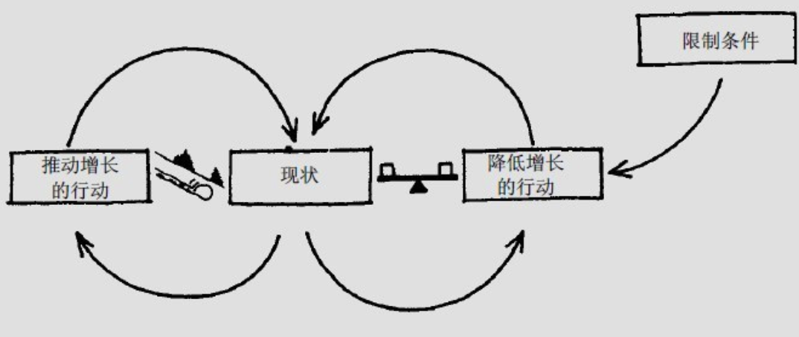

然而无论怎样，总有一个限制因素存在，它往往是一个隐性目标，一个规范标准，或是一个有限资源。第二步是去认清这个限制性因素和它所带来的负反馈。是哪种“减缓行动”或者阻力开始介入，使情况不再继续改善了呢？

一旦你看清了自己的处境，就要开始寻找杠杆作用点。你不能过于用力，因为那样反而会加强阻力。可能更需要的是减弱或者消除限制条件。

### 基本模式2 转移负担
- 定义
    - 由深层问题产生的症状急需我们的关注。但大家感到很难解决，也许因为问题还模糊不清，也许因为处理起来代价会太高，所以，就把问题“转移负担”到其他解决方法上，这些解决方法意图良好、容易上手，看上去也非常高效。不幸的是，容易的“解决办法”只减轻了症状，却没有改变深层问题。还由于它显然帮助消除了症状，反而使大家无法注意到，深层问题正在变得越来越严重，整个系统也丧失了本来可能有的处理深层问题的能力。
- 管理原则
    - 对待症状缓解方法要格外小心谨慎。仅仅针对问题的症状而不触及根本原因的解决方法，最好的情况也只是能带来短期效益。长期来看，问题会重新出现，而要求应用症状缓解措施的压力也增加了；同时，开发“根本解决方法(fundamental solutions)”的能力也因此而萎缩。
- 结构
    - 转移负担的模式结构由两个负反馈(稳定作用)环路组成。两个环路都在调整或修正同一个问题的症状。上面的环路代表症状缓解措施，即应急反应措施。它可以迅速缓解症状，但只是暂时的缓解。下面的环路有一个延迟，它代表对问题的更根本的解决方法，其功效需要更长的时间才能显现出来，但远比应急措施有效，而且可能是唯一长期有效的解决方法。

转移负担的模式经常(但不一定是)还有一个附加的正反馈(放大作用)过程，它来源于症状缓解方法的“副作用”。这时，这个副作用会让根本解决方法更难发挥作用。比如用药物治疗某种健康问题的副作用，如果问题原来就是不健康的生活方式造成的(吸烟、喝酒、不良饮食习惯、缺乏运动等)，那么唯一的根本解决方法就是改变生活方式。药物(症状缓解方法)减轻了症状，也同时缓解了改变生活方式这一艰难任务的压力。而且药物也有副作用，会产生更多的健康问题，使人更难以建立健康的生活方式。

转移负担模式的隐匿表现，在于它所促生的正反馈环路，即人们对缓解症状方法的依赖性不断增加。

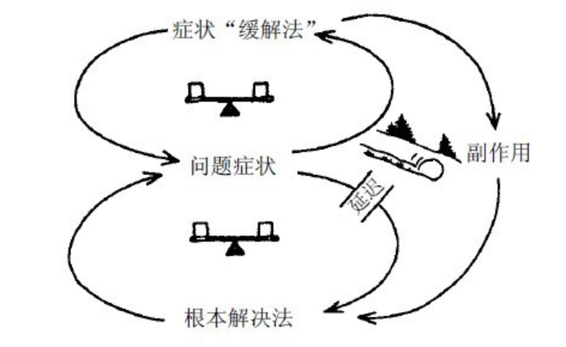

例子1

工作繁忙的业务经理人想请人力资源专家，来处理人事方面的问题。人力资源专家可能会解决问题，但经理人解决其他相关问题的能力就无法得到提升。其他人事问题以后还会出现，那时经理人还会像以前那样依赖人力资源专家。外聘专家曾经成功地解决了这类问题，所以现在就更容易地想到要再聘用专家。对人力资源专家的需求越来越大，成本也在提升，而经理人的能力(和威望)却在下降。

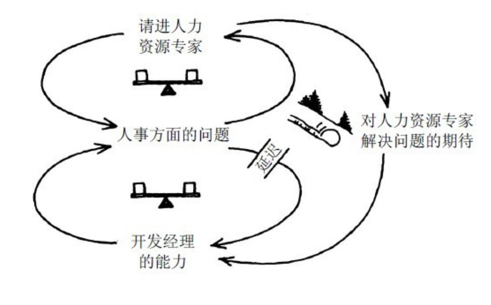

例子2

转移负担的一个特例是“目标侵蚀”。比如美国联邦政府“全面就业”目标(即，使失业率保持在可以接受的水平之下)从20世纪60年代的4%，到80年代初的6%~7%，而80年代初的实际失业率是接近10%。(换句话说，我们愿意容忍失业率出现50%~75%的上升幅度，认为这是“自然的”。)这种目标侵蚀的模式如下图所示：

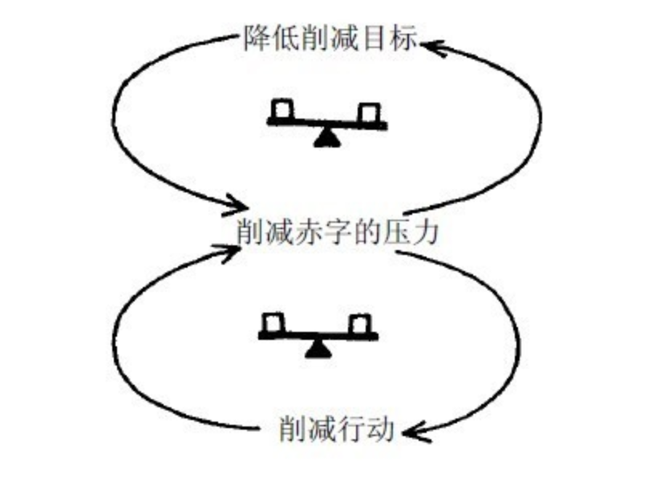

- 如何找出杠杆作用点
    - 要有效应对转移负担的模式，我们必须把强化根本解决方法与弱化症状缓解措施结合起来。强化根本解决方法要求一种长远观点和共同愿景。弱化那些症状缓解措施，就需要当事者情愿说出真相，坦率面对治标方法和“看上去不错”的解决方案。
- 如何写出你自己的“转移负担”故事
    - 有三个线索可以用来分辨“转移负担”结构有没有出现。第一，从长期来看，问题变得越来越糟糕，虽然它有时也会出现好转的迹象。第二，系统的整体健康状况渐渐变差。第三，会产生逐渐增强的无助感。

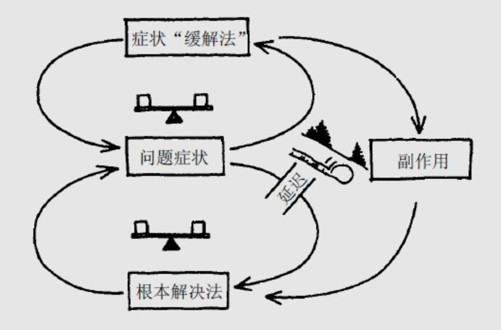

首先要找到“问题的症状”，急需你的关注-比如压力，由此，你要找到“根本解决方法”(也许会不止一个)，即可以带来持久改进的一些列措施。然后，再找到一个或几个也许能临时救急的“症状缓解方法”。其实，“根本解决法”与“症状缓解法”是相对的，最重要是辨别出问题可以从哪里入手，包括从最根本的到最表面的解决方法。接下来要找到症状缓解法可能出现的“副作用”。

转移负担模式分析带来的最主要的认识提升来自以下两个方面：(1)区分不同类型的解决方法；(2)看清在多大程度上依赖症状缓解法会导致依赖的不断加重。杠杆作用不是加强了下面的循环，就是减弱了上面的循环，或者两者同时发生。

## 第七章 是自我局限，还是自我持续地增长
来自增长极限与转移负担模式的整合：


神奇科技故事中特别明显的一个增强因素，就是把利润再投入到增加营销力量之中：销售增加就意味着收入增加，那又可以雇佣更多人力，来进一步增加销售。

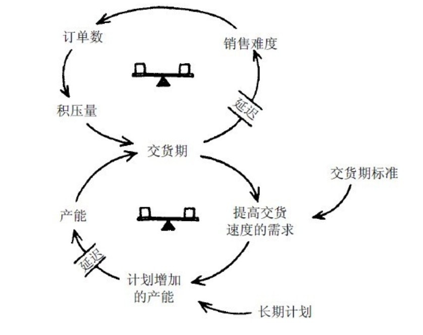

增长极限的结构会有另一面，那当然就是负反馈的作用过程：销售增长莫名其妙地放缓了。而销售放缓通常只有以下几种原因：市场饱和、竞争加剧，或者顾客失望。这里，神奇科技电脑的市场需求仍然强劲，也没有什么竞争对手。只有一个因素让顾客失望：交货期太长。订单积压，生产能力不足，交货期就延长了。交货服务质量差的名声散布出去，逐渐使神奇科技营销团队面临更大的销售障碍。


在增长极限的模式中，最糟糕的事就是在正反馈环路上使劲儿推。而这正是神奇科技公司所做的：他们试图通过新的销售激励、市场促销和产品的小范围改进，来重新发动“增长引擎”，而这些都没什么杠杆效益可言。在增长极限的模式里，杠杆作用在于负反馈环路。

转移负担模式：在这个案例中，根本解决方法(图中下方的环路)是扩大产能，以控制交货延迟的情况。要超越神奇科技公司的交货标准速度，就必须增加产能；一旦产能提高了，就会改进交货延迟的状况。但是，如果这种根本解决方法迟迟得不到应用，负担就会转移到症状缓解方法(图中上方的环路)。由于神奇科技公司的经理们未能通过足够迅速地增加产能来解决交货延迟的问题，潜在顾客不满意，于是就走掉了，并由此帮助“缓解”了交货延迟的问题。

在转移负担结构模式中有一个杠杆作用点被忽视了，那就是公司原来的8星期交货的目标。

## 第八章 自我超越
### 学习型组织的精神
稻盛和夫教导京都陶瓷员工在不断努力追求“完美”时，要遵循公司的座右铭-“敬天爱人”，来内观自省。另一方面，他认为自己作为经理人的首要责任，是“为员工提供物质和精神两方面的福利”。

和稻盛和夫一样，汉诺瓦保险公司前总裁奥布赖恩也主张，经理人必须重新定义自己的工作。他们必须放弃“计划、组织和控制的教条”；他们必须意识到，“对那么多人的生活负责，是件近乎神圣的事”。奥布赖恩认为，经理人的根本任务是“提供适宜的环境条件，让人们过上尽可能充实的生活”。

我们用“自我超越”一词，来描述个人成长和学习的修炼。自我超越水平高的人，能不断为创造自己真心追求的生命成果而扩展自己的能力。学习型组织的精神，出自组织中的个人对不断学习的追求。

### 超越与精通
当自我超越成为一项修炼，成为我们生活的组成部分时，它包括了两方面行动。首先，它不断澄清什么对我们是重要的。其次，它还包括不断地学习如何更清晰地观察现实。

把愿景(我们想要的)和清晰的现实图像(我们现在相对于愿景所处的位置)并列在一起，就产生了我们所谓的“创造性张力”，即把两者拉到一起的力量，它是张力寻求释放的自然倾向。自我超越的精义，就是学习如何在我们的生活中，不断发生和保持创造性张力。

在这里，“学习”指的不是获取更多信息，而是拓展实现我们生活中真正渴望成果的能力。

有高度自我超越修炼水平的人，都具备几个基本特征。他们的愿景和目标背后，都有一种特别的目的和使命感。对他们来说，愿景是一种召唤，而不仅仅是一个好想法。他们把“现实”看成盟友，而不是敌人；他们学会了如何观察和运用变革的力量，而不是抵制这种力量；他们有深入探究的好奇心，致力于不断改进、不断提高观察现实的准确性。他们感到自己与其他人、与生命本身，都有一种沟通。但与此同时，他们不会抹杀自己的特点。他们感到自己好像是更大的创造过程的一部分。他们可以影响这一过程，但不能单独控制它。

### 自我超越的修炼
愿景和志向目标不同。志向目标类似于一种方向，一个大标题。愿景是特定的目的地，是你渴望的未来图景。志向目标是抽象的、梗概的；愿景则是具体的、明确的。志向目标可以是“提升探索太空的能力”；愿景则是“在20世纪60年代末，让人类踏上月球”。志向目标可以是“尽力做得最好”，是“优秀”；愿景则是“跑一英里用时四分钟”。在愿景建立之前，什么都不会发生。愿景背后如果没有对志向目标的领悟，没有召唤，那愿景也只是个漂亮的想法。

### 保持必要的张力
谈论自己的愿景，哪怕是很清晰的愿景，也会有很大的困难。因为我们非常清楚地意识到，我们的愿景和现实之间存在差距。“我想自己开个公司”，但是，“我没有资金”。或者，“我想从事我真心喜欢的职业”，但“我还得挣钱糊口”。这些差距可能会使愿景看似不切实际，或者纯属想象。它们可能会令我们感到气馁，或没有希望。但是，愿景和现实之间的差距，也是一种能量的源泉。假如没有差距，就没有任何追求愿景的行动的必要。其实，这个差距正是创造性能量的源泉。我们把这个差距叫做`创造性张力`(creative tension)。

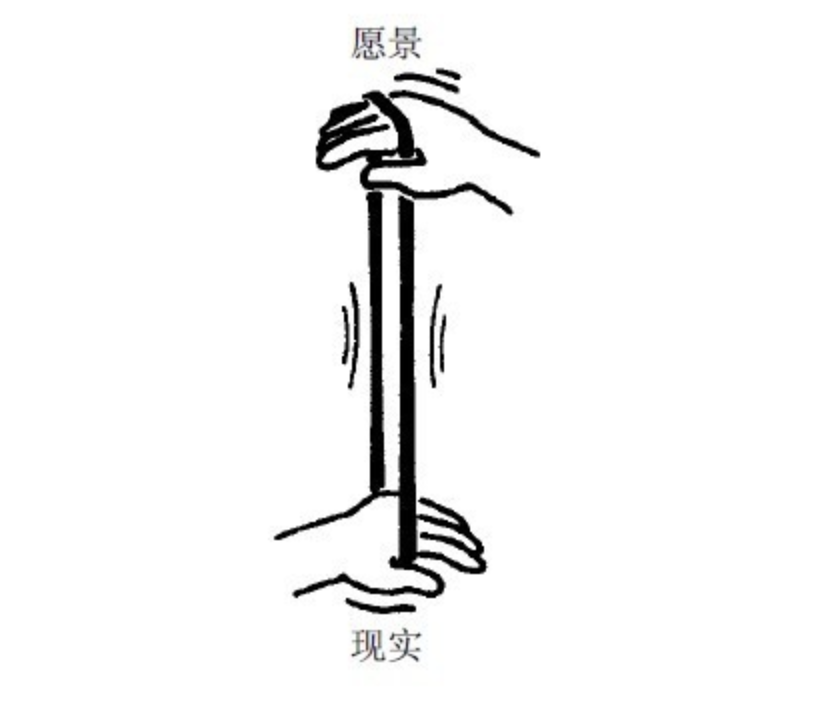

然而，创造性张力往往会导致与焦虑相关的感受或情绪，例如悲伤、沮丧、绝望、担忧等。创造性张力存在时产生的这种“负面”情绪，并非创造性张力本身；认识到这一点至关重要。上述这些情绪，就是我们所说的`情感张力`(emotional tension)。

如果我们没能分辨情感张力和创造性张力，那就相当于预先降低了自己的愿景。愿景没有实现时，如果我们感到极度沮丧，我们可能会有强烈的冲动要舒缓这种沮丧情绪。最直接的舒缓方法就是：降低愿景！

当我们的愿景与现实不一致时，它们之间的差距(创造性张力)可以用两种方法消除。图下方的负反馈过程代表“根本解决法”：努力使现实向愿景靠拢。然而，改变现状是需要时间的。这就产生了图上方的负反馈过程，它包括沮丧和情感张力，属于降低愿景、使其靠近现实的“症状缓解法”。

但是，愿景的一次性降低往往不意味着问题的终结。新的压力迟早会出现，会使现实离(新的、已经降低了的)愿景更远，于是降低愿景的压力又增加了。接着就出现了经典的“转移负担”现象。无法达成目标、产生挫败感、降低愿景、暂时减轻负担、又产生新压力、再降低愿景，这些环节构成了一个微妙的正反馈循环。结果，“负担”就越来越多地被转移到降低愿景上。


情感张力的作用机制，在人类活动的各个层面上都广泛存在。它是一种妥协的机制，一种带人走向平庸的机制。正如萨默赛特.毛姆所说：“只有平庸的人，才总是出于自己的最佳状态。”当我们无法承受情感张力时，我们就不再坚持目标，而是放任它受到侵蚀。另一方面，当我们理解了创造性张力、并使其通过降低远景以外的方式起作用时，愿景便成为了一股活跃的推动力量。

把握创造性张力，能够改变人们对“失败”的看法。失败其实就是一种不足，它显示了愿景与现实之间的差距。失败是一个学习良机，它能够澄清人们对现实的不当理解，能够揭示某些策略的有效性并不如预期，还能够提升与安静的清晰度。把握创造性张力，能够给人们带来毅力和耐心。把握创造性张力，还能使我们面对现实的整个立场发生根本性转变。现实不再是我们的敌人，而成为我们的朋友。对现实的准确而深刻的理解，与清晰的愿景同等重要。“我们学会了依靠观念，而不是通过观察，来理解现实，”“去假定现状与我们观念中预想的相似，比自己亲眼观察现状要来得方便。”“进行自我超越修炼，首先要做的是对自己的愿景作出承诺，第二个关键是对真相的承诺。”对产生创造性张力来说，这两方面都同样至关重要。

### “结构性冲突”：你无能为力的力量
有两种互相矛盾的观念，会限制我们创造真心盼望的东西的能力，而我们大多数人，都持有这两种观念之一。比较普遍的一种，是认为自己无能为力——即缺乏创造我们真心盼望的东西的能力。另一种观念，说的是不配和不相称，即我们不配拥有我们真心盼望的。


弗里茨把它叫做“`结构性冲突(structual conflict)`”。

弗里茨发现，应付结构性冲突影响力的一般性策略有三种，它们各有其局限性。降低愿景是第一种策略。第二种叫“操纵冲突”(conflict manipulation)，即通过制造人为的冲突，来操纵我们自己追求愿景的工作。热衷于操纵冲突的大多数人会认为，他们只有通过始终处于焦虑和恐惧之中，才能有所成就。这些人不会去避免情绪紧张，反而会去美化它。第三章策略，是意志力策略，即简单地用精神兴奋法，去摧毁一切妨碍我们实现目标的障碍——狂躁地执着于目标，甘愿付出代价，以及击败任何对手、突破任何障碍的能力。意志力策略的首要问题，是方法手段缺乏经济性，用系统思考的语言，叫做没有杠杆效益。我们的确达到了目标，但代价巨大。我们可能精疲力尽，可能会怀疑这样的成功是否值得。第二个问题，是这种策略常常有严重的、始料不及的后果。尽管工作上很成功，意志力大师也会随之发现自己已有两次失败的婚姻，和自己的孩子关系也很差。意志力策略丝毫不会触动深层的结构性冲突的系统问题。特别是深层的无能为力的观念，并没有真正改变。

### 对真相的承诺
我们可以从一个异常简单而又深刻的策略，开始应对结构性冲突——说出真相。对真相的承诺指的是，心甘情愿地根除那些令我们限制和欺骗自己、不让自己看到真实情况的习惯。它指的是，不断质疑我们对真实情况为什么会如此的理解。它指的是，不断扩大我们的意识范围，就好像优秀运动员在赛场上，用超常的视野把握全场更大的范围。它还指，不断加深我们对眼下各种事件背后的结构模式的理解。特别是对自我超越修炼水平高的人来说，他们要更多地察觉到自己行为背后的结构性冲突。

因此，应对结构性冲突的首要任务是识别它们，包括其运作产生影响时所引起的行为表现。当我们的那些应付性策略正在发生作用时，我们极难识别它们，因为伴随它们而来的常常是紧张和压力。

比如，在我的个人经历中，在很多年里，大项目一进行到关键时刻，就会有人很让我失望。这样的事情发生时，我仍会闷着头努力推进，努力克服由于别人的失信或无能所带来的困难和障碍。过了很多年我才看到，这是个反复发生的情况，是我自己的意志力策略的特定模式，它的根源在于，我对改变别人总让我失望的情况深感无能为力。没有例外，最后结果是，我感到“我必须一个人都干了”。

看清这个模式以后，我就开始在它再次出现时改变行动方法。我不再像以前那样经常发火了。相反，我在发现它时，会有一种愧疚感-“哦，我的模式又来了。”我更深入地检查了我自己的行动，看到它如何成为这种结果的一部分：不是因为设立无法完成的任务指标，就是因为损害或不支持别的伙伴。进而，我开始努力学习交流技巧，即如何与当事人讨论这些情况，而又不造成防卫反应。第9章“心智模式”，会阐释这些技巧。

没有心灵的转变，我就永远不可能学会这些技巧，也不可能把它们应用到实践中去。只要我还把问题看成孤立的事件，我就会认定它们是外部造成的-“他们让我失望了。”一旦我看到，问题是由结构性原因产生的，我便会开始考虑自己能够做什么，而不是“他们都干了什么”。

### 运用潜意识，就是说你真不必都想明白
自我超越水平高的人有一个很迷人的特点：他们能够以举重若轻和优美安详的风格，完成非常复杂的任务。自我超越修炼所隐含的，是另一个维度的心灵活动，即潜意识（subconsciousness）。我们所有人在面对复杂的问题时，都会运用潜意识。自我超越水平高的人有个特点，就是他们在常态意识（normal awareness）和我们所谓的另一个维度的潜意识之间，发展出一种高度的和谐。

有效运用潜意识的艺术，包括许多技巧。聚焦潜意识的一个有效方法，是通过观想和想象。比如，世界级游泳运动员发现，通过想象自己的手增大两倍，并且脚上长有蹼，他们就能游得更快。复杂技艺表演的“心中彩排”（mental rehearsal），已经成为许多领域的专业表演者的常规心理训练。

所有这些方法的真正效果，还是取决于你对“什么最重要”这个问题的理解。几乎所有精神传统都告诫我们，如果没有不断提升自己的真正志向的精进修为，就不能学练增长心灵功能的技巧。 大师们都有潜意识协调力。而开发这种协调力最重要的环节，是一种对我们渴望的成果的真正关怀，也就是一种对值得追求的“正确”目标的深层感受。潜意识似乎尤其能接受符合我们深层志愿和价值的目标。

### 理性与直觉的融合
系统思考可能是融合理性和直觉的一把钥匙。线性思考（linear thinking）只注重在时空上紧密相连的因果关系，因而很难去把握直觉。结果是，我们大多数直觉都不符合常识-也就是说，不能用线性逻辑（linear logic）语言去解释。

有经验的经理人，通常都对复杂系统有很多直觉的把握，但是又不能明确解释。直觉告诉他们，因和果并不在时空上紧密连接，一些显而易见的解决方法，实际是弊大于利，而短期应急方案，将会产生长期弊端和问题。但是，他们无法用简单的线性因果语言来解释这些概念。最后，他们只能说：“就照这个法子做，肯定管用。”
  
把系统思考作为一种替代语言来掌握，经过一段熟悉和运用之后，经理人就会发现，他们的许多直觉现在可以得到解释了。我们可能逐渐发现，系统思考的主要贡献之一，就是重新融合理性和直觉。

### 看清我们与世界的联系
我的儿子伊恩六个星期大的时候，似乎还不知道他的手和脚。我猜想，他虽已经意识到了手和脚的存在，但并不能清楚地理解那是他的手脚，也不知道他能够控制其运动。有一天，他被困在一个很糟糕的正反馈环路里。他的左手抓住了自己的耳朵，看上去表情痛苦，右手捶打越来越使劲儿，很是躁动不安。但他越是躁动，就越使劲儿揪耳朵；越是揪耳朵，就越是躁动不安。如果不是我把他的手从耳朵上拿开，哄他安静下来，这个可怜的小家伙就会这样折磨自己好一阵子。由于不知道他其实可以自己控制自己的手，于是他把他的疼痛不适看做是外力所致。

伊恩的故事让我开始思考个人成长中一个被忽视的方面，即“闭合回路”（closing the loops）：学会不断辨别出，看似外在的作用力其实是与我们自己的行为相联系的。伊恩很快就学会了辨认自己的手和脚，并控制其运动。

幼儿的学习过程，为我们所面对的学习挑战提供了很好的比喻：要不断放开和拓展我们的意识，提高我们的理解力；要越来越多地看到，我们的行为和我们的现实之间的相互依赖关系；要越来越多地看到，我们和周围世界的联系。
 
### 慈悲心
观察相互关联的修炼，会逐步改变责怪和内疚的旧心态。从这里开始，我们认识到大家都陷入了结构性的局限：这些结构来自我们的思考方法，也来自我们生活中的社会环境和人际关系。这样的认识，会逐步纠正我们下意识地相互指责的倾向，进而使我们更加深入地领悟和理解我们身处其中的各种影响力。

这不是说，我们大家只是系统的受害者，而系统就是支使我们行为的元凶。相反，系统结构常常来源于我们自身的创造。但是，只有看清那些结构，我们才能很好地了解这里面的含义。对我们大多数人来说，我们身处其中的系统结构是不可见的。我们不是受害者，也不是罪犯，我们是受各种影响力左右的人类，只是还没学会如何理解这些影响力。

我们通常把慈悲心（compassion）看成是一种人们之间关怀的情感状态。然而，慈悲心还需要一定的认识水平做基础。从我个人的经历来看，当人们更多地看到身处其中的系统时，当他们更清晰地了解各种相互影响的压力作用时，就会自然产生更大的慈悲心、同情心和恻隐之情（empathy）。
   
### 对整体的承诺
自我超越水平高的人都有一个特点，即具备慈悲心和连通感（connectedness），这自然地给他们带来宏大的愿景。当愿景超越私利时，其行愿承诺就会使人具备一种能量，它不是追求狭隘目标时所能得到的。稻盛和夫说：“如果有人作出有价值的发现或发明，而他却说没有感受到精神的力量，我是绝不相信的。”对于承诺追求更大志向目标的人，他这样描绘其心愿：“一个被震撼和唤醒的灵魂所发出的呼唤。”

## 第九章 心智模式
我们的“心智模式”不仅决定我们如何理解世界，而且决定我们如何采取行动。心智模式会影响我们的观察。有不同心智模式的两个人去观察同一件事，会给出不同的描述，因为他们看见了不同的细节，并且作了不同的解释。

心智模式的问题不在于其正确或错误——由定义可知，一切模式都是简化。问题的出现是在心智模式变为隐性的时候，即当它们存在于我们的意识水平之下的时候。

### 在实践中进行心智模式的修炼
有三个方面的要素，可以帮助开发组织机构显露和检测心智模式的能力：一是提高个人意识水平和反思技能的工具，二是使心智模式修炼制度化的“基础设施”，三是提倡探寻并挑战我们思考方法的文化氛围。

组织和团队常陷入“习惯性防卫”，从而把心智模式与外界隔绝开来，无法进行反省检查。结果，我们发展出一种“老练的无能”——这是个绝妙的矛盾修饰语，它非常准确地描绘了人们“在学习修炼环境中高度干练地保护自己，以免遭受痛苦和难堪的威胁”的情景。但是，如果不进行学习修炼，我们就会停留在无能状态，无法完成我们真正渴望的成绩。

### 心智模式的修炼
- 反思实践是心智模式修炼的精髓。
- 如果没有察觉和承认我们声称的理论和现实的行为之间的差距，就没有学习收获可言。面对声称的理论和实行的理论之间的差距，我们要问的第一个问题就是：“我真正重视声称的理论的价值吗？”“那真是我的愿景的一部分吗？”假如我们实际上对声称的理论并不忠诚，那么这个差距就并不是现实和愿景之间的张力，而只是现实和我表白的观点之间的差距。
- 当我们从直接观察(具体“数据”)，不经过检验就到达一般化概念，就出现了跳跃性推断。跳跃性推断阻碍了学习，因为它成了不需要证明的东西，它把假设当成了事实。如何辨别跳跃性推断？首先，你要问问自己，关于世界的运作方式你有什么信条——商务工作的性质，对人的一般看法，以及对某些人的看法，要问问自己：“这种一般化观念是基于什么样的‘数据’的？”然后再问自己：“我愿不愿意考虑一种可能性，即这种一般化观念是不准确的或误导性的？”而如果你愿意考虑质疑自己的一般性观念，那就要把它和它背后依据的“数据”明确区分开。
- 左手栏。开始时，要选择一个你与某个人或某几个人交往的具体情形，而且你感到那个交往方式没有成效——具体地说，交往没有产生明显的相互理解和学习的结果，或者交往已经陷入僵局。你要写出一段对话，按脚本的形式写在纸张的右侧。而在纸张的左侧，你要写出当时对话的同时你心里想的但没有说出来的话。左手栏练习总是能够让隐藏的假设成功地浮出水面，并且显式它如何影响行为。

我所想的 | 我所说的
-----|-----
大家都说汇报很糟糕。他真不知道糟糕的反应吗？还是他不愿意面对现实？ | 我：汇报怎么样？
 | 比尔：嗯，我不知道。现在说还太早。而且，我们正在实现一项新的突破。
他真的害怕看到真相。如果他更有信心，他也许能从这次的情况中学到东西。我无法想象这次汇报对我们推进工作带来的灾难性影响。 | 我：那你觉得我们应该做什么？我觉得你提的问题很重要。
 | 比尔：我拿不准。我们还是等等，看下一步会发生什么。
我得想个法子，在他屁股下面点把火，让他动起来。 | 我：也许你是对的。但我认为我们得做些什么，而不能只是等待。

- 探寻与宣扬的平衡。

当双方理性、冷静而又更加有力地宣扬自己的观点，各自的立场变得越来越僵硬。没有探寻的宣扬会引发更多的宣扬。这样会演变成“恶性竞争”。


达到探寻和宣扬相结合的理想境界是富于挑战性的。第一步是在意见不合时，学习如何探寻别人的观点。

在学习掌握如何平衡探寻与宣扬时，以下指南会对你有所帮助：
- 宣扬自己的观点时：
    - 要让你自己的推理明确暴露出来。(例如，说出你是如何形成你的观点时，你所依据的实际“数据”是什么。)
    - 鼓励对方提出不同的观点。(即问：“你有相反的事实或数据，或者不同的结论吗？”)
    - 主动探寻对方与自己不同的观点。(即“你的观点有哪些？”“你是如何得出这种观点的？”“你考虑的数据是否和我考虑的有所不同？”)
- 探寻对方观点时：
    - 如果你对对方的观点作出一些假设，就要清楚地加以说明，并承认那些是假设。
    - 把你的假设所依据的事实或“数据”亮出来。
    - 如果你并不真正地对对方的回答感兴趣(即如果你只是想表现出礼貌，或者想揭露对方)，就不要问问题。
- 当你陷入僵局(对方不再对探寻其观点持开放心态)时：
    - 询问是什么事实数据或逻辑改变了他们的看法。
    - 询问是否有共同设计实验(或其他探寻方法)的可能，以便得到新信息。
- 当你或对方对表达观点或实验不同的替代想法感到犹豫时：
    - 鼓励对方(或你自己)想出是什么导致这种困难和犹豫。(即“在这个情况下，或者你我身上，有什么东西使开放的交流变难了？”)
    - 如果双方都想克服障碍，就要一起设计出方法来实现。

## 第十章 共同愿景
在最简单的层面，共同愿景是对下面问题的回答——“我们想要创造什么？”个人愿景是人们在自己头脑里的图景和画面，而共同愿景则是整个组织中的人们内心的图景。这样的图景让组织有一种共同性，它贯穿整个组织，从而在其各式各样的活动中保持一种连贯性和一致性。

人们想寻找共同愿景的原因之一，就是期望在重要的事业上找到沟通和共鸣。

只依赖外在愿景，以击败对手为唯一目的，就会妨碍组织的长期发展。

### 建立共同愿景的修炼
- 激励个人愿景。自我超越修炼就是共同愿景开发的基础。这就不仅包括个人愿景，还包括对真相的承诺，以及创造性张力等这些自我超越修炼的特征内容。共同愿景会增加创造性张力，可能大大超出个人舒适习惯水平。能够“支撑住”这种张力的人，就会对实现崇高愿景有较大贡献：保持清晰的愿景，同时不断探寻现实。由于亲身经历着这种力量，这些人便能深信自己创造未来的能力。
- 从个人愿景到共同愿景。每个人都从自己的角度，用自己的方法，看更大的共同愿景。真正被分享的愿景，是需要时间才能浮现出来，它是大家个人愿景交流沟通过程中成长出来的副产品。经验表明，真正被分享的愿景，需要不断的沟通，大家不仅要自由表达梦想，还要学会如何聆听对方的梦想。

### 愿景的推广：加入、投入和顺从
- 对愿景的几种态度。1.承诺投入(Commitment)；2.报名加入(Enrollment)；3.真心顺从(Genuine compliance)；4.形式顺从(Formal compliance)；5.勉强顺从(Grudging compliance)；6.不顺从(Noncompliance)；7.冷漠(Apathy)
- 在大多数组织里，大多数人对组织目标和基本规章，都处在形式顺从或真心顺从的状态。
- 真心顺从的人和报名加入或承诺投入的人，常常是很难区分的。由真心顺从的人组成的组织，在效率和成本绩效方面，会比大多数组织强上万倍。承诺投入的人会带来激情、能量和兴奋，而只有顺从，甚至是真心顺从的态度，是做不到这些的。
- 真正加入或投入的人，真心想要一个愿景。而真心顺从的人，只接受一个愿景，也许他们想要，但却是为了别的什么目的-比如，保住工作，或者让领导开心，或者得到晋级。他们不是真的想要那个愿景本身，那不是他们自己的愿景。
- 加入和投入指南。自己先加入；直截了当，不要夸大利益，或者隐藏问题；让对方选择。
- 建立共同愿景其实只是更大任务中的一部分。这种更大的任务包括：开发企业的主导理念，企业愿景、志向目标或使命，以及核心价值。这些主导理念要回答三个关键问题：“是什么”、“为什么”和“怎么做”。愿景回答“是什么”-我们追求创造的未来图景。志向目标或使命回答“为什么”-“我们存在是为什么？”。核心价值回答“我们怎么做才能符合我们的使命，并从现实一路达到我们的愿景？”
- 上述三个主导理念作为一个整体，回答“我们相信什么”这一问题。
- 负面愿景的局限性有三点。第一，创新的能量被分散转移，去“防范”我们不想要的东西。第二，负面愿景带来一种微妙但又明确的无能为力的信息：我们大家其实并不真正关心。这种愿景只有在有足够的危险降临时，才能凝聚大家。第三，负面愿景不可避免的是短期的。
- 创造性张力与对真相的承诺。最有战斗力的人，能够在“保持”其愿景的同时，持续投入对现实的清醒观察。

### 共同愿景与第五项修炼
- 愿景为何夭亡

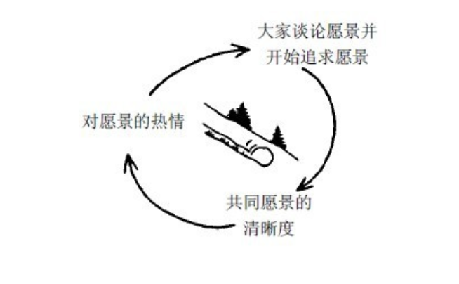

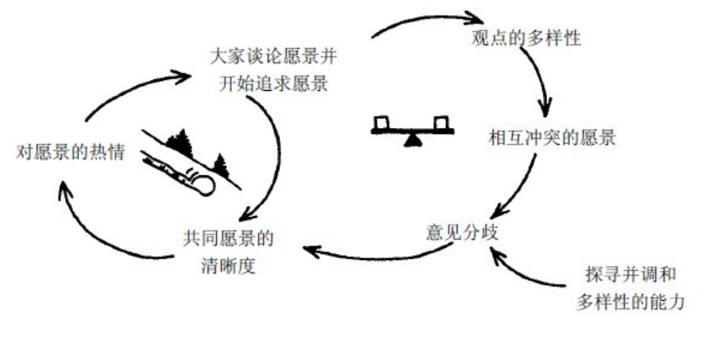

上述例子中，探寻各种不同的愿景并发掘深层次共同愿景的能力(或这种能力的匮乏)，就是我们所说的限制因素。愿景的多样性会不断发展，直到它超出组织机构的容量能力，无法“调和”这种多样性了。

要避开这个极限，最重要的第9章“心智模式”中阐释的反思和探寻的技能。形成愿景的过程实际上是一种特殊的探寻过程，它探寻的是大家真正想创造的未来。

“组织的沮丧情绪”造成的增长极限模式如下图所示。在这种模式中，限制因素是组织“保持住”创造性张力的能力。这是自我超越的核心原则。自我超越是发展共同愿景的基石。


在上述情境下，杠杆作用点必然在于减少用于应付危机和掌控现状的时间和精力，或者将探寻新愿景的人与应对现状的人分开。即组织中的小团体私下探寻组织非主流的新想法。但它往往容易形成两个阵营，而且它们最终会两极分化，无法互相支持。


最后，当人们忘掉彼此时间的连通性时，愿景也会夭亡。将发展愿景看做众人的探寻过程之所以那么重要，这也是原因之一。

导致人们鼓吹劝诱而失去彼此间的连通感的，可能是时间或技能这两个限制因素。

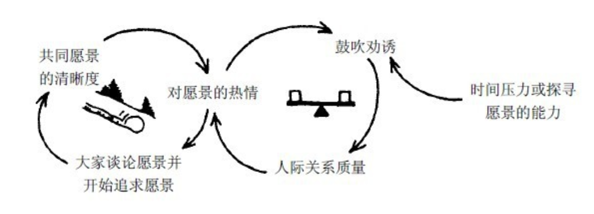

## 第十一章 团队学习
### 团队的智慧潜力
“协同校正”(alignment)是指在一组人群中出现一个整体功能的现象。大多数团队中，个人的能量有不同的目标取向，互相交叉甚至矛盾。如果要画出这样的团队，各个成员凑在一起，各有不同程度的“个人影响力”(完成意向成果的能力)，向不同的生活目标和方向使劲儿，就会如下图所示情况：


相对缺乏协同校正的团队，其基本特点之一就是浪费精力。团队中的个人可能非常努力工作，但他们的努力不能有效地转化为团队的绩效成果。

相反，如果团队做好了协同校正，就会出现在大家方向上的共同一致。大家的精力和能量也会得到融合与协同，减少了损耗。


团队中的个人，并没有为了团队的更大愿景而牺牲个人利益，相反，共同愿景成了他们的个人愿景的延伸和扩展。团队学习是协同校正的过程，是开发团队能力的过程，这种能力会创造团队成员真正想要的成果。团队学习要在开发共同愿景的基础上完成，此外，它还要依赖自我超越的修炼，因为有才能的团队要由有才能的个人组成。

在组织内部，团队学习有三个关键方面。第一，对复杂问题要有深入的思考和明晰的理解。这里，团队必须学会如何挖掘个人的思想潜力，以超越个人的心智。这说来容易，但组织中有很多强大的影响力会使团队的智能低于个人智能，而不是高于它。这类影响力中，有许多都在团队成员的直接掌控之下。

第二，需要有创新的、协调的行动。体育冠军团队和伟大的爵士乐队是一种比喻，它揭示了自发而协调的行动的特征。出色的团队也会开发出同样的人际关系-一种“操作信任”(operational trust)关系。每个团队成员都保持对其成员的清晰意识，行动中互相依赖，互助互补。

第三，团队成员对其他团队起作用。“学习型团队”(learning team)要不断通过广泛传授团队学习的技能和实践方法，来培育其他团队的学习实践。

团队学习修炼，包括深度汇谈和商讨的实践艺术，这是团队交流的两种独特的方法。在深度汇谈中，对复杂和微妙的问题，要有自由的，创造性的探讨，要悬挂或临时忘记自己的观点，互相深度“聆听”。相比之下，在商讨中，不同的观点都摆出来，得到阐述和辩护，同时寻找最佳观点，支持眼下必须做出的决策。深度汇谈和商讨可以互补，但大多数团队无法区分它们，无法在两者之间进行有意识的转换。

妨碍团队进行有效深度汇谈和商讨的强势影响力是存在的，团队学习修炼必须学会如何创造性地面对这些反对力量。这些反对力量的主要表现之一，是阿吉里斯所说的“习惯性防卫”，即保护我们自己和他人不受窘迫威胁的习惯做法。但这些做法同时也妨碍着我们学习。然而，阻碍学习的习惯性防卫同时也蕴涵着很大的促进学习的潜力，前提是要学会如何把它释放出来。第9章所讲的探寻和反思技能，可以用于释放这种潜力，以给深度汇谈和商讨聚焦能量。

系统思考尤其容易引起习惯性防卫，因为其核心思想就是自己的行动创造现实。从系统的角度来看，问题来自我们自己的政策和策略，即来自“我们自己”，而不是来自我们无法控制的外力。因此，团队不一定愿意从更系统的观点看待重要问题。

最后，团队学习如同其他所有修炼，需要实习和演练的过程。

### 团队学习的修炼
#### 深度汇谈有三个必要的基本条件
1. 所有参与者都必须“悬挂”自己的假设，就好比把假设“悬挂在我们面前”。
2. 所有参与者都必须把其他人看成同事，平等相待。
3. 必须有一位“辅导员”(facilitator)来为深度汇谈“护持场境”(holds the context)。

#### 深度汇谈和商讨的平衡
在团队学习中，商讨是与深度汇谈互为补充的必要实践。在商讨过程中，不同的观点得到阐释和辩护，这能给整个情况提供有用的分析。在深度汇谈中，不同的观点也得到阐述，但阐述的目的是发现新观点。一方面，人们在商讨中做决策，在深度汇谈中则要探索复杂问题。团队必须达成协议、作出决策时，需要一定的商谈，基于大家都同意的分析经验，权衡各种替代观点，发现首选观点(这也可能是原来的观点，也可能是商讨中出现的新观点)。有效的商讨会凝聚意见，形成结论或行动路线。另一方面，深度汇谈是发散性的，它的目的不是寻求意见一致，而是开发对复杂问题的丰富感悟。深度汇谈和商讨都有可能形成新的行动路线图，不同之处在于新的行动往往是商讨的关注重点，但却只是深度汇谈中可能出现的副产品。

#### 反思、探寻与深度汇谈
如果深度汇谈意味着一个独特的团队学习的愿景，反思和探寻的技能就是实现这一愿景的必要元素。个人愿景会给建立共同愿景打下基础，反思和探寻的技能也会给深度汇谈和商讨打下基础。有了反思和探寻技能的根基，深度汇谈的出现就更有保障，不需要依赖像团队成员之间的感情这样的特定环境因素。

#### 面对“现实”：冲突与习惯性防卫
与此相对平庸的团队，会有一两种不同的关于冲突的情况，要么是表面上没有冲突，要么就是僵硬的两极分化。在“表面光滑”的团队里，成员们认为，为了维护团队团结，他们必须压制冲突观点-假如每个人都各抒己见，不可调和的差别就会把团队肢解拆散。而在两极分化的团队里，领导“高声讲话”，大家也都清楚各自的立场，但相互冲突的观点根深蒂固，彼此不会妥协和松动。

“一切皆在我掌握之中”，把这种心智模式内化成自然习惯的经理人，会陷入两种困境。有一些人真把这种自信的姿态内化于心，他们简单地相信他们有解决大多数重要问题的方案。而要保护自己的自信，就必须拒绝接触不同的观点，免受外来影响。他们的困境是，要想保持自信就必须维持僵硬的立场。另一种人觉得，人家都认为他应该知道什么造成了严重的问题，但是内心深处的他还知道，解决这些问题会涉及很多不确定因素。他们的困境在于，要保持自信的外表，就必须隐藏自己的无知。不管处于哪种困境，认为自己必须知道答案的经理人都是自挑重负。于是，重压之下会精于习惯性防卫，避免暴露他们决策背后的思考，进而保住高明决策者的光环。

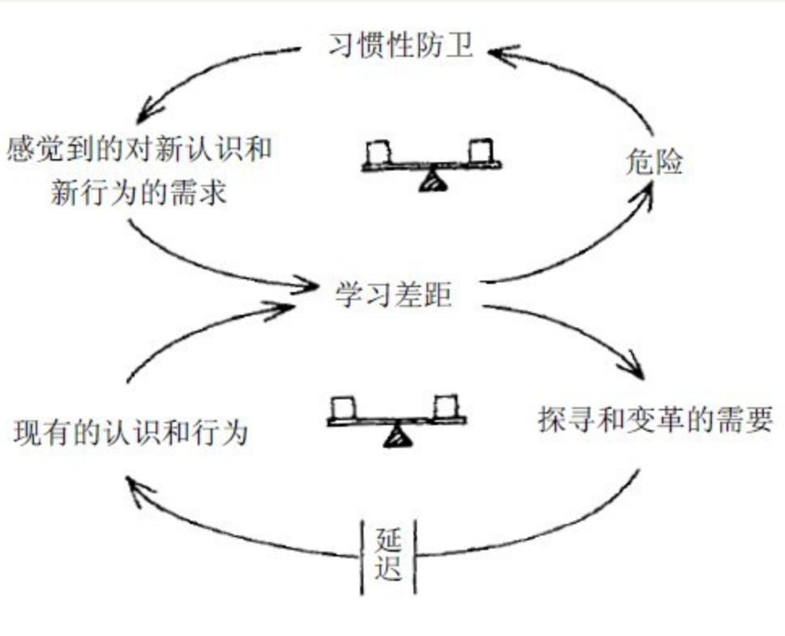

在大多数转移负担的模式结构里，都有两个可能的杠杆作用点：(1)削弱症状缓解法的效果；(2)强化根本解决法的作用。

削弱症状缓解法效果的方法之一，是消除情绪上的危机感，因为那是习惯性防卫的始作俑者。缓解习惯性防卫的技能，基本上就是那些强化“根本解决法”的技能，这在转移负担模式中已经有所体现，即反思和相互探寻的技能。探寻的方法是暴露你自己的假设和推理，公开接受他人影响，同时鼓励别人也这样做，这就是有效探寻眼下问题起因的方法。以此方法探寻，习惯性防卫就不大可能发生作用。

#### 缺失的环节：实习演练
实习演练的基本原则是在“虚拟世界”里进行实验。虚拟世界是“真实世界的人工再现”。基本规则建议：
1. 悬挂假设。人们往往采取某个立场，并极力为其辩护，执著其中，其他人则采取相反的立场。这样的结果是两极分化。这次会议里，我们想检查在我们的目标和战略背后的一些假设，而不是去为其辩护。
1. 以同事的态度交往。我们要求每个人都把自己的职位留在门外。这次会议没有任何特别的等级结构，只不过有辅导员来帮助我们保持不跑题。
1. 探寻精神。我们希望大家开始探索自己观点背后的思考，探索自己可能持有的深层假设，以及导致自己观点的依据。因此，问别人问题是适当的，比如问“是什么导致你的这种说法或看法？”或者“是什么使你问起这个问题？”

## 附录一 各项学习修炼
五项修炼的每一项都可以分成三个不同的层次：
- 实践演练(practices):你做的事
- 原则理念(principles):指导思想和理念
- 精神实质(essences):高水平掌握修炼实质的人的身心状态(state of being)
实践演练是修炼者集中时间和精力从事的活动。实践演练是任何修炼中最突出的方面，也是个人和团队开始从事某种修炼时，所主要聚焦的活动。

修炼背后的原则理念也同样重要。原则理念是修炼实践背后的理论。修炼背后的原则理念，对初学者和大师同样重要。对初学者来说，原则理念能帮助理解修炼背后的基本原理，了解修炼实践的意义：对大师来说，原则理念是参照，它能帮助不断完善修炼实践，并向他人解释和描述。

精通任何一项修炼，都需要既提升理解原则理念的水平，又提高实践演练的水平。熟悉的陷阱：把理性知识的理解与学习实践的收获相混淆。学习实践总要有知性的理解，同时要产生新的行为习惯：“想”与“做”并举，知行合一。这就是为什么要区分原则理念和实践演练的原因。两者至关重要。

第三层次，是修炼的“精神实质”。这是不一样的东西。没有必要刻意把精力集中在寻求某项学习修炼的精神实质上，这就好像不需要刻意去努力体验恋爱、愉悦或者宁静的感受。修炼的精神实质，是个人或团队在高水平精通修炼实践时，所自然出现的身心状态。这很难用语言描述，但对完全掌握每项修炼的意义和目的，它又是至关重要的。每一项修炼都会以某种非常根本的方式，改变修习实践者的状态。这就是为什么我们把这些修习叫做人身修炼(personal disciplines)，这甚至包括那些必须在集体中进行的修习。

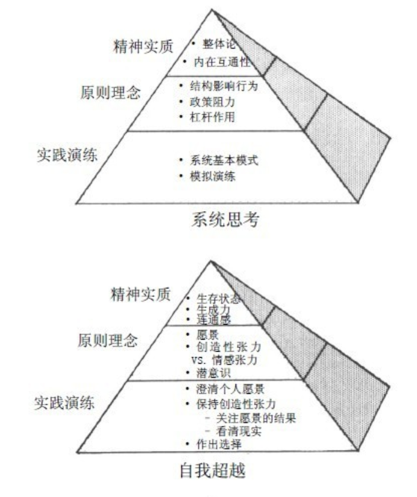

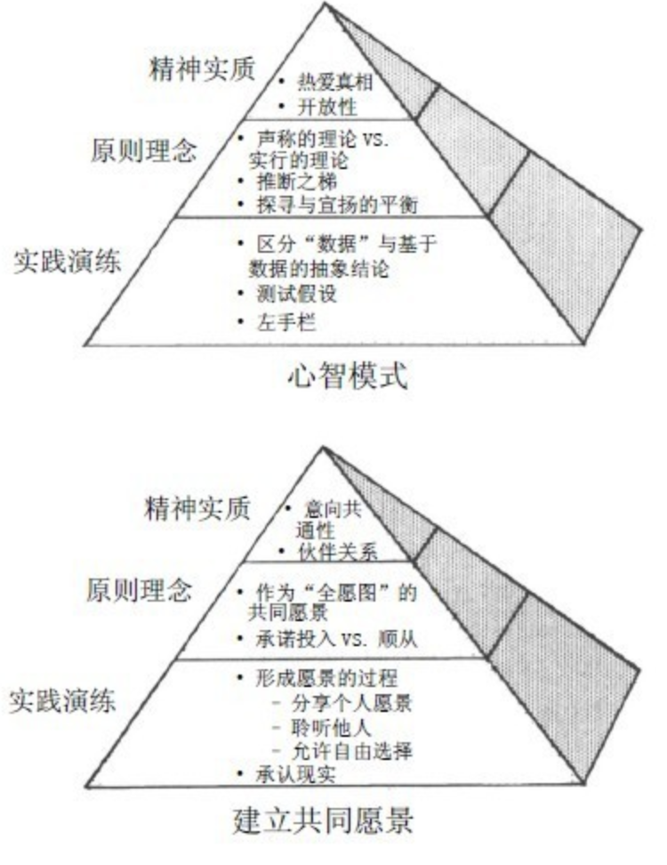

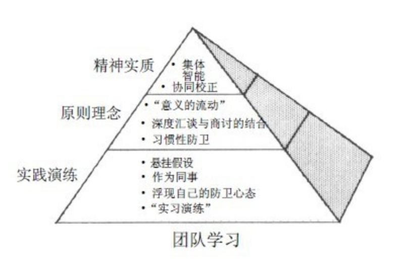

## 附录二 系统基本模式
### 1.有延迟的负反馈
结构：

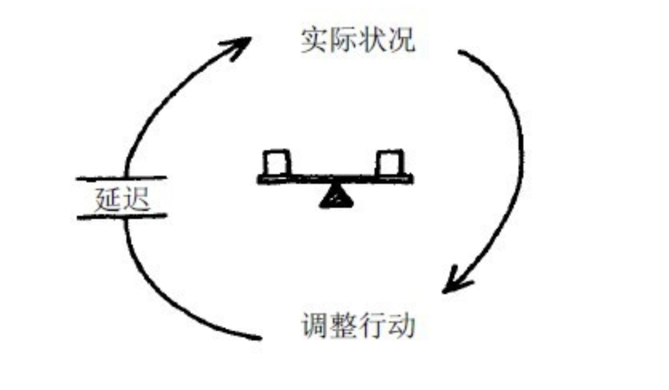

描述：个人、群体或组织为某个目标而行动，并针对反馈过程的延迟作出反应，调整行动。如果意识不到延迟，他们就会作出过多的调整和修正，也(有时)可能由于看不到任何进展而完全放弃行动。

早起预警症状：“我们原来以为很稳妥，但结果过了头。”(然后可能从相反的方向上再次做过了头。)

管理原则：在迟钝的系统里，富有攻击性的过分行动将导致不稳定。要么保持耐心，要么使系统反应更灵敏。

商业案例：地产开发商不停地上新项目，直到产生销售疲软-然而那时市场上已经有足够的其他在建项目，供过于求的结果已成定局。

其他例子：热水开关反应迟钝的淋浴；生产-分销系统供应过度和短缺的波动(啤酒游戏)；由于生产周期过长而产生的生产率和在制品库存量的波动；股市突然间暴涨和暴跌。

### 2.增长极限
结构：


描述：这是在一段时间内加速增长或扩张的自我增强过程。但之后增长开始放缓(系统内的参与者往往无法理解)，并逐渐完全停止，甚至有可能逆转，开始加速崩溃。

早期症状预警：“我们为什么要担心尚未出现的问题呢？我们增长得很快呀。”(稍后，“我们是有些问题，但只要我们按照原来惯用的方法做就没事了。”再后，“我们越是使劲儿努力，越是似乎原地不动。”)

管理原则：不要在正反馈(增长)环路上使劲儿推，要设法消除(或削弱)限制因素。

商业案例：公司制订了平等权利计划，得到越来越多的支持和参与，许多合格的来自少数族群或弱势群体的雇员成功进入公司的各种工作团队。阻力也逐渐开始增加，人们认为这些新员工并没有“挣得”自己的工作职位，这对其他合格的求职者不公平。这些团队被迫接受这些新雇员的压力越大，阻力也越大。

其他例子：学习一种新技能，比如打网球，最初可能进步很快，你的技术水平和自信心都在增长。但随后你天生的自然的能力开始遇到极限，而这只能通过学习新技术来突破，但对这种新技术你开始会觉得“不自然”。新公司从零开始增长，达到一定规模以后就要求更专业的管理技能和正规的组织；新产品开发团队表现出色，成绩非凡，但它吸纳的新成员，许多并没有协调的工作风格，也没有创始成员的价值观，于是麻烦就来了；城市开发规模直线上升，直到土地资源枯竭，结果使房地产价格飙升；社会运动发展遇到“非信徒”的不断增加的抵制；由于天敌消失，动物群迅速繁衍，但很快导致其生活地域里食物匮乏，最终由于饥饿而大量死亡。

### 3.转移负担
结构：

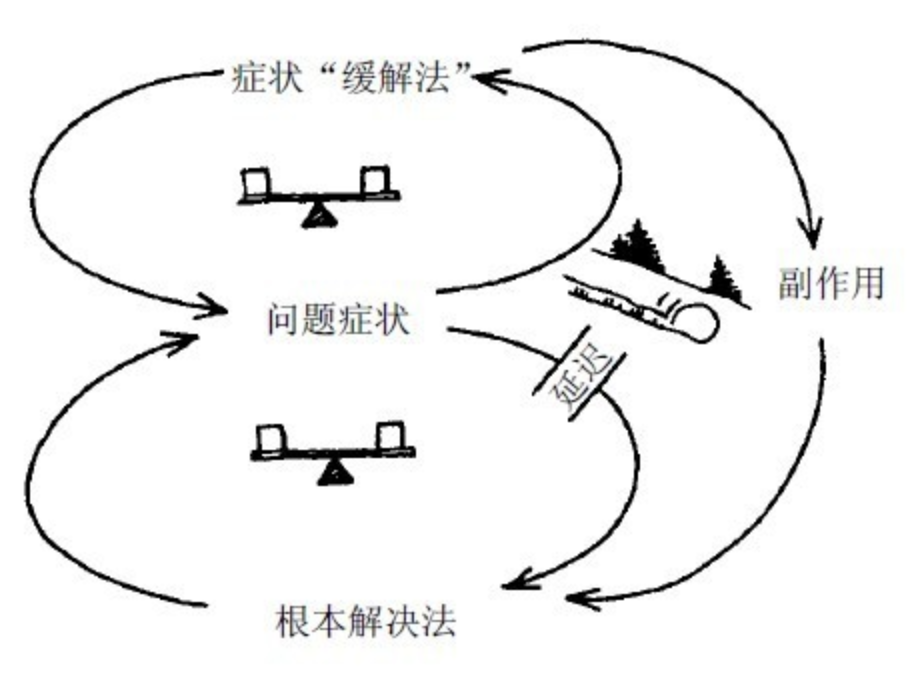

描述：为纠正问题而使用的短期“缓解方法”，看似立即奏效，但随着这种纠正方法的反复运用，更根本的长期纠正方法就越来越被忽视。最终的结果是开发根本解决方法的能力萎缩或消失，导致对“症状缓解法”的更严重的依赖。

早起症状预警：“你看，这个解决方法一直有效！你说什么，这种做法以后会遇到麻烦？”

管理原则：聚焦在根本解决方法上。例如“症状缓解法”是必要的(因为根本解决法有延迟)，那就用它来争取时间，以完善根本解决方法。

商业案例：一项突破性电路板技术可以用来开发独特的功能，并能在众多新产品应用上带来节约成本的效益。但现有产品的电路板也可以代替它。营销人员可以向理解这项新技术的特殊性能的“特别客户”推销它，并逐步充分利用这些新技术来开发完整的新产品线(“根本解决法”)，也可以向不关心特殊性能的一般“商品用户”推销只使用现有电路板的产品(“症状缓解法”)。但管理层有季度销售额的压力，因此营销人员就会采取谁要买就卖给谁的方针，而这往往都是一般的商品用户，因为他们人数较多，销售周期延迟较短。最终这将导致突破性新技术无法发展忠实的客户群体，结果变得和一般产品一样，承受价格和利润空间的压力。

其他例子：不拓宽客户群，而向现有客户推销更多产品。借钱还债，不想做严格的开支预算。不降低工作压力本身，而通过饮酒、吸毒或较好的体育锻炼方法来减轻工作压力。上瘾，包括各种场合和各种形式。

### 特别案例：转移负担到介入者身上
结构：


描述：介入措施是要改善问题的明显的症状，而且非常成功地做到了这一点，以至于系统内部的人根本无法学会自己解决问题。

管理原则：“要授人以渔，而非授人以鱼。”要关注“主人的系统”发展自己解决问题的能力。如果需要外来帮助，“帮助者”应当要么严格局限在一次性的介入(而且大家事先都清楚这一点)，要么有能力帮助大家开发自己的技能、资源以及基础设施，以便在将来有更大的能力。

商业案例：一家有创新传统的保险公司承诺一下原则：其独立的地方分支结构只能偶尔寻求总部的帮助。开始时这条原则实行得很好，但后来整个产业出现危机。面对突然发生的严重损失，地方机构把更有经验的总部专业人员请来重新制定费率结构-这通常需要好几个月时间来完成。与此同时，地方经理们聚焦在危机管理上。危机过去了，但下一次又碰到了利率结构问题时，地方经理已经失去了信心。他们又请总部经理们来做“保险”了。这种情况一连在几年内发生，结果是，地方机构再没有人独立管理利率结构改变的工作。

其他例子：工作依赖外部承包商，而不是培训内部员工。众多的政府援助计划，试图解决紧迫问题，但却养成依赖性，需要不断增加援助。

### 4.目标侵蚀
结构：


描述：这是转移负担的模式之一，其短期缓解方法使长期的、根本的目标收到侵蚀。

早期症状预警：“工作标准现在降低一些也可以，等危机一过再恢复。”

管理原则：保持愿景。

商业案例：虽然产品很棒，而且不断改进，高科技制造商却在丧失市场份额。但这家注重自己的产品设计“天才”公司，从未能有效控制生产进度。外来的调查人员发现，其客户对公司交货逾期越来越不满，并正在转向其竞争对手。公司却坚持自己的立场，满足于自己的业绩：“我们在答应客户的交货时间内，一直保持了90%的成功交货纪录。”于是公司反而去寻找业绩不佳的其他原因。但实际情况是，每次公司交货开始出现延迟的情况，都会把承诺的交货时间加长一些。结果是，客户得到的承诺交货时间一步步变得越来越长…...

其他例子：成功人士降低自己的标准，渐渐失去成功的表现。公司为了降低成本，隐秘地降低质量标准，而不是投入开发新的可以提高质量(而且可能也降低成本)的工作方法，但仍然一路宣称自己不断保持注重质量的传统。政府“全面就业”的目标，或削减联邦赤字的目标，越来越低。控制危险的污染物排放的目标，或保护濒危物种的目标，遭受侵蚀。

### 5.恶性竞争
结构：

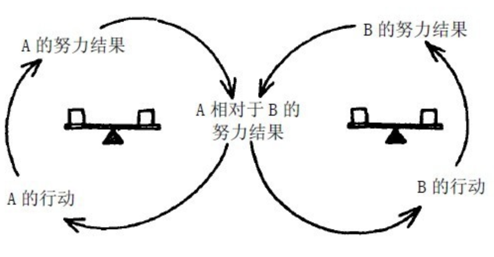

描述：两个人或者两个组织认为，自己的福祉依赖于建立对对方的优势。如果一方占据了优势，另一方就觉得受到更大的威胁，于是便更加咄咄逼人地去重建自己的优势，结果又使前者受到更大的威胁，也使前者更咄咄逼人，如此等等。双方往往把自己咄咄逼人的行为看成是对对方的防卫反应，而各自的“防卫”行动导致双方都不愿意看到的恶性循环。

早起症状预警：“如果我们的对手不再咄咄逼人，那我们就可能停止争斗，而去完成其他事情。”

管理原则：寻找“双赢”的方法，让双方都达到自己的目标。在许多情况下，某一方可以单方面逆转这种恶性循环，方法是公开、主动、大胆的“和平”行动，以使对方感到没那么多威胁了。

商业案例：某公司开发了一种婴儿小推车，可以同时坐三个学步年龄的小孩，而且很轻便。这在小孩儿多的家庭群体里立刻成为畅销品。而几乎与此同时，另一家公司也开发类似产品。几年后，第一家公司对另一家公司的市场占有率非常嫉妒，决定降价20%。于是第二家公司的销售受到影响，也决定降价。

其他例子：军备竞赛，反恐战争，广告战，离婚过程。

### 6.强者愈强
结构：


描述：两个活动为有限的支持或资源而竞争。某一方变得更成功，就会获得更多的支持，而另一方就会失去支持。

早期症状预警：相互关联的两个活动，两个团体或个人，有一方开始表现优异，另一方则在挣扎状态中。

管理原则：寻找两者的总目标，以使两者获得平衡的表现。有时候要切断或削弱两者之间的关联，这样就避免它们对同一个有限资源的竞争(如果两者的关联只是由于偶然的疏忽，却引起对资源的不良竞争，那就需要这样做。)

商业案例：某经理希望自己的两个亲信都能在公司里得到发展，但由于其中一个生病告假一星期，另一位就得到优惠待遇。前者上班后，经理人由于觉得内疚，于是就躲避前者，结果是后者有更多的机会，感觉受到肯定，工作更成功了，进而得到更多的机会。前者由于心神不定，工作效率也下降了，于是机会就更少了。其实两者开始都有同样的能力。前者最后离开公司。

其他例子：平衡家庭与工作；两种产品在公司里争夺有限的财务和管理上的资源。

### 7.公地悲剧
结构：


描述：个体仅仅根据自身的利益需要来使用有限的公共资源，开始大家都各有所得，后来得到的越来越少，结果促使大家加倍努力获取资源。最后，资源明显消耗、毁坏或完全用光。

早起症状预警：“原来每个人都得到许多资源。现在很紧张了。今年要想从中获利，我就必须加倍努力。”

管理原则：要管理“公地”(Commons)，如要对大家进行教育，建立自律机制和同行约束，或者建立官方法规，不过这最好由参与使用公地的人来共同指定。

商业案例：某公司的好几个部门达成一致，都使用同一家零售机构。开始时每个区域经理都很担心，只用一家零售机构可能无法给每个特定的业务领域都提供足够的关注，因而可能会引起销售额下降。于是其中一位咄咄逼人的经理，就让辖下所有客户账户经理都设立高于真正需要的销售额指标，以使零售机构至少提供他们所需要的最低限度的支撑。其他部门经理人看到这种情况，也决定采用同样的策略来获得更多的支撑。新零售机构的经理们想照顾好所有这些“顾客”，于是就不断接受各部门的要求。这导致工作量过大，工作效率下降，人员流失加剧。

其他例子：不同领导合用一套秘书班子；各个采矿公司都开采同一个矿产地。

### 8.饮鸩止渴
结构：


描述：短期内有效的修补措施带来未知的长期后果，可能造成不断使用更多类似修补措施的需要。

早起症状预警：“这方法以前似乎一直奏效，现在为什么不管用了？”

管理原则：保持对长期目标的关注。有可能，要避免使用短期“修补措施”，或者只为“争取时间”才使用它，但同时要开发长期解决方法。

商业案例：制造厂商推出一组新的高性能零部件，马上获得巨大的市场成功。但公司CEO只关心投资回报最大化，所以决定延期购买昂贵的新生产设备，结果使生产质量受到影响，损害了公司的质量声誉。接下来的一年，客户订单急剧下降，投资回报更加萎缩，进而使CEO更不愿投资购买新的生产设备。

其他例子：个人和组织通过举债来偿还利息；为节省开支而减少设备维护频率导致更多故障和更高的维修成本。

### 9.增长与投入不足
结构：

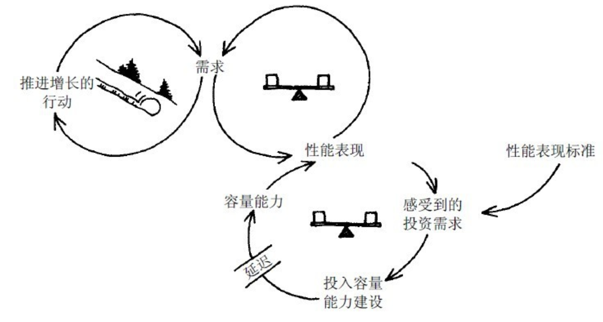

描述：公司或个人成长遇到极限，但可以通过建设更大的“容量能力”来突破极限，或延缓极限的到来。但对这种建设的投入必须及时充分，并在增长降速之前完成，否则就永远不会完成。人们往往降低关键目标或性能标准，以使投入不足合理化。但这样一来，就会实现一种自证预言：降低的目标导致降低的预期，而这些反过来又被投入不足带来的较差的性能表现所证实。

早起症状预警：“你看，我们曾经是最棒的，将来也还会是最棒的，只不过眼下得节省资源，不能过度投资。”

管理原则：假如真有增长的潜力，那一定要在市场需求到来之前建设自身的能力，这是创造市场需求的策略。要保持愿景，特别要关注关键的性能标准，以及目前自身的能力是否能充分适应潜在的市场需求。

商业案例：人民快线航空公司面对市场迅速增长的需求却无法建设自身的服务能力，他们没有投入资源进行培训，或降低增长速度(比如通过适当提高票价)，反而试图通过“超增长”来使问题消失掉。结果是服务质量不断下降，竞争愈演愈烈，士气每况愈下。为了应付压力局面，公司的“缓解方法”是继续对服务质量投入过低，直到公司对顾客不再有任何吸引力。

其他例子：愿景远大的人，却没有切实估计要实现愿景所必须投入的时间和精力。

## 附录三 U型过程
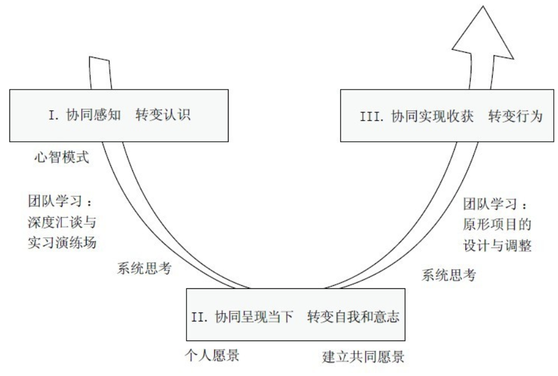

U型过程与五项修炼