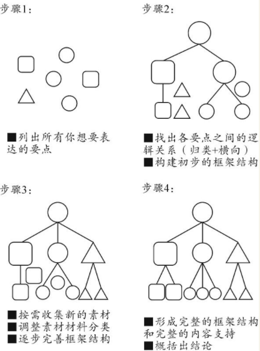

    作者: 张巍
    出版社: 浙江大学出版社
    出版年: 2020-1
    页数: 191
    定价: 52.00元
    装帧: 精装
    ISBN: 9787308196796

[豆瓣链接](https://book.douban.com/subject/34933227/)

- [WHY：为什么要掌握金字塔原理](#why为什么要掌握金字塔原理)
  - [赋能表达的三大优势](#赋能表达的三大优势)
- [WHAT：揭开金字塔结构的面纱](#what揭开金字塔结构的面纱)
  - [四项基本原则：构建逻辑清晰的表达](#四项基本原则构建逻辑清晰的表达)
  - [纵向关系：巧用设问引导受众](#纵向关系巧用设问引导受众)
  - [横向关系：活用演绎逻辑与归纳逻辑](#横向关系活用演绎逻辑与归纳逻辑)
  - [MECE原则：实现不重叠、无遗漏的分类](#mece原则实现不重叠无遗漏的分类)
- [HOW：灵活构建金字塔结构](#how灵活构建金字塔结构)
  - [标题设计：以4U/TOPS原则塑造第一印象](#标题设计以4utops原则塑造第一印象)
  - [序言设计：以SCQA结构呈现精彩开场](#序言设计以scqa结构呈现精彩开场)
  - [主体构建：两种方式搭建金字塔结构](#主体构建两种方式搭建金字塔结构)
- [EXPANSION：拓展逻辑设计](#expansion拓展逻辑设计)
  - [横向逻辑扩展：提升三大表达效果](#横向逻辑扩展提升三大表达效果)
  - [高级逻辑设计：玩转逻辑思维的魔方](#高级逻辑设计玩转逻辑思维的魔方)
    - [钟摆逻辑](#钟摆逻辑)
    - [多米诺效应](#多米诺效应)
    - [收益逻辑](#收益逻辑)

# WHY：为什么要掌握金字塔原理
`金字塔原理`是一种思考方法和沟通方法，包括归类概括、逻辑设计、结构构建等方面的方法或技巧，可以广泛地应用在思考分析、口头表达和书面表达之中。

## 赋能表达的三大优势
对于受众而言，金字塔结构赋予表达三大优势。

1. 易于受众理解
2. 易于受众记忆
3. 易被受众认同

```
提高沟通的效果             如何高效地       提高沟通的效率

观点明确，         |        思考       | 让受众  
按照受众的思维习惯  |        说话       | 准确、快速地
和容易理解的顺序    |  ——>   协作   ——> | 理解和记忆
来表达             |        讲课       |
```

# WHAT：揭开金字塔结构的面纱
## 四项基本原则：构建逻辑清晰的表达
1. `结论先行`，即先从结论说起，把中心思想或关键论点放在口头或书面表达的开头，从而突出呈现。在一般的口头表达或书面表达中，如果采取结论先行的方式，建议遵循如下的逻辑顺序来进行表达：
   1. 先重要后次要
   2. 先全局后细节
   3. 先结论后原因
   4. 先总结后具体
   5. 先结果后过程
   6. 先论点后论据

糟糕的典型案例：

    老板，我最近在留意原材料的价格，发现很多都涨价了；
    刚才物流公司打电话来说提价，我还比较了其他家的价格，但还没办法说服它不涨价；
    还有，竞争品牌XX最近也涨价了；
    对了，广告费最近花销也比较快，如果...可能...

如果遵循结论先行的原则，这个汇报可以是这样表达的：

    老板，我认为我们的产品应该涨价20%。我按影响的大小，从大到小跟您汇报一下。
    第一，原材料最近涨了30%，物流成本也上涨了；
    第二，竞争品牌XX调涨了20%左右；
    第三，广告费开支变大，我们需要增加利润以持续在广告方面的投入。

2. `以上统下`，即运用金字塔原理进行表达时，上一层级的内容必须是下一层级内容的抽象概括。以上统下，实际上是金字塔结构中纵向关系的具体体现。

```mermaid
graph TD;
    r[核心观点]-->A
    r-->B
    r-->C
    A-->A1
    A-->A2
    A-->A3
    B-->B1
    B-->B2
    B-->B3
    C-->C1
    C-->C2
    C-->C3
```

3. `归类分组`，即利用分类的方法处理素材，每一组的思想观点必须在逻辑上属于同一范畴，且在逻辑上具有共同点，能够用单一名词概括该组的所有思想。

按照从属关系，分类9种健康食物：

```mermaid
graph TD;
    r[9种健康食物]-->A[餐前:水果]
    r-->B[餐中:蔬菜]
    r-->C[餐后:奶制品]
    A-->A1[葡萄]
    A-->A2[橘子]
    A-->A3[苹果]
    B-->B1[土豆]
    B-->B2[萝卜]
    C-->C0[牛奶]
    C-->C1[酸奶]
    C-->C2[黄油]
    C-->C3[奶酪]
```

按照食品价格，分类9种健康食物：

```mermaid
graph TD;
    r[9种健康食物]-->A[稍贵]
    r-->B[中等]
    r-->C[便宜]
    A-->A1[黄油]
    A-->A2[奶酪]
    A-->A3[酸奶]
    A-->A4[葡萄]
    B-->B1[牛奶]
    B-->B2[橘子]
    B-->B3[苹果]
    C-->C1[土豆]
    C-->C2[萝卜]
```

按照个人喜好，分类9种健康食物：

```mermaid
graph TD;
    r[9种健康食物]-->A[爱吃]
    r-->B[不爱吃]
    A-->A1[黄油]
    A-->A2[奶酪]
    A-->A3[酸奶]
    A-->A4[葡萄]
    B-->B1[牛奶]
    B-->B2[橘子]
    B-->B3[苹果]
    A-->C1[土豆]
    B-->C2[萝卜]
```

`逻辑递进`，即每组中的内容思想必须按照一定的逻辑顺序来组织。逻辑递进关系一般分为`归纳关系`和`演绎关系`两类，对应金字塔结构中的横向关系。你所选择的逻辑顺序，其实也展现了你在组织思想时的分析过程。

## 纵向关系：巧用设问引导受众
`纵向关系`是指主题（上层）和子题（下层）之间的关系。具体而言，主题必须是子题的总结与概括，而子题必须为主题提供解释和支持。因此在纵向关系中，各层级的重要性是由上而下逐渐递减的，即最上层的中心思想最为重要，下一层级的思想次之，再下一级的思想再次之，以此类推。

在实际应用中，运用纵向关系建立`疑问/回答式的对话`，能够很好地吸引受众的注意力，从而引导受众按照你所设计的方向去思考，将受众的注意力从上一层级引导到下一层级。

具体而言，可以先`设问“为什么”`，引起受众的短暂思考，如果有听众互动来回答“为什么”自然最好；如果没有人回答，自己也可以根据下一层级要点**顺藤摸瓜**，针对这个“为什么”进行自问自答。

```mermaid
flowchart TD
    A[今年是成果丰硕的一年]--为什么-->B[工作取得业绩]
    A--为什么-->C[个人获得成长]
    B--为什么-->b1[上半年项目成功完成]
    B--为什么-->b2[下半年项目进展顺利]
    C--为什么-->c1[专业能力提升]
    C--为什么-->c2[软技能提升]
    C--为什么-->c3[未来发展规划]
```

## 横向关系：活用演绎逻辑与归纳逻辑
`横向关系`是指同一层级上各项要点之间的关系，或者同一组内的各项要点之间的关系。无论在同一层级中，还是在同一组中，各项要点必须同属于一个范畴，且排列顺序必须符合一定的逻辑顺序。

横向关系一般分为`演绎逻辑`和`归纳逻辑`两类。

所谓`演绎逻辑`，即利用逻辑推理的方式来组织材料和观点，也被称为必然性推理。常见的演绎逻辑有：

    【大前提→小前提→结论】
    【问题→原因→解决方法】


例如，上级鼓励下属在项目管理工作中迎难而上时，就可以运用【大前提→小前提→结论】这一演绎逻辑：

```mermaid
flowchart LR
    A[每个人在成长中都会遇到些困难]-->B[项目管理本来就是有一定难度的工作]
    B-->C[因此在项目管理中遇到困难是正常的]
```

所谓`归纳逻辑`，即通过时间顺序、空间（结构）顺序、重要性顺序来组织材料和观点。

常见的时间顺序主要分为两种：

1. 按照绝对时间来设计逻辑顺序。比如：上旬、中旬、下旬或者上午、中午、下午等。
2. 根据相关业务流程，列出流程步骤中的关键点，继而梳理出逻辑顺序。比如：餐前、餐中、餐后或者电话预约、客户访问、方案介绍等。

卖方流程：

```mermaid
flowchart LR
    A[拜访客户]-->B[贸易谈判]
    B-->C[估算费用]
    C-->D[销售签约]
```

常见的空间顺序可以分为两种：

1. 按照现实的空间来进行设计的逻辑顺序。比如：华北、华中和华南或者部门A、部门B和部门C。
2. 按照虚拟的空间或结构来设计的逻辑顺序。比如：线上、线下或人员、机器、物料、方法、环境、测量等。

```mermaid
graph TD;
    r[某公司]-->a[部门A]
    r-->b[部门B]
    r-->c[部门C]
```

`重要性顺序`，也称程度顺序，是按照不同程度的重要性来进行设计的逻辑顺序。

## MECE原则：实现不重叠、无遗漏的分类
`MECE原则`，全称mutually exclusive collectively exhaustive，意思是“相互独立，完全穷尽”。

- 各部分之间相互独立（mutually exclusive）
- 所有部分完全穷尽（collectively exhaustive）

常见的符合MECE原则的分解法有以下五种切入点：

1. 按照A与非A进行分解。例如：国内与非国内（国外）；大企业与非大企业（中小企业）。
2. 按照公式进行分解。我们可以将已知的公式作为分解依据，从而分解出各项要素。例如，当我们要做提升销售额的提案时，可以参考公式：总销售额=员工人均销售额×员工数。
3. 按照流程进行分解。我们可以将已知的业务流程作为分解依据，继而进行各要素的分解。例如，当我们要做改善销售流程的提案时，可以参考销售流程：拜访→商谈→报价→签约。
4. 按照常用要素进行分解。常用要素有3C、4P、QCD、5W2H
   1. 按`3C`要素分解。3C即`customer（客户）`、`competitor（竞争对手）`和`company（公司）`三个维度，以此来进行骨架结构的分解。
      1. Customer（客户）——对于一项新技术或新产品，目标客户的接受度和活跃度如何？
      2. Competitor（竞争对手）——竞争对手的项目与所考察的项目相比，谁更有技术优势？
      3. Company（公司）——该项目所属公司的团队能力和未来的产能如何？
   2. 按`4P`要素分解。4P即`product（产品）`、`price（价格）`、`place（渠道）`、`promotion（促销）`四个要素，以此来进行逻辑结构的划分。4P理论（The Marketing Theory of 4Ps）是产生于20世纪60年代的美国营销理论，常用于营销领域。比如，某国内著名电子产品集团，就是利用4P要素进行营销战略的分解，从而构建起全方位的营销体系。具体如下：
      1. 在产品方面，公司针对各地域消费者的不同需求，有针对性地研制开发了多种、多规格的电子产品，以满足不同层次消费者的需要，凭借其新技术、易用性、个性化的设计及多元化的解决方案而广受用户欢迎。
      2. 在价格方面，公司更愿牺牲短期利益来占领长远的市场，继而提升公司的美誉度和知名度，创立自己“低价高质”的口碑。
      3. 在渠道方面，公司采取了三项措施：一是在香港设置研发和市场销售团队，利用香港这一世界转口中心的区位优势，及时把握国际潮流和最新动态，促进集团的国际化发展；二是将生产基地设置在劳动力成本低的内陆地区，并建立委托加工的合作关系，这不仅避免了大量的基建投资，也能在订货量增大时保证供应；三是自建营销网络，在全国设置48个销售公司，实行逐级控制，采取特许经营，并建立了5万多个品牌专卖店。
      4. 在促销方面，公司将品牌与自身的企业形象宣传、产品推广、促销相结合，强调“科技进步对人类社会的积极影响”，这个品牌概念不仅带来了良好的经济效益，也产生了极好的社会效益。
   3. 按`QCD`要素分解。QCD是`quality（质量）`、`cost（成本）`和`delivery（交付）`三个要素，以此来作为分类的逻辑。QCD分解法常用于企业运营方面的方案呈现，或者客户对于产品或供应商的评估选择。
   4. 按`5W2H`要素分解。5W2H是指5个以W开头的英语单词和2个以H开头的英语单词。5W，即why（为什么）、what（做什么）、who（何人做）、when（何时做）、where（何地做）；2H，即how（如何做）、how much/many（多少）。5W2H分解适用的场景非常多。比如，汇报工作计划时就可以采取如下的结构：
      1. Why（为什么）——说明制订工作计划的理由；
      2. What（做什么）——说明工作计划的范围；
      3. Who（何人做）——说明各个工作模块的负责人；
      4. When（何时做）——说明各个工作包的起始时间，在确定的情况下可以加结束时间；
      5. Where（何地做）——说明各个工作模块的执行所在地；
      6. How（如何做）——说明工作计划中的具体方法；
      7. How much/many（多少）——说明工作计划的花费或需要哪些资源。

# HOW：灵活构建金字塔结构
## 标题设计：以4U/TOPS原则塑造第一印象
标题设计的`4U原则`是指标题的

- `实用性（usefulness）`，所谓实用性，即受众通过标题，可以得知看完这篇文章后能获得什么。比如，本段落的标题“标题设计的4U原则”，就可以直接告诉受众，看完此部分内容，可以了解并掌握标题设计的原则。
- `独特性（uniqueness）`，所谓独特性，即通过标题告诉受众为什么要读这篇文章，文章有何独特之处。比如，本段落的标题也可以设计为“标题都是有套路的——标题设计的4U原则”。
- `紧迫感（urgency）`，所谓紧迫感，即通过标题告诉受众为什么现在就得去阅读这篇文章。塑造紧迫感与危机感，可以让受众做出立即阅读的决策。比如，“如何拯救一个失败的标题设计？”
- `口号式（useslogan）`，把标题设计成口号式，可以唤起受众的责任心和使命感。如“质量是企业的生命”，就会起到唤醒受众使命感的作用。一般正装句的动宾结构会比倒装句更能体现出使命感，比如“质量是企业的生命”就会比“企业的生命是质量”更为有力。

标题设计的`TOPS原则`:

- T代表`targeted to our audience`，意为瞄准受众，即标题抓住受众的需求点、利益和关注点；
- O代表`overarching`，意为周延完整，即标题内容完整，结构清晰；
- P代表`powerful`，意为掷地有声，即标题有力度，能触动受众；
- S代表`supportable`，意为言之有据，即标题有依据，能说服受众。

## 序言设计：以SCQA结构呈现精彩开场

- `S（背景，situation）`，指与主题相关的一些公认的事实。如事件发生的时间、空间、人物等要素。
- `C（冲突，complication）`，指某种不利的变化或者混乱，且这种变化或混乱能够促使受众产生疑问。在某种程度上，冲突是推动序言故事情节发展的重要因素。
- `Q（疑问，question）`，即根据之前的冲突和文章的核心论点设计疑问，通过明知故问的方式过渡到之后的答案。
- `A（回答，answer）`，即给出之前问题的答案。可能有人会问：为什么要在序言中早早地给出答案？从心理学角度来看，先向受众传递答案，避免让他们在混乱的思考中摸索，可以使文章或者演讲报告更加简单易懂，使受众更容易接受表达者的思想。

例如：

    去年我们公司的销售额再创历史新高。[S（背景）]
    但是我们公司的利润和员工奖金却下降了。[C（冲突）]
    如何在销量提升的情况下，提升公司利润？[Q（疑问）]
    我们需要积极推动高端产品。[A（回答）]

根据“SCQA结构”，可以总结出五种常用的序言设计结构，具体有：

1. `基本结构：S（背景）→C（冲突）→Q（疑问）→A（回答）`参考示例：
   1. S（随着中国社会的不断发展，人群结构的老龄化已经呈现明显的趋势。）
   2. C（然而，记者在调查中发现，虽然老年人越来越多，但他们在购买服装时却存在着各种各样的困难，在商场中很难找到老年人专柜，老年人也没有自己的“名牌”。）
   3. Q（如何满足老年人在服装购买方面的品牌需求呢？）
   4. A（这一问题引起了一些商业嗅觉灵敏的商家的注意。）
2. `标准式：S（背景）→C（冲突）→A（回答）`参考示例：
   1. S（随着中国社会的不断发展，人群结构的老龄化已经呈现明显的趋势。）
   2. C（然而，记者在调查中发现，虽然老年人越来越多，但他们在服装购买时却存在着各种各样的困难，在商场中很难找到老年人专柜，老年人也没有自己的“名牌”。）
   3. A（所以一些商业嗅觉灵敏的商家开始关注如何满足老年人购买服装时的品牌需求这一问题。）
3. `开门见山式：A（回答）→S（背景）→C（冲突）`参考示例：
   1. A（一些商业嗅觉灵敏的商家开始关注老年人在服装购买方面的品牌需求。）
   2. S（因为随着中国社会的不断发展，人群结构的老龄化已经呈现明显的趋势。）
   3. C（然而，记者在调查中发现，虽然老年人越来越多，但他们在购买服装时却存在着各种各样的困难，在商场中很难找到老年人专柜，老年人也没有自己的“名牌”。）
4. `突出忧虑式：C（冲突）→S（背景）→A（回答）`参考示例：
   1. C（记者在调查中发现，虽然老年人越来越多，但他们在购买服装时却存在着各种各样的困难，在商场中很难找到老年人专柜，老年人也没有自己的“名牌”。）
   2. S（这一情况令人吃惊，因为随着中国社会的不断发展，人群结构的老龄化已经呈现明显的趋势。）
   3. A（我们不应该忽视这个问题，所以一些商业嗅觉灵敏的商家已经开始关注老年人在购买服装时的品牌需求。）
5. `突出信心式：Q（疑问）→S（背景）→C（冲突）→A（回答）`参考示例：
   1. Q（如何满足老年人在服装购买方面的品牌需求呢？）
   2. S（因为随着中国社会的不断发展，人群结构的老龄化已经呈现明显的趋势。）
   3. C（记者在调查中发现，虽然老年人越来越多，但他们在购买服装时却存在着各种各样的困难，在商场中很难找到老年人专柜，老年人也没有自己的“名牌”。）
   4. A（所以一些商业嗅觉灵敏的商家开始关注老年人在服装购买方面的品牌需求。）

## 主体构建：两种方式搭建金字塔结构
主体的构建方式有两种：自下而上或自上而下。

`自下而上`的具体的构建过程如下：

1. 列出所有你想要表达的要点；
2. 找出各要点之间的逻辑关系（归类分组+横向逻辑）；
3. 得出结论（概括）。

下图则提供了更为详细的方法步骤，可供参考：



当表达者有明确的论点，且需要展现说服力的时候，一般建议采取`自上而下`的主体构建方式。同时，这一方式也要求表达者对业务情况比较熟悉。具体的构建过程如下：

1. 设计标题（确定主题/中心思想）；
2. 分析受众的需求和关注点；
3. 设计序言（列出背景S、冲突C、问题Q及答案A）；
4. 确定要点（书面上的要点可加下划线或加粗）；
5. 组织支持上层观点的内容和材料；
6. 重复步骤4、步骤5；
7. 设计横向逻辑：演绎法或归纳法。

自上而下构建起主体，可以参考下图的步骤：


# EXPANSION：拓展逻辑设计
## 横向逻辑扩展：提升三大表达效果
在金字塔结构中，`横向逻辑`主要用于要点展开时的逻辑递进。具体而言，横向逻辑为第一层级或其他层级上的同一组内的思想观点、内容要点、论据材料等提供了一定的排列规则，使各项内容联系得更为紧密、更符合逻辑表达的要求。

## 高级逻辑设计：玩转逻辑思维的魔方
横向逻辑的顺序：

1. 时间顺序
2. 空间（结构）顺序
3. 重要性顺序
4. 钟摆逻辑
5. 多米诺效应方式
6. 收益逻辑
7. 二维模型
8. 层化模型
9. 同心圆模型

除了前三种常见的横向逻辑设计（时间顺序、空间顺序和重要性顺序），我们将会在下文具体展开介绍一些更加高级的逻辑设计。

### 钟摆逻辑
`钟摆逻辑`源于哲学中的辨证推理，即通过描述相互对立的选项，从而建立起对“合理”的中间选项的渴望。如下图所示，钟摆逻辑通常由左摆选项、中间选项、右摆选项构成。

钟摆逻辑实质上属于演绎逻辑，只是相对于一般的推理逻辑更为复杂些而已。
钟摆逻辑有两种具体的设计方法：`温和形式`和`激进形式`。

所谓`温和形式`，即不试图推翻左摆选项或右摆选项，而是努力加以调和，以接近中间选项，从而提出妥协方案。简而言之，温和形式就是承认存在不同的观点，但努力走向秉持中间立场的选项。来看一个具体的案例。

    【引出话题】听说你要买车？
    【左摆选项】如果你要便宜的话，可以买两三万元的车，但是这样的车不安全。
    【左摆选项过渡到右摆选项】那么，什么车比较安全呢？
    【右摆选项】上百万元的车肯定安全些，但是那些车的价格和日后保养都太贵了。
    【右摆选项过渡到中间选项】那么，什么车行驶安全而且价格适中呢？
    【中间选项】还是建议买二三十万元的车，行驶安全，而且价格和成本适中。

所谓`激进形式`，即推翻左摆选项和右摆选项，只留下中间选项，以此来捍卫或者坚持自己的方案或观点。继续以上文建议买车的情境为例。如果按照钟摆逻辑的激进形式，我们可以采用下述表达框架。

    【引出话题】听说你要买车？
    【左摆选项】有些人图便宜买两三万元的车，但是这样的车一撞就散，而且出现过多次自燃事件，很不安全。
    【左摆选项过渡到右摆选项】那么，什么价位的车比较安全呢？
    【右摆选项】当然可以买上百万元的车，行驶时肯定安全些。但是以我们的收入买这么贵的车，根本不现实。大家会想：你从哪里来的这么多钱？买上百万元的车，会造成财务上的不安全。
    【右摆选项过渡到中间选项】那么买什么车，既能行驶安全，又能财务安全呢？
    【中间选项】应该买二三十万元的车，这样的车行驶安全，而且价格适中，也符合我们的收入水平。

### 多米诺效应
`多米诺效应`，也叫骨牌效应，是以一个事件引发另一个事件来展开话题，从而设计出连锁反应的逻辑顺序。

在运用多米诺效应这一方式来设计逻辑顺序时，需要先把事件的原因重复一下，再去讲这个原因所导致的结果，继而这一结果又引发下一个事件的发生。

在口头表达或书面表达中，为了强调结果的必然性，可以设计`多因一果`的逻辑顺序。来看一个多因一果的典型例子：

>如果我们在口头表达时能注重语音、语调和语速上的变化，就能发出动人的嗓音。

```mermaid
flowchart BT;
    r[动人嗓音]-->a[语音]
    r-->b[语调]
    r-->c[语速]
```

在口头表达或书面表达中，为了强调原因的重要性，可以设计`一因多果`的逻辑顺序。来看一个一因多果的典型例子：

>如果事先没有做好旅行计划，就会导致玩不好、睡不好，甚至吃不好。

```mermaid
flowchart TB;
    r[没做旅游计划]-->a[玩不好]
    r-->b[吃不好]
    r-->c[睡不好]
```

### 收益逻辑
`收益逻辑`是利用受众趋利避害的心理，将正面收益呈现给受众后，又把负面害处分析给受众，从正反两方面的对比来影响和说服对方。收益方式属于归纳逻辑，这种逻辑的设计比较犀利，通过正反两部分的对比来突出观点，从而构建起说服力。

收益逻辑的设计要从两方面入手：`正向收益方法`和`反向收益方法`。

- 正向收益方法，简单来讲，就是向受众推介多个收益，用利益去诱惑和引导受众，从而使受众理解、认同、跟随表达者的思想观点。正向收益方法的话术可以概括为：“如果大家采纳我的建议，我们可以看到好处一……好处二……好处三……”
- 反向收益方法，与正向受益方法反其道而行之，即通过向受众分析害处，警告可能的风险和后果，用于提醒或刺痛对现状满意的受众。反向收益方法的话术可以概括为：“如果大家不实施这个方案，我们可能会遇到风险一……风险二……风险三……”

让我们来看一个职场中的案例：如何从正反两面来说服对方，接受某产品的改进建议？首先，运用正向收益的方式来表达。

    如果我们启动产品A的改进项目，会带来如下好处：
    好处一是提升产品A的良品率，从而促使生产成本的下降；
    好处二是提升产品A的质量，客户满意度也会随之提升；
    好处三是降低产品A售后的返修率，从而降低售后服务的成本。

然后，再运用反向收益的方式做对比，加强改进建议的说服力。

    但如果我们不实施产品A的改进计划，继续生产和销售现在的产品A，可能会遇到如下风险：
    风险一是会造成产品A的良品率持续走低，从而导致生产成本持续走高；
    风险二是会造成产品A的质量不稳定，从而影响客户的满意度，导致销量继续下滑；
    风险三是会造成产品A的售后返修率过高，不仅会增加售后服务的成本，而且会直接影响品牌形象。


