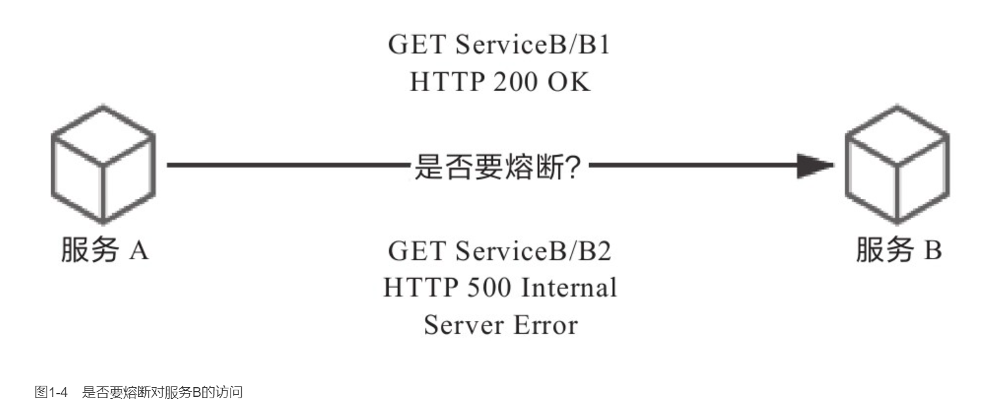

    作者: 周志明
    出版社: 机械工业出版社
    出品方: 机械工业出版社
    副标题: 构建可靠的大型分布式系统
    出版年: 2021-6-30
    页数: 413
    定价: 99.00
    装帧: 平装
    ISBN: 9787111683919

[豆瓣链接](https://book.douban.com/subject/35492898/)

- [第一部分 演进中的架构](#第一部分-演进中的架构)
- [第1章 服务架构演进史](#第1章-服务架构演进史)
  - [1.1 原始分布式时代](#11-原始分布式时代)
  - [1.2 单体系统时代](#12-单体系统时代)
  - [1.3 SOA时代](#13-soa时代)
  - [1.4　微服务时代](#14微服务时代)
  - [1.5 后微服务时代](#15-后微服务时代)
  - [1.6 无服务时代](#16-无服务时代)
- [第二部分 架构师的视角](#第二部分-架构师的视角)

# 第一部分 演进中的架构
# 第1章 服务架构演进史
## 1.1 原始分布式时代
为了避免UNIX系统的版本战争在分布式领域中重演，负责制定UNIX系统技术标准的“开放软件基金会”（Open Software Foundation，OSF，也即后来的“国际开放标准组织”）邀请了当时业界主流的计算机厂商一起参与，共同制订了名为“分布式运算环境”（Distributed Computing Environment，DCE）的分布式技术体系。DCE包含一套相对完整的分布式服务组件规范与参考实现，譬如源自NCA的远程服务调用规范（Remote Procedure Call，RPC），当时被称为DCE/RPC，它与后来Sun公司向互联网工程任务组（Internet Engineering Task Force，IETF）提交的基于通用TCP/IP协议的远程服务标准ONC RPC被认为是现代RPC的共同鼻祖；源自AFS的分布式文件系统（Distributed File System，DFS）规范，当时被称为DCE/DFS；源自Kerberos的服务认证规范；还有时间服务、命名与目录服务，甚至现在程序中很常用的`通用唯一识别符（Universally Unique Identifier，UUID）`也是在DCE中发明出来的。

且不说远程方法不能再依靠本地方法那些以内联为代表的传统编译优化来提升速度，光是“远程”二字带来的网络环境下的新问题，譬如，远程的服务在哪里（服务发现），有多少个（负载均衡），网络出现分区、超时或者服务出错了怎么办（熔断、隔离、降级），方法的参数与返回结果如何表示（序列化协议），信息如何传输（传输协议），服务权限如何管理（认证、授权），如何保证通信安全（网络安全层），如何令调用不同机器的服务返回相同的结果（分布式数据一致性）等一系列问题，全都需要设计者耗费大量精力。

对DCE的研究是计算机科学第一次对分布式有组织领导、有标准可循、有巨大投入的尝试，但无论是DCE还是稍后出现的CORBA，从结果来看，都不能称得上成功，因为将一个系统拆分到不同的机器中运行，为解决这样做带来的服务发现、跟踪、通信、容错、隔离、配置、传输、数据一致性和编码复杂度等方面的问题所付出的代价已远远超过了分布式所取得的收益。

## 1.2 单体系统时代
对于小型系统，单台机器就足以支撑其良好运行的系统，不仅易于开发、测试、部署，且由于系统中各个功能、模块、方法的调用过程都是进程内调用，不会发生`进程间通信（Inter-Process Communication，IPC）`，因此连运行效率也是最高的。单体系统的不足，必须在软件的性能需求超过了单机、软件的开发人员规模明显超过了`“2 Pizza Team”`范畴的前提下才有讨论的价值。

从纵向角度来看，`分层架构（Layered Architecture）`已是现在所有信息系统建设中普遍认可、采用的软件设计方法，无论是单体还是微服务，抑或是其他架构风格，都会对代码进行纵向层次划分，收到的外部请求在各层之间以不同形式的数据结构进行流转传递，触及最末端的数据库后按相反的顺序回馈响应。

从横向角度来看，单体架构也支持按照技术、功能、职责等维度，将软件拆分为各种模块，以便重用和管理代码。单体系统并不意味着只能有一个整体的程序封装形式，如果需要，它完全可以由多个JAR、WAR、DLL、Assembly或者其他模块格式来构成。即使是从横向扩展（Scale Horizontally）的角度来衡量，在负载均衡器之后同时部署若干个相同的单体系统副本，以达到分摊流量压力的效果，也是非常常见的需求。

如果说共享同一进程获得简单、高效的代价是同时损失了各个功能模块的自治与隔离能力，那这两者孰轻孰重呢？这个问题的潜台词似乎是在比较微服务、单体架构哪种更好用、更优秀。

今天以微服务取代单体系统成为潮流趋势的根本原因，单体系统很难兼容“Phoenix”的特性。这种架构风格潜在的要求是希望系统的每一个部件、每一处代码都尽量可靠，尽量不出或少出缺陷。然而战术层面再优秀，也很难弥补战略层面的不足。单体系统靠高质量来保证高可靠性的思路，在小规模软件上还能运作良好，但当系统规模越来越大时，交付一个可靠的单体系统就变得越来越具有挑战性。如本书前言所说，正是随着软件架构演进，构建可靠系统的观念从“追求尽量不出错”到正视“出错是必然”的转变，才是微服务架构得以挑战并逐步取代单体架构的底气所在。

为了允许程序出错，获得自治与隔离的能力，以及实现可以技术异构等目标，是继性能与算力之后，让程序再次选择分布式的理由。

## 1.3 SOA时代
为了对大型的单体系统进行拆分，让每一个子系统都能独立地部署、运行、更新，开发者们尝试过很多种方案，这里列举三种较有代表性的架构模式，具体如下。

- `烟囱式架构（Information Silo Architecture）`：信息烟囱又名信息孤岛（Information Island），使用这种架构的系统也被称为孤岛式信息系统或者烟囱式信息系统。它指的是一种与其他相关信息系统完全没有互操作或者协调工作的设计模式。这样的系统其实并没有什么“架构设计”可言。接着上一节中企业与部门的例子来说，如果两个部门真的完全没有任何交互，就没有什么理由强迫它们必须在同一栋楼里办公。两个不发生交互的信息系统，让它们使用独立的数据库和服务器即可实现拆分，而唯一的问题，也是致命的问题是，企业中真的存在完全没有交互的部门吗？对于两个信息系统来说，哪怕真的毫无业务往来关系，但系统的人员、组织、权限等主数据会是完全独立、没有任何重叠的吗？这样“独立拆分”“老死不相往来”的系统，显然不可能是企业所希望见到的。
- `微内核架构（Microkernel Architecture）`：微内核架构也被称为插件式架构（Plug-in Architecture）。既然在烟囱式架构中，没有业务往来关系的系统也可能需要共享人员、组织、权限等一些公共的主数据，那不妨就将这些主数据，连同其他可能被各子系统用到的公共服务、数据、资源集中到一块，组成一个被所有业务系统共同依赖的核心（Kernel，也称为Core System），具体的业务系统以插件模块（Plug-in Module）的形式存在，这样也可提供可扩展的、灵活的、天然隔离的功能特性，即微内核架构。
  - 微内核架构也有局限性，它假设系统中各个插件模块之间互不认识，且不可预知系统将安装哪些模块，因此这些插件可以访问内核中一些公共的资源，但不会直接交互。可是，无论是企业信息系统还是互联网应用，这一假设在许多场景中并不成立，所以我们必须找到办法，既能拆分出独立的系统，也能让拆分后的子系统之间顺畅地相互通信。
- `事件驱动架构（Event-Driven Architecture）`：为了能让子系统互相通信，一种可行的方案是在子系统之间建立一套事件队列管道（Event Queue），来自系统外部的消息将以事件的形式发送至管道中，各个子系统可以从管道里获取自己感兴趣、能够处理的事件消息，也可以为事件新增或者修改其中的附加信息，甚至可以自己发布一些新的事件到管道队列中去。如此，每一条消息的处理者都是独立的、高度解耦的，但又能与其他处理者（如果存在其他消息处理者的话）通过事件管道进行交互。

SOA的概念最早由Gartner公司在1994年提出，当时的SOA还不具备发展的条件，直至2006年IBM、Oracle、SAP等公司共同成立了OSOA（Open Service Oriented Architecture）联盟，用于联合制定和推进SOA相关行业标准之后，情况才有所变化。2007年，在结构化资讯标准促进组织（Organization for the Advancement of Structured Information Standard，OASIS）的倡议与支持下，OSOA由一个软件厂商组成的松散联盟，转变为一个制定行业标准的国际组织，并联合OASIS共同新成立了Open CSA（Open Composite Service Architecture）组织，这便是SOA的官方管理机构。

软件架构来到SOA时代，其包含的许多概念、思想都已经能在今天的微服务中找到对应的身影了，譬如服务之间的松散耦合、注册、发现、治理，隔离、编排等。这些在微服务中耳熟能详的概念，大多数也是在分布式服务刚被提出时就已经可以预见的困难点。

- “更具体”体现在尽管SOA本身还属于抽象概念，而不是特指某一种具体的技术，但它比单体架构和前面所列举的三种架构模式的操作性更强，已经不能简单视为一种架构风格，而是一套软件设计的基础平台。它拥有领导制定技术标准的组织Open CSA；有清晰的软件设计的指导原则，譬如服务的封装性、自治、松耦合、可重用、可组合、无状态，等等；明确了采用SOAP作为远程调用协议，依靠SOAP协议族（WSDL、UDDI和WS-*协议）来完成服务的发布、发现和治理；利用企业服务总线（Enterprise Service Bus，ESB）的消息管道来实现各个子系统之间的交互，令各服务在ESB的调度下无须相互依赖就能相互通信，实现了服务松耦合，也为以后进一步实施业务流程编排（Business Process Management，BPM）提供了基础；使用服务数据对象（Service Data Object，SDO）来访问和表示数据，使用服务组件架构（Service Component Architecture，SCA）来定义服务封装的形式和服务运行的容器，等等。
- “更系统”指的是SOA的宏大理想，它的终极目标是希望总结出一套自上而下的软件研发方法论，做到企业只需要跟着SOA的思路，就能够一揽子解决掉软件开发过程中的全部问题，譬如该如何挖掘需求、如何将需求分解为业务能力、如何编排已有服务、如何开发/测试/部署新的功能，等等。这些技术问题确实是重点和难点，但也仅仅是其中的一个方面，SOA不仅关注技术，还关注研发过程中涉及的需求、管理、流程和组织。

`SOAP`协议被逐渐边缘化的本质原因：过于严格的规范定义带来过度的复杂性，而构建在SOAP基础之上的ESB、BPM、SCA、SDO等诸多上层建筑，进一步加剧了这种复杂性。

## 1.4　微服务时代
`“微服务”`这个技术名词最早在2005年就已经被提出，由Peter Rodgers博士在2005年的云计算博览会（Web Services Edge 2005）上首次使用，当时的说法是“Micro-Web-Service”，指的是一种专注于单一职责的、与语言无关的细粒度Web服务（Granular Web Service）。

>微服务是一种软件开发技术，是SOA的一种变体。

Thoughtworks首席咨询师James Lewis做了题为“Microservices-Java,the UNIX Way”的主题演讲，其中提到了单一服务职责、康威定律、自动扩展、领域驱动设计等原则，却只字未提SOA，反而号召应该重拾UNIX的设计哲学（As Well Behaved UNIX Service），这点仿佛与笔者在1.3节所说的“初心与自省”遥相呼应。

微服务真正崛起是在2014年，从Martin Fowler与James Lewis合写的文章[“Microservices：A Definition of This New Architectural Term”](https://martinfowler.com/articles/microservices.html)中首次了解微服务的。文中列举了微服务的九个核心的业务与技术特征：

- 围绕业务能力构建（Organized around Business Capability）。这里再次强调了康威定律的重要性，有怎样结构、规模、能力的团队，就会产生对应结构、规模、能力的产品。这个结论不是某个团队、某个公司遇到的巧合，而是必然的演化结果。如果本应该归属同一个产品内的功能被划分在不同团队中，必然会产生大量的跨团队沟通协作，而跨越团队边界无论在管理、沟通、工作安排上都有更高昂的成本，因此高效的团队自然会针对其进行改进，当团队、产品磨合稳定之后，团队与产品就会拥有一致的结构。
- 分散治理（Decentralized Governance）。这里是指服务对应的开发团队有直接对服务运行质量负责的责任，也有不受外界干预地掌控服务各个方面的权力，譬如选择与其他服务异构的技术来实现自己的服务。这一点在真正实践时多少存有宽松的处理余地，大多数公司都不会在某一个服务使用Java，另一个服务用Python，再下一个服务用Go，而是通常会用统一的主流语言，乃至统一的技术栈或专有的技术平台。微服务不提倡也并不反对这种“统一”，只要负责提供和维护基础技术栈的团队有被各方依赖的觉悟，有“经常被凌晨3点的闹钟吵醒”的心理准备就好。微服务更加强调的是在确实需要技术异构时，应能够有选择“不统一”的权利，譬如不应该强迫Node.js去开发报表页面，要做人工智能训练模型时可以选择Python，等等。
- 通过服务来实现独立自治的组件（Componentization via Service）。之所以强调通过“服务”（Service）而不是“类库”（Library）来构建组件，是因为类库在编译期静态链接到程序中，通过本地调用来提供功能，而服务是进程外组件，通过远程调用来提供功能。前文我们也已经分析过，尽管远程服务有更高昂的调用成本，但这是为组件带来自治与隔离能力的必要代价。
- 产品化思维（Product not Project）。避免把软件研发视作要去完成某种功能，而是视作一种持续改进、提升的过程。譬如，不应该把运维只看作运维团队的事，把开发只看作开发团队的事，团队应该为软件产品的整个生命周期负责，开发者不仅应该知道软件如何开发，还应该知道它如何运作，用户如何反馈，乃至售后支持工作是怎样进行的。注意，这里服务的用户不一定是最终用户，也可能是消费这个服务的另外一个服务。以前在单体架构下，程序的规模决定了无法让全部成员都关注完整的产品，如开发、运维、支持等不同职责的成员只关注自己的工作，但在微服务下，要求开发团队中每个人都具有产品化思维，关心整个产品的全部方面是具有可行性的。
- 数据去中心化（Decentralized Data Management）。微服务明确提倡数据应该按领域分散管理、更新、维护、存储。在单体服务中，一个系统的各个功能模块通常会使用同一个数据库。诚然，中心化的存储天生就更容易避免一致性问题，但是，同一个数据实体在不同服务的视角里，它的抽象形态往往是不同的。譬如，Bookstore应用中的书本，在销售领域中关注的是价格，在仓储领域中关注的是库存数量，在商品展示领域中关注的是书的介绍信息，如果使用中心化存储，所有领域都必须修改和映射到同一个实体之中，这很可能使不同服务相互影响而丧失独立性。尽管在分布式中处理好一致性问题也相当困难，很多时候都没办法使用传统的事务处理来保证，但是两害相权取其轻，即使有一些必要的代价，但仍是值得使用的。
- 强终端弱管道（Smart Endpoint and Dumb Pipe）。弱管道（Dumb Pipe）几乎是直接反对SOAP和ESB的通信机制。ESB可以处理消息的编码加工、业务规则转换等；BPM可以集中编排企业业务服务；SOAP有几十个WS-*协议族在处理事务、一致性、认证授权等一系列工作，这些构建在通信管道上的功能也许对某个系统中的某一部分服务是有必要的，但对于另外更多的服务则是强加进来的负担。如果服务需要上面的额外通信能力，就应该在服务自己的Endpoint上解决，而不是在通信管道上一揽子处理。微服务提倡使用类似于经典UNIX过滤器那样简单直接的通信方式，所以RESTful风格的通信在微服务中会是更合适的选择。
- 容错性设计（Design for Failure）。不再虚幻地追求服务永远稳定，而是接受服务总会出错的现实，要求在微服务的设计中，能够有自动的机制对其依赖的服务进行快速故障检测，在持续出错的时候进行隔离，在服务恢复的时候重新联通。所以“断路器”这类设施，对实际生产环境中的微服务来说并不是可选的外围组件，而是一个必需的支撑点，如果没有容错性设计，系统很容易被一两个服务崩溃所带来的雪崩效应淹没。可靠系统完全可能由会出错的服务组成，这是微服务最大的价值所在，也是本书前言中所说的“凤凰架构”的含义。
- 演进式设计（Evolutionary Design）。容错性设计承认服务会出错，演进式设计则承认服务会被报废淘汰。一个设计良好的服务，应该是能够报废的，而不是期望得到长存永生。假如系统中出现不可更改、无可替代的服务，这并不能说明这个服务多么优秀、多么重要，反而是一种系统设计上脆弱的表现，微服务所追求的自治、隔离，也是反对这种脆弱性的表现。
- 基础设施自动化（Infrastructure Automation）。基础设施自动化，如CI/CD的长足发展，显著减少了构建、发布、运维工作的复杂性。由于微服务架构下运维对象数量是单体架构运维对象数量的数量级倍，使用微服务的团队更加依赖于基础设施的自动化，人工是很难支撑成百上千乃至上万级别的服务的。

## 1.5 后微服务时代
2017年是容器生态发展历史中具有里程碑意义的一年。在这一年，长期作为Docker竞争对手的RKT容器一派的领导者CoreOS宣布放弃自己的容器管理系统Fleet，并将会在未来把所有容器管理的功能移至Kubernetes之上去实现。在这一年，容器管理领域的独角兽Rancher Labs宣布放弃其内置了数年的容器管理系统Cattle，提出“All-in-Kubernetes”战略，把1.x版本就能够支持多种容器编排系统的管理工具Rancher，从2.0版本开始“反向升级”为完全绑定于Kubernetes这一系统。在这一年，Kubernetes的主要竞争者Apache Mesos在9月正式宣布了“Kubernetes on Mesos”集成计划，由竞争关系转为对Kubernetes提供支持，使其能够与Mesos的其他一级框架（如HDFS、Spark和Chronos等）进行集群资源动态共享、分配与隔离。在这一年，Kubernetes的最大竞争者Docker Swarm的母公司Docker，终于在10月被迫宣布Docker要同时支持Swarm与Kubernetes两套容器管理系统，也即在事实上承认了Kubernetes的统治地位。这场已经持续了三年时间，以Docker Swarm、Apache Mesos与Kubernetes为主要竞争者的“容器编排战争”终于有了明确的结果。Kubernetes登基加冕是容器发展中一个时代的终章，也将是软件架构发展下一个纪元的开端。

表1-1　Kubernetes与传统Spring Cloud提供的解决方案对比

能力 | Kubernetes | Spring Cloud
---|------------|-------------
弹性伸缩 | Autoscaling | N/A
服务发现 | KubeDNS/CoreDNS | Spring Cloud Eureka
配置中心 | ConfigMap/Secret | Spring Cloud Config
服务网关 | Ingress Controller | Spring Cloud Zuul
负载均衡 | Load Balancer | Spring Cloud Ribbon
服务安全 | RBAC API | Spring Cloud Security
跟踪服务 | Metrics API/Dashboard | Spring Cloud Turbine
降级熔断 | N/A | Spring Cloud Hystrix

Kubernetes成为容器战争胜利者标志着后微服务时代的开启，但Kubernetes仍然没能完美解决全部的分布式问题——“不完美”的意思是，仅从功能上看，单纯的Kubernetes反而不如之前的Spring Cloud方案。这是因为有一些问题处于应用系统与基础设施的边缘，使得很难完全在基础设施层面中精细化地处理。举个例子，如图1-4所示，微服务A调用了微服务B的两个服务，称为B1和B2，假设B1表现正常但B2出现了持续的500错，那在达到一定阈值之后就应该对B2进行熔断，以避免产生雪崩效应。如果仅在基础设施层面来处理，这会遇到一个两难问题，切断A到B的网络通路会影响B1的正常调用，不切断则会持续受B2的错误影响。

以上问题在通过Spring Cloud这类应用代码实现的微服务中并不难处理，既然是使用程序代码来解决问题，只要合乎逻辑，想要实现什么功能，只受限于开发人员的想象力与技术能力，但基础设施是针对整个容器来管理的，粒度相对粗犷，只能到容器层面，对单个远程服务则很难有效管控。类似的，在服务的监控、认证、授权、安全、负载均衡等方面都有可能面临细化管理的需求，譬如服务调用时的负载均衡，往往需要根据流量特征，调整负载均衡的层次、算法等，而DNS虽然能实现一定程度的负载均衡，但通常并不能满足这些额外的需求。

为了解决这一类问题，虚拟化的基础设施很快完成了第二次进化，引入了今天被称为`“服务网格”（Service Mesh）`的`“边车代理模式”（Sidecar Proxy）`，如图1-5所示。所谓“边车”是一种带垮斗的三轮摩托车，笔者小时候还算常见，现在基本就只在影视剧中才会看到了。在虚拟化场景中的边车指的是由系统自动在服务容器（通常是指Kubernetes的Pod）中注入一个通信代理服务器，相当于那个挎斗，以类似网络安全里中间人攻击的方式进行流量劫持，在应用毫无感知的情况下，悄然接管应用所有对外通信。这个代理除了实现正常的服务间通信外（称为数据平面通信），还接收来自控制器的指令（称为控制平面通信），根据控制平面中的配置，对数据平面通信的内容进行分析处理，以实现熔断、认证、度量、监控、负载均衡等各种附加功能。通过边车代理模式，便实现了既不需要在应用层面加入额外的处理代码，也提供了几乎不亚于程序代码的精细管理能力。

## 1.6 无服务时代
无服务现在还没有一个特别权威的“官方”定义，但它的概念并没有前面提到的各种架构那么复杂，本来无服务也是以“简单”为主要卖点的，它只涉及两块内容：后端设施（Backend）和函数（Function）。

- `后端设施`是指数据库、消息队列、日志、存储等这类用于支撑业务逻辑运行，但本身无业务含义的技术组件，这些后端设施都运行在云中，在无服务中将它们称为“后端即服务”（Backend as a Service，BaaS）。
- `函数`是指业务逻辑代码，这里函数的概念与粒度都已经很接近于程序编码角度的函数了，其区别是无服务中的函数运行在云端，不必考虑算力问题，也不必考虑容量规划（从技术角度可以不考虑，从计费的角度还是要掂量一下的），在无服务中将其称为“函数即服务”（Function as a Service，FaaS）。

与单体架构、微服务架构不同，无服务架构有一些天生的特点决定了它现在不是，以后如果没有重大变革的话，估计也很难成为一种普适性的架构模式。无服务架构确实能够降低一些应用的开发和运维环节的成本，譬如不需要交互的离线大规模计算，又譬如多数Web资讯类网站、小程序、公共API服务、移动应用服务端等都契合于无服务架构所擅长的短链接、无状态、适合事件驱动的交互形式。但另一方面，对于那些信息管理系统、网络游戏等应用，或者说对于具有业务逻辑复杂、依赖服务端状态、响应速度要求较高、需要长链接等特征的应用，至少目前是相对不那么适合的。这是因为无服务天生“无限算力”的假设决定了它必须要按使用量（函数运算的时间和占用的内存）计费以控制消耗的算力的规模，因而函数不会一直以活动状态常驻服务器，请求到了才会开始运行，这就导致了函数不便依赖服务端状态，也导致了函数会有冷启动时间，响应的性能可能不太好。目前无服务的冷启动过程大概是在数十到百毫秒级别，对于Java这类启动性能差的应用，甚至是接近秒的级别。

# 第二部分 架构师的视角

